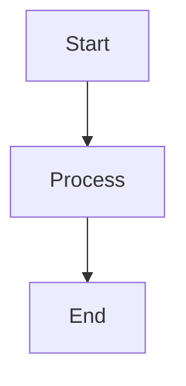

# Documentation Design Language Guide
# Based on Material for MkDocs and Zensical-style documentation patterns

## Overview
This project uses Material for MkDocs to render documentation from Markdown to HTML. All documentation should follow these style guidelines to ensure consistency, readability, and professional presentation.

## Headers

### Hierarchy Rules
- Use `#` for page titles (H1) - only one per page
- Use `##` for major sections (H2)
- Use `###` for subsections (H3)
- Use `####` for sub-subsections (H4) - use sparingly
- Avoid going deeper than H4

### Style Guidelines
- **Capitalization**: Use sentence case for headers (capitalize first word and proper nouns only)
- **Length**: Keep headers concise and descriptive (under 60 characters when possible)
- **Consistency**: Use parallel structure across headers at the same level
- **Spacing**: Always include a blank line before and after headers
- **Permalinks**: Headers automatically get permalinks (enabled in mkdocs.yml)

### Example
```markdown
# Main Page Title

## Section Title

### Subsection Title
```

### Hero Titles
**CRITICAL**: When creating a hero title at the top of a page (typically in a styled div for landing pages), the hero title **must** be wrapped in an H1 (`#` or `<h1>`) element. This prevents Material for MkDocs from auto-rendering the page title from frontmatter in the content area.

**Why this is required:**
Material for MkDocs automatically renders the page title (from frontmatter `title:` field or filename) as an H1 if no H1 is found in the content. By including an H1 in your hero section, you control the title display.

**Example:**
```markdown
---
title: Container Environments
---

<div class="hero-section" markdown>

# Deploy containers, not complexity

Hero subtitle text here.

</div>
```

**Or with HTML:**
```html
<div class="hero-section">
<h1>Deploy containers, not complexity</h1>
<p>Hero subtitle text here.</p>
</div>
```

**Key Points:**
- Hero titles must use H1 (`#` in markdown or `<h1>` in HTML)
- Only one H1 per page (the hero title serves as the page H1)
- This applies to landing pages and pages with custom hero sections
- Without an H1 in content, Material for MkDocs will auto-insert the page title

## Admonitions

### Available Types
Use admonitions to highlight important information. Available types:
- `note` - General information
- `abstract` - Summary or overview
- `info` - Informational content
- `tip` - Helpful suggestions
- `success` - Success messages
- `question` - Questions or FAQs
- `warning` - Warnings
- `failure` - Failure messages
- `danger` - Critical warnings
- `bug` - Known issues
- `example` - Examples
- `quote` - Quotations

### Syntax
**CRITICAL SPACING REQUIREMENTS:**
- Must include a **blank line** after the `!!!` declaration line
- Content must be indented with **exactly 4 spaces** (not tabs)
- Each line of content must maintain the 4-space indentation
- Code blocks within admonitions require additional indentation (4 spaces + code block)

```markdown
!!! note "Optional Title"

    Content goes here. Use 4 spaces indentation.
    Multiple lines are supported.
    
    Code blocks need proper indentation:
    
    ```bash
    command here
    ```
```

### Best Practices
- Always provide a clear, descriptive title in quotes
- Use appropriate admonition type for the content
- Keep content concise and scannable
- Use `abstract` for page-level summaries
- Use `warning` or `danger` for critical information
- Use `tip` for helpful shortcuts or best practices
- **Never skip the blank line** after the `!!!` line - it's required for proper rendering

### When to Use Admonitions

**Always search for opportunities to improve clarity and visibility with admonitions.** When reviewing or creating documentation, actively look for:

**Security and Safety:**
- Security warnings (never commit secrets, never log passwords, always use WAF)
- Critical safety information that could cause data loss or security breaches
- Best practices that prevent common security mistakes

**Important Warnings:**
- Limitations or constraints (preview status, shared resources, known issues)
- Requirements that must be met (firewall rules, prerequisites, dependencies)
- Configuration mistakes that could cause problems

**Helpful Tips:**
- Cost optimization strategies
- Performance best practices
- Time-saving shortcuts or recommendations
- Available resources (demo environments, sandboxes)

**Critical Information:**
- Information that's easy to miss in regular paragraphs
- Important notes about service behavior or architecture
- Requirements that users might overlook

**Look for these patterns in existing content:**
- Lists with bold items that should be warnings (e.g., "**Never commit secrets**")
- Important information buried in paragraphs
- Best practices sections that could use visual emphasis
- Troubleshooting sections with common mistakes
- Configuration sections with critical requirements

**When adding admonitions:**
- Replace or supplement existing text rather than duplicating it
- Use the most appropriate admonition type (`danger` for security, `warning` for important, `tip` for helpful)
- Ensure the admonition adds value and improves visibility
- Maintain consistency with existing admonition usage patterns

### Example
```markdown
!!! abstract "Accessing Storage"

    See the [How to Access Storage Accounts](./access.md) page for instructions on accessing your data or storage.
```

## Buttons

### Syntax
Buttons can be created using HTML or Markdown links styled as buttons:

```markdown
[Button Text](url){ .md-button }
[Primary Button](url){ .md-button .md-button--primary }
```

### Best Practices
- Use buttons for primary actions (downloads, external links, navigation)
- Use primary button style sparingly (one per page maximum)
- Keep button text short and action-oriented
- Prefer regular links for secondary navigation

## Code Blocks

### Syntax Highlighting
Always specify the language for syntax highlighting:

```markdown
```language
code here
```
```

### Supported Languages
Common languages: `bash`, `python`, `yaml`, `json`, `terraform`, `hcl`, `javascript`, `typescript`, `html`, `css`, `sql`, `powershell`, `azurecli`

### Inline Code
Use single backticks for inline code: `` `variable_name` ``

### Code Block Features
- **Line Numbers**: Automatically enabled via `anchor_linenums: true`
- **Copy Button**: Automatically enabled via `content.code.copy`
- **Line Highlighting**: Use `__span` for highlighting specific lines

### Best Practices
- Always include language identifier
- Keep code blocks focused and relevant
- Add comments in code to explain complex logic
- Use inline code for variable names, file paths, and short commands
- For long code blocks, consider splitting into multiple examples

### Example
````markdown
```bash
az storage account show --name mystorageaccount
```
````

## Content Tabs

### Syntax
**CRITICAL SPACING REQUIREMENTS:**
- Each tab starts with `=== "Tab Title"` on its own line
- **Must include a blank line** after the `===` declaration line (recommended for clarity)
- Content must be indented with **exactly 4 spaces** (not tabs)
- Each line of content must maintain the 4-space indentation
- Code blocks within tabs require proper indentation (4 spaces + code block)
- Each new tab starts with `===` at the beginning of a line (no indentation)

```markdown
=== "Tab 1 Title"

    Content for tab 1
    
    ```bash
    command here
    ```

=== "Tab 2 Title"

    Content for tab 2
```

### Best Practices
- Use tabs for alternative methods, configurations, or views
- Keep tab titles short and descriptive (2-4 words)
- Limit to 3-5 tabs maximum per tab group
- Ensure all tabs contain related content
- Use `alternate_style: true` (already configured) for better visual distinction
- **Always include a blank line** after each `===` line for readability
- **Maintain consistent 4-space indentation** for all content within tabs

### Example
```markdown
=== "Option 1: Azure CLI"

    ```bash
    az storage account show --name mystorageaccount
    ```

=== "Option 2: PowerShell"

    ```powershell
    Get-AzStorageAccount -Name mystorageaccount
    ```
```

## Data Tables

### Syntax
Use standard Markdown table syntax:

```markdown
| Header 1 | Header 2 | Header 3 |
|----------|----------|----------|
| Cell 1   | Cell 2   | Cell 3   |
| Cell 4   | Cell 5   | Cell 6   |
```

### Best Practices
- Always include a header row
- Align columns consistently (left-align for text, right-align for numbers)
- Keep tables narrow (3-5 columns maximum when possible)
- Use tables for structured, comparable data
- Add captions using `pymdownx.blocks.caption` extension when needed
- Break wide tables into multiple smaller tables when possible

### Alignment
```markdown
| Left | Center | Right |
|:-----|:------:|------:|
| Text | Text   | Text  |
```

## Diagrams

### Mermaid Diagrams
Use Mermaid for flowcharts, state diagrams, and other visualizations:

```markdown

```

### Best Practices
- Use diagrams to illustrate complex processes or relationships
- Keep diagrams simple and focused
- Use descriptive labels
- Prefer Mermaid over external image files when possible (version controlled, searchable)
- For complex diagrams, consider splitting into multiple simpler diagrams

### Supported Diagram Types
- Flowcharts (`graph`, `flowchart`)
- Sequence diagrams (`sequenceDiagram`)
- State diagrams (`stateDiagram-v2`)
- Class diagrams (`classDiagram`)
- Entity relationship diagrams (`erDiagram`)
- And more...

## Footnotes

### Syntax
```markdown
Main text with a reference[^1].

[^1]: Footnote content here.
```

### Best Practices
- Use footnotes for supplementary information, citations, or references
- Keep footnote content concise
- Number footnotes sequentially
- Use descriptive footnote references when helpful: `[^note-name]`

### Example
```markdown
The service uses Azure Storage[^azure-storage].

[^azure-storage]: See [Azure Storage documentation](https://docs.microsoft.com/azure/storage)
```

## Formatting

### Text Emphasis
- **Bold** (`**text**`): Use for important terms, UI elements, or strong emphasis
- *Italic* (`*text*`): Use for emphasis, foreign terms, or titles
- `Code` (`` `text` ``): Use for code, variables, file paths, commands
- ~~Strikethrough~~ (`~~text~~`): Use for deprecated content or corrections
- ==Highlight== (`==text==`): Use for important highlights (requires pymdownx.mark)

### Best Practices
- Use formatting sparingly - too much emphasis reduces impact
- Prefer bold for UI elements and important terms
- Use code formatting for technical terms, variables, and commands
- Maintain consistency in formatting choices
- **Avoid emojis** - use icons instead (see Icons section)
- Use Material icons (e.g., `:material-check:`, `:material-alert:`) for status indicators instead of emoji symbols

## Grids

### Material Grid System
Use HTML with Material classes for grid layouts:

```html
<div class="grid cards" markdown>

-   :material-cloud:{ .lg .middle } __Cloud Storage__

    ---

    Access cloud-based storage solutions

-   :material-database:{ .lg .middle } __Database__

    ---

    Manage database resources

</div>
```

### HTML Divs with Markdown Content
**CRITICAL**: When creating HTML `<div>` elements that contain Markdown content, you **must** include the `markdown` attribute on the div. This includes:

- **Parent divs** - Any container div that wraps markdown content
- **Child divs** - Individual divs within a grid or layout that contain markdown
- **All nested divs** - Every div in the hierarchy that contains markdown must have the attribute

**Why this is required:**
Material for MkDocs needs the `markdown` attribute to process Markdown syntax within HTML divs. Without it, Markdown will be rendered as plain text.

**Example:**
```html
<div style="display: grid; grid-template-columns: repeat(auto-fit, minmax(400px, 1fr));" markdown>

<div markdown>

## Section Title

Content with **markdown** formatting.

</div>

<div markdown>

## Another Section

More markdown content here.

</div>

</div>
```

**Key Points:**
- Always add `markdown` to divs containing markdown content
- Include it on parent containers, not just child elements
- This applies to any HTML div, not just grid layouts
- When in doubt, add the `markdown` attribute

### Best Practices
- Use grids for feature cards, service overviews, or related content
- Keep grid items balanced in length
- Use icons consistently (Material Design Icons or Lucide)
- Limit grid items to 2-4 columns for readability
- **Always include `markdown` attribute on divs containing markdown content**

## Icons

### Avoid Emojis
**CRITICAL REQUIREMENT**: Emojis are **NOT ALLOWED** in documentation. All emojis must be replaced with appropriate Material Design Icons or Lucide icons.

**When evaluating documentation, you MUST:**
- Scan the entire file for emoji characters (Unicode emoji ranges)
- Replace ALL emojis with appropriate icon syntax
- Use Material icons for inline use (e.g., `:material-check:`)
- Use Lucide icons for frontmatter (e.g., `icon: lucide/cloud`)

**Why this is required:**
- Consistent visual style across the documentation
- Better accessibility and screen reader support
- Professional appearance
- Scalable vector graphics that render cleanly at any size
- Icons integrate better with the Material for MkDocs theme

**Common emoji replacements:**
- ✅ → `:material-check:` or `:material-check-circle:`
- ❌ → `:material-close:` or `:material-cancel:`
- ⚠️ → `:material-alert:` or `:material-warning:`
- ℹ️ → `:material-information:`
- 💡 → `:material-lightbulb:`
- 🔒 → `:material-lock:`
- 📝 → `:material-pencil:` or `:material-file-edit:`
- 🚀 → `:material-rocket-launch:`
- ⚡ → `:material-lightning-bolt:`
- 📚 → `:material-book:`
- 🔍 → `:material-magnify:`
- And any other emojis should be replaced with semantically appropriate Material icons

### Icon Syntax
Use Material Design Icons or Lucide icons:

**Inline icons:**
```markdown
:material-cloud:
:material-database:
:material-lock:
:material-check:
:material-alert:
```

**In frontmatter (for page navigation):**
```yaml
icon: lucide/cloud
icon: lucide/settings
icon: lucide/log-in
```

**In tables or inline text:**
```markdown
| Status | ==:material-check: Required.== |
| Status | ==:material-alert: Warning.== |
```

### Best Practices
- **Always prefer icons over emojis** for visual elements
- Use icons consistently throughout documentation
- Choose icons that are intuitive and recognizable
- Use icons in page frontmatter for navigation
- Use icons in grids and feature lists for visual interest
- Prefer Lucide icons for modern, clean aesthetic
- Use Material icons for compatibility with Material theme and inline use
- Use Material icons (like `:material-check:`, `:material-alert:`) for status indicators in tables

### Common Icons

**Lucide Icons (for frontmatter):**
- `lucide/cloud` - Cloud services
- `lucide/settings` - Configuration
- `lucide/log-in` - Access/Login
- `lucide/box` - Storage/Containers
- `lucide/help-circle` - Help/FAQ
- `lucide/package` - Inventory/Packages
- `lucide/globe` - External/Network access
- `lucide/folder` - File shares/Directories
- `lucide/database` - Database services
- `lucide/file-json` - JSON/Configuration files

**Material Icons (for inline use):**
- `:material-check:` - Success, required, completed
- `:material-alert:` - Warning, alert
- `:material-info:` - Information
- `:material-error:` - Error, failure
- `:material-cloud:` - Cloud services
- `:material-lock:` - Security, authentication
- `:material-database:` - Database, storage
- `:material-download:` - Download actions
- `:material-link:` - Links, connections

## Images

### Syntax
```markdown


```

### Best Practices
- **Alt Text**: Always provide descriptive alt text for accessibility
- **Paths**: Use relative paths from the markdown file location
- **Format**: Prefer PNG for screenshots, SVG for diagrams (when possible)
- **Size**: Optimize images for web (compress large images)
- **Captions**: Add descriptive captions when helpful
- **Organization**: Store images in `docs/img/` directory
- **Naming**: Use descriptive, lowercase filenames with hyphens: `access-entra.png`

### Image Features
- Images support zoom via `panzoom` plugin (Ctrl+click)
- Images can be opened in lightbox via `glightbox` plugin
- Use descriptive filenames that indicate content

### Example
```markdown

```

## Lists

### Unordered Lists
```markdown
- Item 1
- Item 2
  - Nested item
  - Another nested item
- Item 3
```

### Ordered Lists
```markdown
1. First step
2. Second step
3. Third step
```

### Task Lists
```markdown
- [x] Completed task
- [ ] Incomplete task
```

### Definition Lists
```markdown
Term 1
:   Definition of term 1

Term 2
:   Definition of term 2
```

### Best Practices
- Use unordered lists for non-sequential items
- Use ordered lists for step-by-step instructions
- Use task lists for checklists or feature lists
- Use definition lists for glossaries or term definitions
- Keep list items parallel in structure
- Limit nesting to 2-3 levels maximum
- Use consistent punctuation (or no punctuation) within lists
- Start list items with capital letters
- End list items with periods only if they are complete sentences

## Page Frontmatter

### Required/Common Fields
```yaml
---
icon: lucide/cloud
hide:
  - navigation  # Optional: hide navigation
  - toc         # Optional: hide table of contents
---
```

### Best Practices
- Always include an `icon` field for navigation
- Use `hide` fields sparingly (only for special pages like inventory)
- Choose icons that represent the page content

## Links

### Internal Links
```markdown
[Link text](./relative/path.md)
[Link text](../parent/page.md)
```

### External Links
```markdown
[Link text](https://example.com)
```

### Best Practices
- Use descriptive link text (avoid "click here" or "this link")
- Prefer relative paths for internal links
- Open external links in new tab when appropriate: `<a href="url" target="_blank">text</a>`
- Use magic links for GitHub issues/PRs (automatically handled)

## General Writing Guidelines

### Tone and Voice
- Use clear, concise language
- Write in second person ("you") for instructions
- Use active voice when possible
- Avoid jargon; define technical terms on first use

### Structure
- Start pages with a brief introduction
- Use headers to create logical sections
- Break up long paragraphs (3-4 sentences maximum)
- Use lists to make information scannable
- End sections with clear next steps when applicable

### Consistency
- Use consistent terminology throughout
- Follow the same patterns for similar content types
- Maintain consistent formatting choices
- Use the dictionary feature for term definitions (auto-appended via snippets)
- **Use icons instead of emojis** for visual elements to maintain professional appearance

## Special Features

### Snippets
Content from `docs/dictionary.md` is automatically appended to all pages. Use this for term definitions.

### Search
Search is enabled and indexed automatically. Use descriptive headers and content to improve searchability.

### Git Integration
- Last updated dates shown (in CI environments)
- Contributors shown (in CI environments)
- Edit links available in page actions

### Math Support
LaTeX math is supported via KaTeX:
```markdown
Inline math: $E = mc^2$

Block math:
$$
\int_{-\infty}^{\infty} e^{-x^2} dx = \sqrt{\pi}
$$
```

## Documentation Evaluation and Review

**CRITICAL**: When evaluating or updating documentation files, you MUST systematically check ALL of the following requirements. Do not focus only on visible formatting issues - review every section of these rules.

### Required Evaluation Checklist

When asked to evaluate, review, or update documentation files, you MUST verify:

#### Frontmatter Requirements
- [ ] **Every page has an `icon:` property** in frontmatter (required for navigation)
- [ ] Icon values use Lucide format (e.g., `lucide/cloud`, `lucide/settings`)
- [ ] Frontmatter is properly formatted with YAML syntax
- [ ] Optional `hide:` fields are used appropriately (only for special pages)

#### Code and Formatting
- [ ] **All code blocks have language identifiers** (no bare ``` blocks)
- [ ] Code block language identifiers have no spaces (e.g., ````json` not ```` json`)
- [ ] Language identifiers match the code content (e.g., YAML files use `yaml`, not `sh`)
- [ ] Inline code uses single backticks for variables, paths, commands

#### Admonitions
- [ ] **Blank line after `!!!` declaration** (required for proper rendering)
- [ ] Content indented with exactly 4 spaces (not tabs)
- [ ] Admonitions have descriptive titles in quotes
- [ ] Appropriate admonition type used (warning, tip, danger, etc.)

#### Content Tabs
- [ ] **Blank line after `===` declaration** (recommended for clarity)
- [ ] Content indented with exactly 4 spaces
- [ ] Tab titles are short and descriptive

#### Headers
- [ ] Only one H1 per page (page title)
- [ ] Headers use sentence case (capitalize first word and proper nouns only)
- [ ] Blank lines before and after headers
- [ ] Proper hierarchy (H1 → H2 → H3 → H4)

#### HTML and Markdown
- [ ] **All HTML divs containing markdown have `markdown` attribute**
- [ ] Grid layouts use proper Material classes
- [ ] **NO EMOJIS present** - All emojis replaced with appropriate Material or Lucide icons
- [ ] Icons are used consistently throughout (Material for inline, Lucide for frontmatter)

#### Images and Links
- [ ] Images have descriptive alt text
- [ ] Links use descriptive text (not "click here")
- [ ] Image paths are relative and correct

#### Emoji Removal (CRITICAL)
- [ ] **File scanned for emoji characters** - No emojis present in the file
- [ ] All emojis replaced with appropriate Material icons (for inline use)
- [ ] All emojis replaced with appropriate Lucide icons (for frontmatter)
- [ ] Icon replacements are semantically appropriate

#### General Quality
- [ ] Content follows tone and voice guidelines
- [ ] Paragraphs are short and scannable (3-4 sentences max)
- [ ] Lists are properly formatted
- [ ] Tables have headers
- [ ] Important information uses admonitions for visibility

### Evaluation Process

1. **Read the cursor rules file completely** - Don't assume you know all requirements
2. **Check frontmatter first** - Verify `icon:` property exists on every page
3. **Review all code blocks** - Ensure language identifiers are present and correct
4. **Verify admonition formatting** - Check spacing and indentation
5. **Check content tabs** - Verify proper spacing and indentation
6. **Review HTML elements** - Ensure `markdown` attribute on divs
7. **Scan for emojis** - Search entire file for emoji characters and replace ALL with appropriate Material or Lucide icons
8. **Verify headers** - Check hierarchy and formatting
9. **Review overall structure** - Ensure content follows guidelines
10. **Final emoji check** - Do a second pass specifically looking for any remaining emoji characters

### When Updating Multiple Files

When updating documentation across multiple files:
- Create a systematic checklist based on this evaluation guide
- Review each file against ALL requirements, not just the most visible issues
- Don't skip frontmatter checks - they're easy to miss but required
- **Scan every file for emojis** - Use grep or search to find emoji characters across all files
- Verify code block language identifiers on every code block
- Check admonition spacing on every admonition
- Replace all emojis with appropriate icons before completing the review

## Checklist for New Documentation

When creating new documentation pages, ensure:

- [ ] Page has appropriate icon in frontmatter
- [ ] Page title is clear and descriptive (H1)
- [ ] Content is organized with logical headers (H2, H3)
- [ ] Important information is highlighted with admonitions (security warnings, critical requirements, helpful tips)
- [ ] Code examples have language identifiers
- [ ] Images have descriptive alt text
- [ ] Links use descriptive text
- [ ] Lists are properly formatted
- [ ] Tables have headers
- [ ] Content follows tone and voice guidelines
- [ ] Page is scannable (short paragraphs, lists, headers)
- [ ] Icons are used instead of emojis for visual elements
