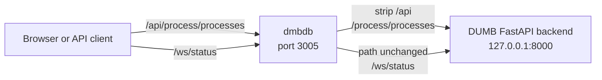

# DUMB API

DUMB includes a built-in REST API and WebSocket server to allow programmatic control of services, logging, and system state.

## How to reach it

| Access path | Example | Notes |
|---|---|---|
| DUMB Frontend proxy | `http://<host>:3005/api/process/processes` | Default and recommended. Add `/api` before the backend-native REST path. |
| Backend directly | `http://<host>:8000/process/processes` | Port `8000` listens on `127.0.0.1` by default and is not published by the standard Compose file. Direct exposure requires an intentional host/config change. |
| WebSocket through the frontend | `ws://<host>:3005/ws/status` | WebSocket routes stay under `/ws`; do not add `/api`. |

## How the frontend API gateway works

Port `3005` is not only the dashboard. The dmbdb server also acts as the normal
gateway to the DUMB backend, so scripts and other API clients can use the same
published address as the browser UI.



The mapping is:

| Client-facing request on port 3005 | Request received by port 8000 |
|---|---|
| `/api/auth/login` | `/auth/login` |
| `/api/process/processes` | `/process/processes` |
| `/api/config` | `/config` |
| `/ws/status` | `/ws/status` |

The proxy changes only the route used to reach the backend. Authentication and
authorization are still enforced by FastAPI; using port `3005` does not bypass
JWT requirements or expose a separate API implementation.

Endpoint paths throughout this API reference are **backend-native paths**. When
using the normal frontend URL, prefix REST paths with `/api`. For example:

```bash
# Standard deployment: call through the published frontend/API gateway
curl http://localhost:3005/api/health

# Direct backend: only inside the container or when port 8000 is exposed
curl http://127.0.0.1:8000/health
```

WebSocket paths are forwarded without adding or removing `/api`.

The API is enabled and configured using the `dumb_config.json` under the `dumb.api_service` section. For example:

```json
"api_service": {
  "enabled": true,
  "process_name": "DUMB API",
  "log_level": "INFO",
  "host": "127.0.0.1",
  "port": 8000
}
```

--- 

## Features

- **Authentication** - JWT-based user authentication and management
- **Health checks** - Container and service health monitoring
- **Process management** - Start, stop, restart services
- **Real-time streaming** - WebSocket endpoints for logs, status, and metrics
- **Metrics history storage** - SQLite history, optional PostgreSQL, migration, compression, and fallback status
- **Configuration** - View and update settings (in-memory and persistent)
- **Environment state inspection** - Service and system information
- **Notifications** - Configure destinations, send tests/manual messages, and inspect persistent delivery history

---

## Common Endpoints

| Method | Path                      | Description                                |
|--------|---------------------------|--------------------------------------------|
| GET    | `/auth/status`            | Get authentication status                  |
| POST   | `/auth/login`             | Authenticate and get JWT tokens            |
| POST   | `/auth/refresh`           | Refresh access token                       |
| GET    | `/health`                 | Container health check                     |
| GET    | `/process/processes`      | List all services in `dumb_config.json`    |
| GET    | `/process`                | Get a specific service by `process_name`   |
| POST   | `/process/start-service`  | Start a specific service                   |
| POST   | `/process/stop-service`   | Stop a specific service                    |
| POST   | `/process/restart-service`| Restart a specific service                 |
| GET    | `/process/service-status` | Get the current status of a service        |
| GET    | `/process/mediastorm-initial-admin-password` | Read MediaStorm's one-time first-login credential while available |
| POST   | `/process/start-core-service` | Start core services + dependencies     |
| GET    | `/process/capabilities`   | Get backend feature flags                  |
| GET    | `/process/postgres-migration/preflight` | Check supported service migration readiness |
| POST   | `/process/postgres-migration/start` | Start a rehearsal or guarded cutover |
| GET    | `/process/postgres-migration/status` | Poll migration progress and validation |
| POST   | `/process/postgres-migration/rollback` | Restore preserved SQLite configuration |
| GET    | `/seerr-sync/status`      | Seerr Sync summary status                  |
| GET    | `/seerr-sync/failed`      | Seerr Sync failed request list             |
| GET    | `/seerr-sync/state`       | Seerr Sync raw state (debug)               |
| POST   | `/seerr-sync/test`        | Test Seerr URL + API key                   |
| DELETE | `/seerr-sync/failed`      | Clear failed Seerr Sync requests           |
| GET    | `/logs`                   | Read service log chunks                    |
| GET    | `/ai/settings`             | Read sanitized AI provider settings        |
| PUT    | `/ai/settings`             | Update AI provider settings                |
| POST   | `/ai/test`                 | Test current AI provider settings          |
| POST   | `/ai/models`               | List available provider models             |
| POST   | `/ai/diagnose`             | Preview or run AI service diagnostics      |
| POST   | `/ai/diagnose-stack`       | Preview or run stack-wide AI diagnostics   |
| GET    | `/notifications/config`    | Read redacted notification settings         |
| POST   | `/notifications/config`    | Update notification settings while preserving redacted secrets |
| POST   | `/notifications/test`      | Test a saved notification destination       |
| POST   | `/notifications/send`      | Queue a manual notification                  |
| GET    | `/notifications/history`   | Read persistent delivery history             |
| DELETE | `/notifications/history`   | Clear completed notification history         |
| GET    | `/metrics/history`         | Read provider-neutral metrics history         |
| GET    | `/metrics/filesystems`     | Discover monitorable container filesystems    |
| GET    | `/metrics/network-interfaces` | Discover visible network interfaces         |
| GET    | `/metrics/history_series`  | Read compact/downsampled chart history        |
| GET    | `/metrics/history/storage` | Inspect SQLite/PostgreSQL status and sizing    |
| POST   | `/metrics/history/migrate` | Import preserved legacy JSONL history          |
| POST   | `/metrics/history/storage/activate-postgresql` | Provision and activate PostgreSQL Metrics history |
| WS     | `/ws/logs`                | Real-time log streaming                    |
| WS     | `/ws/status`              | Real-time service status updates           |
| WS     | `/ws/metrics`             | Real-time system metrics                   |

---

## Directory Structure
The DUMB API is split into the following modules:

| File | Purpose |
|------|---------|
| `api_service.py` | Initializes and launches the FastAPI app |
| `api_state.py` | Tracks and updates service runtime state |
| `connection_manager.py` | Manages WebSocket client connections |
| `config.py` | Endpoints for working with `dumb_config.json` and service configs |
| `health.py` | Health check endpoint for validating API status |
| `logs.py` | REST endpoint for reading historical logs |
| `websocket_logs.py` | WebSocket server for streaming real-time logs to frontend |
| `process.py` | Service control for backend processes (start, stop, restart) |
| `seerr_sync.py` | Seerr Sync status and failure endpoints |
| `ai.py` | AI provider settings and redacted service diagnostics |
| `notifications.py` | Notification configuration, tests, manual messages, and delivery history |
| `metrics.py` | Current metrics, Database Health, provider-neutral history, storage status, and migration |

---

## API Documentation

DUMB provides built-in API documentation on the backend listener through two convenient endpoints. Because the listener is loopback-only by default, use these from inside the container or deliberately expose the backend with authentication and network controls.

- **FastAPI Swagger UI**  
  Accessible at:  
  `http://<host>:<port>/docs`  
  This interface allows for interactive testing and exploring of all available REST endpoints.

- **Scalar (ReDoc-style) Docs**  
  Accessible at:  
  `http://<host>:<port>/scalar`  
  A clean, read-only view of the full OpenAPI schema for the DUMB API.

These are helpful for development, debugging, and integrating external systems with DUMB.

--- 

## Next Steps

Click on any of the modules in the sidebar to explore endpoint structure, usage examples, and development guidelines for extending the DUMB API:

- [Authentication](auth.md)
- [Health Check](health.md)
- [Process Management](process.md)
- [Configuration](config.md)
- [Logs](logs.md)
- [WebSocket](websocket.md)
- [WebSocket Logs](websocket_logs.md)
- [Seerr Sync](seerr-sync.md)
- [AI Assistant](ai.md)
- [Notifications](notifications.md)
- [Metrics](metrics.md)
