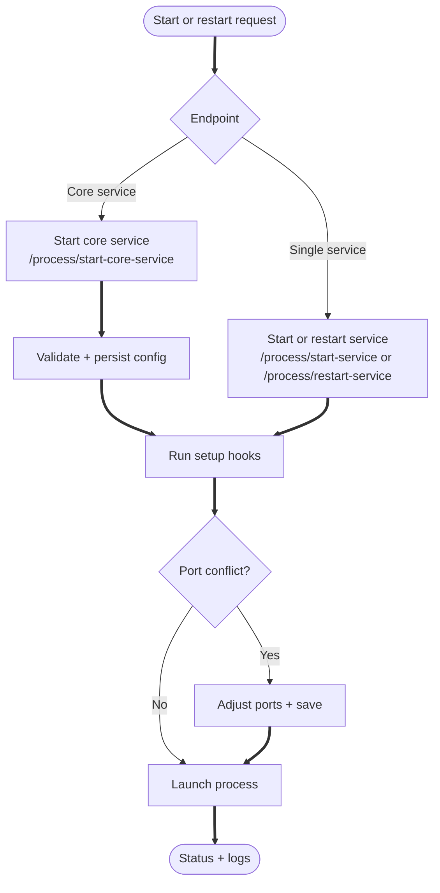

# Process Management API

The **Process Management** endpoints handle launching, stopping, restarting, and tracking subprocesses managed by DUMB.

---

## Lifecycle flow



---

## Endpoints

### `GET /process/processes`

Returns all configured processes, including enabled status, version, repo URL, and sponsorship URL.

#### Example Response:

```json
{
  "processes": [
    {
      "name": "rclone w/ RealDebrid",
      "process_name": "rclone w/ RealDebrid",
      "enabled": true,
      "config": { "enabled": true, "...": "..." },
      "version": "1.65.1",
      "key": "rclone",
      "config_key": "rclone",
      "repo_url": "https://rclone.org",
      "sponsorship_url": "https://rclone.org/sponsor/"
    }
  ]
}
```

---

### `GET /process`

Fetch details about a specific process.

#### Required Query Parameter:

* `process_name` (string)

#### Example Response:

```json
{
  "process_name": "rclone w/ RealDebrid",
  "config": { "enabled": true, "...": "..." },
  "version": "1.65.1",
  "config_key": "rclone"
}
```

---

### `POST /process/start-service`

Starts a specific process.

#### Request Body:

```json
{
  "process_name": "rclone w/ RealDebrid"
}
```

#### Example Response:

```json
{
  "status": "Service started successfully",
  "process_name": "rclone w/ RealDebrid"
}
```

---

### `POST /process/stop-service`

Stops a running process.

#### Request Body:

```json
{
  "process_name": "rclone w/ RealDebrid"
}
```

---

### `POST /process/restart-service`

Restarts a running process.

#### Request Body:

```json
{
  "process_name": "rclone w/ RealDebrid"
}
```

---

### `GET /process/service-status`

Gets the current status of a process.

#### Example Response:

```json
{
  "process_name": "rclone w/ RealDebrid",
  "status": "running"
}
```

---

### `POST /process/start-core-service`

Starts one or more core services and all required dependencies. This is used during onboarding.

The `core_services` field can be a single object or an array. The `name` can be the config key (e.g., `riven_backend`) or a display name (e.g., `Riven`).

#### Request Body Examples:

=== "Riven"

    ```json
    {
      "core_services": {
        "name": "riven_backend",
        "debrid_service": "RealDebrid",
        "debrid_key": "abc123",
        "service_options": {}
      },
      "optional_services": ["zilean", "pgadmin", "riven_frontend"]
    }
    ```

=== "Decypharr"

    ```json
    {
      "core_services": {
        "name": "decypharr",
        "debrid_service": "RealDebrid",
        "debrid_key": "abc123",
        "service_options": {
          "decypharr": { "use_embedded_rclone": true }
        }
      },
      "optional_services": []
    }
    ```

=== "CLI Debrid"

    ```json
    {
      "core_services": {
        "name": "cli_debrid",
        "debrid_service": "RealDebrid",
        "debrid_key": "abc123",
        "service_options": {
          "phalanx_db": { "enabled": true }
        }
      },
      "optional_services": ["zilean"]
    }
    ```

=== "Plex Debrid"

    ```json
    {
      "core_services": {
        "name": "plex_debrid",
        "debrid_service": "RealDebrid",
        "debrid_key": "abc123",
        "service_options": {
          "rclone": { "log_level": "DEBUG" },
          "zurg": { "port": 9194 }
        }
      },
      "optional_services": []
    }
    ```

#### Example Response:

```json
{
  "results": [
    {"service": "riven_backend", "status": "started"},
    {"service": "decypharr", "status": "started"}
  ],
  "errors": []
}
```

!!! note "Notes"
    * Dependencies like Zurg or rclone are created using templates and attached to the calling core service.
    * Optional services such as `pgadmin` or `zilean` are started only if included.
    * `debrid_key` is injected into Zurg or Decypharr as needed.
    * `service_options` can override config values such as `log_level`, `port`, or `enabled`.
    * Any startup errors appear in the `errors` list.

---

### `GET /process/core-services`

Returns the available core services, their dependencies, and default service options (used by onboarding).

---

### `GET /process/optional-services`

Returns optional services. You can pass `core_service` and `optional_services` query params to tailor the list.

---

### `GET /process/capabilities`

Returns backend capabilities and feature flags. Used by the frontend to determine available features.

#### Example Response:

```json
{
  "service_ui_supported": true,
  "optional_only_onboarding": false,
  "metrics_history": true,
  "auto_restart": true,
  "multi_instance": true
}
```

| Field | Description |
|-------|-------------|
| `service_ui_supported` | Whether embedded service UIs via Traefik are available |
| `optional_only_onboarding` | Whether onboarding can skip core service selection |
| `metrics_history` | Whether historical metrics are collected |
| `auto_restart` | Whether auto-restart functionality is enabled |
| `multi_instance` | Whether services support multiple instances |

---

!!! tip "Important Notes"
    * All process names are matched against the entries defined in `dumb_config.json`.
    * Most process commands are defined as arrays and are managed with subprocess handling inside Python.

---

## Related Files

* [`process.py`](https://github.com/I-am-PUID-0/DUMB/blob/master/api/routers/process.py)
* [Configuration](config.md)
