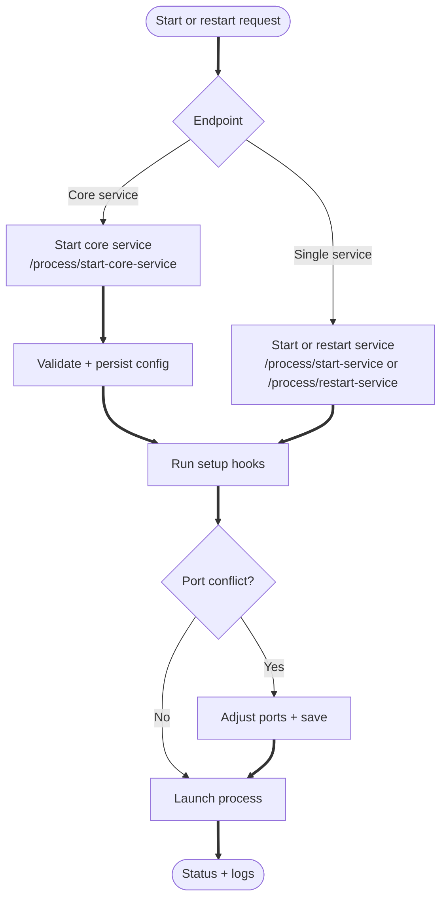

# Process Management API

The **Process Management** endpoints handle launching, stopping, restarting, and tracking subprocesses managed by DUMB.

---

## Lifecycle flow


```mermaid
%%{ init: { "flowchart": { "curve": "basis" } } }%%
flowchart TD
    A([Start or restart request])
    B{Endpoint}
    C[Start core service<br/>/process/start-core-service]
    D[Start or restart service<br/>/process/start-service or /process/restart-service]
    E[Validate + persist config]
    F[Run setup hooks]
    G{Port conflict?}
    H[Adjust ports + save]
    I[Launch process]
    J([Status + logs])

    A ==> B
    B -- Core service --> C
    B -- Single service --> D
    C ==> E
    E ==> F
    F ==> G
    G -- Yes --> H
    G -- No --> I
    H ==> I
    D ==> F
    I ==> J
```

---

## Endpoints

### `GET /process/processes`

Returns all configured processes, including enabled status, version, repo URL, and sponsorship URL.

#### Example Response:

```json
{
  "processes": [
    {
      "name": "rclone w/ RealDebrid",
      "process_name": "rclone w/ RealDebrid",
      "enabled": true,
      "config": { "enabled": true, "...": "..." },
      "version": "1.65.1",
      "key": "rclone",
      "config_key": "rclone",
      "repo_url": "https://rclone.org",
      "sponsorship_url": "https://rclone.org/sponsor/"
    }
  ]
}
```

---

### `GET /process`

Fetch details about a specific process.

#### Required Query Parameter:

* `process_name` (string)

#### Example Response:

```json
{
  "process_name": "rclone w/ RealDebrid",
  "config": { "enabled": true, "...": "..." },
  "version": "1.65.1",
  "config_key": "rclone"
}
```

---

### `POST /process/start-service`

Starts a specific process.

#### Request Body:

```json
{
  "process_name": "rclone w/ RealDebrid"
}
```

#### Example Response:

```json
{
  "status": "Service started successfully",
  "process_name": "rclone w/ RealDebrid"
}
```

---

### `POST /process/stop-service`

Stops a running process.

#### Request Body:

```json
{
  "process_name": "rclone w/ RealDebrid"
}
```

---

### `POST /process/restart-service`

Restarts a running process.

#### Request Body:

```json
{
  "process_name": "rclone w/ RealDebrid"
}
```

---

### `GET /process/service-status`

Gets the current status of a process.

#### Example Response:

```json
{
  "process_name": "rclone w/ RealDebrid",
  "status": "running"
}
```

---

## Updates and scheduling

### `GET /process/update-status`

Returns the last recorded update state for the required `process_name` query parameter.

### `GET /process/update-notices`

Returns available, informational, and recently applied update notices. `scope=project` (default) limits notices to DUMB/dmbdb; `scope=all` includes managed services.

### `POST /process/update-check`

Runs a manual update check without installing it.

```json
{
  "process_name": "AltMount",
  "force": true
}
```

### `POST /process/update-install`

Installs an available update. `allow_override: true` temporarily ignores the
saved release, branch, commit, or pinned-version selection and installs the
latest stable release; DUMB restores the saved configuration afterward.
`target` optionally supplies a supported release selector; `target:
"configured"` applies the currently configured pinned commit/release/branch
without clearing or bypassing it.

Configured-target update-check responses include
`configured_target_kind` (`release`, `branch`, or `commit`) and
`configured_target_installed`. Clients can use these fields to offer the
matching configured-target installation action only when it is needed.

```json
{
  "process_name": "NzbDAV",
  "allow_override": false,
  "target": "configured"
}
```

### `POST /process/auto-update/reschedule`

Recomputes the next automatic-update run after changing a service's interval or start time.

```json
{
  "process_name": "AltMount"
}
```

Clients should gate manual update actions on the `manual_update_check`
capability, configured-target installation on `configured_source_install`, and
the start-time control on `auto_update_start_time`.

---

### `POST /process/start-core-service`

Starts one or more core services and all required dependencies. This is used during onboarding.

The `core_services` field can be a single object or an array. The `name` can be the config key (e.g., `riven_backend`) or a display name (e.g., `Riven`).

#### Request Body Examples:

=== "Riven"

    ```json
    {
      "core_services": {
        "name": "riven_backend",
        "debrid_service": "RealDebrid",
        "debrid_key": "abc123",
        "service_options": {}
      },
      "optional_services": ["zilean", "pgadmin", "riven_frontend"]
    }
    ```

=== "Decypharr"

    ```json
    {
      "core_services": {
        "name": "decypharr",
        "debrid_service": "RealDebrid",
        "debrid_key": "abc123",
        "service_options": {
          "decypharr": {
            "mount_type": "dfs",
            "mount_path": "/mnt/debrid/decypharr"
          }
        }
      },
      "optional_services": []
    }
    ```

=== "CLI Debrid"

    ```json
    {
      "core_services": {
        "name": "cli_debrid",
        "debrid_service": "RealDebrid",
        "debrid_key": "abc123",
        "service_options": {
          "phalanx_db": { "enabled": true }
        }
      },
      "optional_services": ["zilean"]
    }
    ```

#### Example Response:

```json
{
  "results": [
    {"service": "riven_backend", "status": "started"},
    {"service": "decypharr", "status": "started"}
  ],
  "errors": []
}
```

!!! note "Notes"
    * Dependencies like Zurg or rclone are created using templates and attached to the calling core service.
    * Optional services such as `pgadmin`, `zilean`, `bazarr`, `pulsarr`, `maintainerr`, `mediastorm`, `traefik_proxy_admin`, or `cloudflared` are started only if included.
    * `debrid_key` is injected into Zurg or Decypharr as needed.
    * `service_options` can override config values such as `log_level`, `port`, or `enabled`.
    * Any startup errors appear in the `errors` list.

---

### `GET /process/core-services`

Returns the available core services, their dependencies, and default service options (used by onboarding).

---

### `GET /process/dependency-graph`

Returns backend-resolved dependency relationships for a specific process, including:

* static core dependencies (with instance-scoped matching for `rclone`/`zurg`)
* inferred links from `core_service`/`core_services`
* inferred links from `wait_for_url`/`wait_for_dir` entries (including localhost port matching)
* inferred links from `wait_for_mounts` by matching required mount paths to provider service mount points
* rclone provider links (`zurg_enabled`, `decypharr_enabled`, `key_type=nzbdav`) to reflect WebDAV provider dependencies directly
* non-core hard dependency map for service-specific startup requirements (for example `riven_frontend -> riven_backend`, `zilean -> postgres`, `pgadmin -> postgres`)
* conditional startup dependencies from the backend startup ordering logic -- config-aware dependencies like `tautulli -> plex` (when plex is enabled), `bazarr -> sonarr/radarr` (when those Arrs are enabled), `prowlarr -> sonarr/radarr` (when those Arrs are enabled), `neutarr -> sonarr` (when Sonarr has `use_neutarr` enabled), etc. For instance-scoped services (`rclone`, `zurg`), conditional deps are filtered per-instance so that only the specific associated instances are shown (for example, a rclone instance with `zurg_enabled` only shows its own zurg instance, not zurg instances belonging to other rclone configurations)
* documented integration links (soft linkage, `scope=all` only) -- for example `seerr -> sonarr/radarr` request routing
* per-process status state used by the frontend dependency graph panel
* `dependency_truth_table` describing the 12 dependency signal types and whether each is treated as hard dependency vs linkage
* `signals` array on each row/edge identifying which detection signals established the relationship (for example `["core_service_map"]`, `["rclone_provider_zurg", "conditional_startup_map"]`)

#### Required Query Parameter:

* `process_name` (string)

#### Optional Query Parameter:

* `scope` (string): `runtime` (default) or `all`
    * `runtime` returns runtime/configured hard dependencies
    * `all` additionally includes soft linkage edges (for example optional Zilean integrations)

The response includes `parallel_groups` metadata describing concurrent
prerequisite/dependent stages around the selected service.

#### Example Response (shape):

```json
{
  "process_name": "Seerr Main",
  "config_key": "seerr",
  "context": { "mode": "core", "key": "seerr", "core": { "key": "seerr", "name": "Seerr", "dependencies": [] } },
  "scope": "runtime",
  "startup_order": [{ "key": "seerr", "label": "Seerr", "state": "running" }],
  "dependency_rows": [],
  "dependent_rows": [],
  "linked_outgoing_rows": [{ "process_name": "Plex Media Server", "key": "plex", "label": "Plex Media Server", "state": "running" }],
  "linked_incoming_rows": [],
  "nodes": [{ "id": "Seerr Main", "process_name": "Seerr Main", "key": "seerr", "label": "Seerr Main", "state": "running" }],
  "edges": [{ "source": "Seerr Main", "target": "Plex Media Server", "signals": ["wait_for_url"], "strength": "hard_runtime" }],
  "parallel_groups": [{ "id": "pre_core", "label": "Parallel prerequisites", "type": "parallel", "members": ["PostgreSQL", "Rclone w/ Riven"] }],
  "updated_at": "2026-02-11T18:45:00Z"
}
```

---

### `GET /process/optional-services`

Returns optional services. You can pass `core_service` and `optional_services` query params to tailor the list.

---

### `POST /process/symlink-repair`

Runs symlink target rewrites for service symlink trees (Decypharr, NzbDAV, CLI Debrid, Riven).

Use this endpoint when mount paths change and existing symlink targets need to be rewritten.

#### Request Body:

```json
{
  "dry_run": true,
  "include_broken": true,
  "presets": ["decypharr_beta_consolidated"],
  "roots": ["/mnt/debrid/decypharr_symlinks", "/mnt/debrid/clid_symlinks"],
  "root_migrations": [
    {
      "from_root": "/mnt/debrid/decypharr_symlinks",
      "to_root": "/mnt/debrid/combined_symlinks"
    }
  ],
  "overwrite_existing": false,
  "copy_instead_of_move": false,
  "rewrite_rules": [
    {
      "from_prefix": "/mnt/debrid/old",
      "to_prefix": "/mnt/debrid/new"
    }
  ],
  "backup_path": "/config/symlink-repair/manifest.json"
}
```

#### Behavior

* `dry_run: true` scans and reports without changing symlinks.
* `dry_run: false` rewrites matching symlinks in place.
* `process_name` is optional but recommended for async runs/job lookup.
* Provide at least one of: `presets`, `rewrite_rules`, `root_migrations`.
* `root_migrations` moves symlink entries from one symlink tree to another while
  preserving relative paths. This is intended for individual-root to combined-root migrations.
* `overwrite_existing` controls behavior when a destination symlink already exists during root migration.
* `copy_instead_of_move` (root migration mode) creates destination symlinks and keeps source symlinks in place.
* If `roots` is omitted, backend defaults are used:
  `/mnt/debrid/decypharr_symlinks`, `/mnt/debrid/nzbdav-symlinks`,
  `/mnt/debrid/combined_symlinks`, `/mnt/debrid/clid_symlinks`, and
  `riven_backend.symlink_library_path` when configured.
* `backup_path` is written only for non-dry-run operations with changes.

#### Example Response:

```json
{
  "dry_run": true,
  "scanned_symlinks": 2451,
  "changed": 312,
  "moved": 120,
  "copied": 0,
  "skipped_unchanged": 2139,
  "errors": [],
  "changes": []
}
```

### `POST /process/symlink-repair-async`

Queues symlink repair as a background job and returns immediately.

Use `GET /process/symlink-job-status` (or `/process/symlink-job-latest`) to track completion.

#### Response (example)

```json
{
  "status": "queued",
  "job_id": "76d1a3bd35f84e3fab0cc39f81246849",
  "operation": "symlink_repair"
}
```

### `POST /process/symlink-manifest/backup`

Creates a standalone snapshot manifest of symlink entries for later restore.

#### Request Body:

```json
{
  "backup_path": "/config/symlink-repair/snapshots/latest.json",
  "roots": ["/mnt/debrid/decypharr_symlinks", "/mnt/debrid/clid_symlinks"],
  "include_broken": true
}
```

#### Behavior

* Writes a manifest containing `link_path` + `target` entries.
* If `roots` is omitted, backend default symlink roots are used.
* Used by the internal DUMB scheduler when `symlink_backup_enabled` is set on supported services.
* Scheduled runs can prune older manifests when `symlink_backup_retention_count` is greater than `0`.

### `POST /process/symlink-manifest/backup-async`

Queues a standalone snapshot backup as a background job and returns immediately.

#### Response (example)

```json
{
  "status": "queued",
  "job_id": "8e9fd0fbe88d4a6fbb2f3f77b2a3f8c1",
  "operation": "symlink_manifest_backup"
}
```

### `GET /process/symlink-job-status`

Returns status/result for background symlink jobs.

#### Query Params

- `job_id` (required)

#### Response fields

- `status`: `queued`, `running`, `completed`, or `error`
- `result`: operation payload when completed
- `error`: error payload when failed
- `created_at`, `updated_at`, `started_at`, `finished_at` timestamps (when available)

### `GET /process/symlink-job-latest`

Returns the latest symlink job for a process/operation (optionally only active jobs).

#### Query Params

- `process_name` (required)
- `operation` (optional, default `symlink_manifest_backup`)
- `active_only` (optional, default `true`)

### `POST /process/symlink-manifest/restore`

Restores symlinks from a previously generated snapshot manifest.

#### Request Body:

```json
{
  "manifest_path": "/config/symlink-repair/snapshots/latest.json",
  "dry_run": true,
  "overwrite_existing": false,
  "restore_broken": true
}
```

#### Behavior

* `dry_run: true` previews restore actions without writing.
* `overwrite_existing` controls whether existing paths are replaced.
* `restore_broken` controls whether entries with currently missing targets are restored.

### `GET /process/symlink-manifest/compare`

Compares a snapshot manifest against current filesystem state and returns projected restore outcomes.

#### Query Params

- `manifest_path` (required)
- `overwrite_existing` (optional, default `false`)
- `restore_broken` (optional, default `true`)
- `sample_limit` (optional, default `50`, max `200`)

#### Behavior

* Uses the same overwrite/missing-target rules as restore.
* Returns projected counts (`projected_restored`, skipped categories, errors).
* Returns `sample_changes` with representative actions (`create`, `overwrite`, `skip_*`) for quick review before apply.

### `POST /process/symlink-manifest/restore-async`

Queues restore as a background job and returns immediately.

Use `GET /process/symlink-job-status` (or `/process/symlink-job-latest`) to track completion.

### `GET /process/symlink-backup-status`

Returns current symlink-backup scheduler state for a service.

### `GET /process/symlink-backup-manifests`

Lists backup manifests that match the current service `symlink_backup_path` template.

### `GET /process/symlink-manifest-files`

Lists files from the directory of a provided `manifest_path` (defaults to `/config/symlink-repair/snapshots/latest.json` directory).

Use this to populate manifest pickers in the Snapshot tab for quick restore/overwrite selection.

### `POST /process/symlink-backup/reschedule`

Rebuilds symlink-backup schedule state from current service config.

#### Request Body:

```json
{
  "process_name": "Decypharr"
}
```

---

## SQLite-to-PostgreSQL Migration

These endpoints power the guarded migration workflow for Sonarr, Radarr, Lidarr, Prowlarr, Whisparr, Bazarr, Pulsarr, Seerr, and AltMount. See [SQLite to PostgreSQL Migration](../features/arr-postgres-migration.md) for operator guidance and service-specific limitations.

### `GET /process/postgres-migration/preflight`

Query parameter: `process_name`.

Returns non-mutating SQLite integrity, detected application version when available, PostgreSQL connectivity/role, target database, and backup-space checks. `ready` is false when any blocking check fails. The response never includes the PostgreSQL password. `supports_log_migration` tells clients whether to offer the separate Arr log-database option.

### `POST /process/postgres-migration/start`

Queues a persisted rehearsal or cutover job.

```json
{
  "process_name": "Sonarr NzbDAV",
  "mode": "rehearsal",
  "include_logs": false,
  "confirmation": "MIGRATE Sonarr NzbDAV",
  "acknowledge_unsupported": true,
  "acknowledge_backup": true,
  "acknowledge_target_reset": true
}
```

`mode` must be `rehearsal` or `cutover`. The backend requires every acknowledgement and exact confirmation text. Jobs and detailed stage events persist under `/config/arr-postgres-migration/jobs`.

### `GET /process/postgres-migration/status`

Query parameter: `job_id`.

Returns stage, percentage, recent detailed events, result counts, errors, and rollback state for one job.

### `GET /process/postgres-migration/latest`

Query parameter: `process_name`.

Returns the most recently updated migration job for that service so dmbdb can resume visibility after navigation or refresh.

### `POST /process/postgres-migration/rollback`

```json
{
  "job_id": "example-job-id",
  "confirmation": "ROLLBACK Sonarr NzbDAV"
}
```

Restores the job's preserved application configuration when applicable, persists `postgres_enabled: false`, and restarts the service against SQLite when it was running. This does not reverse-copy changes made after PostgreSQL cutover.

The former `/process/arr-postgres-migration/*` paths remain available as hidden compatibility aliases for older dmbdb clients and existing Sonarr/Radarr deployments.

---

### `GET /process/mediastorm-initial-admin-password`

Returns MediaStorm's generated bootstrap credential while its one-time password file exists:

```json
{
  "available": true,
  "username": "admin",
  "password": "generated-bootstrap-password"
}
```

After the administrator changes the password, MediaStorm deletes the file and the endpoint returns:

```json
{
  "available": false,
  "username": "admin",
  "password": null
}
```

The endpoint uses the existing DUMB authentication dependency, accepts no caller-supplied path, and
reads only the fixed MediaStorm cache credential. It refuses symlinks, non-regular files, oversized
values, and multiline values. Responses include `Cache-Control: no-store, private` and
`Pragma: no-cache`; clients must not persist the password.

DUMB checks `/data/mediastorm/cache/initial_admin_password.txt` through MediaStorm's configured
persistent directory and also recognizes the extensionless `initial_admin_password` filename used
by some upstream builds. Clients should gate this endpoint on the
`mediastorm_initial_admin_password` capability.

---

### `GET /process/capabilities`

Returns backend capabilities and feature flags. Used by the frontend to determine available features.

#### Example Response:

```json
{
  "optional_only_onboarding": true,
  "optional_service_options": true,
  "manual_update_check": true,
  "configured_source_install": true,
  "commit_sha_pinning": true,
  "seerr_sync": true,
  "auto_update_start_time": true,
  "symlink_repair": true,
  "symlink_repair_async": true,
  "symlink_manifest_backup": true,
  "symlink_manifest_backup_async": true,
  "symlink_job_status": true,
  "symlink_job_latest": true,
  "symlink_manifest_restore": true,
  "symlink_manifest_restore_async": true,
  "symlink_manifest_compare": true,
  "symlink_backup_schedule": true,
  "symlink_backup_manifest_list": true,
  "symlink_manifest_file_list": true,
  "arr_postgres_migration": true,
  "arr_postgres_migration_rehearsal": true,
  "arr_postgres_migration_rollback": true,
  "postgres_migration": true,
  "postgres_migration_rehearsal": true,
  "postgres_migration_rollback": true,
  "postgres_migration_service_keys": ["altmount", "bazarr", "lidarr", "prowlarr", "pulsarr", "radarr", "seerr", "sonarr", "whisparr"],
  "database_health_metrics": true,
  "metrics_history_storage": true,
  "metrics_history_hot_activation": true,
  "metrics_filesystem_selection": true,
  "metrics_network_interface_selection": true,
  "mediastorm_initial_admin_password": true,
  "notifications": true
}
```

`metrics_history_hot_activation` means the frontend can enable, start, and synchronize DUMB-managed PostgreSQL for Metrics history without restarting DUMB. Clients must continue using the restart-based guidance when this flag is absent.

`metrics_filesystem_selection` means the backend accepts `dumb.metrics.filesystem_paths`, returns all selected paths in Metrics snapshots/history, and exposes `GET /metrics/filesystems` for container-visible mount discovery. Older backends support only the legacy root-filesystem metrics fields.

`metrics_network_interface_selection` means the backend accepts `dumb.metrics.network_interfaces`, returns per-interface Metrics data, and exposes `GET /metrics/network-interfaces` for network-namespace interface discovery. Older backends expose only the aggregate `system.net_io` counters.

| Field | Description |
|-------|-------------|
| `optional_only_onboarding` | Whether onboarding can skip core service selection |
| `optional_service_options` | Whether optional service options are exposed for onboarding |
| `manual_update_check` | Whether manual update check/install routes are available |
| `configured_source_install` | Whether `target: "configured"` can install a saved pinned source target without overriding it |
| `commit_sha_pinning` | Whether exact GitHub commit SHA source pins are supported |
| `seerr_sync` | Whether Seerr sync feature routes are available |
| `auto_update_start_time` | Whether anchored auto-update start time is supported |
| `symlink_repair` | Whether `/process/symlink-repair` is available |
| `symlink_repair_async` | Whether `/process/symlink-repair-async` is available |
| `symlink_manifest_backup` | Whether `/process/symlink-manifest/backup` is available |
| `symlink_manifest_backup_async` | Whether `/process/symlink-manifest/backup-async` is available |
| `symlink_job_status` | Whether `/process/symlink-job-status` is available |
| `symlink_job_latest` | Whether `/process/symlink-job-latest` is available |
| `symlink_manifest_restore` | Whether `/process/symlink-manifest/restore` is available |
| `symlink_manifest_restore_async` | Whether `/process/symlink-manifest/restore-async` is available |
| `symlink_manifest_compare` | Whether `/process/symlink-manifest/compare` is available |
| `symlink_backup_schedule` | Whether scheduled symlink backup status/reschedule routes are available |
| `symlink_backup_manifest_list` | Whether `/process/symlink-backup-manifests` is available |
| `symlink_manifest_file_list` | Whether `/process/symlink-manifest-files` is available |
| `postgres_migration` | Whether the generic guarded SQLite-to-PostgreSQL routes are available |
| `postgres_migration_rehearsal` | Whether isolated rehearsal imports are supported |
| `postgres_migration_rollback` | Whether jobs can restore preserved SQLite configuration |
| `postgres_migration_service_keys` | Backend-authoritative service keys offered by the migration UI |
| `arr_postgres_migration*` | Legacy Sonarr/Radarr capability aliases retained for older clients |
| `mediastorm_initial_admin_password` | Whether the no-store MediaStorm bootstrap credential endpoint is available |

---

!!! tip "Important Notes"
    * All process names are matched against the entries defined in `dumb_config.json`.
    * Most process commands are defined as arrays and are managed with subprocess handling inside Python.

---

## Related Files

* [`process.py`](https://github.com/I-am-PUID-0/DUMB/blob/dev/api/routers/process.py)
* [Configuration](config.md)
