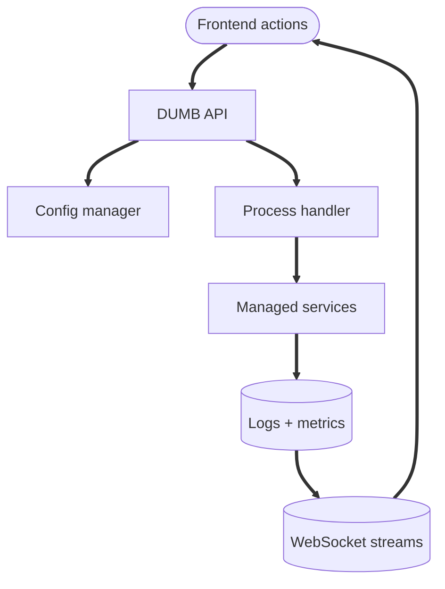
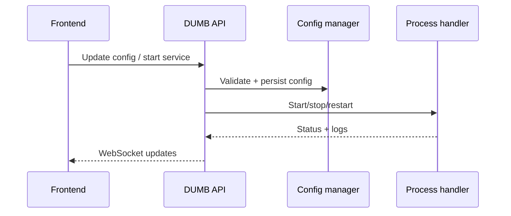

# Backend architecture

The DUMB backend is a FastAPI service that manages configuration, process lifecycle, and real-time updates. It is the control plane for all managed services.

---

## Core components

| Component | Responsibility |
|-----------|----------------|
| FastAPI app | HTTP API surface and WebSocket hubs |
| Routers | `/auth`, `/process`, `/config`, `/logs`, `/metrics`, `/ws/*` |
| Config manager | Reads/writes `dumb_config.json` and service settings |
| Process handler | Starts/stops services and reports status |
| Auto-update | Downloads releases/branches, runs setup, restarts services |
| Auto-restart | Monitors service health and applies backoff |
| Metrics | Collects system and service telemetry |

---

## Control plane flow

---

## Request flow

---

## Configuration pipeline

1. The API validates configuration updates.
2. Service setup hooks patch service-specific configs (for example Decypharr or NzbDAV).
3. The process handler applies changes and updates status.
4. WebSocket channels broadcast logs and state.

!!! warning "Config ownership"

    The backend is the source of truth for `dumb_config.json`. Manual edits are allowed, but should be followed by a reload or restart so the process handler picks up changes.

---

## Service orchestration

Service lifecycle is centralized in the process handler, which:

- Tracks enabled services and instances
- Executes setup/install steps
- Applies auto-update scheduling
- Enforces shutdown ordering

---

## WebSocket channels

The backend exposes WebSocket endpoints for:

- Service status updates
- Log streaming
- Metrics updates

These streams power the frontend’s real-time dashboard.

---

## Related pages

- [API reference](../api/index.md)
- [Process management](../api/process.md)
- [Authentication](../api/auth.md)
