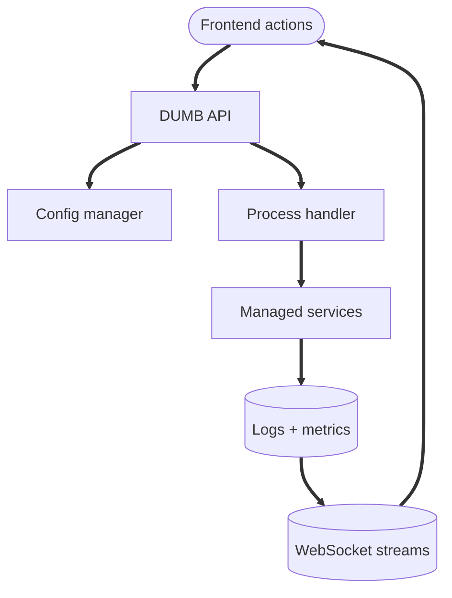
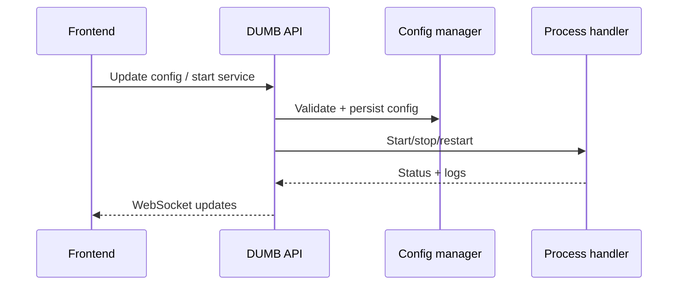

# Backend architecture

The DUMB backend is a FastAPI service that manages configuration, setup hooks, process lifecycle, dependency ordering, route generation, and real-time updates. It is the control plane for all managed services.

---

## Core components

| Component | Responsibility |
|-----------|----------------|
| FastAPI app | HTTP API surface and WebSocket hubs |
| Routers | `/auth`, `/process`, `/config`, `/logs`, `/metrics`, `/notifications`, `/ai`, `/seerr-sync`, `/ws/*` |
| Config manager | Reads/writes `/config/dumb_config.json` and service settings |
| Process handler | Starts/stops services and reports status |
| Setup modules | Install services and patch service-specific config files |
| Dependency graph | Resolves hard runtime dependencies, configured links, and optional integrations |
| Auto-update | Downloads releases/branches, runs setup, restarts services |
| Auto-restart | Monitors service health and applies backoff |
| Symlink jobs | Runs repair, migration, snapshot backup, and restore operations |
| Traefik setup | Writes DUMB-owned embedded UI routes and static Traefik config |
| Metrics | Collects system, process, filesystem, network, history, and opt-in database-health telemetry |
| Notifications | Queues and delivers routed Apprise/webhook events when enabled |
| AI diagnostics | Builds redacted diagnostic bundles for an optional configured model provider |

---

## Control plane flow

```mermaid
%%{ init: { "flowchart": { "curve": "basis" } } }%%
flowchart TD
    UI([Frontend actions])
    API[DUMB API]
    CFG[Config manager]
    PH[Process handler]
    SVC[Managed services]
    WS[(WebSocket streams)]
    LOG[(Logs + metrics)]

    UI ==> API
    API ==> CFG
    API ==> PH
    PH ==> SVC
    SVC ==> LOG
    LOG ==> WS
    WS ==> UI
```

---

## Request flow

```mermaid
sequenceDiagram
    participant UI as Frontend
    participant API as DUMB API
    participant CFG as Config manager
    participant PH as Process handler
    UI->>API: Update config / start service
    API->>CFG: Validate + persist config
    API->>PH: Start/stop/restart
    PH-->>API: Status + logs
    API-->>UI: WebSocket updates
```

---

## Configuration pipeline

1. The API validates configuration updates.
2. Service setup hooks patch service-specific configs (for example Decypharr, NzbDAV, AltMount, Profilarr, Traefik Proxy Admin, or Pulsarr).
3. The process handler applies changes and updates status.
4. WebSocket channels broadcast logs and state.

!!! warning "Config ownership"

    The backend is the source of truth for `dumb_config.json`. Manual edits are allowed, but should be followed by a reload or restart so the process handler picks up changes.

---

## Service orchestration

Service lifecycle is centralized in the process handler, which:

- Tracks enabled services and instances
- Executes setup/install steps
- Applies service-specific configuration reconciliation
- Resolves startup dependency order and post-core services
- Starts the DUMB API immediately and starts an already-installed DUMB Frontend
  before enabled-service preinstall, so the control plane remains available
  during longer service preparation
- Records individual service preinstall failures without shutting down the
  control plane; failed services retry through their normal startup path
- Applies auto-update scheduling
- Enforces shutdown ordering

---

## WebSocket channels

The backend exposes WebSocket endpoints for:

- Service status updates
- Log streaming
- Metrics updates

These streams power the frontend’s real-time dashboard.

---

## Related pages

- [API reference](../api/index.md)
- [Process management](../api/process.md)
- [Authentication](../api/auth.md)
