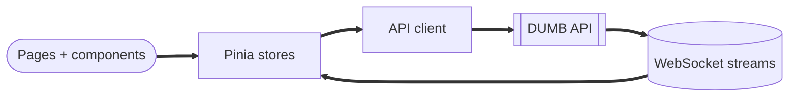

# Frontend architecture

The DUMB frontend is a Nuxt 4 application that renders the dashboard, service controls, and embedded UIs. It communicates with the DUMB API for configuration, logs, metrics, and service status.

---

## Key directories

| Path | Purpose |
|------|---------|
| `pages/` | Route-driven pages (dashboard, settings, onboarding) |
| `components/` | Reusable UI components |
| `composables/` | Shared logic and API hooks |
| `stores/` | Pinia stores for app state |
| `services/` | API clients and service abstractions |
| `layouts/` | Layout templates |

---

## Data flow

---

## Embedded service UIs

The frontend can embed service UIs in iframes when Traefik is enabled, keeping navigation and authentication within the DUMB experience.

!!! tip "Traefik paths"

    Embedded UIs use Traefik paths like `http://<host>/radarr/` or `http://<host>/sonarr/` when proxying is enabled.

---

## Configuration UX

Configuration editing is performed in the settings UI, which:

- Reads service config from the API
- Validates changes client-side where possible
- Submits updates to the backend for persistence

---

## Related pages

- [Frontend overview](../frontend/index.md)
- [Dashboard guide](../frontend/dashboard.md)
- [Settings guide](../frontend/settings.md)
