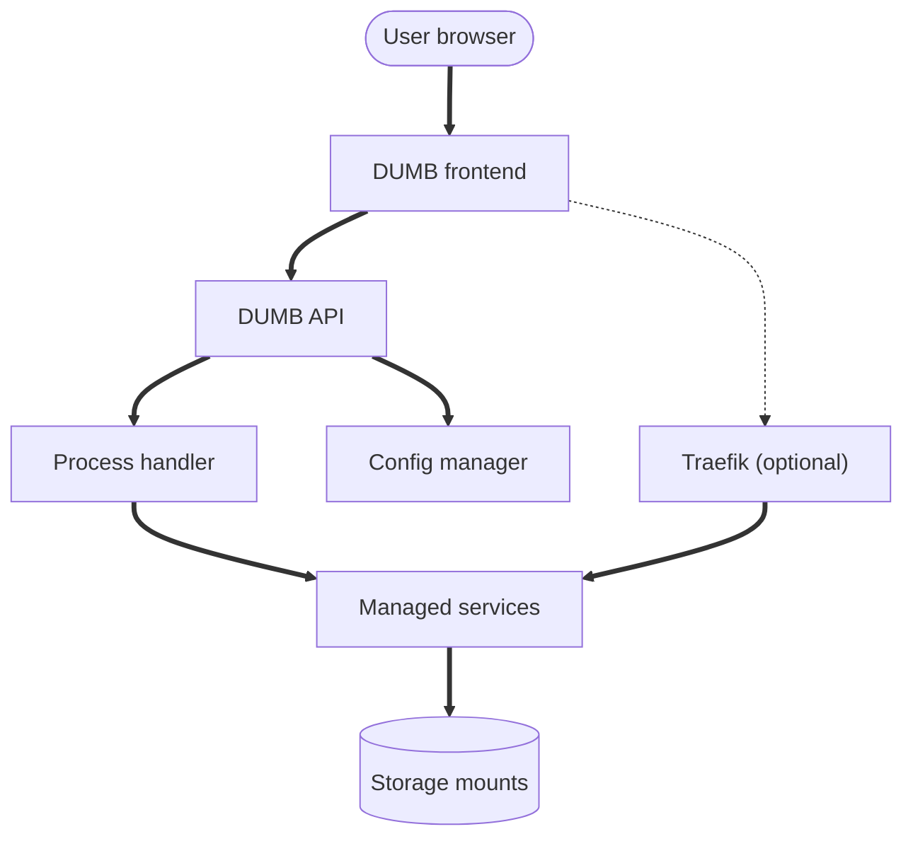

# Architecture overview

This section explains how DUMB is structured, how services are orchestrated, and how the frontend, backend, and proxy layers interact.

---

## System overview

DUMB bundles a FastAPI backend, a Nuxt 4 frontend, and a set of managed services (core, dependent, and optional). The backend owns configuration, process lifecycle, and update automation. The frontend surfaces status, logs, and configuration controls.

---

## Core building blocks

| Component | Responsibility |
|-----------|----------------|
| DUMB API | REST + WebSocket endpoints, config and process control |
| Process handler | Starts/stops services, monitors status, orchestrates updates |
| Config manager | Loads `dumb_config.json`, validates, persists changes |
| Auto-update | Fetches releases/branches and applies updates per service |
| Auto-restart | Monitors health and restarts services when needed |
| Frontend | UI for service status, logs, configuration, and onboarding |
| Traefik | Unified service UI routing (optional) |

---

## Storage and mounts

Most services store state under `/data`, `/config`, or service-specific directories (for example `/riven`, `/cli_debrid`, `/decypharr`, `/nzbdav`). Media access is typically provided via `/mnt/debrid`, with symlink folders exposed for curated libraries.

!!! tip "Mount propagation"

    When Arr services or media servers run outside the DUMB container, ensure mount propagation (`rshared`/`rslave`) is configured so symlinks and rclone mounts stay consistent.

---

## Networking and proxying

DUMB exposes the frontend and API directly, while Traefik can be enabled to consolidate access to service UIs under a single port and path-based routing.

!!! info "Traefik is optional"

    You can access service UIs directly on their ports, or enable Traefik to route everything under a single endpoint.

---

## Configuration lifecycle

1. DUMB loads `dumb_config.json` on startup.
2. The API and process handler apply config changes.
3. Service-specific setup hooks patch configs and directories.
4. The frontend reflects status and logs in real time.

---

## Related pages

- [Backend architecture](backend.md)
- [Frontend architecture](frontend.md)
- [Traefik proxy](traefik.md)
