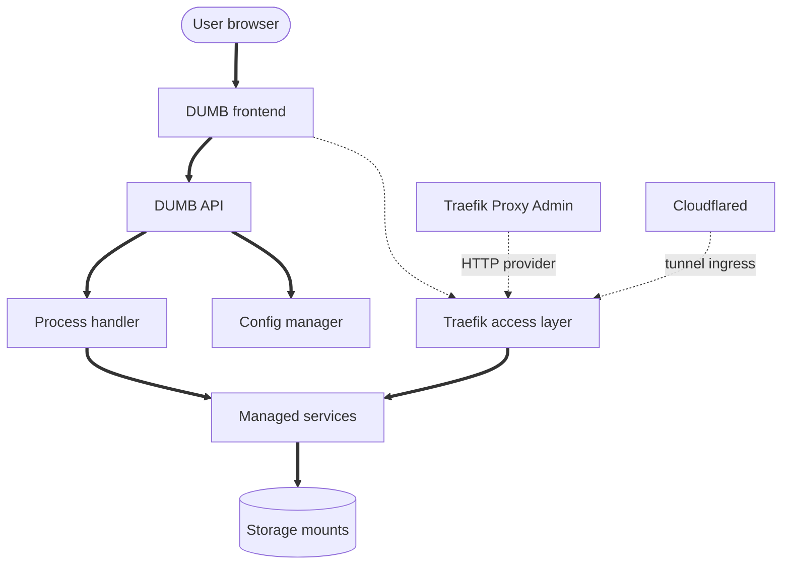

# Architecture overview

This section explains how DUMB is structured, how services are orchestrated, and how the frontend, backend, and proxy layers interact.

---

## System overview

DUMB bundles a FastAPI backend, a Nuxt 4 frontend, a Traefik access layer, and a set of managed services (core, dependent, and optional). The backend owns configuration, process lifecycle, setup hooks, dependency ordering, health checks, update automation, and Traefik route generation. The frontend surfaces onboarding, status, logs, metrics, configuration controls, and embedded service UIs.

```mermaid
flowchart TD
    U([User browser])
    FE[DUMB frontend]
    API[DUMB API]
    PH[Process handler]
    CFG[Config manager]
    SVC[Managed services]
    VOLS[(Storage mounts)]
    TR["Traefik access layer"]
    TPA["Traefik Proxy Admin"]
    CFD["Cloudflared"]

    U ==> FE
    FE ==> API
    API ==> PH
    API ==> CFG
    PH ==> SVC
    SVC ==> VOLS
    FE -.-> TR
    TR ==> SVC
    TPA -. HTTP provider .-> TR
    CFD -. tunnel ingress .-> TR

```

---

## Core building blocks

| Component | Responsibility |
|-----------|----------------|
| DUMB API | REST + WebSocket endpoints, config and process control |
| Process handler | Starts/stops services, monitors status, orchestrates updates |
| Config manager | Loads `dumb_config.json`, validates, persists changes |
| Auto-update | Fetches releases/branches and applies updates per service |
| Auto-restart | Monitors health and restarts services when needed |
| Frontend | UI for service status, logs, configuration, and onboarding |
| Traefik | Unified service UI routing and shared reverse-proxy entrypoint |
| Traefik Proxy Admin | Optional owner of user-managed LAN/public routes through Traefik |
| Cloudflared | Optional Cloudflare Tunnel connector that forwards public traffic to Traefik |

---

## Storage and mounts

Most services store state under `/data`, `/config`, or service-specific directories (for example `/riven`, `/cli_debrid`, `/decypharr`, `/nzbdav`, `/altmount`, `/traefik-proxy-admin`, or `/pulsarr`). Media access is typically provided via `/mnt/debrid`, with symlink folders exposed for curated libraries.

!!! tip "Mount propagation"

    When Arr services or media servers run outside the DUMB container, ensure mount propagation (`rshared`/`rslave`) is configured so symlinks and rclone mounts stay consistent.

---

## Networking and proxying

DUMB exposes the frontend and API directly, while Traefik can be enabled to consolidate access to service UIs under a single port and path-based routing. When Traefik Proxy Admin is enabled, Traefik also polls TPA's HTTP provider for user-managed host routes. When Cloudflared is enabled, Cloudflare Tunnel traffic is delivered to the same Traefik entrypoint.

!!! info "Traefik is optional"

    You can access service UIs directly on their ports, or enable Traefik to route embedded UIs under a single endpoint. TPA and Cloudflared are optional additions for user-managed hostnames and tunnel ingress.

---

## Configuration lifecycle

1. DUMB loads `dumb_config.json` on startup.
2. The API and process handler apply config changes.
3. Service-specific setup hooks patch configs and directories.
4. The frontend reflects status and logs in real time.

---

## Related pages

- [Backend architecture](backend.md)
- [Frontend architecture](frontend.md)
- [Traefik proxy](traefik.md)
