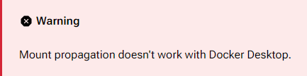

# Deployment Overview

DUMB can be deployed across a variety of platforms and environments. Most
platforms use the maintained Docker image. Proxmox can instead use the
[native LXC helper](proxmox.md), which installs DUMB and its managed services
directly in a Debian guest without Docker.

All deployment methods provide access to the same integrated services and configurations, with slight differences in how the container is started and managed.

!!! tip "Platform-Specific Instructions"
    **Select your platform from the left navigation** to view detailed, platform-specific deployment instructions. Each platform guide includes step-by-step setup instructions tailored to your environment.

---

## System Requirements

- **Docker or a supported native Proxmox LXC**
- Linux system (WSL on Windows when using `rshared`)
- A practical minimum of 2 vCPU and 2 GB RAM for a small stack; larger stacks and source builds need more
- SSD-backed persistent storage is strongly recommended


!!! warning "Docker Desktop" 
    Docker Desktop cannot support DUMB workflows that require `rshared` mount propagation.

    Docker Desktop does not support the [mount propagation](https://docs.docker.com/storage/bind-mounts/#configure-bind-propagation) required to expose DUMB-created rclone/FUSE submounts to external host containers.

    

    See the [deployment options](https://dumbarr.com/deployment/wsl) to run DUMB on Windows through WSL2.
---

## Required Credentials

| Workflow | Required information |
|---|---|
| Debrid | API key for each selected debrid provider |
| Usenet | NNTP provider connection details |
| Plex | Claim/token and address when needed by the selected integration |
| Private/sponsored GitHub source | Read-capable GitHub token only when required |
| Cloudflared | Cloudflare Tunnel token when enabled |

 See [Configuration → Integration Tokens](../features/configuration.md#integration-tokens-credentials)

---

## Required Directories

The maintained Compose file uses these persistent mounts. Native Proxmox LXC
deployments use the same absolute paths directly inside the guest.

| Container Mount Path       | Description                                       |
|----------------------------|---------------------------------------------------|
| `/config` | DUMB configuration and feature state |
| `/log` | DUMB and service logs |
| `/data` | Service-specific persistent data, reached through DUMB-managed internal symlinks |
| `/mnt/debrid` | Mounts, links, and symlink libraries |

!!! note "Internal service paths"
    Paths such as `/plex`, `/postgres_data`, `/zurg/RD`, and `/altmount` are still the paths services use inside the container, but DUMB maps them into subdirectories of the mounted `/data` tree. Do not add a separate bind mount for each one unless you are deliberately retaining a legacy/advanced layout.

!!! important "Choose mount propagation deliberately"

    Keep the `/mnt/debrid` bind private when the Arr applications and media
    server run inside DUMB. Add `:rshared` only when a prepared Linux host mount
    must receive DUMB-created FUSE/rclone submounts for external consumers. The
    host path must already support shared propagation; adding the Compose suffix
    alone is not sufficient. See the platform guide, especially
    [Proxmox](proxmox.md), before enabling it.
---

!!! note "Configuration Requirements"
    All deployment methods rely on a valid and accessible `dumb_config.json` file for configuring services.
    
    It is strongly recommended to bind-mount a local `config` directory to persist user data.

!!! example "Example Volume Mount"
    ```yaml
    dumb:
      image: iampuid0/dumb:latest
      volumes:
        - ./config:/config
        - ./log:/log
        - ./data:/data
        - ./mnt/debrid:/mnt/debrid
    ```

    For a deliberately configured external-consumer topology, the final line
    becomes `./mnt/debrid:/mnt/debrid:rshared`.

For more about configuring services, see the [Configuration](../features/configuration.md) page.

---

## Related Pages
- [Docker Networking and Ports](networking.md)
- [Service Overview](../services/index.md)
- [Features](../features/index.md)
