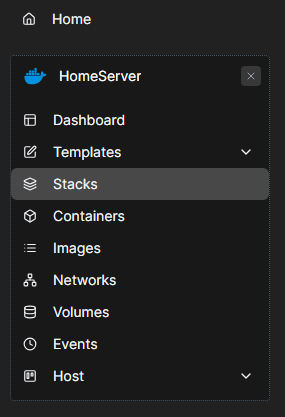
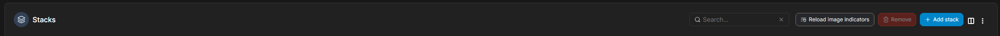
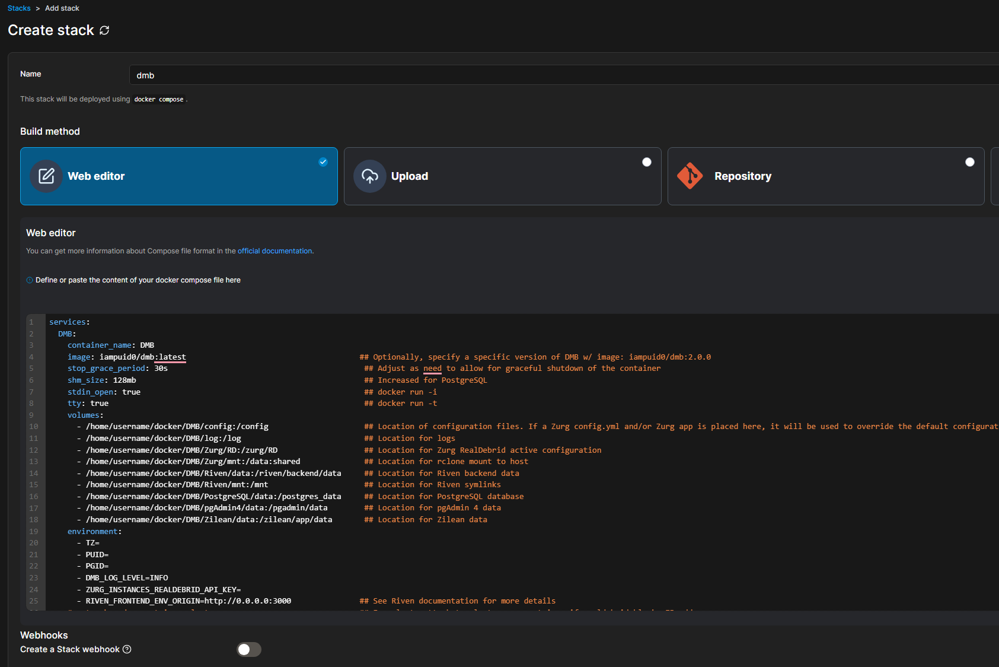
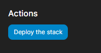

## Deploying DUMB with Portainer

Portainer provides a user-friendly web interface for managing Docker containers and stacks. This guide walks you through deploying **Debrid Unlimited Media Bridge (DUMB)** using Portainer's stack deployment feature.

---

## Prerequisites

Before you begin:

-  Docker and Portainer must be installed and running
-  Internet access (to pull the DUMB image)
-  Mounted host directories for persistent data storage

---

## Step-by-Step Deployment

### 1. Log into Portainer

Navigate to your Portainer instance (e.g., `http://localhost:9000`, or `https://localhost:9443`) and log in.

---

### 2. Navigate to Stacks

Click on **Stacks** in the left sidebar.

---

### 3. Click "Add Stack"

Click the **+ Add stack** button at the top-right.

---

### 4. Configure the Stack

Enter the following:

- **Name**: `dumb`
- **Build method**: Select `Web editor`
- **Web editor**: Paste the DUMB `docker-compose` content (see below)

!!! important
    The `docker-compose.yml` file must be updated to include the correct environment variable values and host paths.  
    For example, replace `/home/username/docker` with the actual path on your system.

---

### 5. Deploy the Stack

Click **Deploy the stack** to launch DUMB.

---

## That’s It!

Once deployed, DUMB will initialize and make its services available at their respective ports (e.g., DUMB Frontend at `:3005`, API at `:8000`, etc.).

You can now manage DUMB entirely through the **[DUMB Frontend](../services/dumb/dumb-frontend.md)**, or explore the [Configuration](../features/configuration.md) docs to adjust settings as needed.

---

## Viewing Logs for DUMB

Once your stack is deployed, you can view logs for the DUMB container:

1. Navigate to **Containers** from the left sidebar.
2. Click on the **DUMB** container name.
3. Go to the **Logs** tab.
4. Logs will stream live by default. You can scroll or refresh for updates.

!!! note "This is helpful for debugging service startup or checking configuration issues."

---

## Attach to the Container

To view live output or run interactive commands:

1. From the **Containers** page, click on the **DUMB** container.
2. Click the **Attach Console** button
3. Choose a shell (e.g., `sh`, `bash`, or `/venv/bin/python`) and click **Connect**.

!!! note "Use this for tasks like inspecting running processes, modifying configs, or testing tools inside the container."

---

## Console Access

You can also use the **Console** option to access the container shell:

1. From the **Containers** tab, click on **DUMB**.
2. Click the **Console** tab.
3. Choose the shell you wish to run.
4. Click **Connect**.

!!! note "Great for quick inspection or administrative tasks inside the container."

---