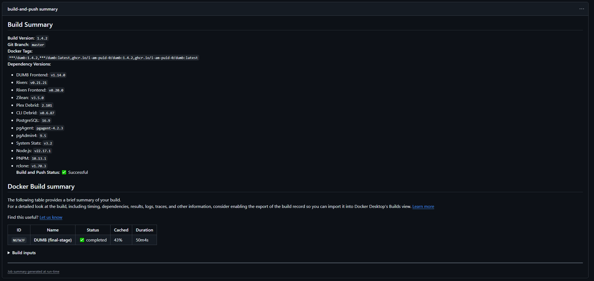

# DMB FAQ

Below are some common questions and solutions related to **DMB**.

---
## ❓ Frequently Asked Questions (FAQ)

### Does the **DMB** image have the latest version of `x`

The GitHub repo for **DMB** use many continuous integration and continuous deployment (CI/CD) workflows to ensure proper building, reporting, and updating of the images.

For example, the [Check for New Release Tags](https://github.com/I-am-PUID-0/DMB/actions/workflows/fetch-latest-tags.yml) workflow is automated to run every three hours and check for updates to the various services/projects utilized in DMB. If an update is found, the [Docker Image CI](https://github.com/I-am-PUID-0/DMB/actions/workflows/docker-image.yml) workflow is called to build a new image with the latest services. 

### What versions are in the latest **DMB** image

Similar to the above question, and the answer is usually the latest; however, if there has been a recent release and the [Check for New Release Tags](https://github.com/I-am-PUID-0/DMB/actions/workflows/fetch-latest-tags.yml) workflow has not run yet, then there my be disparity. 

To check, click on one of the [Docker Image CI](https://github.com/I-am-PUID-0/DMB/actions/workflows/docker-image.yml) jobs to see the `Build Summary`

Example `Build Summary` below:
