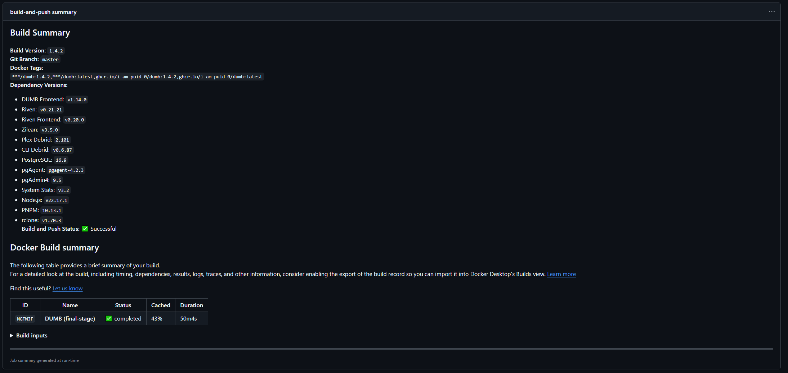

# DUMB FAQ

Below are some common questions and solutions related to **DUMB**.

---
## Frequently Asked Questions (FAQ)

### Does the **DUMB** image have the latest version of `x`

The GitHub repo for **DUMB** use many continuous integration and continuous deployment (CI/CD) workflows to ensure proper building, reporting, and updating of the images.

For example, the [Check for New Release Tags](https://github.com/I-am-PUID-0/DUMB/actions/workflows/fetch-latest-tags.yml) workflow is automated to run every three hours and check for updates to the various services/projects utilized in DUMB. If an update is found, the [Docker Image CI](https://github.com/I-am-PUID-0/DUMB/actions/workflows/docker-image.yml) workflow is called to build a new image with the latest services. 

### What versions are in the latest **DUMB** image

Similar to the above question, and the answer is usually the latest; however, if there has been a recent release and the [Check for New Release Tags](https://github.com/I-am-PUID-0/DUMB/actions/workflows/fetch-latest-tags.yml) workflow has not run yet, then there my be disparity. 

To check, click on one of the [Docker Image CI](https://github.com/I-am-PUID-0/DUMB/actions/workflows/docker-image.yml) jobs to see the `Build Summary`

Example `Build Summary` below:


---

## Authentication

### How do I enable authentication?

Authentication can be enabled during the first-time setup or later via Settings:

1. Navigate to **Settings** in the sidebar
2. Find the **Authentication** section
3. Click **Enable Authentication**
4. If no users exist, create an admin account

See the [Authentication Guide](../features/authentication.md) for details.

### I'm locked out of DUMB - how do I reset authentication?

If you cannot access your account:

1. Stop the DUMB container
2. Edit `/config/users.json`
3. Set `"auth_enabled": false`
4. Restart the container
5. Access the dashboard and create a new user

### Why do I get "Invalid credentials" when logging in?

- Usernames are case-sensitive
- Verify the password is correct
- Check if your user account is disabled in Settings :material-arrow-right: User Management

### My session keeps expiring - what's wrong?

- Access tokens expire after 60 minutes by default
- The frontend should automatically refresh tokens
- If issues persist, clear browser storage and log in again
- Check if "Remember Me" was checked during login

---

## WebSocket and Real-time Updates

### Dashboard status is not updating in real-time

1. Check the WebSocket connection indicator in the header
2. Verify your browser supports WebSocket connections
3. Check for network/firewall issues blocking WebSocket
4. Try refreshing the page to reconnect

### Metrics page shows "Disconnected"

- The metrics WebSocket may have dropped
- The frontend will automatically reconnect
- If it persists, check DUMB API logs for errors

---

## Services

### How do I access service UIs?

When embedded UIs are enabled, access services at:

```
http://<host>:18080/service/ui/<service_name>
```

Or access services directly on their native ports. See [Embedded Service UIs](../features/embedded-ui.md).

### A service keeps restarting - what should I do?

1. Check the service logs for error messages
2. Verify the service configuration is valid
3. Check if dependencies are running
4. Review auto-restart settings in the service config

See [Auto-restart](../features/auto-restart.md) for more information.