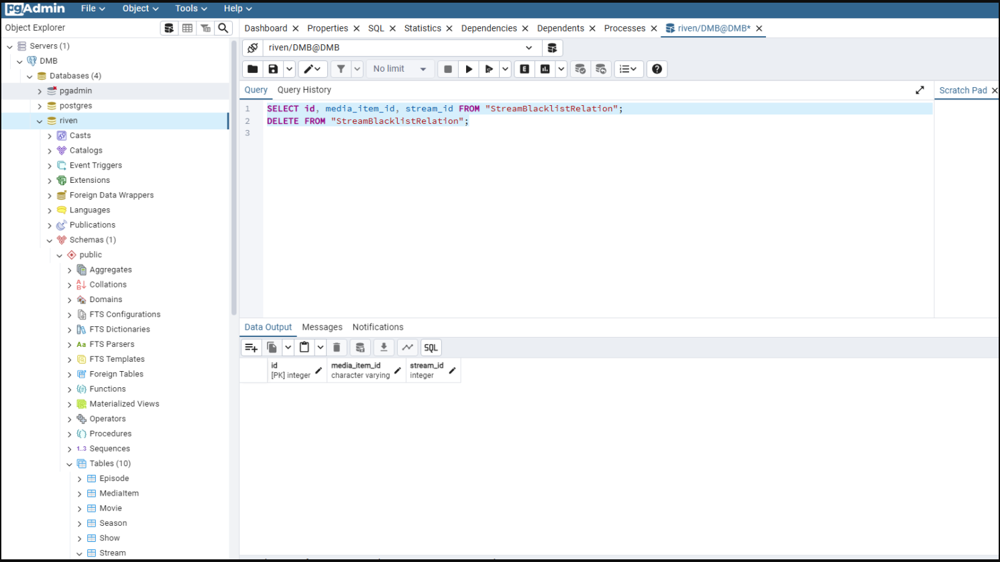
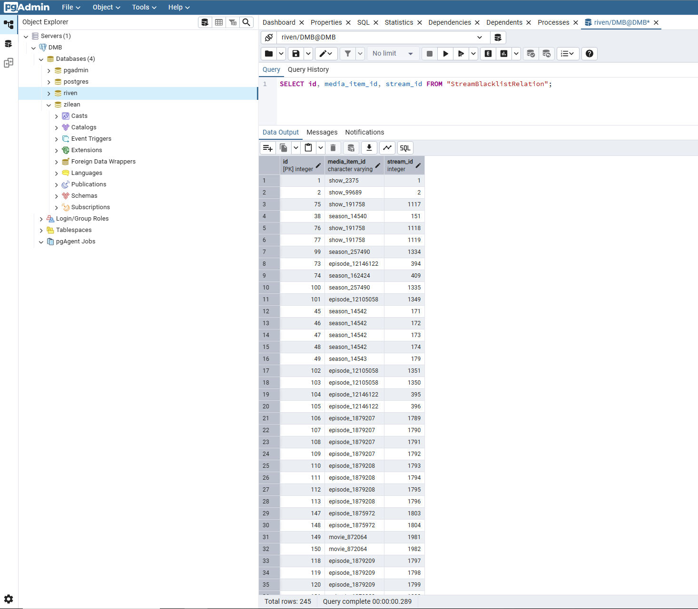
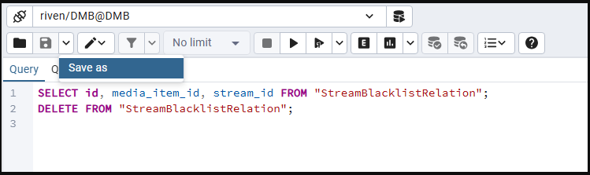
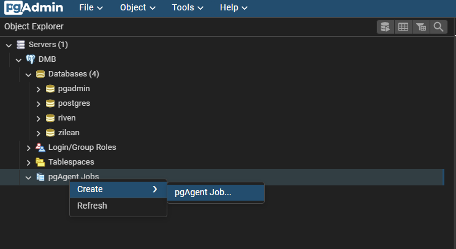
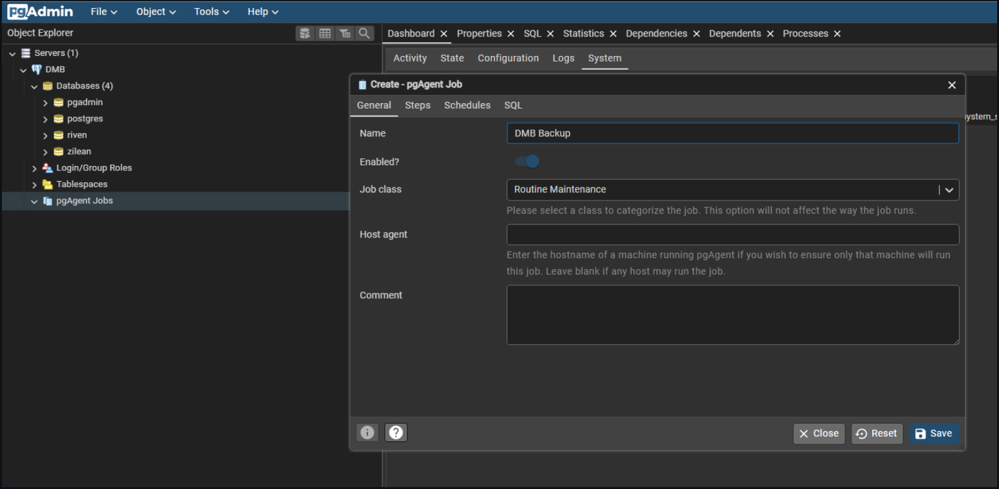
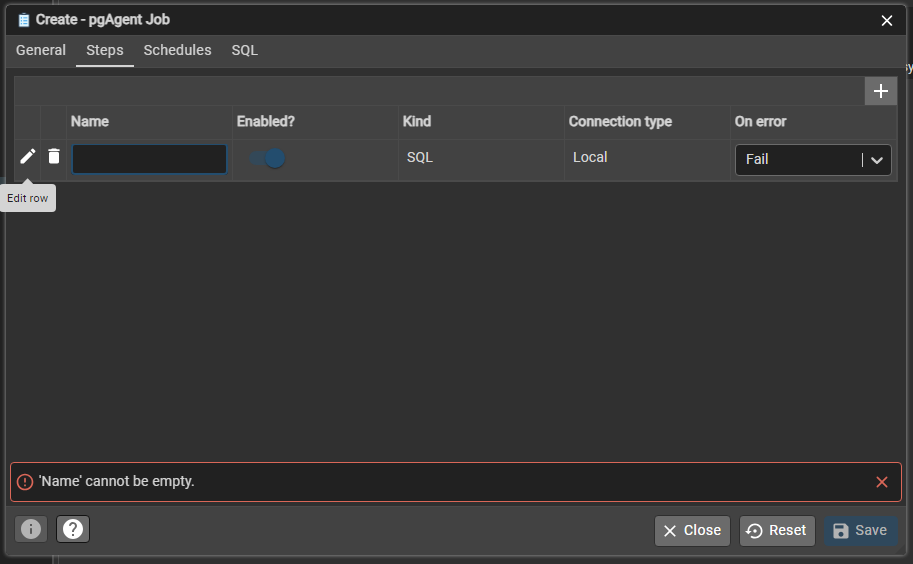
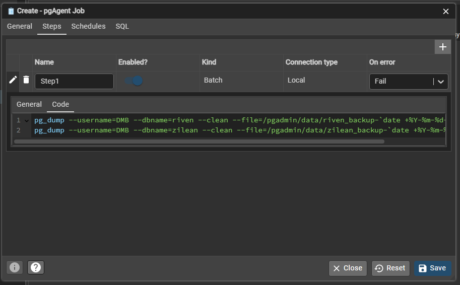
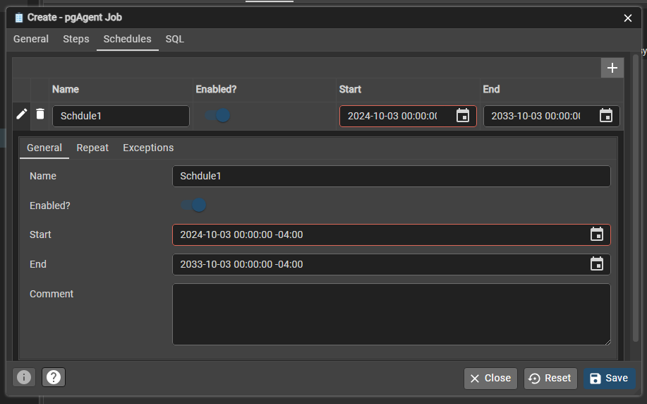
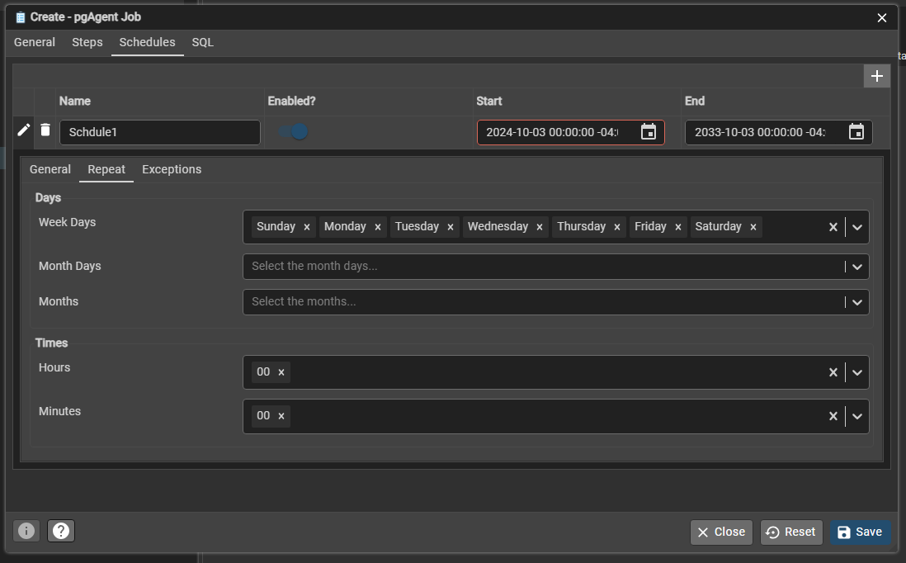

# pgAdmin FAQ

Below are common questions and helpful usage tips for working with **pgAdmin** in DMB.

---

## ❓ Frequently Asked Questions (FAQ)

### What is pgAdmin used for in DMB?

pgAdmin is a web-based GUI for managing PostgreSQL. In the context of DMB, it connects to the PostgreSQL instance used by services like Riven and Zilean.

You can use it to:

- Explore and modify database tables and data
- Run SQL queries manually using the **Query Tool**
- Schedule tasks using **pgAgent** (optional tool inside pgAdmin)
- View the [System Stats](../services/pgadmin.md#-system_stats) inside PostgreSQL
---

## 🧪 Using pgAdmin’s Query Tool

To run manual queries (e.g., inspecting or modifying blacklist entries):

1. Navigate to the **"Databases"** list in the left sidebar.
2. Right-click the `riven` or `zilean` database.
3. Select **Query Tool**.
4. Paste your SQL query in the top panel and run it.

### 🔄 Example: View & Clear Riven's Stream Blacklist

```sql
SELECT id, media_item_id, stream_id FROM "StreamBlacklistRelation";
DELETE FROM "StreamBlacklistRelation";
```



To just view the count:

```sql
SELECT COUNT(*) FROM "StreamBlacklistRelation";
```



---


## 💾 Save Queries for Later

Click **Save As** in the Query Tool to store frequently used queries as `.sql` files.



---

## 🧹 Drop a Database or Create a Manual Backup in pgAdmin

### 🗑️ Drop a Database

You can delete a database from within pgAdmin if you no longer need it (e.g., to reset Riven or Zilean).

1. In the **Object Browser**, expand the **Databases** section.
2. Right-click the target database (e.g., `riven` or `zilean`).
3. Select **Delete/Drop**.
4. Confirm when prompted.

!!! warning 
    This will permanently remove the database and all its data.  
    Ensure you’ve backed up anything you want to keep before proceeding.

---

### 💾 Manually Create a Database Backup

To create a backup of any database using the pgAdmin interface:

1. In the **Object Browser**, right-click the desired database.
2. Choose **Backup**.
3. In the dialog:

    - **Format**: Select `Custom` to enable full database restore capability.
    - **Filename**: Save to `/pgadmin/data/your_backup_name.backup` or `.sql`.

4. Ensure **Dump Options #1** is configured with:

    - `Include CREATE DATABASE statement` enabled (for standalone restoration)
    - `Only data` and `Only schema` **unchecked** (you want both schema and data)

5. Under **Dump Options #2**, verify or set advanced filters if needed.

6. Click **Backup** to start the process.

---

### 🗂️ .backup vs .sql

- `.backup` (Custom Format)

    - Recommended for **complete backups**
    - Supports **compression, selective restore, and full restore** via pgAdmin or `pg_restore`
    - Not human-readable but ideal for production-grade backups

- `.sql` (Plain Format)

    - Outputs all SQL commands as text
    - Human-readable and easy to inspect or modify manually
    - Can be restored via `psql`, but lacks compression and selective restoration features

!!! tip  "For a reliable, restorable snapshot of your database, always choose `.backup` with Custom format."

---

> For more advanced backup configuration and explanation of options, see the [pgAdmin Backup Dialog Documentation](https://www.pgadmin.org/docs/pgadmin4/latest/backup_dialog.html).


## ⏱️ Optional: Use pgAgent to Schedule Tasks

pgAdmin comes with **pgAgent**, which lets you create recurring jobs.

> This is entirely optional and not required to use DMB.

## 💾 Example: Scheduled Backups with pgAgent

1. Navigate to `pgAgent Jobs` under your connected DMB server.
2. Right-click → `Create → pgAgent Job`

    

3. Enter the job name and any comments.

    

4. Go to the **Steps** tab and click the `+` button to **Add row**.
5. Edit the new row to configure a backup step.

    

6. Enter a step name, set `Kind` = `Batch`, and paste your backup command in the **Code** tab:

    ```sql
    pg_dump --username=DMB --dbname=riven --clean --file=/pgadmin/data/riven_backup-`date +%Y-%m-%d-%H-%M-%S`.sql
    pg_dump --username=DMB --dbname=zilean --clean --file=/pgadmin/data/zilean_backup-`date +%Y-%m-%d-%H-%M-%S`.sql
    ```

    

7. Go to the **Schedules** tab to define when the backup should run.

    

8. On the **Repeat** tab, set a repeat interval like daily at midnight.

    

9. Save your pgAgent job.

!!! tip "Backups are saved in `/pgadmin/data` by default."

---

## 📎 Related Pages

- [PostgreSQL FAQ](postgres.md)
- [Zilean](../services/zilean.md)
- [Riven Backend](../services/riven-backend.md)