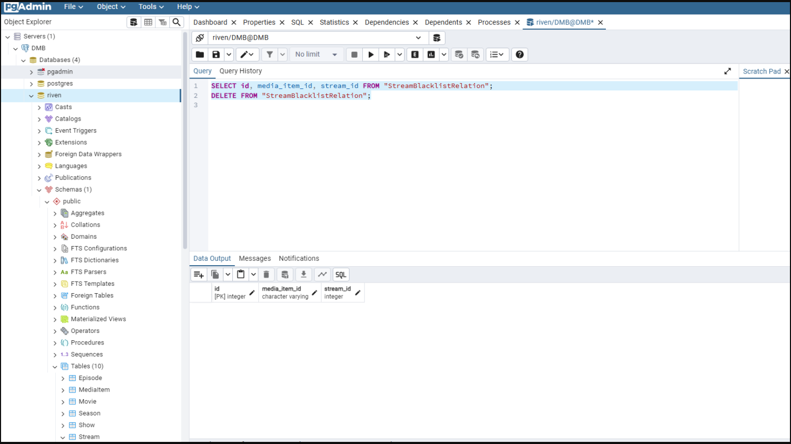
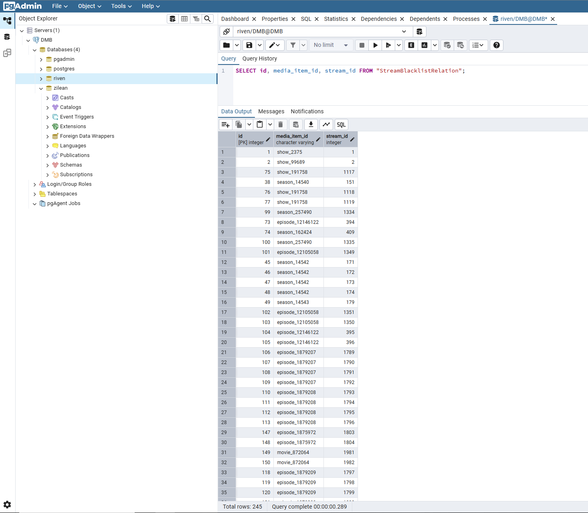
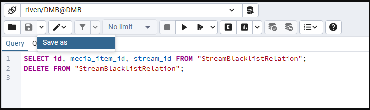
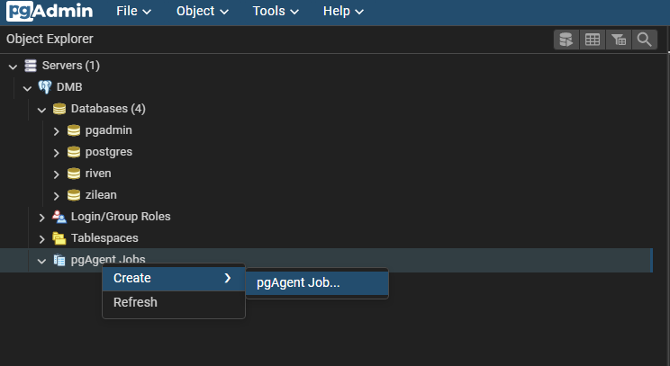
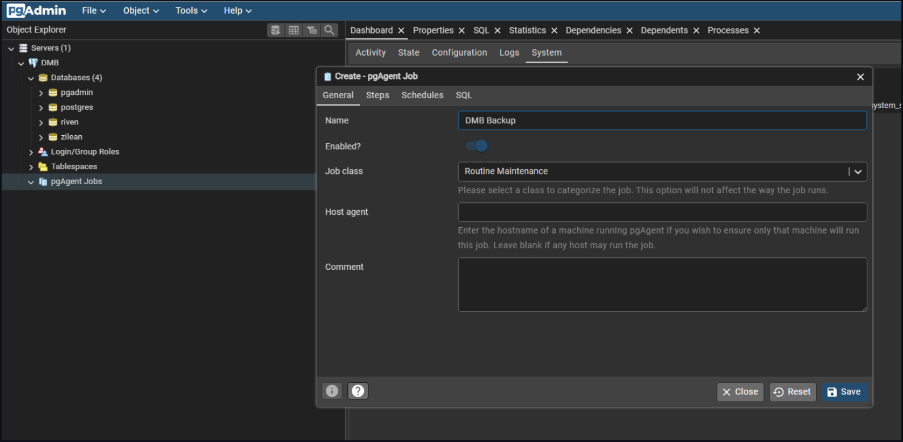
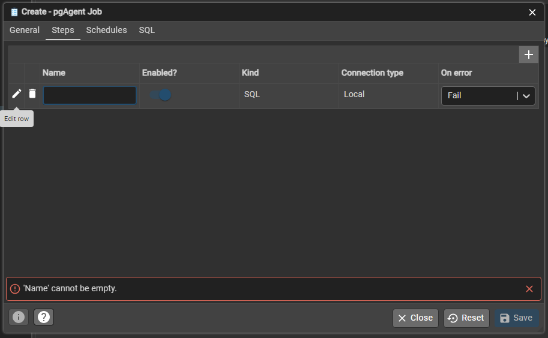
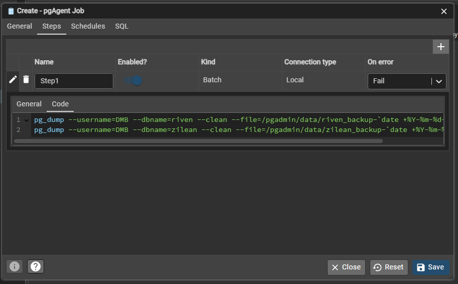
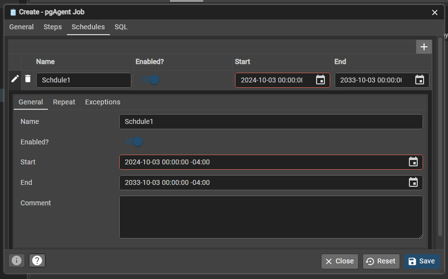
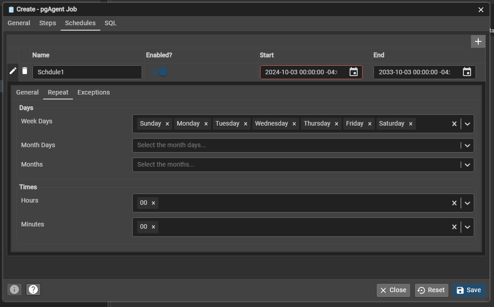

# pgAdmin FAQ

Below are common questions and helpful usage tips for working with **pgAdmin** in DUMB.

---

## Frequently Asked Questions (FAQ)

### What is pgAdmin used for in DUMB?

pgAdmin is a web-based GUI for managing PostgreSQL. In the context of DUMB, it connects to the PostgreSQL instance used by services like Riven and Zilean.

You can use it to:

- Explore and modify database tables and data
- Run SQL queries manually using the **Query Tool**
- Schedule tasks using **pgAgent** (optional tool inside pgAdmin)
- View the [System Stats](../services/optional/pgadmin.md#system_stats) inside PostgreSQL
---

## Using pgAdmin’s Query Tool

To run manual queries (e.g., inspecting or modifying blacklist entries):

1. Navigate to the **"Databases"** list in the left sidebar.
2. Right-click the `riven` or `zilean` database.
3. Select **Query Tool**.
4. Paste your SQL query in the top panel and run it.

### Example: View & Clear Riven's Stream Blacklist

```sql
SELECT id, media_item_id, stream_id FROM "StreamBlacklistRelation";
DELETE FROM "StreamBlacklistRelation";
```



To just view the count:

```sql
SELECT COUNT(*) FROM "StreamBlacklistRelation";
```



---


## Save Queries for Later

Click **Save As** in the Query Tool to store frequently used queries as `.sql` files.



---

## Drop a Database or Create a Manual Backup in pgAdmin

### Drop a Database

You can delete a database from within pgAdmin if you no longer need it (e.g., to reset Riven or Zilean).

1. In the **Object Browser**, expand the **Databases** section.
2. Right-click the target database (e.g., `riven` or `zilean`).
3. Select **Delete/Drop**.
4. Confirm when prompted.

!!! warning 
    This will permanently remove the database and all its data.  
    Ensure you’ve backed up anything you want to keep before proceeding.

---

### Manually Create a Database Backup

To create a backup of any database using the pgAdmin interface:

1. In the **Object Browser**, right-click the desired database.
2. Choose **Backup**.
3. In the dialog:

    - **Format**: Select `Custom` to enable full database restore capability.
    - **Filename**: Save to `/pgadmin/data/your_backup_name.backup` or `.sql`.

4. Ensure **Dump Options #1** is configured with:

    - `Include CREATE DATABASE statement` enabled (for standalone restoration)
    - `Only data` and `Only schema` **unchecked** (you want both schema and data)

5. Under **Dump Options #2**, verify or set advanced filters if needed.

6. Click **Backup** to start the process.

---

### .backup vs .sql

- `.backup` (Custom Format)

    - Recommended for **complete backups**
    - Supports **compression, selective restore, and full restore** via pgAdmin or `pg_restore`
    - Not human-readable but ideal for production-grade backups

- `.sql` (Plain Format)

    - Outputs all SQL commands as text
    - Human-readable and easy to inspect or modify manually
    - Can be restored via `psql`, but lacks compression and selective restoration features

!!! tip  "For a reliable, restorable snapshot of your database, always choose `.backup` with Custom format."

---

> For more advanced backup configuration and explanation of options, see the [pgAdmin Backup Dialog Documentation](https://www.pgadmin.org/docs/pgadmin4/latest/backup_dialog.html).


## Example: Scheduled Backups with pgAgent

DUMB includes the pgAgent package, creates its PostgreSQL extension, and starts
the agent when pgAdmin is enabled. The example below creates daily, compressed
custom-format dumps for every connectable non-template database, backs up global
roles, and removes files older than 14 days.

!!! note "Where the backups are stored"

    This example writes to `/pgadmin/data/backups` inside DUMB. In the maintained
    volume layout that is persisted under `/data/pgadmin/backups`.

    A backup stored beside the same container data is not an off-system backup.
    Include the host-side `data/pgadmin/backups` directory in separate storage,
    snapshot, or replication so one disk or filesystem failure cannot destroy
    both PostgreSQL and its dumps.

1. Enable and start both **PostgreSQL** and **pgAdmin** in DUMB.
2. Log in to pgAdmin, connect to the preconfigured **DUMB** server, and expand
   `pgAgent Jobs`. If the node does not appear, refresh the server tree and check
   the PostgreSQL, pgAdmin, and pgAgent service logs before continuing.
3. Right-click `pgAgent Jobs` and select **Create → pgAgent Job**.

    

4. Name the job `DUMB PostgreSQL backups`, enable it, and leave **Host Agent**
   blank unless this database is managed by more than one pgAgent host.

    

5. Open **Steps**, add a step, and use these values:

    - **Name:** `01-backup-all-databases`
    - **Kind:** `Batch`
    - **Enabled:** Yes
    - **On error:** Fail

    

6. Paste this shell script into the step's **Code** tab. Change
   `retention_days` if required:

    ```bash
    #!/bin/sh
    set -eu

    backup_dir=/pgadmin/data/backups
    retention_days=14
    timestamp=$(date -u +%Y%m%dT%H%M%SZ)
    socket_dir=/run/postgresql

    mkdir -p "$backup_dir"

    # Preserve cluster-level roles in addition to the per-database archives.
    pg_dumpall \
      --host="$socket_dir" \
      --username=DUMB \
      --no-password \
      --globals-only \
      --file="$backup_dir/globals-$timestamp.sql"

    psql \
      --host="$socket_dir" \
      --username=DUMB \
      --dbname=postgres \
      --no-password \
      --tuples-only \
      --no-align \
      --command="SELECT datname FROM pg_database WHERE datallowconn AND NOT datistemplate ORDER BY datname" |
    while IFS= read -r database; do
      safe_name=$(printf '%s' "$database" | tr -c 'A-Za-z0-9_.-' '_')
      pg_dump \
        --host="$socket_dir" \
        --username=DUMB \
        --no-password \
        --format=custom \
        --file="$backup_dir/$safe_name-$timestamp.backup" \
        "$database"
    done

    find "$backup_dir" -type f \
      \( -name '*.backup' -o -name 'globals-*.sql' \) \
      -mtime "+$retention_days" -delete
    ```

    

    DUMB's default local-socket authentication allows its `DUMB` database role
    to run these commands without embedding a password in the job. If you have
    customized `pg_hba.conf` to require a password for local connections, use a
    root-owned/libpq `.pgpass` file with mode `0600`; do not paste the PostgreSQL
    password into the pgAgent job.

7. Open **Schedules**, add a schedule, enable it, and choose a start time when
   database activity is normally low.

    

8. On **Repeat**, select every day and the desired hour/minute. pgAgent schedule
   values use the DUMB container's timezone.

    

9. Save the job, right-click it, and select **Run now**. Confirm that the run is
   successful and that `.backup` files plus a `globals-*.sql` file appeared in
   `/pgadmin/data/backups`.

### Test a restore

A successful job only proves that files were written. Periodically restore one
of the application archives into a disposable database:

1. In pgAdmin, right-click **Databases**, select **Create → Database**, and create
   a clearly temporary database such as `restore_test`.
2. Right-click that database and select **Restore**.
3. Select the matching `.backup` file from `/pgadmin/data/backups`, choose
   **Custom or tar**, and enable **Exit on error**.
4. Run the restore and inspect representative tables or application records.
5. Drop only the disposable `restore_test` database after validation.

Do not test by restoring over a live application database. The separate
`globals-*.sql` file contains cluster roles and is restored with `psql` only when
rebuilding a cluster, before restoring the per-database custom archives.

For the underlying behavior, see the official
[pgAgent job documentation](https://www.pgadmin.org/docs/pgadmin4/latest/pgagent_jobs.html),
[pg_dump documentation](https://www.postgresql.org/docs/current/app-pgdump.html),
and [pg_restore documentation](https://www.postgresql.org/docs/current/app-pgrestore.html).

---

## Related Pages

- [PostgreSQL FAQ](postgres.md)
- [Zilean](../services/optional/zilean.md)
- [Riven Backend](../services/core/riven-backend.md)
