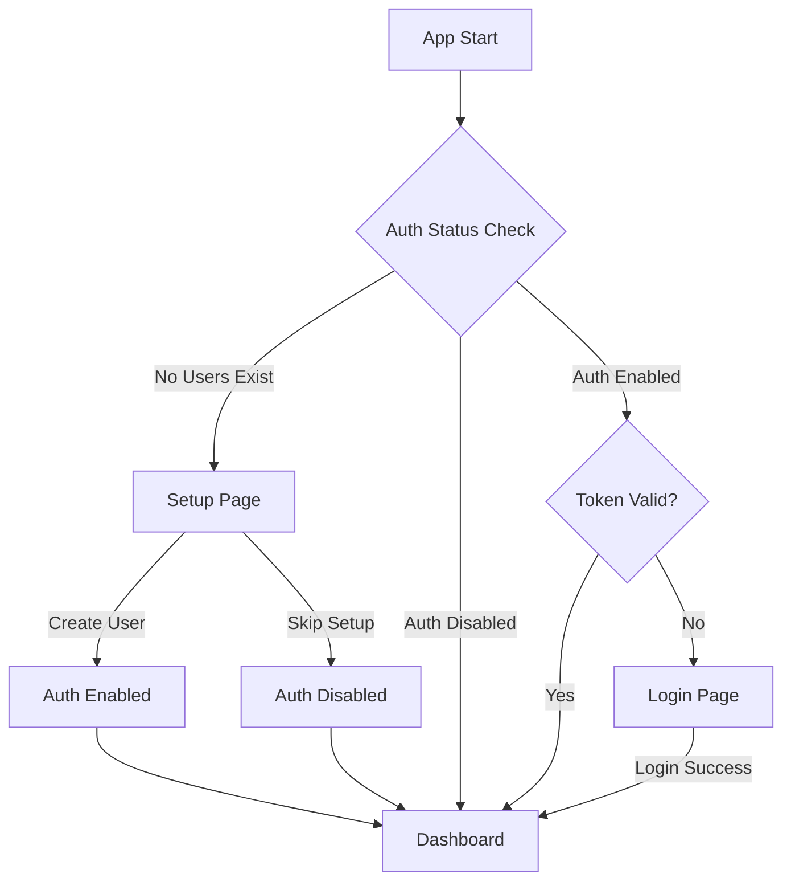

# Authentication

DUMB includes an optional JWT-based authentication system to secure access to the API and web interface. Authentication can be enabled during initial setup or at any time through the settings page.

---

## Overview

The authentication system provides:

- **JWT token-based security** with access and refresh tokens
- **User management** with create, update, and delete capabilities
- **First-time setup wizard** for creating the initial admin user
- **Optional authentication** - can be skipped for local/trusted environments
- **Session persistence** with "Remember Me" functionality

---

## Authentication flow



---

## First-time setup

When DUMB starts for the first time, the frontend detects that no users exist and redirects to the setup page.

### Setup options

=== "Create admin account"

    1. Navigate to the DUMB frontend (default: `http://localhost:3005`)
    2. You will be redirected to `/setup`
    3. Enter a username and password
    4. Click **Create Account**
    5. Authentication is automatically enabled
    6. You are logged in and redirected to the dashboard

=== "Skip authentication"

    1. Navigate to the DUMB frontend
    2. On the setup page, click **Skip Setup**
    3. Authentication remains disabled
    4. All API endpoints are accessible without tokens
    5. You can enable authentication later in Settings

!!! warning "Security consideration"

    Skipping authentication is only recommended for local development or fully isolated environments. If your DUMB instance is accessible from the network, enable authentication to protect your services.

---

## Login process

When authentication is enabled, users must log in to access the dashboard and API.

### Login steps

1. Navigate to the DUMB frontend
2. Enter your username and password
3. Optionally check **Remember Me** for persistent sessions
4. Click **Login**

### Token management

| Token Type | Lifetime | Storage | Purpose |
|------------|----------|---------|---------|
| Access Token | 60 minutes | Session/Local Storage | API requests |
| Refresh Token | 30 days | Session/Local Storage | Obtain new access tokens |

- **Remember Me checked**: Tokens stored in `localStorage` (persist across browser sessions)
- **Remember Me unchecked**: Tokens stored in `sessionStorage` (cleared when browser closes)

---

## User management

Administrators can manage users through the Settings page or API.

### Available operations

| Operation | Description |
|-----------|-------------|
| **Create User** | Add a new user with username and password |
| **Disable User** | Temporarily disable a user account |
| **Enable User** | Re-enable a disabled user account |
| **Delete User** | Permanently remove a user account |

!!! note "Last active user protection"

    The last active (non-disabled) user cannot be disabled or deleted. This prevents accidentally locking yourself out of the system.

### Managing users via settings

1. Navigate to **Settings** in the sidebar
2. Scroll to the **User Management** section
3. Use the interface to add, disable, or delete users

---

## Enabling or disabling authentication

Authentication can be toggled at any time through the Settings page.

### Enable authentication

1. Go to **Settings**
2. Find the **Authentication** section
3. Click **Enable Authentication**
4. If no users exist, you will be prompted to create one

### Disable authentication

1. Go to **Settings**
2. Find the **Authentication** section
3. Click **Disable Authentication**
4. All API endpoints become accessible without tokens

!!! danger "Security warning"

    Disabling authentication exposes all DUMB functionality to anyone who can reach the API. Only disable authentication in trusted, isolated environments.

---

## API authentication

When authentication is enabled, all API requests require a valid JWT token in the `Authorization` header.

### Request format

```bash
curl -X GET http://localhost:8000/api/process/processes \
  -H "Authorization: Bearer <access_token>"
```

### WebSocket authentication

WebSocket connections pass the token as a query parameter:

```javascript
const ws = new WebSocket('ws://localhost:8000/ws/status?token=<access_token>');
```

### Handling token expiration

When an access token expires, the API returns a `401 Unauthorized` response. The frontend automatically:

1. Catches the 401 response
2. Sends the refresh token to `/api/auth/refresh`
3. Receives new access and refresh tokens
4. Retries the original request

If the refresh token is also expired, the user is redirected to the login page.

---

## Configuration

Authentication state is stored in `/config/users.json`:

```json
{
  "version": 2,
  "jwt_secret": "auto-generated-secret-key",
  "auth_enabled": true,
  "setup_skipped": false,
  "users": [
    {
      "username": "admin",
      "hashed_password": "$2b$12$...",
      "disabled": false
    }
  ]
}
```

| Field | Description |
|-------|-------------|
| `version` | Schema version for migrations |
| `jwt_secret` | Auto-generated secret for signing tokens |
| `auth_enabled` | Whether authentication is required |
| `setup_skipped` | Whether initial setup was skipped |
| `users` | Array of user accounts |

!!! tip "Password security"

    Passwords are hashed using bcrypt with automatic salt generation. The original password is never stored.

---

## Troubleshooting

### "Invalid credentials" error

- Verify the username is spelled correctly (case-sensitive)
- Ensure the password is correct
- Check if the user account is disabled

### "Token expired" errors

- The frontend should automatically refresh tokens
- If issues persist, try logging out and back in
- Clear browser storage and re-authenticate

### Locked out of the system

If you cannot access your account:

1. Stop the DUMB container
2. Edit `/config/users.json`
3. Set `"auth_enabled": false`
4. Restart the container
5. Access the dashboard and create a new user or reset your password

---

## Related pages

- [Authentication API](../api/auth.md)
- [WebSocket API](../api/websocket.md)
- [DUMB Frontend](../services/dumb/dumb-frontend.md)
