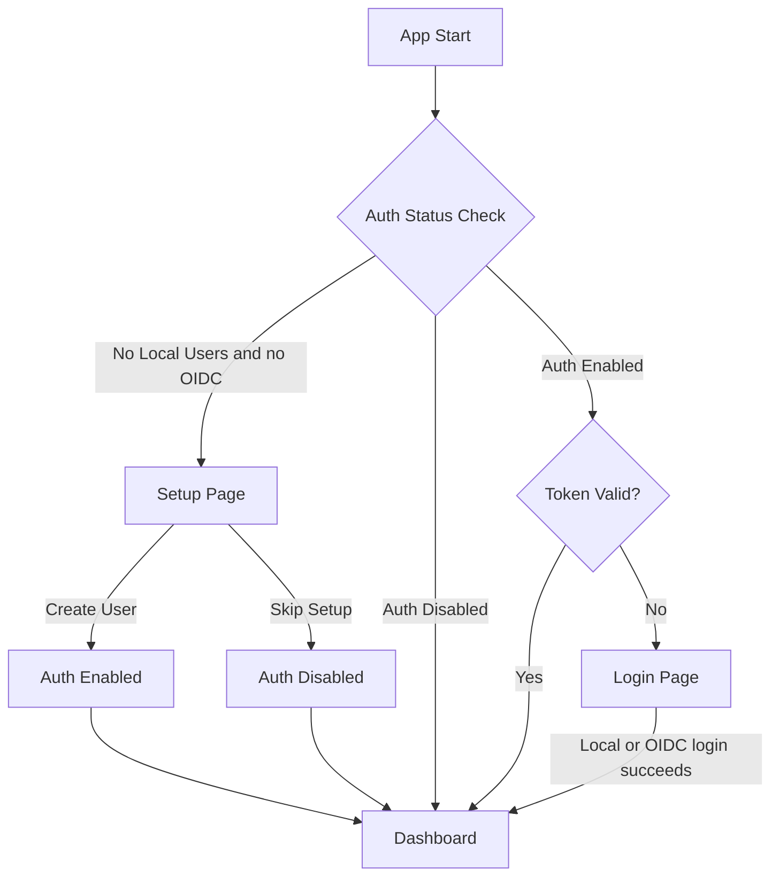

# Authentication

DUMB includes optional authentication for the API and web interface. It can use
local accounts, an external OpenID Connect (OIDC) provider, or both.

---

## Overview

The authentication system provides:

- **Local, OIDC, or hybrid sign-in**
- **JWT token-based DUMB sessions** after either login method succeeds
- **User management** with create, update, and delete capabilities
- **First-time setup wizard** for creating the initial local user
- **External Authelia and generic standards-compatible OIDC providers**
- **DUMB-managed Authelia linking** from the Authelia service page
- **Optional authentication** - can be skipped for local/trusted environments
- **Session persistence** with "Remember Me" functionality

!!! important "No role separation"
    DUMB currently has one authenticated privilege level. Every enabled user can reach the same service-control, configuration, and user-management endpoints; usernames are not viewer/editor/admin roles.

---

## Authentication modes

| Mode | Sign-in choices | Recommended use |
|------|-----------------|-----------------|
| **Local** | DUMB username and password | Simple trusted-LAN deployments |
| **Hybrid** | OIDC plus local accounts | Recommended while introducing or operating SSO |
| **OIDC only** | External identity provider | Only after provider login and recovery access are proven |

Hybrid mode keeps local password login as a break-glass path if DNS, TLS, the
identity provider, or its database is unavailable. OIDC-only mode requires an
explicit lockout-risk confirmation in Settings or the Authelia wizard.

!!! important "One DUMB privilege level"
    OIDC groups can limit who may sign in, but DUMB does not currently map
    groups to viewer/editor/admin roles. Every accepted identity receives the
    same DUMB operator privilege.

## Authentication flow


```mermaid
flowchart TD
    A[App Start] --> B{Auth Status Check}
    B -->|No Local Users and no OIDC| C[Setup Page]
    B -->|Auth Disabled| D[Dashboard]
    B -->|Auth Enabled| E{Token Valid?}
    E -->|Yes| D
    E -->|No| F[Login Page]
    C -->|Create User| G[Auth Enabled]
    C -->|Skip Setup| H[Auth Disabled]
    G --> D
    H --> D
    F -->|Local or OIDC login succeeds| D
```

---

## First-time setup

When DUMB starts for the first time, the frontend detects that no users exist and redirects to the setup page.

### Setup options

=== "Create first account"

    1. Navigate to the DUMB frontend (default: `http://localhost:3005`)
    2. You will be redirected to `/setup`
    3. Enter a username and password
    4. Click **Create Account**
    5. Authentication is automatically enabled
    6. You are logged in and redirected to the dashboard

=== "Skip authentication"

    1. Navigate to the DUMB frontend
    2. On the setup page, click **Skip Setup**
    3. Authentication remains disabled
    4. All API endpoints are accessible without tokens
    5. You can enable authentication later in Settings

!!! warning "Security consideration"

    Skipping authentication is only recommended for local development or fully isolated environments. If your DUMB instance is accessible from the network, enable authentication to protect your services.

---

## Login process

When authentication is enabled, users must log in to access the dashboard and API.

### Local login

1. Navigate to the DUMB frontend
2. Enter your username and password
3. Optionally check **Remember Me** for persistent sessions
4. Click **Login**

### OIDC login

1. Select **Continue with _provider_**.
2. DUMB starts Authorization Code flow with PKCE and redirects to the provider.
3. Complete the provider's authentication policy.
4. The provider returns to `/api/auth/oidc/callback`.
5. DUMB validates state, nonce, issuer, audience, signature, token lifetime, and
   any configured group restriction.
6. The browser redeems a short-lived, one-time exchange code for DUMB tokens.

Provider tokens are not placed in the browser URL. DUMB issues its own access
and refresh tokens after successful OIDC validation.

### Token management

| Token Type | Lifetime | Storage | Purpose |
|------------|----------|---------|---------|
| Access Token | 60 minutes | Session/Local Storage | API requests |
| Local refresh token | 30 days | Session/Local Storage | Renew a local session |
| OIDC refresh token | 1 day | Session/Local Storage | Renew a provider-backed DUMB session |

- **Remember Me checked**: Tokens stored in `localStorage` (persist across browser sessions)
- **Remember Me unchecked**: Tokens stored in `sessionStorage` (cleared when browser closes)

---

## User management

Any authenticated user can manage users through the Settings page or API. This
is why DUMB should be treated as an operator/admin control plane even when you
create accounts for multiple people.

### Available operations

| Operation | Description |
|-----------|-------------|
| **Create User** | Add a new user with username and password |
| **Disable User** | Temporarily disable a user account |
| **Enable User** | Re-enable a disabled user account |
| **Delete User** | Permanently remove a user account |

!!! note "Last active user protection"

    The last active (non-disabled) user cannot be disabled or deleted. This prevents accidentally locking yourself out of the system.

### Managing users via settings

1. Navigate to **Settings** in the sidebar
2. Scroll to the **User Management** section
3. Use the interface to add, disable, or delete users

---

## Enabling or disabling authentication

Authentication can be toggled at any time through the Settings page.

### Enable authentication

1. Go to **Settings**
2. Find the **Authentication** section
3. Click **Enable Authentication**
4. If no users exist, you will be prompted to create one

### Disable authentication

1. Go to **Settings**
2. Find the **Authentication** section
3. Click **Disable Authentication**
4. All API endpoints become accessible without tokens

!!! danger "Security warning"

    Disabling authentication exposes all DUMB functionality to anyone who can reach the API. Only disable authentication in trusted, isolated environments.

---

## API authentication

When authentication is enabled, protected API requests require a valid JWT token in the `Authorization` header.

The normal browser-facing API is proxied by the DUMB Frontend at port `3005` under `/api`. The backend-native form, used only when you deliberately expose port `8000`, has no `/api` prefix.

### Request format

```bash
curl -X GET http://localhost:3005/api/process/processes \
  -H "Authorization: Bearer <access_token>"
```

### WebSocket authentication

WebSocket connections pass the token as a query parameter:

```javascript
const ws = new WebSocket('ws://localhost:3005/ws/status?token=<access_token>');
```

### Handling token expiration

When an access token expires, the API returns a `401 Unauthorized` response. The frontend automatically:

1. Catches the 401 response
2. Sends the refresh token to `/api/auth/refresh`
3. Receives new access and refresh tokens
4. Retries the original request

If the refresh token is also expired, the user is redirected to the login page.

---

## Configuration

Authentication state is stored in `/config/users.json`:

```json
{
  "enabled": true,
  "mode": "hybrid",
  "users": [
    {
      "username": "admin",
      "password": "$2b$12$...",
      "disabled": false
    }
  ],
  "oidc": {
    "enabled": true,
    "provider_name": "Authelia",
    "source": "external_authelia",
    "issuer_url": "https://auth.example.com",
    "client_id": "dumb",
    "client_secret": "<stored-secret>",
    "redirect_uri": "https://dumb.example.com/api/auth/oidc/callback",
    "scopes": ["openid", "profile", "email", "groups"],
    "username_claim": "preferred_username",
    "groups_claim": "groups",
    "allowed_groups": ["dumb-users"]
  },
  "jwt_secret": "auto-generated-secret-key",
  "setup_skipped": false
}
```

| Field | Description |
|-------|-------------|
| `enabled` | Whether authentication is required |
| `mode` | `local`, `hybrid`, or `oidc` |
| `users` | Array of user accounts; `password` contains the bcrypt hash, not plain text |
| `oidc` | Provider endpoints, client credentials, claim mapping, and optional allowed groups |
| `jwt_secret` | Auto-generated secret for signing tokens |
| `setup_skipped` | Whether initial setup was skipped |

!!! tip "Password security"

    Passwords are hashed using bcrypt with automatic salt generation. The original password is never stored.

`users.json` contains the OIDC client secret and DUMB JWT signing secret. Keep
the file private and include it in protected configuration backups.

## Configure an OIDC provider

Open **Settings → Authentication → Sign-in provider**. The **Provider preset**
list includes:

- DUMB-managed Authelia, when DUMB reports that its managed instance has been
  bootstrapped;
- external Authelia;
- Google, Authentik, Keycloak, Microsoft Entra ID, Auth0, Okta, ZITADEL, and
  Dex;
- Custom / Generic OIDC for another standards-compatible provider.

Presets fill safe known values, labels, claim defaults, scopes, and
provider-specific examples. Some providers have tenant-, realm-, or
deployment-specific issuers, so those presets explain the expected URL rather
than guessing it. The Google preset fills its fixed issuer and
[official discovery URL](https://developers.google.com/identity/openid-connect/reference).

Except for DUMB-managed Authelia, first create an OIDC/OAuth **web
application** at the provider. Then supply:

- provider and issuer names;
- issuer URL, or an explicit discovery URL when necessary;
- client ID and secret;
- the exact browser-facing DUMB callback URL;
- scopes and username/groups claim names;
- optional allowed groups.

Register the **Redirect URI** shown in DUMB as an exact allowed callback at the
provider. It normally has this form:

```text
https://<dumb-public-host>/api/auth/oidc/callback
```

Use the normal browser-facing HTTPS FQDN. DUMB does not accept `localhost`, an
IP address, a single-label hostname, HTTP, or a DUMB embedded-service URL as an
OIDC callback. Opening Settings through a local/IP address therefore leaves the
field blank instead of presenting that origin as a usable default.

For Google, standard OpenID Connect does not return Google Group membership in
DUMB's `groups` claim. Leave **Allowed groups** blank unless an intermediary or
custom provider mapping deliberately supplies that claim.

Use **Check discovery** before saving. This fetches and validates provider
metadata without changing the active login configuration.

### Provider connection safety

| Option | What it does | Recommended state |
| --- | --- | --- |
| **Verify provider TLS** | Validates the provider HTTPS certificate and hostname | On |
| **Allow private endpoint IPs** | Allows DUMB's backend to contact provider endpoints that resolve to loopback, RFC1918, or other private addresses | Off unless using a trusted self-hosted provider |
| **Allow HTTP** | Allows unencrypted provider endpoints | Off; use only on an isolated trusted network when HTTPS is unavailable |

These controls apply to outbound DUMB-to-provider requests, not
browser-to-DUMB TLS. Changing provider presets resets them to the safe defaults
so an exception intended for an internal provider is not silently carried to a
different provider.

When a bootstrapped DUMB-managed Authelia instance is available, its preset
fills the issuer and `dumb` client ID automatically. **Link managed Authelia**
creates or reuses the dedicated client and transfers its generated secret
without exposing it in the browser. Use the
[Authelia service-page wizard](../services/optional/authelia.md) for the initial
bootstrap, TPA linking, ForwardAuth publishing, or later integration changes.

## OIDC versus ForwardAuth

OIDC changes how users sign in to DUMB or TPA. ForwardAuth is a Traefik
middleware that protects a routed service before its upstream receives the
request. They solve different problems and may be enabled independently.

Do not attach both Authelia ForwardAuth and TPA Service SSO to the same router
unless you intentionally want two authentication gates.

---

## Troubleshooting

### "Invalid credentials" error

- Verify the username is spelled correctly (case-sensitive)
- Ensure the password is correct
- Check if the user account is disabled

### "Token expired" errors

- The frontend should automatically refresh tokens
- If issues persist, try logging out and back in
- Clear browser storage and re-authenticate

### Locked out of the system

If you cannot access your account:

1. Stop the DUMB container
2. Edit `/config/users.json`
3. Set `"mode": "local"` if a working local account remains, or set
   `"enabled": false` for emergency recovery
4. Restart the container
5. Access the dashboard and create a new user or reset your password

Because the current API has no password-change endpoint, recovery means creating
a temporary user, re-enabling authentication, signing in as that user, and
recreating the forgotten account. See the [Authentication FAQ](../faq/authentication.md#i-forgot-my-password-how-do-i-reset-it)
for the safe sequence.

---

## Related pages

- [Authentication API](../api/auth.md)
- [WebSocket API](../api/websocket.md)
- [DUMB Frontend](../services/dumb/dumb-frontend.md)
