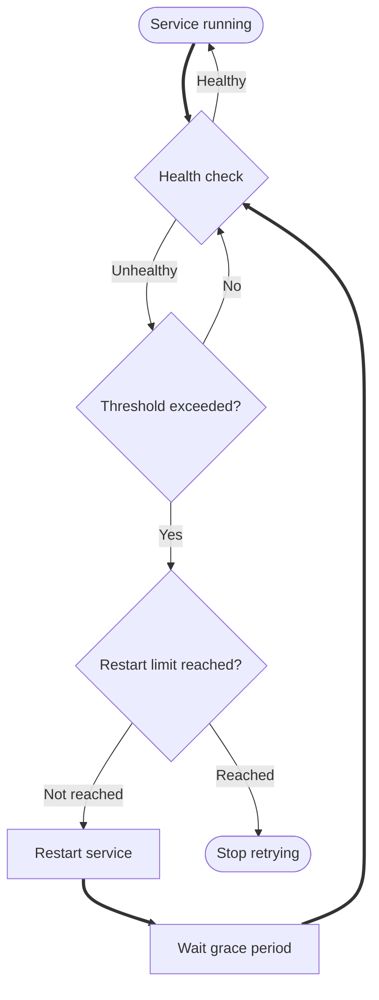

# Auto-restart

DUMB includes an automatic restart system that monitors service health and restarts failed services to maintain system stability without manual intervention.

---

## Overview

The auto-restart system provides:

- **Health monitoring** - Periodic health checks for each service
- **Automatic recovery** - Restart services that become unhealthy
- **Exponential backoff** - Increasing delays between restart attempts
- **Restart limits** - Prevent infinite restart loops
- **Grace periods** - Allow services time to initialize

---

## How it works



1. **Health check** - Service is periodically checked for responsiveness
2. **Unhealthy detection** - Multiple consecutive failures trigger action
3. **Restart attempt** - Service is stopped and restarted
4. **Grace period** - Wait for service to initialize
5. **Repeat** - Continue monitoring after restart

---

## Configuration

Auto-restart is configured globally in `dumb.auto_restart`:

```json
"dumb": {
  "auto_restart": {
    "enabled": false,
    "restart_on_unhealthy": true,
    "healthcheck_interval": 30,
    "unhealthy_threshold": 3,
    "max_restarts": 3,
    "window_seconds": 300,
    "backoff_seconds": [5, 15, 45, 120],
    "grace_period_seconds": 30,
    "services": []
  }
}
```

### Configuration options

| Option | Default | Description |
|--------|---------|-------------|
| `enabled` | `false` | Enable auto-restart globally |
| `restart_on_unhealthy` | `true` | Restart when health checks fail |
| `healthcheck_interval` | `30` | Seconds between health checks |
| `unhealthy_threshold` | `3` | Consecutive failures before restart |
| `max_restarts` | `3` | Maximum restarts within the window |
| `window_seconds` | `300` | Time window in seconds |
| `backoff_seconds` | `[5, 15, 45, 120]` | Backoff delays between restarts |
| `grace_period_seconds` | `30` | Seconds to wait after restart before health checks |
| `services` | `[]` | Limit auto-restart to these process names |

---

## Exponential backoff

To prevent rapid restart loops, delays between restarts increase exponentially:

| Attempt | Delay |
|---------|-------|
| 1 | 5 seconds |
| 2 | 10 seconds |
| 3 | 20 seconds |
| 4 | 40 seconds |
| 5 | 80 seconds |
| 6+ | 120 seconds (max) |

The formula: `delay = min(initial_delay * (backoff_multiplier ^ attempt), max_delay)`

---

## Restart limits

Services have a maximum number of restart attempts within a time window:

- **Default**: 5 restarts per hour
- After reaching the limit, auto-restart pauses for that service
- The counter resets after the window expires
- Manual restart resets the counter

!!! warning "Restart limit reached"

    If a service keeps failing, investigate the root cause rather than increasing limits. Check logs for error messages.

---

## Health checks

Services are monitored using health check endpoints or process status:

### HTTP health checks

For services with web interfaces:

```json
"health_check": {
  "type": "http",
  "url": "http://127.0.0.1:8080/health",
  "timeout": 10,
  "interval": 30
}
```

### Process health checks

For services without HTTP endpoints:

```json
"health_check": {
  "type": "process",
  "interval": 30
}
```

---

## Monitoring restart status

### Dashboard indicators

The dashboard shows auto-restart status for each service:

- **Restart count** - Number of restarts in current window
- **Last restart** - Timestamp of most recent restart
- **Health status** - Current healthy/unhealthy state

### API endpoints

Query restart status via the API:

```bash
# Get service status including restart info
curl http://localhost:8000/api/process/service-status?process_name=Riven%20Backend
```

Response includes:

```json
{
  "process_name": "Riven Backend",
  "status": "running",
  "healthy": true,
  "restart": {
    "count": 2,
    "last_restart": "2025-01-15T10:30:00Z",
    "enabled": true
  }
}
```

### WebSocket updates

Real-time restart events via `/ws/status`:

```json
{
  "type": "status",
  "processes": [
    {
      "process_name": "Riven Backend",
      "status": "running",
      "healthy": true,
      "restart": {
        "count": 2,
        "last_restart": "2025-01-15T10:30:00Z",
        "enabled": true
      }
    }
  ]
}
```

---

## Disabling auto-restart

### Per-service

Disable for a specific service:

```json
"riven_backend": {
  "auto_restart": {
    "enabled": false
  }
}
```

### Globally

To disable auto-restart for all services, set `enabled: false` in each service's auto_restart configuration, or use the Settings page in the frontend.

---

## Best practices

### Appropriate thresholds

- **Critical services** (Plex, rclone): Lower threshold (2-3)
- **Background services** (Zilean, Huntarr): Higher threshold (3-5)

### Grace periods

- **Fast-starting services**: 10-15 seconds
- **Database-dependent services**: 30-60 seconds
- **Services with startup tasks**: 60-120 seconds

### Monitoring

- Review restart counts regularly
- Investigate services with frequent restarts
- Check logs after restart events

---

## Troubleshooting

### Service keeps restarting

1. Check service logs for errors
2. Verify configuration is valid
3. Ensure dependencies are running
4. Check for port conflicts

### Auto-restart not working

1. Verify `auto_restart.enabled` is `true`
2. Check if restart limit was reached
3. Ensure health check is configured correctly

### Restart delay too long

- Reduce `backoff_multiplier`
- Lower `max_delay`
- Reset counter with manual restart

---

## Related pages

- [Dashboard](../frontend/dashboard.md) - View restart status
- [Process Management API](../api/process.md) - API controls
- [WebSocket API](../api/websocket.md) - Real-time updates
