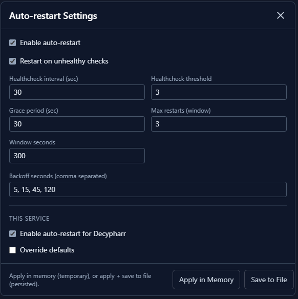
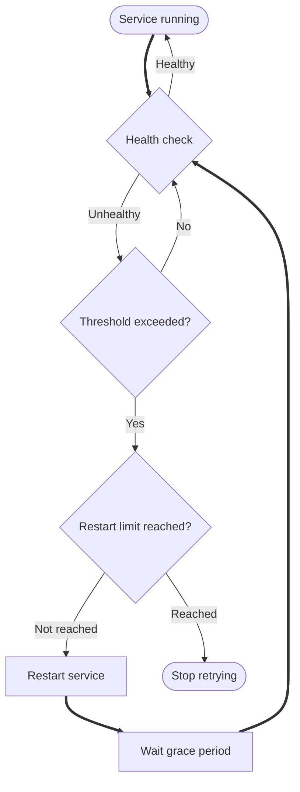

# Auto-restart

DUMB includes an automatic restart system that monitors service health and restarts failed services to maintain system stability without manual intervention.

---

## Overview

The auto-restart system provides:

- **Health monitoring** - Periodic health checks for each service
- **Automatic recovery** - Restart services that become unhealthy
- **Exponential backoff** - Increasing delays between restart attempts
- **Restart limits** - Prevent infinite restart loops
- **Grace periods** - Allow services time to initialize

{ .shadow }
{ .shadow }

---

## How it works


```mermaid
%%{ init: { "flowchart": { "curve": "basis" } } }%%
flowchart TD
    A([Service running])
    B{Health check}
    C{Threshold exceeded?}
    D{Restart limit reached?}
    E[Restart service]
    F([Stop retrying])
    G[Wait grace period]

    A ==> B
    B -- Healthy --> A
    B -- Unhealthy --> C
    C -- No --> B
    C -- Yes --> D
    D -- Not reached --> E
    D -- Reached --> F
    E ==> G
    G ==> B
```

1. **Health check** - Service is periodically checked for responsiveness
2. **Unhealthy detection** - Multiple consecutive failures trigger action
3. **Restart attempt** - Service is stopped and restarted
4. **Grace period** - Wait for service to initialize
5. **Repeat** - Continue monitoring after restart

---

## Configuration

Auto-restart is configured globally in `dumb.auto_restart`:

```json
"dumb": {
  "auto_restart": {
    "enabled": false,
    "restart_on_unhealthy": true,
    "healthcheck_interval": 30,
    "unhealthy_threshold": 3,
    "max_restarts": 3,
    "window_seconds": 300,
    "backoff_seconds": [5, 15, 45, 120],
    "grace_period_seconds": 30,
    "services": []
  }
}
```

### Configuration options

| Option | Default | Description |
|--------|---------|-------------|
| `enabled` | `false` | Enable auto-restart globally |
| `restart_on_unhealthy` | `true` | Restart when health checks fail |
| `healthcheck_interval` | `30` | Seconds between health checks |
| `unhealthy_threshold` | `3` | Consecutive failures before restart |
| `max_restarts` | `3` | Maximum restarts within the window |
| `window_seconds` | `300` | Time window in seconds |
| `backoff_seconds` | `[5, 15, 45, 120]` | Backoff delays between restarts |
| `grace_period_seconds` | `30` | Seconds to wait after restart before health checks |
| `services` | `[]` | Limit auto-restart to these process names |

---

## Backoff schedule

To prevent rapid restart loops, DUMB selects delays from the configured
`backoff_seconds` list:

| Attempt | Delay |
|---------|-------|
| 1 | 5 seconds |
| 2 | 15 seconds |
| 3 | 45 seconds |
| 4+ | 120 seconds |

This is an explicit list, not a calculated multiplier. You can replace it with
any ordered list of non-negative delays. Attempts beyond the list use its last
value.

---

## Restart limits

Services have a maximum number of restart attempts within a time window:

- **Default**: 3 restart attempts in a rolling 300-second window
- After reaching the limit, additional automatic attempts are suppressed while
  those attempts remain inside the window
- Old attempts age out of the rolling window automatically
- A manual start re-enables monitoring after an intentional stop, but does not
  erase the recorded rolling-window attempts

!!! warning "Restart limit reached"

    If a service keeps failing, investigate the root cause rather than increasing limits. Check logs for error messages.

---

## Health checks

For each explicitly selected service, DUMB verifies:

- the tracked PID still exists and is not a zombie; and
- each configured `port`, `frontend_port`, `backend_port`, or `webdav_port`
  (including corresponding values in `env`) accepts a TCP connection.

There is no standalone `health_check` object in the current config. Add a
service to `dumb.auto_restart.services`; its entry may inherit all global values
or override selected policy fields:

```json
"services": [
  {
    "process_name": "Riven Backend",
    "enabled": true,
    "unhealthy_threshold": 4,
    "grace_period_seconds": 60
  }
]
```

An empty `services` list monitors no services even when the global `enabled`
flag is true. Use exact process names from `GET /process/processes` or select
services in the frontend panel.

---

## Monitoring restart status

### Dashboard indicators

The dashboard shows auto-restart status for each service:

- **Restart count** - Number of restarts in current window
- **Last restart** - Timestamp of most recent restart
- **Health status** - Current healthy/unhealthy state

### API endpoints

Query restart status via the API:

```bash
# Get service status including restart info
curl 'http://localhost:3005/api/process/service-status?process_name=Riven%20Backend&include_health=true'
```

Response includes:

```json
{
  "process_name": "Riven Backend",
  "status": "running",
  "healthy": true,
  "restart": {
    "restart_attempts": 2,
    "restart_successes": 2,
    "restart_failures": 0,
    "recent_restart_attempts": 2,
    "pending": false,
    "next_restart_time": null,
    "disabled": false,
    "last_restart_time": 1736937000.0,
    "last_failure_reason": null,
    "last_exit_time": 1736936995.0,
    "last_exit_reason": "Port 127.0.0.1:8080 not responding",
    "unhealthy_count": 0,
    "unhealthy_threshold": 3
  }
}
```

### WebSocket updates

Real-time restart events via `/ws/status`:

```json
{
  "type": "status",
  "processes": [
    {
      "process_name": "Riven Backend",
      "status": "running",
      "healthy": true,
      "restart": {
        "restart_attempts": 2,
        "restart_successes": 2,
        "restart_failures": 0,
        "recent_restart_attempts": 2,
        "pending": false,
        "next_restart_time": null,
        "disabled": false,
        "last_restart_time": 1736937000.0,
        "last_failure_reason": null,
        "last_exit_time": 1736936995.0,
        "last_exit_reason": "Port 127.0.0.1:8080 not responding",
        "unhealthy_count": 0,
        "unhealthy_threshold": 3
      }
    }
  ]
}
```

---

## Disabling auto-restart

### Per-service

Remove a service from the monitored list, or retain an explicit disabled entry:

```json
"services": [
  {
    "process_name": "Riven Backend",
    "enabled": false
  }
]
```

### Globally

To disable auto-restart for all services, set `dumb.auto_restart.enabled` to
`false`, or use the frontend panel. Per-service entries may remain stored for a
later re-enable.

---

## Best practices

### Appropriate thresholds

- **Critical services** (Plex, rclone): Lower threshold (2-3)
- **Background services** (Zilean, NeutArr): Higher threshold (3-5)

### Grace periods

- **Fast-starting services**: 10-15 seconds
- **Database-dependent services**: 30-60 seconds
- **Services with startup tasks**: 60-120 seconds

### Monitoring

- Review restart counts regularly
- Investigate services with frequent restarts
- Check logs after restart events

---

## Troubleshooting

### Service keeps restarting

1. Check service logs for errors
2. Verify configuration is valid
3. Ensure dependencies are running
4. Check for port conflicts

### Auto-restart not working

1. Verify `auto_restart.enabled` is `true`
2. Confirm the exact process name is present and enabled in `auto_restart.services`
3. Check whether the restart limit was reached
4. Confirm the configured service port is accurate and reachable on container loopback

### Restart delay too long

- Shorten the values in `backoff_seconds`
- Review `max_restarts` and `window_seconds` before changing limits
- Fix the underlying health failure instead of using a zero-delay retry loop

---

## Related pages

- [Dashboard](../frontend/dashboard.md) - View restart status
- [Process Management API](../api/process.md) - API controls
- [WebSocket API](../api/websocket.md) - Real-time updates
