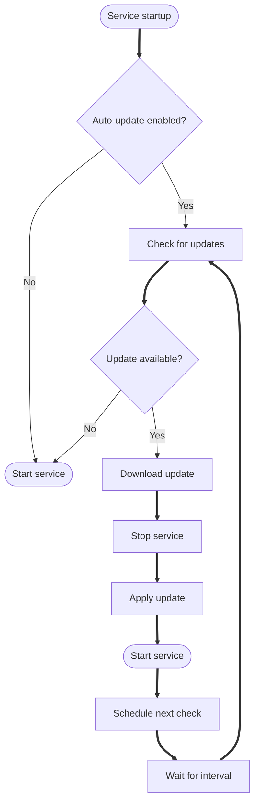

# Auto-update

DUMB includes a comprehensive auto-update system that keeps your services current with the latest releases. Each service can be configured independently with different update strategies, from fully automatic updates to version pinning.

---

## Overview

The auto-update system supports multiple update strategies:

| Strategy | Description | Use Case |
|----------|-------------|----------|
| **Latest Release** | Tracks the latest stable GitHub release with scheduled checks | Production environments |
| **Nightly Builds** | Tracks nightly GitHub releases with scheduled checks | Testing new features |
| **Prerelease** | Tracks prerelease GitHub builds with scheduled checks | Beta testing |
| **Branch-based** | Downloads directly from a Git branch on setup/startup | Development |
| **Version Pinning** | Locks to a specific version without scheduled updates | Stability critical |

---

## How it works



### Update lifecycle

1. **Initial check** - When a service starts, DUMB checks for available updates
2. **Version comparison** - Current version is compared with the latest available
3. **Download** - If an update is available, the new version is downloaded
4. **Apply** - The service is stopped, updated, and restarted
5. **Schedule** - Future update checks are scheduled based on the configured interval

---

## Configuration

Auto-update settings are configured per-service in `dumb_config.json`:

```json
{
  "service_name": {
    "enabled": true,
    "auto_update": true,
    "auto_update_interval": 24,
    "release_version_enabled": false,
    "release_version": "latest",
    "branch_enabled": false,
    "branch": "main",
    "pinned_version": "",
    "clear_on_update": true,
    "exclude_dirs": []
  }
}
```

### Configuration options

| Option | Type | Default | Description |
|--------|------|---------|-------------|
| `auto_update` | boolean | `false` | Enable automatic updates for this service |
| `auto_update_interval` | number | `24` | Hours between update checks |
| `release_version_enabled` | boolean | `false` | Use release version strategy |
| `release_version` | string | `"latest"` | Target version: `latest`, `nightly`, `prerelease`, or specific version |
| `branch_enabled` | boolean | `false` | Use branch-based deployment |
| `branch` | string | `"main"` | Git branch to track |
| `pinned_version` | string | `""` | Pin to specific version (disables auto-update) |
| `clear_on_update` | boolean | `true` | Clear working directory before update |
| `exclude_dirs` | array | `[]` | Directories to preserve during updates |

!!! warning "Auto-update and strategy interaction"

    Automatic scheduling is disabled when `pinned_version`, `release_version_enabled`, or `branch_enabled` are set.
    The only exception is when `release_version` is `nightly` or `prerelease`, which keeps scheduled checks enabled.

---

## Update strategies

### Latest release (default)

The default strategy fetches the latest stable release from GitHub:

```json
{
  "frontend": {
    "auto_update": true,
    "auto_update_interval": 24
  }
}
```

This checks GitHub's `/releases/latest` endpoint and downloads the newest stable version.

### Nightly builds

For testing cutting-edge features, enable nightly builds:

```json
{
  "service_name": {
    "release_version_enabled": true,
    "release_version": "nightly"
  }
}
```

!!! info "Nightly version format"

    Nightly builds use date-based versioning like `v2025.01.22.nightly`. Version comparison checks the first three parts (year, month, day).

### Prerelease versions

To receive beta or release candidate versions:

```json
{
  "service_name": {
    "release_version_enabled": true,
    "release_version": "prerelease"
  }
}
```

!!! tip "Prerelease scheduling"

    When `release_version` is `prerelease`, scheduled auto-update checks continue to run at your configured interval.

### Branch-based deployment

Track a specific Git branch for development or testing:

```json
{
  "service_name": {
    "branch_enabled": true,
    "branch": "dev"
  }
}
```

!!! warning "Branch-based updates"

    Branch-based deployment downloads the latest commit from the specified branch during setup/startup.
    Scheduled auto-update checks are disabled when `branch_enabled` is true.

### Version pinning

Lock a service to a specific version:

```json
{
  "service_name": {
    "pinned_version": "v1.30.0"
  }
}
```

!!! tip "When to pin versions"

    Pin versions when:

    - A specific version is required for compatibility
    - You need to prevent unexpected changes
    - Testing a specific release
    - Production stability is critical

!!! warning "Pinned versions and auto-update"

    Setting `pinned_version` disables scheduled updates for that service.

---

## Update intervals

The `auto_update_interval` setting controls how often DUMB checks for updates:

| Interval | Check Frequency | Recommended For |
|----------|-----------------|-----------------|
| `6` | Every 6 hours | Nightly/prerelease testing |
| `24` | Daily (default) | Most services |
| `168` | Weekly | Stable, critical services |

```json
{
  "frontend": {
    "auto_update": true,
    "auto_update_interval": 24
  }
}
```

---

## Preserving data during updates

### Clear on update

By default, DUMB clears the service directory before applying updates. This ensures a clean installation:

```json
{
  "service_name": {
    "clear_on_update": true
  }
}
```

### Excluding directories

To preserve specific directories during updates (like configuration or data):

```json
{
  "service_name": {
    "clear_on_update": true,
    "exclude_dirs": ["config", "data", "logs"]
  }
}
```

---

## GitHub API integration

### Rate limiting

GitHub's API has rate limits:

| Authentication | Requests per Hour |
|----------------|-------------------|
| Unauthenticated | 60 |
| With token | 5,000 |

### Using a GitHub token

For higher rate limits, add a GitHub token to your configuration:

```json
{
  "dumb": {
    "github_token": "ghp_xxxxxxxxxxxxxxxxxxxx"
  }
}
```

!!! tip "Token permissions"

    The GitHub token only needs `public_repo` read access for checking releases.

!!! danger "Protect your token"

    Treat GitHub tokens as secrets. Never commit them to source control or share them in logs/screenshots.

---

## Service-specific behavior

Different services have specialized update handling:

| Service Type | Update Method |
|--------------|---------------|
| **Arr Suite** (Sonarr, Radarr, etc.) | Binary installation |
| **Plex Media Server** | System package installer |
| **Jellyfin** | System package installer |
| **Emby** | System package installer |
| **GitHub-based** (Frontend, Huntarr, etc.) | Release download and extraction |

!!! info "Strategy support varies"

    Not every service supports every strategy. For example, Arr services and Plex/Jellyfin/Emby use native installers,
    while GitHub-based services rely on release or branch downloads.

---

## Monitoring updates

### Check current versions

View installed versions in the frontend:

1. Navigate to **Settings**
2. Check the **Version** display for each service

### Update logs

Update activity is logged to the DUMB logs:

```
INFO - [Auto-Update] Checking for updates: frontend
INFO - [Auto-Update] Update available: v1.32.0 -> v1.33.0
INFO - [Auto-Update] Downloading update...
INFO - [Auto-Update] Update complete: frontend v1.33.0
```

---

## Troubleshooting

### Updates not running

1. **Verify auto_update is enabled** in the service configuration
2. **Check the interval** - updates may not be due yet
3. **Review logs** for error messages
4. **Verify network connectivity** to GitHub

### Update fails repeatedly

1. **Check GitHub API rate limits** - add a token if needed
2. **Verify disk space** is available
3. **Check file permissions** in the service directory
4. **Review logs** for specific error messages

### Service won't start after update

1. **Check compatibility** between the new version and your configuration
2. **Review the service's changelog** for breaking changes
3. **Consider pinning** to the previous working version
4. **Check logs** for startup errors

---

## Best practices

!!! tip "Recommendations"

    - **Test updates** in a non-production environment first
    - **Use version pinning** for critical services
    - **Set appropriate intervals** based on service stability needs
    - **Monitor logs** after updates for any issues
    - **Keep backups** of configuration files
    - **Add a GitHub token** to avoid rate limiting

---

## Related pages

- [Configuration Guide](configuration.md)
- [Auto-restart](auto-restart.md)
- [Settings Page](../frontend/settings.md)
