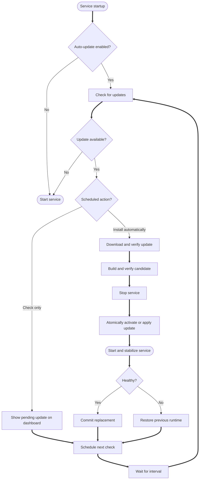

# Auto-update

DUMB includes a comprehensive auto-update system that keeps your services current with the latest releases. Each service can be configured independently with different update strategies, from fully automatic updates to version pinning.

---

## Overview

The auto-update system supports multiple update strategies:

| Strategy | Description | Use Case |
|----------|-------------|----------|
| **Latest Release** | Tracks the latest stable GitHub release with scheduled checks | Production environments |
| **Nightly Builds** | Tracks nightly GitHub releases with scheduled checks | Testing new features |
| **Prerelease** | Tracks prerelease GitHub builds with scheduled checks | Beta testing |
| **Branch-based** | Downloads directly from a Git branch on setup/startup | Development |
| **Version Pinning** | Locks to a specific version without scheduled updates | Stability critical |

---

## How it works


```mermaid
%%{ init: { "flowchart": { "curve": "basis" } } }%%
flowchart TD
    A([Service startup])
    B{Auto-update enabled?}
    C[Check for updates]
    D([Start service])
    E{Update available?}
    F{Scheduled action?}
    L[Show pending update on dashboard]
    M[Download and verify update]
    N[Build and verify candidate]
    G[Stop service]
    H[Atomically activate or apply update]
    I([Start and stabilize service])
    R{Healthy?}
    S[Commit replacement]
    T[Restore previous runtime]
    J[Schedule next check]
    K[Wait for interval]

    A ==> B
    B -- No --> D
    B -- Yes --> C
    C ==> E
    E -- No --> D
    E -- Yes --> F
    F -- Check only --> L
    L ==> J
    F -- Install automatically --> M
    M ==> N
    N ==> G
    G ==> H
    H ==> I
    I ==> R
    R -- Yes --> S
    R -- No --> T
    S ==> J
    T ==> J
    J ==> K
    K ==> C
```

### Update lifecycle

1. **Initial check** - When a service starts, DUMB checks for available updates
2. **Version comparison** - Current version is compared with the latest available
3. **Act** - In `check_only` mode, DUMB leaves the service untouched and records the pending update; in `install` mode, it downloads and applies the update
4. **Dashboard** - Pending check-only results appear in the dashboard **Updates** badge, service card, and Updates panel
5. **Notify** - Configured DUMB notifications can emit the `update.available` event, while project update notices cover DUMB backend/frontend updates
6. **Schedule** - Future update checks are scheduled based on the configured interval

Downloads, package-manager inputs, and supported compiled runtimes are reused
through the [verified install cache](install-cache.md). A failed build retains
or restores the previous runtime instead of accepting partial output. Services
with candidate-native layouts are not stopped until their replacement has
finished building.

The DUMB Frontend uses this candidate-first lifecycle for release, branch,
commit, and configured-target installs. Its current Nuxt server remains online
during download and build, then DUMB stops it only long enough to atomically
activate and health-check the replacement. If activation fails, DUMB restores
and verifies the prior frontend. When an operator starts the update from the
dashboard itself, the loaded page reconnects through the restarted frontend,
reads the terminal result retained by the DUMB API, and reloads to use the new
assets. A temporary request disconnect is therefore shown as reconnection and
verification, not immediately as a failed install.

Manual dashboard installs and scheduled update installs record total install
duration plus observed service downtime. Total duration covers the complete
installer and health-stabilization operation. Downtime covers only intervals
from stopping the managed process until its application readiness probe first
succeeds, including an additional interruption if a candidate regresses and
rollback is required. A result distinguishes completed, ongoing/unverified, and
not-observed downtime instead of assuming that every update caused an outage.
Current dmbdb versions show these values in both the dashboard Updates panel and
each service's Updates panel when the backend advertises
`update_timing_metrics`.

When an update affects storage used by Plex, Jellyfin, or Emby, [Media Library Protection](media-library-protection.md) runs before the service is stopped. Scheduled updates are deferred while playback is active or activity cannot be verified. Manual installs show explicit protect, keep-running, stop-now, and defer choices in dmbdb.

### Frontend notices

The DUMB Frontend polls `GET /api/process/update-notices` for project-level update notices. Available-update notices come from the backend's current update-status cache. Applied-update notices are persisted to `/config/update_notices.json` when an update install reports success, so the frontend can still show what changed after the backend or frontend restarts.

DUMB dev images use rolling versions such as `v2.4.2-dev.5`. These are treated as dev builds, not production release tags, so their notice action points to the rolling dev-build reference instead of a per-version release page. Production semver releases still link to their release notes, and branch builds with commit markers link to the relevant commit or comparison.

Dismissals are stored in browser local storage and only hide the notice for that browser. They do not remove the backend's applied-update history.

---

## Configuration

Auto-update settings are configured per-service in `dumb_config.json`:

```json
{
  "service_name": {
    "enabled": true,
    "auto_update": true,
    "auto_update_mode": "check_only",
    "auto_update_start_time": "04:00",
    "auto_update_interval": 24,
    "release_version_enabled": false,
    "release_version": "latest",
    "commit_sha": "",
    "branch_enabled": false,
    "branch": "main",
    "pinned_version": "",
    "clear_on_update": true,
    "exclude_dirs": []
  }
}
```

### Configuration options

| Option | Type | Default | Description |
|--------|------|---------|-------------|
| `auto_update` | boolean | `false` | Enable scheduled update checks for this service |
| `auto_update_mode` | string | `"install"` | `check_only` reports pending updates; `install` applies them automatically |
| `auto_update_start_time` | string | `"04:00"` | 24-hour schedule anchor time (`HH:MM`) |
| `auto_update_interval` | number | `24` | Hours between update checks |
| `release_version_enabled` | boolean | `false` | Use release version strategy |
| `release_version` | string | `"latest"` | Target version: `latest`, `nightly`, `prerelease`, or specific version |
| `commit_sha` | string | `""` | Exact full 40-character GitHub commit to deploy |
| `branch_enabled` | boolean | `false` | Use branch-based deployment |
| `branch` | string | `"main"` | Git branch to track |
| `pinned_version` | string | `""` | Pin to specific version (disables auto-update) |
| `clear_on_update` | boolean | `true` | Clear working directory before update |
| `exclude_dirs` | array | `[]` | Directories to preserve during updates |

!!! warning "Auto-update and strategy interaction"

    Automatic scheduling is disabled when `pinned_version`, `commit_sha`,
    `release_version_enabled`, or `branch_enabled` are set. Exceptions are a
    `nightly` or `prerelease` release selector and a digit-free NzbDAV release
    tag such as `dev`, `lts`, or `edge`, provided no commit, pinned-version, or
    branch selector takes precedence. NzbDAV tags containing a digit remain
    fixed configured releases. A non-empty `commit_sha` always disables moving
    update checks, including the initial post-setup check.

After changing a fixed release, branch, or commit selection, use **Check for
updates**. When the configured target differs from the installed version, the
Updates panel shows **Install configured release**, **Install configured
branch**, or **Install configured commit**. This applies the saved selection
without clearing it. **Override + latest** is a separate escape hatch that
temporarily bypasses any saved release, branch, commit, or pinned-version
selection and installs the latest stable release. DUMB restores the saved
configuration after that one installation.

### Check only and review on the dashboard

Set `auto_update` to `true` and `auto_update_mode` to `check_only` when you want
DUMB to check on schedule without stopping, restarting, or changing the
service. When a newer ordinary release is found, the dashboard **Updates**
button shows a count, the service card exposes its update shortcut, and the
Updates panel includes the current and available versions. You can then install
one update or select several for sequential installation.

The dashboard refreshes the cached results while it remains open. A later
scheduled or manual check clears the pending state when the service is current.
Existing configurations that do not contain `auto_update_mode` retain the
legacy `install` behavior.

---

## Update strategies

### Latest release (default)

The default strategy fetches the latest stable release from GitHub:

```json
{
  "frontend": {
    "auto_update": true,
    "auto_update_mode": "install",
    "auto_update_start_time": "04:00",
    "auto_update_interval": 24
  }
}
```

This checks GitHub's `/releases/latest` endpoint and downloads the newest stable version.

### Nightly builds

For testing cutting-edge features, enable nightly builds:

```json
{
  "service_name": {
    "release_version_enabled": true,
    "release_version": "nightly"
  }
}
```

!!! info "Nightly version format"

    Nightly builds use date-based versioning like `v2025.01.22.nightly`. Version comparison checks the first three parts (year, month, day).

### Prerelease versions

To receive beta or release candidate versions:

```json
{
  "service_name": {
    "release_version_enabled": true,
    "release_version": "prerelease"
  }
}
```

!!! tip "Prerelease scheduling"

    When `release_version` is `prerelease`, scheduled auto-update checks continue to run at your configured interval.

### Branch-based deployment

Track a specific Git branch for development or testing:

```json
{
  "service_name": {
    "branch_enabled": true,
    "branch": "dev"
  }
}
```

!!! warning "Branch-based updates"

    Branch-based deployment downloads the latest commit from the specified branch during setup/startup.
    Scheduled auto-update checks are disabled when `branch_enabled` is true.

### Exact commit pinning

Source-build services can be pinned to an immutable GitHub revision:

```json
{
  "nzbdav": {
    "commit_sha": "0123456789abcdef0123456789abcdef01234567"
  }
}
```

`commit_sha` must be the complete 40-character hexadecimal SHA. When non-empty,
it takes precedence over release and branch settings. DUMB downloads that exact
GitHub source archive, builds it through the service's normal source-build path,
records a `commit-<short-sha>` version marker where supported, and disables
automatic updates until the field is changed or cleared. This block applies to
scheduled checks, the initial post-setup check, and normal direct update checks.
When the configured commit differs from the installed version, use **Install
configured commit** to build and restart on that SHA without clearing or
bypassing the pin. **Override + latest** is a separate explicit action that
temporarily bypasses the pin and installs the moving latest release; it does not
clear the saved SHA. If source settings are saved while an update is already
running, DUMB preserves the newer saved selection rather than restoring the
update operation's older selection over it.

Supported source-build services are:

- DUMB Frontend
- Traefik Proxy Admin
- CLI Debrid
- Decypharr
- NzbDAV
- Phalanx DB
- Tautulli
- Pulsarr
- Maintainerr
- NeutArr
- Profilarr
- Seerr
- Riven Backend and Riven Frontend
- Zilean

Arr applications and binary-only services such as Zurg do not use this source
commit strategy.

### Version pinning

Lock a service to a specific version:

```json
{
  "service_name": {
    "pinned_version": "v1.30.0"
  }
}
```

!!! tip "When to pin versions"

    Pin versions when:

    - A specific version is required for compatibility
    - You need to prevent unexpected changes
    - Testing a specific release
    - Production stability is critical

!!! warning "Pinned versions and auto-update"

    Setting `pinned_version` disables scheduled updates for that service.

---

## Update intervals

The `auto_update_start_time` and `auto_update_interval` settings control update cadence:

| Interval | Check Frequency | Recommended For |
|----------|-----------------|-----------------|
| `6` | Every 6 hours | Nightly/prerelease testing |
| `24` | Daily (default) | Most services |
| `168` | Weekly | Stable, critical services |

```json
{
  "frontend": {
    "auto_update": true,
    "auto_update_start_time": "04:00",
    "auto_update_interval": 24
  }
}
```

With this example, checks run once per day at 04:00. If you set `auto_update_interval` to another value (for example `12`), checks run every 12 hours anchored from the configured start time.

---

## Preserving data during updates

### Clear on update

By default, DUMB clears the service directory before applying updates. This ensures a clean installation:

```json
{
  "service_name": {
    "clear_on_update": true
  }
}
```

### Excluding directories

To preserve specific directories during updates (like configuration or data):

```json
{
  "service_name": {
    "clear_on_update": true,
    "exclude_dirs": ["config", "data", "logs"]
  }
}
```

---

## GitHub API integration

### Rate limiting

GitHub's API has rate limits:

| Authentication | Requests per Hour |
|----------------|-------------------|
| Unauthenticated | 60 |
| With token | 5,000 |

### Using a GitHub token

For higher rate limits, add a GitHub token to your configuration:

```json
{
  "dumb": {
    "github_token": "ghp_xxxxxxxxxxxxxxxxxxxx"
  }
}
```

!!! tip "Token permissions"

    Prefer a fine-grained token restricted to the repositories DUMB must read.
    Fine-grained tokens already have read-only access to public repositories;
    for private repos/forks, grant only the minimum read permission required by
    the GitHub endpoint. Do not grant repository write, package write, workflow,
    or administration permissions for release checks.

!!! danger "Protect your token"

    Treat GitHub tokens as secrets. Never commit them to source control or share them in logs/screenshots.

---

## Service-specific behavior

Different services have specialized update handling:

| Service Type | Update Method |
|--------------|---------------|
| **Arr Suite** (Sonarr, Radarr, etc.) | Binary installation |
| **Plex Media Server** | System package installer |
| **Jellyfin** | System package installer |
| **Emby** | System package installer |
| **GitHub-based** (Frontend, NeutArr, etc.) | Release download and extraction |

!!! info "Strategy support varies"

    Not every service supports every strategy. For example, Arr services and Plex/Jellyfin/Emby use native installers,
    while GitHub-based services rely on release or branch downloads.

---

## Monitoring updates

### Dashboard update center

The dashboard **Updates** button provides an on-demand alternative to enabling
automatic updates. It checks all enabled update-capable services sequentially,
shows the services with available versions, and lets you install some or all of
those ordinary updates. Each service card also gains an Update shortcut while an
ordinary update is recorded as available.

Bulk installation is deliberately conservative: saved release, branch, commit,
and pinned-version selections appear as **Review source** and cannot be selected.
Use the individual service page when you need **Install configured target** or
**Override + latest**. Selected services install one at a time and restart as
needed; the frontend and API are placed last to reduce control-plane interruption.
If the selection includes DUMB Frontend, its replacement is prepared while the
old UI stays online. The bulk runner resumes after the brief activation restart
and reloads the dashboard only after the remaining selected updates have been
processed.

The individual service Updates panel also retains active check/install state if
you close it or navigate to another service page. A background-progress banner
reopens the operation, and returning to the service shows the same live progress
or completed result.

See [Dashboard](../frontend/dashboard.md#check-and-update-multiple-services) for
the complete workflow.

### Check current versions

View installed versions in the frontend:

1. Navigate to **Settings**
2. Check the **Version** display for each service

### Update logs

Update activity is logged to the DUMB logs:

```
INFO - [Auto-Update] Checking for updates: frontend
INFO - [Auto-Update] Update available: v1.32.0 -> v1.33.0
INFO - [Auto-Update] Downloading update...
INFO - [Auto-Update] Update complete: frontend v1.33.0
```

---

## Troubleshooting

### Updates not running

1. **Verify auto_update is enabled** in the service configuration
2. **Check the interval** - updates may not be due yet
3. **Review logs** for error messages
4. **Verify network connectivity** to GitHub

### Update fails repeatedly

1. **Check GitHub API rate limits** - add a token if needed
2. **Verify disk space** is available
3. **Check file permissions** in the service directory
4. **Review logs** for specific error messages

### Service won't start after update

1. **Check compatibility** between the new version and your configuration
2. **Review the service's changelog** for breaking changes
3. **Consider pinning** to the previous working version
4. **Check logs** for startup errors

---

## Best practices

!!! tip "Recommendations"

    - **Test updates** in a non-production environment first
    - **Use version pinning** for critical services
    - **Set appropriate intervals** based on service stability needs
    - **Monitor logs** after updates for any issues
    - **Keep backups** of configuration files
    - **Add a GitHub token** to avoid rate limiting

---

## Related pages

- [Configuration Guide](configuration.md)
- [Auto-restart](auto-restart.md)
- [Settings Page](../frontend/settings.md)
