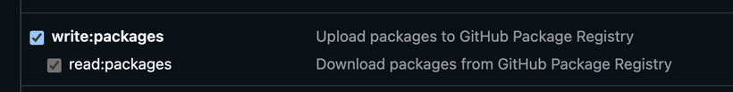

# Configuration

## 📑 Overview
DMB relies on a **centralized configuration file**, `dmb_config.json`, to control its services, logging, API settings, and more. This file allows you to customize the behavior of DMB without modifying the source code.

DMB also supports **environment variables, .env files, and Docker secrets**. If the same setting is defined in multiple places, the **precedence is as follows:**

1. **Environment Variables** (highest priority)
2. **.env File**
3. **Docker Secrets**
4. **`dmb_config.json`** (lowest priority)

## 🛠️ Configuration File Structure

!!! caution "Be Careful When Modifying `dmb_config.json`"
    While DMB is highly configurable via `dmb_config.json`,  
    some changes can cause failures during startup.  
    As such, it is **not recommended** to make modifications unless you fully understand their impact.
    
Below is the **general structure** of `dmb_config.json`:

```json
{
    "puid": 1000,
    "pgid": 1000,
    "tz": "",
    "dmb": { ... },
    "postgres": { ... },
    "pgadmin": { ... },
    "rclone": { ... },
    "riven_backend": { ... },
    "riven_frontend": { ... },
    "zilean": { ... },
    "zurg": { ... }
}
```

Each section configures a specific service.

Below is a breakdown of some of the sections:

---

## 🔧 General Settings

### **User & Timezone**
```json
"puid": 1000,
"pgid": 1000,
"tz": ""
```

- **puid** / **pgid** – Define the user and group IDs for container execution.
- **tz** – Set the timezone (e.g., `America/New_York`).

!!! warning "(puid/pgid cannot be set to `0`, aka root)"
---

## 📜 Logging Settings
Located in `dmb`:
```json
"log_level": "INFO",
"log_name": "DMB",
"log_dir": "/log",
"log_count": 2,
"log_size": "10M",
"color_log": true
```

- **log_level** – Set the logging verbosity (`DEBUG`, `INFO`, `WARNING`, `ERROR`).
- **log_dir** – Directory where logs are stored.
- **log_count** – Number of rotated logs to retain.
- **log_size** – Maximum log file size before rotation.
- **color_log** – Enables colored log output.

---

## 🔐 Integration Tokens & Credentials
Located in the `dmb` section of `dmb_config.json`:

```json
"plex_token": "",
"plex_address": "",
"github_token": "",
"github_username": ""
```

### 🔄 Plex Integration
- **`plex_token`** – This token is used by Riven backend for interacting with your Plex account. It allows features such as using watchlists and sending library scan requests to the Plex server.
- **`plex_address`** – The internal or external URL of your Plex server (e.g., `http://127.0.0.1:32400`).

These values are used automatically by Riven when setting up the [Riven Backend](../services/riven-backend.md).

---

### 🧬 GitHub Integration
- **`github_token`** – Used to increase GitHub API rate limits and unlock access to private/sponsored repositories such as [`zurg`](https://github.com/debridmediamanager/zurg) when associated with your GitHub account.
- **`github_username`** – (Reserved for future use) Will support additional GitHub-sourced services and contributor personalization.

To create a GitHub token:

1. Go to [GitHub Developer Settings → Tokens (Classic)](https://github.com/settings/tokens)
2. Click **Generate new token (classic)**
3. Set an expiration and enable the following scopes:
    - `repo:all`
    - `write:packages` 
    - `read:packages`

    
    
4. Click **Generate token** and **copy the token** — it will only be shown once
5. Add the token to your `.env` file or docker compose with `DMB_GITHUB_TOKEN=`, or `dmb_config.json` under `"github_token"`

---

## 🔌 Service Configuration

Each DMB-integrated service is configured within its own section of `dmb_config.json`.

See the individual service pages for in-depth configuration details:

- [DMB API](../services/api.md)
- [DMB Frontend](../services/dmb-frontend.md)
- [pgAdmin 4](../services/pgadmin.md)
- [PostgreSQL](../services/postgres.md)
- [rclone](../services/rclone.md)
- [Riven Backend](../services/riven-backend.md)
- [Riven Frontend](../services/riven-frontend.md)
- [Zilean](../services/zilean.md)
- [Zurg](../services/zurg.md)


## 📌 Next Steps
1. Review and modify `dmb_config.json` as needed.
2. Review the [Usage](usage.md) page. 
3. For a deep dive into individual services, see the [Services](../services/index.md) section.
