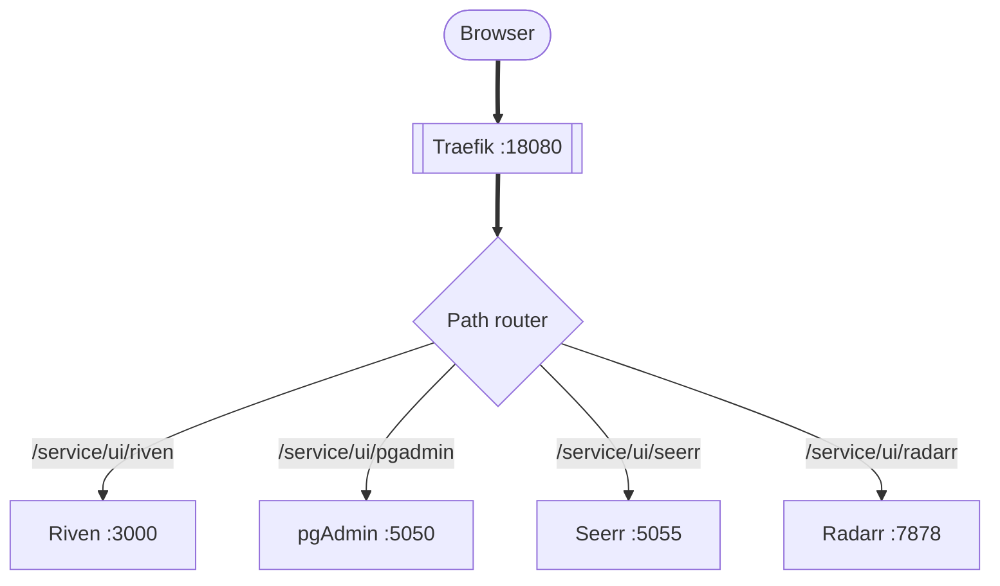

# Embedded Service UIs

DUMB can proxy service web interfaces through Traefik, allowing you to access all service UIs from a single entry point without exposing individual ports.

---

## Overview

The embedded UI feature provides:

- **Unified access** - All service UIs available through one port
- **Simplified networking** - No need to expose multiple ports
- **Integrated experience** - Access services without leaving DUMB
- **Traefik routing** - Dynamic path-based routing to services

{ .shadow }

---

## How it works



1. **Request arrives** at Traefik on port 18080
2. **Path matching** routes to the appropriate service
3. **Middleware** strips the prefix and adjusts headers
4. **Service responds** through the proxy

---

## Enabling embedded UIs

### During onboarding

The onboarding wizard asks if you want to enable embedded service UIs. Select **Yes** to configure Traefik routing automatically.

### Via settings

1. Navigate to **Settings**
2. Find the **Embedded UIs** section
3. Toggle **Enable Service UIs**

### Via API

```bash
curl -X POST http://localhost:8000/api/config/service-ui \
  -H "Content-Type: application/json" \
  -d '{"enabled": true}'
```

---

## Accessing embedded UIs

When enabled, service UIs are available at:

```
http://<host>:18080/service/ui/<service_name>
```

The DUMB frontend also proxies UI requests through a `/ui/<service_name>` path for iframes and split view. Direct browser navigation to `/ui/<service_name>` is blocked by the frontend proxy; use the service page or the direct-link button instead.

### Available services

| Service | Path | Native Port |
|---------|------|-------------|
| Riven Frontend | `/service/ui/riven_frontend` | 3000 |
| pgAdmin 4 | `/service/ui/pgadmin` | 5050 |
| Seerr | `/service/ui/seerr` | 5055 |
| Tautulli | `/service/ui/tautulli` | 8181 |
| Radarr | `/service/ui/radarr` | 7878 |
| Sonarr | `/service/ui/sonarr` | 8989 |
| Lidarr | `/service/ui/lidarr` | 8686 |
| Prowlarr | `/service/ui/prowlarr` | 9696 |
| Whisparr | `/service/ui/whisparr` | 6969 |
| Jellyfin | `/service/ui/jellyfin` | 8096 |
| Emby | `/service/ui/emby` | 8096 |
| Zilean | `/service/ui/zilean` | 8182 |
| CLI Debrid | `/service/ui/cli_debrid` | 5000 |
| CLI Battery | `/service/ui/cli_battery` | 5001 |
| Huntarr (instance) | `/service/ui/huntarr_<instance>` | 9705 |
| Traefik Dashboard | `/service/ui/traefik` | 18081 |

!!! note "Dynamic availability"

    Only enabled services appear in the embedded UI list. The paths are generated based on your `dumb_config.json` configuration.

---

## Traefik configuration

DUMB automatically generates Traefik routing configuration in `/config/traefik/services.yaml`.

### Example configuration

```yaml
http:
  routers:
    riven_frontend:
      rule: "PathPrefix(`/service/ui/riven_frontend`)"
      service: riven_frontend
      middlewares:
        - riven_frontend-stripprefix
        - riven_frontend-replace
        - ui_frame_headers

  middlewares:
    riven_frontend-stripprefix:
      stripPrefix:
        prefixes:
          - "/service/ui/riven_frontend"

    riven_frontend-replace:
      replacePathRegex:
        regex: "^/$"
        replacement: "/web/index.html"

    ui_frame_headers:
      headers:
        customFrameOptionsValue: "SAMEORIGIN"
        contentSecurityPolicy: "frame-ancestors 'self'"

  services:
    riven_frontend:
      loadBalancer:
        servers:
          - url: "http://127.0.0.1:3000"
```

### Middleware chain

Each service uses a middleware chain:

1. **stripPrefix** - Removes `/service/ui/<name>` from the path
2. **replacePathRegex** - Rewrites root path to service entry point
3. **ui_frame_headers** - Adds headers for iframe embedding

---

## iframe embedding

The DUMB frontend can display service UIs in iframes for a seamless experience:

### Embedded UI tab

Each service page includes an embedded UI tab when the service exposes a UI. From there you can:

- Switch between available UI base paths when the service exposes multiple entry points
- Open the UI in a new browser tab using the proxied direct link
- Expand the UI into a full-window view without leaving the service page

### Split view mode

1. Open a service from the dashboard
2. Click the split view button
3. The service UI loads in a side panel

### Full iframe mode

Some pages display the service UI in a full iframe, maintaining DUMB navigation while showing the service interface.

---

## Security considerations

### Same-origin policy

Embedded UIs are served from the same origin (Traefik port), avoiding cross-origin restrictions.

### Frame headers

The `ui_frame_headers` middleware sets:

- `X-Frame-Options: SAMEORIGIN` - Only allow framing from same origin
- `Content-Security-Policy: frame-ancestors 'self'` - Modern browsers CSP

### Authentication passthrough

When DUMB authentication is enabled:

- The DUMB frontend handles auth
- Service UIs may have their own auth (e.g., Plex, pgAdmin)
- Traefik does not add authentication to proxied services

!!! warning "Service-level authentication"

    Embedded UIs inherit their own authentication requirements. Configure service-specific credentials as needed.

---

## Troubleshooting

### Service UI not loading

1. Verify the service is running
2. Check the service appears in `/api/config/service-ui`
3. Verify Traefik configuration in `/config/traefik/services.yaml`
4. Check Traefik logs for routing errors

### "Refused to display in frame" error

- Ensure `ui_frame_headers` middleware is applied
- Some services have their own frame protection - check service settings
- Try accessing the service directly to verify it works

### 404 errors on service paths

- Verify the service name matches the configuration
- Check if the path prefix is correct
- Ensure Traefik has reloaded the configuration

### Slow loading

- Services load their full UI through the proxy
- Initial load may be slower than direct access
- Consider the service's native performance

---

## Proxy behavior and restrictions

The frontend proxy enforces iframe-only access to `/ui/<service>` routes. If you try to visit those paths directly, the proxy redirects you back to the main app. This keeps service UI cookies scoped to the embedded context and prevents navigation loops.

Use one of these paths instead:

- The embedded UI tab on the service page
- The direct link button (opens a new tab safely through the proxy)
- The Traefik route (`/service/ui/<service>`) if you want to bypass the frontend

---

## Disabling embedded UIs

To disable and revert to direct port access:

1. Go to **Settings** :material-arrow-right: **Embedded UIs**
2. Toggle **Disable Service UIs**
3. Access services on their native ports

Or via API:

```bash
curl -X POST http://localhost:8000/api/config/service-ui \
  -H "Content-Type: application/json" \
  -d '{"enabled": false}'
```

---

## Related pages

- [Frontend Overview](../frontend/index.md) - Web interface guide
- [Settings](../frontend/settings.md) - Configuration options
- [Configuration API](../api/config.md) - API endpoints
