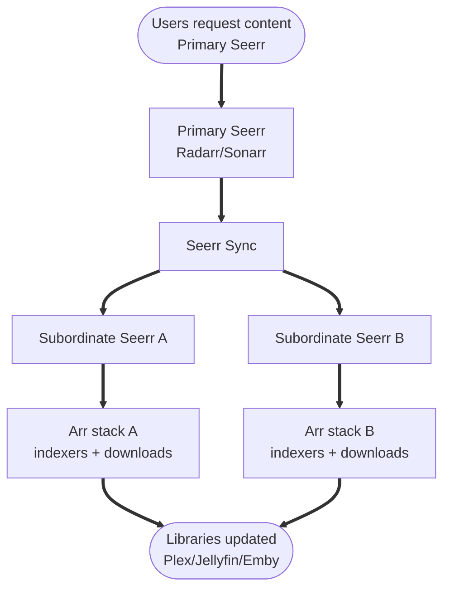
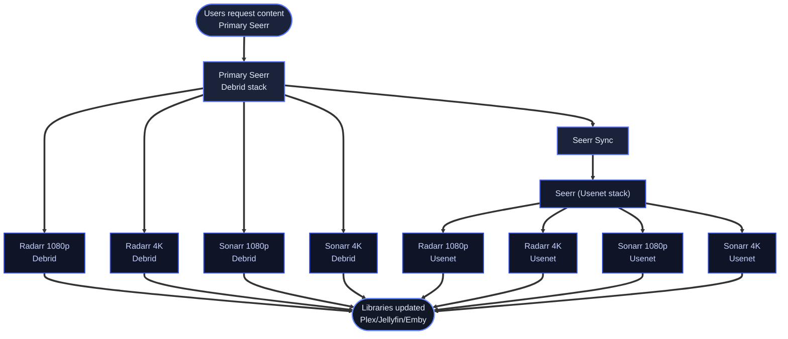

# Seerr Sync

Seerr Sync replicates media requests from a **primary** Seerr instance to one or more **subordinate** Seerr instances. It is one‑way: requests originate from the primary and are mirrored to subordinates.

{ .shadow }

---

## Why Seerr Sync is useful

Seerr is typically connected to a single Radarr and Sonarr per quality profile. That works well for a single stack, but becomes limiting when you want **one request to drive multiple independent stacks**.

Common scenarios Seerr Sync solves:

- **Multiple download locations**  
  Home server, seedbox, or a friend’s server all run their own Arr stack. Seerr can’t drive all of them directly.
- **Redundant libraries**  
  A primary library on fast storage and a backup library elsewhere should receive the same requests automatically.
- **Multi‑household setups**  
  Family members in different houses want the same content, but downloads should happen locally to each household.

Seerr Sync removes the need to duplicate requests or maintain custom scripts.

---

## How it works

1. **Primary Seerr** is where users make requests.  
2. **Subordinate Seerrs** mirror those requests and send them to their own Arr stacks.  
3. **Each subordinate downloads independently**, using its own indexers, download clients, and storage paths.

The result: **one request → multiple Arr stacks all grab the content**.

---

## Real example

“I have a home server and a seedbox. I want Seerr users to make one request, and have both my home Radarr and my seedbox Radarr grab it. Before this, I had to add things twice or run scripts. Now it just works.”

Another common use case is running **separate Arr stacks for Debrid and Usenet** (non‑combined). Because Seerr can only push to one Arr per quality profile, you run multiple Seerr instances and use Seerr Sync to mirror requests so **both the Debrid and Usenet stacks get the same requests automatically**.

---

## Where it’s configured

Seerr Sync is configured via the `seerr_sync` block in `dumb_config.json` and per‑instance `sync_role` on Seerr instances. See the [Seerr service page](../services/core/seerr.md) for configuration details and validation rules.

The DUMB Frontend exposes a Seerr Sync panel with:

- Enable + poll interval
- External primary / subordinate editors
- Sync options toggles
- Per‑instance sync role selector
- Status + failed request reporting

---

## Related pages

- [Seerr service](../services/core/seerr.md)
- [Seerr Sync API](../api/seerr-sync.md)
