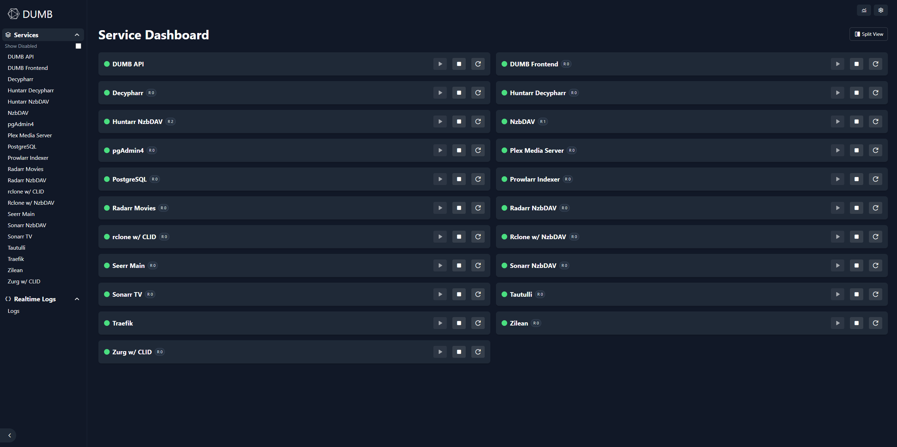
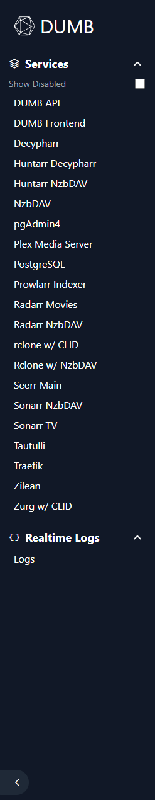
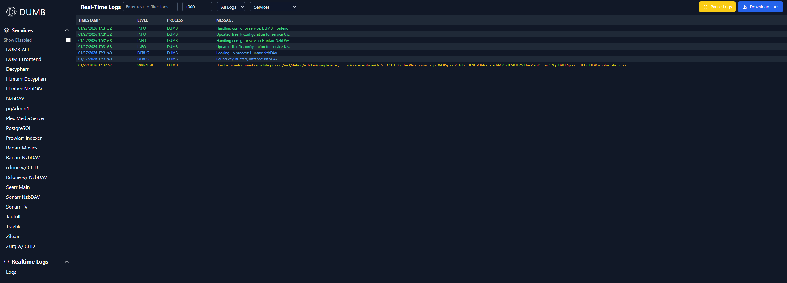
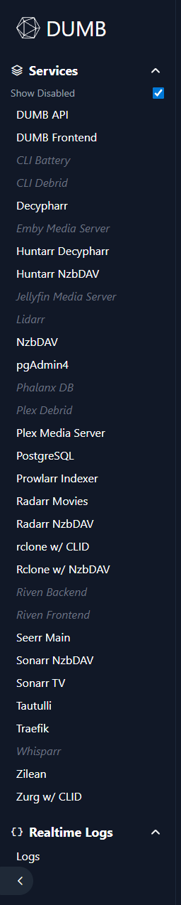

# Dashboard

The dashboard is the main page of the DUMB Frontend, providing an at-a-glance view of all your services with real-time status updates and quick controls.

---

## Overview

The dashboard displays service cards for each configured service, showing:

- Service name and status
- Health indicator
- Auto-restart badge
- Quick action and available-update buttons

{ .shadow }

---

## Service cards

Each service is represented by a card with the following elements:

### Status indicator

| Color | Status |
|-------|--------|
| :material-circle:{style="color: #4caf50"} Green | Running and healthy |
| :material-circle:{style="color: #ff9800"} Amber | Running but degraded |
| :material-circle:{style="color: #29b6f6"} Blue | Application is starting or migrating |
| :material-circle:{style="color: #e91e63"} Rose | Running but application health is unhealthy |
| :material-circle:{style="color: #f44336"} Red | Stopped |
| :material-circle:{style="color: #9e9e9e"} Gray | Unknown status |

### Health badge

When a service has health checks enabled, you'll see:

- **Healthy** - Service is responding correctly
- **Degraded** - Application is reachable but reports a warning
- **Starting** - Application is initializing or migrating
- **Unhealthy** - Application failed a restart-relevant health check

Hover the indicator or health badge to see the probe, reason, and component
states supplied by the backend. The sidebar's **Unhealthy** filter includes
only restart-relevant unhealthy states, not degraded or starting services.

### Auto-restart badge

If auto-restart is enabled for a service:

- Shows restart count (e.g., "Restarts: 2")
- Indicates the auto-restart feature is active

### Resource badges (Geek Mode)

With [Geek Mode](settings.md#geek-mode) enabled, each service card shows live resource badges:

- **CPU%** - Color-coded by usage (green < 50%, amber < 80%, red >= 80%)
- **Memory RSS** - Current resident memory usage
- **DB Healthy/Moderate/High/Critical + score** - Current Database Health pressure for services explicitly opted into monitoring, color-coded by severity; hover for provider, mode, score, and recommendation

Metrics are polled every 5 seconds while Geek Mode is active and stop automatically when disabled. Database Health badges are omitted for unsupported services and services whose Database Health monitoring is disabled. Geek Mode never enables collection automatically.

---

## Quick actions

Each service card provides action buttons:

| Button | Action | Description |
|--------|--------|-------------|
| :material-play: | Start | Start a stopped service |
| :material-stop: | Stop | Stop a running service |
| :material-restart: | Restart | Restart a running service |
| :material-download: | Update | Install the version already reported as available |

The per-service Update button appears only after DUMB has recorded an ordinary
available update. It restarts that service as part of the install. Saved release,
branch, commit, and pinned-version choices are never overridden by this shortcut.

!!! tip "Tooltips"

    Hover over action buttons to see what each will do.

## Check and update multiple services

Use **Updates** in the dashboard header to review every enabled service that
supports DUMB-managed updates.

The button shows a pending count when cached checks report available updates.
This includes checks run manually and services configured with scheduled
**Show on dashboard** (`auto_update_mode: check_only`). The dashboard refreshes
the inventory periodically while open, so a completed background check can
light the badge without reloading the page.

1. Select **Check all** to check the services sequentially.
2. Review current and available versions plus any updater message.
3. Select some updates, or use **Select available**.
4. Select **Install selected** and confirm the restart warning.

Checks and installs run one service at a time. The panel shows the active service
and retains a result on each row. You can close the panel without cancelling the
operation: the dashboard shows a background-progress banner, and reopening
**Updates** reattaches to the same progress and row states.

After an install finishes, newer DUMB backends show two measurements on the
service row:

- **Install** is the complete update operation, including download/cache
  restore, build, activation, readiness checks, stabilization, and rollback when
  required.
- **Downtime** starts immediately before DUMB stops the old managed process and
  ends when the replacement first passes its application-readiness probe. The
  stabilization window after that first ready response remains part of Install,
  not Downtime. If no running process was stopped, the row says downtime was not
  observed. A failed update that never regains verified readiness reports a
  minimum measured downtime and says readiness was not confirmed.

These values use DUMB's monotonic server clock and bounded readiness polling, so
they measure the managed service interruption rather than browser request time.
The display is gated by the `update_timing_metrics` backend capability; older
backends continue to show normal update results without the timing row.

Only rows in the normal **Update available** state can be bulk-selected. A row
marked **Review source** has a saved release, branch, commit, or version choice;
open that service page to decide whether to install its configured target or use
the explicit **Override + latest** action. The bulk workflow never overrides it.

Checking never restarts a service. Installing does. DUMB Frontend and DUMB API
updates are ordered last so the loaded dashboard can report as much progress as
possible.

For a DUMB Frontend update, the backend downloads, builds, and validates an
adjacent replacement while the current dashboard continues serving requests.
It stops the old frontend only for the final atomic swap, restart, and readiness
check. The loaded dashboard treats that brief proxy disconnect as expected,
reconnects to the backend's retained update status, and reloads itself after the
replacement is ready. A failed candidate build leaves the current frontend
running; a failed activation restores the previous runtime. DUMB API updates can
still interrupt the final inventory refresh because the API is the update control
plane itself. After a bulk update, verify service health and logs before
continuing normal operation.

---

## Service detail navigation

Click anywhere on a service card (except the action buttons) to open its service page. For a full breakdown
of service-page controls (config editors, logs, auto-restart overrides, and embedded UIs), see
[Service pages](service-pages.md).

---

## Real-time updates

The dashboard automatically receives updates via WebSocket:

- Status changes appear immediately
- Health check results update in real-time
- No manual refresh needed

The connection status is shown in the header area. If disconnected, the frontend will automatically attempt to reconnect.

---

## Toolbar and log viewer

The toolbar and sidebar provide quick access to service settings and logs.

{ .shadow }

From here you can:

- Show disabled services
- Jump to a service’s logs or config
- Open the main DUMB config editor

### Real-time logs

{ .shadow }

The log viewer supports:

- Filtering by text or log level
- Selecting process names
- Pausing/resuming the stream
- Downloading log snapshots (`DMB_logs.txt`)

---

## Filtering and organization

Enabled services are displayed in a grid layout, organized by:

- **DUMB services first** - The API/frontend lead the default list
- **Alphabetical order** - Other services follow by name until you save a custom order

{ .shadow }

---

## Tile reordering

You can reorder dashboard service tiles with drag-and-drop.

- Drag a tile (or use the drag handle) to move it
- Other tiles shift in real time while you drag
- The same order is applied to the Services list in the sidebar

Order is persisted in `dumb_config.json` under:

- `dumb.ui.sidebar.service_order`

### Mobile and touch behavior

On mobile, touch reordering is protected by a lock toggle to prevent accidental tile moves while scrolling:

- **Reorder Off** (default): touch scrolling only, no tile movement
- **Reorder On**: drag-handle touch reordering is enabled

---

## System alerts

When system resources are critically high, alerts appear at the top of the dashboard:

| Alert | Trigger |
|-------|---------|
| CPU Warning | CPU usage exceeds threshold (default 85%) |
| Memory Warning | Memory usage exceeds threshold (default 85%) |
| Disk Warning | Disk usage exceeds threshold (default 90%) |

Configure alert thresholds in the [Settings](settings.md) page.

---

## Sidebar navigation

The sidebar provides quick access to:

- **Home** - Return to dashboard
- **Settings** - Configuration and preferences
- **Metrics** - System monitoring
- **Onboarding** - Re-run setup wizard

The Services section follows the same persisted `service_order` used by dashboard tiles.

---

## Related pages

- [Service Management](../services/dumb/dumb-frontend.md) - Detailed service controls
- [Metrics](metrics.md) - System resource monitoring
- [Settings](settings.md) - Dashboard preferences
