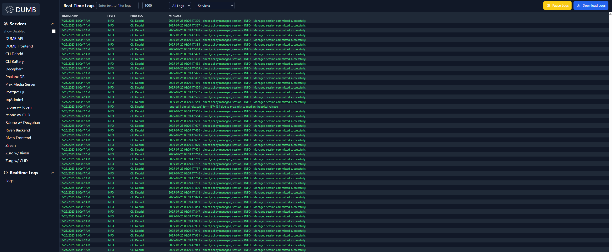

# Dashboard

The dashboard is the main page of the DUMB Frontend, providing an at-a-glance view of all your services with real-time status updates and quick controls.

---

## Overview

The dashboard displays service cards for each configured service, showing:

- Service name and status
- Health indicator
- Auto-restart badge
- Quick action buttons

---

## Service cards

Each service is represented by a card with the following elements:

### Status indicator

| Color | Status |
|-------|--------|
| :material-circle:{style="color: #4caf50"} Green | Running and healthy |
| :material-circle:{style="color: #f44336"} Red | Stopped |
| :material-circle:{style="color: #ff9800"} Amber | Running but unhealthy |
| :material-circle:{style="color: #9e9e9e"} Gray | Unknown status |

### Health badge

When a service has health checks enabled, you'll see:

- **Healthy** - Service is responding correctly
- **Unhealthy** - Service failed health check (with reason on hover)

### Auto-restart badge

If auto-restart is enabled for a service:

- Shows restart count (e.g., "Restarts: 2")
- Indicates the auto-restart feature is active

---

## Quick actions

Each service card provides action buttons:

| Button | Action | Description |
|--------|--------|-------------|
| :material-play: | Start | Start a stopped service |
| :material-stop: | Stop | Stop a running service |
| :material-restart: | Restart | Restart a running service |

!!! tip "Tooltips"

    Hover over action buttons to see what each will do.

---

## Service detail navigation

Click anywhere on a service card (except the action buttons) to navigate to the service detail page, where you can:

- View and edit service configuration
- Access real-time logs
- See detailed status information
- Configure auto-restart settings

### Service detail tools

From the service detail view, you can access configuration editors and logs for the selected service.

#### Edit DUMB Config

Use this to view or edit `dumb_config.json`. Changes can be saved temporarily (in memory) or
persisted to disk.

#### Edit Service Config

For services with their own config files, you can open and edit those settings here.

#### View service logs

Log views support filtering by log level and line count, plus a one-click download.

---

## Real-time updates

The dashboard automatically receives updates via WebSocket:

- Status changes appear immediately
- Health check results update in real-time
- No manual refresh needed

The connection status is shown in the header area. If disconnected, the frontend will automatically attempt to reconnect.

---

## Toolbar and log viewer

The toolbar provides quick access to service settings and logs.

From here you can:

- Show disabled services
- Jump to a service’s logs or config
- Open the main DUMB config editor

### Real-time logs

The log viewer supports:

- Filtering by text or log level
- Selecting process names
- Pausing/resuming the stream
- Downloading log snapshots (`DMB_logs.txt`)

---

## Filtering and organization

Services are displayed in a grid layout, organized by:

- **Enabled services first** - Active services appear prominently
- **Alphabetical order** - Within each group

---

## System alerts

When system resources are critically high, alerts appear at the top of the dashboard:

| Alert | Trigger |
|-------|---------|
| CPU Warning | CPU usage exceeds threshold (default 85%) |
| Memory Warning | Memory usage exceeds threshold (default 85%) |
| Disk Warning | Disk usage exceeds threshold (default 90%) |

Configure alert thresholds in the [Settings](settings.md) page.

---

## Sidebar navigation

The sidebar provides quick access to:

- **Home** - Return to dashboard
- **Settings** - Configuration and preferences
- **Metrics** - System monitoring
- **Onboarding** - Re-run setup wizard

---

## Related pages

- [Service Management](../services/dumb/dumb-frontend.md) - Detailed service controls
- [Metrics](metrics.md) - System resource monitoring
- [Settings](settings.md) - Dashboard preferences
