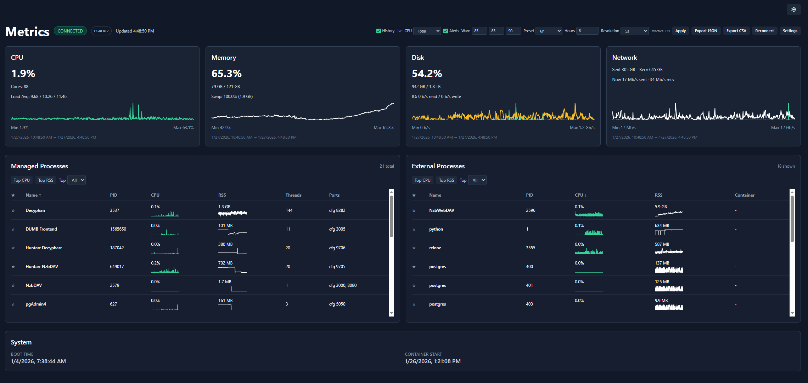

# Metrics

The Metrics page provides real-time and historical system monitoring, displaying CPU, memory, disk, and network usage for the DUMB container.

---

## Overview

The metrics dashboard shows:

- **Real-time gauges** - Current resource usage
- **Historical charts** - Usage trends over time
- **Process details** - Per-service resource consumption
- **Database health** - Optional SQL and persistent-store pressure summaries
- **Plex cloud status** - Optional cached status for Plex-operated services
- **System information** - Container and host details



---

## Resource monitoring

### CPU usage

| Metric | Description |
|--------|-------------|
| **Usage %** | Current CPU utilization |
| **Core Count** | Available CPU cores |
| **Load Average** | 1, 5, 15 minute averages |

The CPU gauge shows:

- :material-circle:{style="color: #4caf50"} Green: 0-60%
- :material-circle:{style="color: #ff9800"} Amber: 60-85%
- :material-circle:{style="color: #f44336"} Red: 85%+

### Memory usage

| Metric | Description |
|--------|-------------|
| **Used** | Currently allocated memory |
| **Available** | Free memory for allocation |
| **Total** | Total system RAM |
| **Usage %** | Percentage in use |

### Swap usage

| Metric | Description |
|--------|-------------|
| **Used** | Current swap utilization |
| **Total** | Total swap space |
| **Usage %** | Percentage in use |

!!! tip "Swap monitoring"

    High swap usage may indicate memory pressure. Consider increasing container memory limits.

### Disk usage

| Metric | Description |
|--------|-------------|
| **Used** | Space consumed |
| **Free** | Available space |
| **Total** | Total disk capacity |
| **Usage %** | Percentage in use |

Use **Metrics → Settings → Monitored Filesystems** to choose one or more paths that DUMB can see inside its container. The discovered list includes eligible container mounts; custom absolute container paths are also accepted. For example, if the storage you care about is bind-mounted at `/data`, select `/data` rather than `/`.

Docker does not expose an unmounted host path to DUMB. The selector therefore uses container paths, not host paths. The first selected path is marked **Primary** and supplies the existing disk/inode history chart and compatibility API fields. Use the arrow controls to change the primary path. All selected filesystems appear in the live card and participate in disk/inode alerts; unavailable paths are shown explicitly.

### Inode usage

| Metric | Description |
|--------|-------------|
| **Used / free / total** | Filesystem entries consumed and remaining |
| **Usage %** | Percentage of available inodes in use |

The **Filesystems** card shows disk and inode pressure for every selected path, plus a zoomable inode-history chart for the primary path alongside system/container I/O. Inodes represent filesystem entries for files and directories, so a filesystem can reach 100% inode usage and reject new files even when byte capacity remains. JSON history exports retain each filesystem entry; CSV exports add disk and inode percentage columns for every path present in the selected history range.

### Network I/O

| Metric | Description |
|--------|-------------|
| **Bytes Sent** | Total outbound data |
| **Bytes Received** | Total inbound data |
| **Packets Sent** | Outbound packet count |
| **Packets Received** | Inbound packet count |

Use **Metrics → Settings → Monitored Network Interfaces** to select every visible interface or a specific set. The default `all` option preserves the previous aggregate, including loopback. Selecting a specific bridge interface such as `eth0` removes unrelated loopback traffic from the aggregate rate chart.

The Network card shows the selected aggregate plus per-interface link state, speed, MTU, current send/receive rate, cumulative counters, and nonzero error/drop totals. JSON history retains the interface records, and CSV exports add send/receive rate columns for every interface present in the selected range.

Only interfaces visible inside DUMB's network namespace are available. A normally bridge-networked container cannot inspect host interfaces; host interfaces become visible when DUMB runs with host networking.

---

## Historical charts

The metrics page displays time-series charts showing resource usage over time:

- **Time range** - Configurable history window
- **Bucket size** - Data aggregation interval
- **Auto-refresh** - Continuous updates via WebSocket

### Chart controls

| Control | Function |
|---------|----------|
| Zoom | Scroll to zoom in/out |
| Pan | Click and drag to move |
| Reset | Double-click to reset view |

---

## Per-process metrics

View resource usage for individual services:

| Column | Description |
|--------|-------------|
| **Process** | Service name |
| **PID** | Process ID |
| **CPU %** | CPU utilization |
| **Memory %** | RAM utilization |
| **Memory RSS** | Resident set size |

Sort by any column to identify resource-intensive services.

---

## Plex cloud status

Enable **Plex Cloud Status** from **Metrics → Settings** or open the Plex service page and choose **Plex Status**. After it is enabled, the Metrics page shows Plex's overall public status, the latest collection time, affected components, active incidents, scheduled maintenance, and links to the official status entry.

The existing Metrics alert banner adds a Plex cloud alert when the enabled feed reports a disruption. A temporary refresh failure shows the last successful sample as **Stale** instead of replacing it with a false operational state.

This panel is deliberately separate from the local Plex service indicator:

- **Plex service status** tells you whether the DUMB-managed Plex process is running and healthy.
- **Plex Cloud Status** summarizes infrastructure operated by Plex.

An operational cloud status does not prove that local playback, remote access, DNS, routing, or port forwarding is working. The metric is disabled by default and sends no Plex token or local library/service data.

---

## Database health

Only services explicitly opted into Database Health monitoring appear in the **Database Health** table on the Metrics page. Supported services with monitoring disabled remain available in **Metrics → Settings** and the service page's **Database Health** panel so they can be enabled, but they are omitted from the results table. When no services are monitored, the section shows a concise empty state with a **Configure** action instead of disabled service rows.

The Database Health section appears near the bottom of the live Metrics content. When Plex Cloud Status is enabled, its card follows Database Health; **System** remains last. Click or keyboard-activate any service row to expand or collapse its full details. Expanded details match the service-page panel and include the recommendation, score reasons, database paths/names, provider metadata, filesystem capacity, inode pressure, read-only/network state, probe results, and observed log signals. Column headers, settings, status badges, and detail fields include tooltips, and the section links directly to the Database Health documentation.

The table shows:

- detected SQL provider or custom store format and current pressure classification;
- combined database/store and SQLite WAL size;
- database-related log-signal count;
- bounded read-only probe latency when Enhanced mode is enabled;
- a service-specific recommendation.
- filesystem byte usage/free space, inode usage/free inodes, and read-only state in the expanded details.

Use **Standard / passive** for the lowest overhead. Use **Enhanced / read-only probes** when you need SQLite page/WAL metadata or PostgreSQL statistics. Plex is always collected passively while running, even if Enhanced is selected. Decypharr append-log stores, Phalanx DB Hyperbee data, and the Zurg state directory are also passive-only; Enhanced does not open or query those formats.

The supported set includes the Arrs, NzbDAV, Bazarr, Plex, CLI Debrid/Battery, Emby, Jellyfin, Profilarr, Tautulli, AltMount, Pulsarr, Seerr, PostgreSQL, pgAdmin, Riven Backend, Zilean, Traefik Proxy Admin, Decypharr, Phalanx DB, and Zurg. DUMB detects SQLite versus PostgreSQL for provider-neutral services and keeps multi-instance entries separate.

Enable **Ignore network storage score** for an individual service when its NFS/SMB placement is intentional. The filesystem remains visible in the service details, but it no longer raises the pressure score or replaces recommendations derived from the remaining metrics.

The override excludes only network placement. Low free space, high inode usage, read-only storage, WAL growth, log errors, probe latency, locks, deadlocks, and long-running transactions continue to affect the result.

Pressure classifications are `healthy`, `observing`, `moderate`, `high`, `critical`, `unavailable`, or `disabled`. Collect through representative imports, scans, health checks, and playback before deciding whether PostgreSQL would help.

Open **How to read Database Health** for an in-product explanation of observed signals, score bands, and limitations. Database Health is evidence rather than a benchmark: it cannot profile individual SQL queries, prove root cause, predict an exact provider speedup, guarantee every transient event was captured, repair databases, or replace backups and application-native diagnostics.

---

## System information

### Container details

| Info | Description |
|------|-------------|
| **Boot Time** | When the container started |
| **Uptime** | Time since boot |
| **Platform** | Operating system |

### cgroup awareness

DUMB automatically detects whether it's running in a cgroup-limited environment (Docker/Kubernetes) and reports metrics accordingly:

- **cgroup mode** - Reports container limits, not host resources
- **Host mode** - Reports full system resources

---

## WebSocket connection

Metrics are streamed in real-time via WebSocket:

| Status | Indicator |
|--------|-----------|
| **Connected** | :material-circle:{style="color: #4caf50"} Live updates active |
| **Connecting** | :material-circle:{style="color: #ff9800"} Establishing connection |
| **Disconnected** | :material-circle:{style="color: #f44336"} No live updates |

The frontend automatically reconnects if the connection drops.

---

## Configuration

### Update interval

Configure how frequently metrics are updated:

| Setting | Default | Range |
|---------|---------|-------|
| Interval | 2 seconds | 0.5-10 seconds |

Lower intervals provide more responsive updates but increase network traffic.

### History settings

| Setting | Default | Description |
|---------|---------|-------------|
| **Retention** | 7 days | How long to keep history |
| **Bucket Size** | 5 seconds | Aggregation interval |
| **History read backend** | SQLite | Serve history from local SQLite or optional DUMB-managed PostgreSQL |
| **Max local SQLite size** | 100 MB | Bounds the compressed local history/continuity payloads |
| **SQLite continuity path** | `/config/metrics/metrics.sqlite` | Persistent local history database and PostgreSQL write-ahead continuity buffer |

### History storage status

Open **Metrics → Settings → History Storage** to see:

- the configured and currently active provider;
- whether automatic SQLite fallback is active;
- local and PostgreSQL sample counts and allocated size;
- the local compressed-to-original JSON ratio;
- retained legacy JSONL files and import state;
- the latest safe PostgreSQL connection error.

PostgreSQL is not merely a backup. When selected, synchronized, and healthy, it is the active history query and retention backend. SQLite is written first as a bounded write-ahead continuity buffer so live charts remain available when PostgreSQL is stopped or restarting. Retained local samples are replayed when PostgreSQL reconnects.

On current backends, choosing PostgreSQL only changes the draft selection. The panel explicitly prompts the user to click **Apply & activate PostgreSQL**; nothing is provisioned until that button is used. Apply enables PostgreSQL if necessary, creates the dedicated database, starts or reuses the managed process, synchronizes retained samples, and switches history reads without restarting DUMB. During the operation the panel displays activation progress. Afterward, a persistent **PostgreSQL cutover complete** notice confirms that PostgreSQL is serving history reads while SQLite remains the continuity buffer.

If any step fails, the panel keeps SQLite active and returns to the pending state so **Apply & activate PostgreSQL** can be used to retry. For backward compatibility, dmbdb shows **Apply** plus restart guidance instead when the connected backend does not advertise hot activation support.

Use **Import JSONL now** to force a fresh scan for history created by older DUMB releases. The import is timestamp-idempotent, detects files added after an earlier completed migration, and does not delete the source files. **Refresh / probe** performs an operator-requested PostgreSQL connection test without waiting for the normal retry interval.

See [Metrics history storage](../features/metrics.md#metrics-history-storage) for configuration, sizing, migration, fallback, and rollback details.

---

## Alert thresholds

Configure when alerts appear on the dashboard:

| Resource | Default | Setting Location |
|----------|---------|-----------------|
| CPU | 85% | Settings :material-arrow-right: Preferences |
| Memory | 85% | Settings :material-arrow-right: Preferences |
| Disk | 90% | Settings :material-arrow-right: Preferences |
| Inodes | 90% | Metrics header warning controls |
| Database Health | Off; selectable Moderate/High/Critical minimum | Metrics header or Metrics Settings :material-arrow-right: Database Health Monitoring |

Alerts appear as banners when thresholds are exceeded and on the global Metrics indicator. **DB health** / **Include Database Health in alerts** is optional and browser-local; enabling it does not enable collection for any service or alter its pressure score.

These browser alerts are separate from [backend notifications](../features/notifications.md). Backend notifications continue operating without an open browser and have their own persistent thresholds, cooldowns, recovery handling, and delivery history.

---

## API access

Metrics are also available via the REST API:

```bash
# Current metrics snapshot
curl http://localhost:3005/api/metrics

# Historical metrics newer than a Unix timestamp
curl "http://localhost:3005/api/metrics/history?since=1784300000&limit=5000"

# Storage, migration, and fallback status
curl "http://localhost:3005/api/metrics/history/storage?probe_postgresql=true"

# Database health, optionally forcing a fresh collection
curl "http://localhost:3005/api/metrics/database-health?process_name=NzbDAV&refresh=true"
```

See the [WebSocket API](../api/websocket.md) documentation for real-time streaming.

---

## Troubleshooting

### Metrics not updating

- Check WebSocket connection status
- Verify browser supports WebSocket
- Check for network/firewall issues

### High memory usage

- Review per-process metrics to identify heavy services
- Consider disabling unused services
- Increase container memory limits

### Disk filling up

- Check log file sizes
- Review metrics retention settings
- Clear old data if needed

---

## Related pages

- [Dashboard](dashboard.md) - Service monitoring
- [WebSocket API](../api/websocket.md) - Real-time data streaming
- [Settings](settings.md) - Alert configuration
