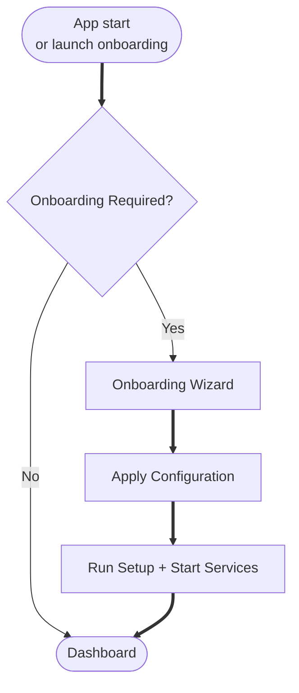

# Onboarding Wizard

The onboarding wizard guides you through the initial setup of DUMB, helping you configure core services, debrid credentials, and optional components in a step-by-step process.

---

## Overview

The wizard walks you through:

1. Selecting core services (orchestrators)
2. Configuring debrid service credentials
3. Choosing optional services
4. Customizing service-specific options
5. Reviewing and applying your configuration

---

## Onboarding flow

---

## When to use onboarding

The onboarding wizard runs automatically when:

- DUMB is started for the first time
- No core services have been configured
- You manually navigate to `/onboarding`

You can also re-run onboarding at any time from the Settings page to reconfigure your setup.

---

## Wizard steps

### Step 1: Select core services

Choose one or more core services:

| Category | Services |
|----------|----------|
| **Orchestrators** | Riven Backend, CLI Debrid, Decypharr, NzbDAV |
| **Request/automation** | Seerr, Huntarr |
| **Media servers** | Plex, Jellyfin, Emby |
| **Arr services** | Sonarr, Radarr, Lidarr, Prowlarr, Whisparr |

!!! info "Multiple core services"

    You can select multiple core services if needed. Each will be configured with its own dependencies.

---

### Step 2: Configure debrid service

For each core service, provide your debrid credentials:

| Field | Description |
|-------|-------------|
| **Debrid Service** | Select your provider (RealDebrid, AllDebrid, etc.) |
| **API Key** | Your debrid service API key |

!!! tip "Finding your API key"

    - **RealDebrid**: [real-debrid.com/apitoken](https://real-debrid.com/apitoken)
    - **AllDebrid**: Account settings :material-arrow-right: API Keys
    - **Premiumize**: Account :material-arrow-right: API Key

---

### Step 3: Select optional services

Choose additional services to enable:

| Category | Services |
|----------|----------|
| **Utilities** | Zilean, pgAdmin, Riven Frontend, PostgreSQL |
| **Monitoring** | Tautulli |

Optional services are automatically configured with appropriate connections to your core services.

---

### Step 4: Service-specific options

Configure additional settings for selected services:

**Example options:**

- **Zurg**: Custom port, log level
- **rclone**: Mount options, log level
- **Phalanx DB**: Enable/disable for CLI Debrid
- **Decypharr**: Use embedded rclone option

Default values are pre-filled but can be customized.

---

### Step 5: Enable embedded UIs

If your backend supports embedded service UIs, you'll be asked:

> Would you like to enable embedded service UIs?

When enabled, you can access service web interfaces directly within the DUMB frontend using embedded tabs, direct link buttons, and split view.

---

### Step 6: Review configuration

Review your complete configuration before applying:

- Core services selected
- Debrid credentials (API key masked)
- Optional services
- Custom options

!!! warning "Verify before proceeding"

    Review carefully - the wizard will start services immediately after confirmation.

---

### Step 7: Live setup logs

Watch the setup progress in real-time:

- Service initialization
- Dependency resolution
- Configuration application
- Startup confirmations

The log viewer shows output from all services being started.

---

### Step 8: Success or error

**Success**: All services started successfully. You'll be redirected to the dashboard.

**Error**: If any service failed to start, you'll see:

- Which services failed
- Error messages
- Option to retry or skip

---

## Skipping onboarding

If you prefer to configure services manually:

1. Navigate to `/onboarding`
2. Click **Skip Onboarding**
3. Configure services individually in Settings

!!! warning "Manual setup caveats"

    Onboarding is the preferred way to add or configure services. Manual edits
    can miss the nuanced wiring DUMB applies for core services, so a manual-only
    setup may fail to fully configure dependencies and integrations.

!!! note "Re-running onboarding"

    You can always return to onboarding from Settings :material-arrow-right: Launch Onboarding.

---

## Configuration applied

The wizard updates `dumb_config.json` with:

- Enabled services
- Debrid API keys (injected into Zurg/Decypharr)
- Service options
- Instance configurations

---

## Multi-instance support

For services that support multiple instances (like Zurg or rclone), the wizard:

- Creates instances linked to core services
- Names them appropriately (e.g., "Zurg w/ Riven")
- Configures separate ports to avoid conflicts

---

## After onboarding

Once complete:

1. **Dashboard** shows your running services
2. **Settings** allows further customization
3. **Service UIs** are accessible (if enabled)
4. **Logs** can be viewed for each service

---

## Troubleshooting

### Services fail to start

- Check logs for specific error messages
- Verify debrid API key is valid
- Ensure required ports are available

### Can't proceed past a step

- Fill in all required fields
- Check for validation errors (red highlights)
- Refresh the page and try again

### Need to change configuration

- Complete onboarding first
- Use Settings to modify individual services
- Or Launch Onboarding to start fresh

---

## Related pages

- [Dashboard](dashboard.md) - Post-setup service management
- [Settings](settings.md) - Manual configuration
- [Authentication](../features/authentication.md) - User setup
