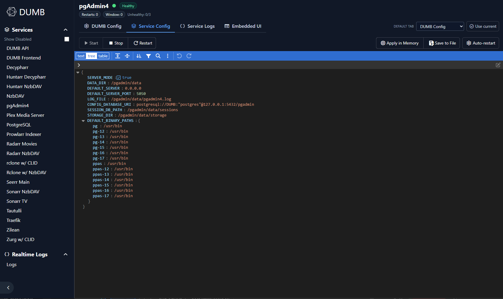
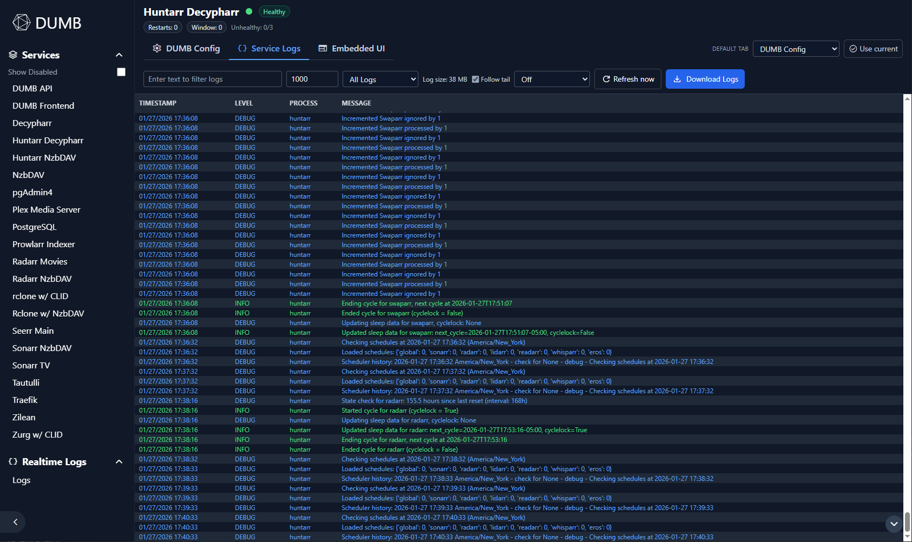

# Service pages

This page covers the service-level controls exposed in the DUMB Frontend, including
auto-restart policies, auto-update scheduling, and configuration editors.

The dashboard **Updates** panel includes install-cache usage and maintenance
only when the backend advertises `install_cache_management`. On older DUMB
versions the controls remain hidden and the frontend makes no install-cache API
requests. Managed, legacy, and combined usage are shown when supplied by the
backend. Named-scope cleanup is independently gated by
`install_cache_cleanup`, so a frontend on `dev` does not call the cleanup route
on older APIs. Editing and saving `dumb.install_cache.max_size_gib` is separately
gated by `install_cache_limit_settings`; saving the value does not prune until
the operator selects **Prune to limit**. See
[Install cache and safe updates](../features/install-cache.md).

---

## Overview

Each service page includes:

- Current status, health, and restart counters
- Start, stop, and restart actions (except for the API service)
- Configuration editors with validation
- Log viewers (service logs, plus special logs when available)
- Embedded UI tab when supported and enabled
- Dependency graph view for core/dependency startup relationships
- Per-service auto-restart overrides
- Media Library Protection policy and Plex library preferences on Plex, Jellyfin, and Emby pages
- On-demand update checks and auto-update scheduling
- InfiniDysk/NzbDAV install provenance in Updates (verified prebuilt archive or source build, resolved release, and automatic fallback reason)
- A **Sponsor** action when the backend publishes a support link for the service
- Seerr Sync controls when viewing a Seerr instance
- Symlink Job Center (for symlink-capable services) with active jobs, recent history, retry, and failure clearing
- Guided SQLite-to-PostgreSQL rehearsal/cutover panel on every backend-advertised supported service, with explicit rehearsal/cutover success notices, automatic cutover selection, close-while-active confirmation, and persistent background running/completion indicators
- An **Rclone Optimizer** tab and persistent active-job banner on NzbDAV-backed rclone instances when the backend advertises `rclone_optimizer_nzbdav`; the NzbDAV page shows only a link to an associated active rclone job
- Sidebar operator QoL controls (quick filters, saved views, compact mode, and command palette)

---

## Status and controls

The header shows the service name, status dot, and health badge. When auto-restart is
enabled for a service, you also see restart counters and the last restart reason.
With [Geek Mode](settings.md#geek-mode) enabled, the header also displays the internal
config key and process name in monospace.

The compact command bar keeps frequent actions visible:

- **Start**, **Stop**, **Restart** for the current service
- **Save to File** persists the current configuration; on DUMB Config, its split-button menu also provides **Apply in Memory** for a temporary change
- **Tools**, pinned beside the horizontally scrollable tab strip, opens capability-gated Automation, Data, Observability, Maintenance, Project, and page-preference groups from every tab

On extra-narrow displays, Tools uses its wrench icon without the text label so more
of the tab strip remains visible; its menu and accessibility label are unchanged.

Less-frequent controls such as **Auto-restart**, **Library Protection**, **Seerr Sync**,
**Database Migration**, **Database Health**, **Dependencies**, **Metrics**, **Updates**,
**Reset / Remove**, and **Sponsor** appear in the relevant Tools group. Active updates
and database migrations remain promoted through the existing page banners and an
attention indicator on Tools. **Docs** remains available directly in the service header.

When a manual stop, restart, or update affects a protected downstream media server, the frontend displays current stream/scan activity before it performs the operation. Users can defer, use the safe stop-and-recover path, keep the media server running with scans guarded, or explicitly stop it immediately. Dashboard bulk updates use safe mode and report protected busy/unknown services as deferred; use the individual service page to choose an override.

!!! note "API service controls"

    The DUMB API service does not show Start/Stop/Restart controls in the UI.

### Reset / Remove

When the backend advertises `service_reset`, eligible service pages show **Reset / Remove**. **Reset DUMB configuration** disables the selected target and restores its DUMB defaults without deleting application files. **Remove service files** also clears only the paths listed in the preview; custom instances are removed from `dumb_config`, while required default instances and single-instance services remain as disabled templates.

The confirmation dialog identifies shared or custom paths that DUMB will retain, lists references from other configured services, and requires the exact process name. Media mounts, symlink libraries, caches, PostgreSQL databases, external stores, and other service configuration are never removed by this action. See [Service Reset and Removal](../features/service-reset.md) before using the file-removal option.

### Rclone Optimizer tab

NzbDAV-backed rclone pages expose active Arr-category content selection, the
content base and per-category discovery counts, safety limits, live job progress,
candidate results, warm/cold startup comparison, and explicit apply/rollback
controls. Safely resolved mount-relative NzbDAV read paths are opened on isolated
rclone shadow mounts; the production mount is used only for metadata discovery.
The report labels values as actually varied, fixed constraints, NzbDAV
recommendations, bundled assumptions, or preserved; shows current-to-tested effective values for every
candidate; and warns that the winner is a profile-bundle result rather than
proof that each flag is independently optimal. Unrelated preserved command
values remain hidden because they can contain credentials. Completed jobs also
show verified shadow-mount, runtime-directory, and candidate-cache cleanup.
The NzbDAV recommendation role applies a one-week minimum to
`--dir-cache-time` and `--vfs-cache-max-age` while retaining any longer existing
value. It explains that the former relies on NzbDAV RC invalidation and the latter
is warm-data retention guidance; neither is presented as score-selected. If RC
is disabled, mismatched, or unreachable, the job notices include a repair/fallback
warning.
Each NzbDAV provider-evidence panel always shows the candidate-matched
**Providers**, **Retries**, **Bytes**, **Provider wait**, and **Connection wait**
aggregate fields. When no retained trace matched—or trace capture was
unavailable—the fields explicitly show that no value is available instead of
being omitted. Individual matched sessions remain available below the aggregate.
Representative automatic files are pinned to the top with selection-reason
labels, but operators can keep, replace, or mix those files. Safety-limit values
are clearly labeled as generic starting placeholders and expose native tooltips;
they must be adjusted for the deployment's hardware, bandwidth, workload, and
provider. Jobs continue when the tab or page closes. A global
frontend poll posts a toast when an observed job completes or fails, while the
rclone page's banner remains the primary active-job indicator. Apply and rollback
both stop rclone, verify that the old production FUSE mount is detached, restart
the process, and require the replacement mount to be accessible and stable. See
[Rclone Streaming Optimizer](../features/rclone-optimizer.md).

---

## mediastorm first-login credential

Current mediastorm builds initialize username `admin` with the public password `admin`. When the
backend advertises `mediastorm_initial_admin_password`, the mediastorm service page shows a
prominent credential notice with masked reveal and copy controls. The API identifies whether the
file contains the current default or an installation-specific credential from an older, pinned, or
customized build. The password is fetched only through the DUMB process API under the same
authentication policy as other process endpoints, is not stored in browser preferences, and is
refreshed while the notice is visible.

Current mediastorm builds accept the first login through Docker and reverse proxies, but require the
same login form to include and confirm a replacement password before creating the admin session.
Pinned builds without those additional fields should be changed under
**Admin UI → Accounts → Change Password** immediately after sign-in. mediastorm then removes the
bootstrap file; the next frontend refresh detects that removal, clears the password from page
state, and hides the notice. DUMB recognizes both `initial_admin_password` and
`initial_admin_password.txt`.

---

## Database Migration panel

On Sonarr, Radarr, Lidarr, Prowlarr, Whisparr, Bazarr, Pulsarr, Seerr, and AltMount service pages, **Database Migration** opens a guided SQLite-to-PostgreSQL workflow when the backend advertises `postgres_migration` and includes the service in `postgres_migration_service_keys`. Older backends retain the legacy Sonarr/Radarr capability path.

The panel provides:

- non-mutating readiness checks;
- visible SQLite sizes and PostgreSQL target names;
- rehearsal before cutover;
- optional application-log migration;
- exact acknowledgement and confirmation gates;
- persistent stage/percentage/event progress;
- imported library row-count results; and
- explicit SQLite rollback when a cutover backup is available.

The frontend requires a successful rehearsal before enabling its cutover choice. Closing or navigating away from the panel does not cancel the backend job; reopening the service page resumes the latest job display.

See [SQLite to PostgreSQL Migration](../features/arr-postgres-migration.md) before using it in production.

---

## Dependency graph view

On the **DUMB Config** tab, use the **Dependencies** action to open a pop-out dependency graph panel that:

- Shows dependency startup order for the current service context
- Highlights missing/stopped dependencies
- Provides remediation suggestions
- Offers one-click **Fix now** actions to start available dependency processes
- Links to this documentation section from the panel header

Notes:

- For multi-instance dependency services (for example `rclone`, `zurg`), the graph scopes dependencies to instances linked to the current core service via `core_service`/`core_services`. Instance-scoped conditional dependencies are filtered so that only the specific instance associated with the current service is shown -- for example, "Rclone w/ CLID" only shows its specific Zurg instance, not Zurg instances belonging to other rclone configurations.
- If no linked dependency instance exists, the panel reports that mapping gap instead of treating an unrelated instance as valid.
- The panel also infers links from service config relationships (`core_service`, `core_services`, `wait_for_url`, `wait_for_dir`) so service-specific relationships (for example Seerr, Tautulli, Arr instances tied to Decypharr/NzbDAV/AltMount, or optional access services) can show real dependency edges.
- Dependency resolution runs on the backend (`GET /api/process/dependency-graph`) so startup ordering and dependency edges are aligned with backend process/config semantics.
- The dependency graph surfaces **conditional startup dependencies** from the backend startup ordering logic. These are dependencies that only apply when specific services are enabled -- for example, Prowlarr depends on Sonarr/Radarr only when those are enabled; Tautulli depends on Plex only when Plex is enabled; NeutArr depends on arr services only when `use_neutarr` is enabled on those instances. These appear with the `conditional_startup_map` signal and are styled the same as other hard runtime dependencies.
- Each dependency edge displays its signal type as a colored badge tag with a tooltip explaining the signal. Signal types include:
    - **Hard runtime** (orange): `core map`, `conditional startup`, `wait for url/dir/mounts`, `rclone provider`, `non-core dep`
    - **Hard configured** (cyan): `core service fields`
    - **Soft linkage** (gray): `optional integration`, `documented integration`
- The dependency pop-out supports scope selection:
    - `Runtime`: hard runtime/configured dependencies
    - `All`: includes soft linkage edges (for example optional integrations and documented service integrations like Seerr request routing to Sonarr/Radarr)
- The `Flow` view renders a Mermaid dependency graph (with edge strength styling) and shows directed edge details.
- The `Flow` view also lists backend `parallel_groups` to make concurrent prerequisite stages explicit (for example Riven startup prerequisites in parallel before backend start).
- With [Geek Mode](settings.md#geek-mode) enabled:
    - A **Copy JSON** button copies the full dependency graph API response to the clipboard
    - A **latency badge** shows the fetch time in milliseconds next to the panel title
    - The `Flow` view also shows the raw Mermaid graph source text for troubleshooting

For dependency services (for example `zurg`/`rclone`), the panel also shows which core services currently depend on them.

---

## Process Metrics panel

With [Geek Mode](settings.md#geek-mode) enabled, the **DUMB Config** tab displays a
**Process Metrics** panel showing live data from the `/api/metrics` endpoint:

| Section | Details |
|---------|---------|
| **Process** | PID, thread count, uptime since last start |
| **Resources** | CPU% and memory RSS with color-coded badges (green < 50%, amber < 80%, red >= 80%), disk I/O read/write totals |
| **Network** | Listening ports, active connection count |
| **Disk** | Per-path existence check (green/red dot), usage with percent bar |
| **Container** | CPU core count, total/used RAM with percent |
| **Restarts** | Total restart count, last exit reason, last restart timestamp |

Click **Refresh** to re-fetch metrics on demand. Metrics are fetched once when entering a
service page with Geek Mode active. For supported database- or persistent-store-backed
services, the Geek Mode panel also shows a compact **Database Health** summary with the
provider, pressure score, collection mode, store/WAL size, observed signal count, and
current recommendation. **Full details** opens the complete per-service Database Health
panel. Refreshing Process Metrics also refreshes this Database Health summary.

### Database Health panel

Supported database- or persistent-store-backed services expose the full **Database Health** panel independently of Geek Mode, while Geek Mode also includes its compact summary in Process Metrics. The backend advertises the supported service keys so the panel stays aligned as adapters are added. Neither opening Geek Mode nor viewing the summary enables collection; monitoring remains an explicit per-service choice. The full panel can opt that service into Standard or Enhanced collection, display database/store/WAL/storage and log-pressure evidence, optionally exclude intentional network storage from scoring, and link to both the full documentation and stack-wide Metrics view. Storage details include byte capacity/free space, inode usage/free inodes, network placement, and read-only state. Shared **How to read Database Health** guidance explains score bands, safe collection behavior, and diagnostic limitations, while field and control tooltips provide shorter contextual help. Collection is read-only; maintenance, migration, integrity, and repair operations are never triggered from this panel. Non-SQL formats such as the Zurg state directory, Decypharr append logs, and Phalanx Hyperbee remain passive-only even when Enhanced is selected.

---

## Auto-restart policy

Configure the global auto-restart behavior:

| Setting | Description |
|---------|-------------|
| **Enabled** | Auto-restart failed services |
| **Max Restarts** | Maximum restart attempts |
| **Cooldown** | Time between restart attempts |
| **Grace Period** | Wait time after stack readiness or a later service launch before health checks |

The auto-restart modal includes a contextual **Why this matters** callout linking to this section.

{ .shadow }

### Service overrides

Service pages can also override auto-restart settings per service:

- Enable/disable auto-restart for the current service
- Override defaults (intervals, thresholds, backoff)
- Apply in memory or save to file

The backend pauses Auto-restart during stack startup. A restart attempt is
shown as successful only after the service passes its health checks; slow
services can use a longer per-service grace override.

Service-page health badges distinguish **Healthy**, **Degraded**, **Starting**,
and **Unhealthy**. Hover the badge for the backend's application-probe reason
and component summary. Degraded and starting states remain visible but do not
increment the Auto-restart unhealthy threshold.

---

## Auto-update settings

The updates panel lets you check for updates on demand and configure automatic update checks.

DUMB also shows global update notices in the frontend when a DUMB API or DUMB Frontend update is available, blocked, or was recently applied. The notice opens a review dialog with the affected component, current and available versions, the update message, and a release-notes link when the component has a known repository URL. For normal published releases, a badge reports how many releases the component is behind when GitHub history contains the installed tag. The first release with this feature also seeds a one-time informational notice with the current version; production versions link to release notes, DUMB dev-image versions such as `v2.4.2-dev.5` link to the rolling dev-build reference, and branch builds with commit markers link to the relevant commit.

The backend retains API/frontend terminal update state plus applied and informational notices under `/config/update_notices.json`, so a backend restart or a different browser does not lose the authoritative result. The DUMB API always performs a startup check and daily check-only monitoring; this never installs or replaces the API container automatically. **Dismiss** only hides a notice in the current browser and does not delete the backend record.

The panel includes a contextual **Why this matters** callout linking to this section.

Manual update actions:

- **Check for updates** runs a one-time update check even if auto-update is disabled.
- **Install update** applies the latest available update when allowed.
- **Install configured release**, **Install configured branch**, or **Install
  configured commit** appears when that saved source selection differs from the
  installed version and the backend advertises `configured_source_install`.
  It installs the displayed configured target and keeps the selection active.
- **Override + latest** appears when a service is pinned and temporarily ignores
  any saved release, branch, commit, or pinned-version selection to install the
  latest stable release. The saved configuration is restored afterward.

Hover either configured-target action or **Override + latest** for a concise
summary before choosing an installation path.

Checks and installs use app-scoped progress state. Closing the Updates panel
while either operation is active asks for confirmation but does not cancel the
request. The service page shows a **Service update running in the background**
banner, and reopening the panel—or navigating to another service page and then
returning—reattaches to the same progress and final result. This matches the
dashboard Updates panel behavior for normal in-app navigation.

When the service being updated is **DUMB Frontend**, the current frontend stays
online while DUMB builds and verifies the replacement. During the final atomic
swap, the active request may briefly disconnect because it passes through that
same frontend. The page automatically polls the DUMB API's retained update
status after the proxy returns and reloads when the replacement is confirmed.
If confirmation cannot be reached within the reconnect window, the panel asks
you to refresh and review the stored status instead of claiming that the install
failed.

Automatic update settings:

| Setting | Description |
|---------|-------------|
| **Scheduled update checks** | Enable the per-service schedule |
| **When available** | **Show on dashboard** records the update without installing; **Install automatically** retains the existing update/restart behavior |
| **Start time** | Daily schedule anchor in `HH:MM` (24-hour) |
| **Interval** | Hours between update checks |

Notes:

- Saving auto-update settings reschedules the updater immediately (no service restart required).
- **Next check** is shown in the panel once auto-update is enabled and scheduled.
- Check-only results feed the dashboard Updates count, per-service shortcut, and bulk Updates panel.
- When the backend advertises `update_timing_metrics`, a completed manual or
  scheduled install shows **Install** duration and readiness-based **Downtime**
  in this per-service Updates panel as well as the dashboard bulk Updates panel.
  The manual-install result remains visible after its automatic post-install
  version recheck.
- Older backends without the `auto_update_mode` capability retain automatic installation and do not show the action selector.

---

## Seerr Sync panel

On Seerr service pages, the **Seerr Sync** panel lets you:

- Configure the top-level `seerr_sync` settings (enable, polling, external primary/subordinates)
- Toggle sync behavior options (pending/approved/declined/deletes/4K)
- Select the per-instance `sync_role` (disabled/primary/subordinate)
- Test external primary/subordinate connections before saving
- View sync status and failed requests
- Review a contextual **Why this matters** callout linking to this section

API keys are hidden by default and can be revealed when needed.

Failed request lists are shown in a scrollable panel so large queues don’t expand the page.

---

## Configuration editors

The frontend includes editors for the main DUMB config and service-specific configs.

### Edit DUMB Config

View or edit `dumb_config.json`. Changes can be saved in memory or written to disk.

Notes:

- The editor runs schema validation when available.
- Invalid JSON or validation errors block saves until corrected.
- Validation errors include inline "Why invalid" guidance (for example missing required fields, wrong types, unknown keys).
- A live config diff preview shows added/changed/removed paths before apply/save.
- Risk-tagged config changes (for example command/env/path/network/restart/update/credential fields) require an explicit acknowledgement checkbox before apply/save.

On the DUMB API service page, backends advertising `runtime_api_log_level` also
show a **DUMB API Logging** panel above the editor. **Enable DEBUG Logging**
changes the running DUMB and Uvicorn loggers immediately without restarting the
container. **Disable DEBUG Logging** restores the configured levels. The panel
shows the effective and configured levels, and marks the override as temporary:
it is cleared when the container restarts. Managed-service log-level settings
are not changed.

If DEBUG is already enabled in persistent configuration, the quick action shows
**DEBUG configured** instead of creating a temporary override. Change the saved
configuration when persistent DEBUG logging should be disabled. DEBUG can
increase log volume substantially and expose additional operational details;
existing DUMB secret redaction remains active.

### Edit Service Config

{ .shadow }

For services with separate config files, you can open and modify those settings here.
Service configs should be saved to file.

---

## AI Assist

When the backend exposes `ai_diagnostics`, service pages include an **AI Assist** tab.

The primary workflow is:

1. Choose a health, performance, recent-change, or error-recovery preset.
2. Select the current time window and comparison period.
3. Use **Preview bundle** to inspect the redacted evidence without contacting a provider.
4. Use **Analyze** when provider calls are enabled.
5. Review source coverage and confidence, then ask follow-up questions from the same evidence session.

Provider and evidence settings are collapsed by default so routine diagnostics stay focused on the question and measured result. Reports render sanitized Markdown with working tables and include copy/download controls. The raw redacted bundle remains available in an expandable section.

Provider settings support named saved profiles. Selecting a profile activates it in the backend for both this service page and Stack AI Assist and always repopulates its stored details. Editing those details changes the selector to **Unsaved provider** until the profile is updated; changing the provider type starts a new unsaved provider instead of silently rewriting the prior profile. Provider keys remain stored server-side and are represented in the UI only by a configured-key indicator. Native Gemini, OpenAI, and Anthropic profiles show a managed endpoint instead of an editable Base URL; gateway profiles continue to expose their URL.

Model discovery retains provider-returned entries but labels known retirements, scheduled shutdown dates, and models incompatible with DUMB's text-diagnostics request. The metadata follows the official Google, OpenAI, and Anthropic lifecycle tables. Retired or incompatible models cannot be tested or used for analysis. Native OpenAI text/Codex models use the Responses API, while embeddings, moderation, media, realtime, and specialized tool-only entries are marked unsupported.

Deep log scans are performed by the backend against retained files and are not limited by the frontend log table's displayed row count. The configured MiB budget bounds each scan.

See [AI Assistant](../features/ai-assistant.md) for evidence sources, provider configuration, privacy, and safety boundaries.

---

## Logs

Service pages include log viewers when a log file is configured or when the service
is allowlisted for logs:

{ .shadow }

- Filter by text and level
- Limit displayed lines
- Follow tail and refresh on an interval (including custom intervals)
- Manual refresh
- Download logs

Logs viewed or downloaded here pass through DUMB's sensitive-data redactor. It removes credential-bearing headers and cookies, common URL/config secrets, email addresses, and Plex account/server identifiers. Prefer this download path over sharing an application's native log file directly from disk.

Service-aware parsing promotes inner application metadata when a service wraps its own log format. Bazarr rows use Bazarr's real timestamp and severity, preserve useful logger names such as `waitress`, and group SQL/parameters/traceback continuation lines into the originating error instead of showing each physical line as a current-time `INFO` row.

### Special log tabs

- **Traefik Access Logs** appear on the Traefik service page.
- **DBRepair Logs** appear on the Plex service page when DBRepair is enabled.

---

## Embedded UI

When embedded UIs are enabled and the service exposes a UI, a dedicated **Embedded UI**
tab appears.

Features:

- **Open Public URL** when an enabled TPA route matches the service
- **Open in new tab** for a local/private direct address when no public route is available
- **Full window** toggle
- UI path selector for services with multiple entry points (for example Zilean)

NzbDAV uses a trailing slash in its embedded UI path to match its frontend routing.

DUMB discovers public routes through its authenticated loopback integration
with TPA. A route must be enabled and match the managed service's target port;
non-loopback targets must also match the service name. dmbdb never guesses a
domain and never receives TPA's integration token. Services without a confirmed
TPA match retain their existing local/direct behavior.

Authelia is a security-specific exception. Its service tab launches the
configured public HTTPS portal instead of framing the login page because
Authelia deliberately sends anti-clickjacking headers that prohibit iframe
embedding. TPA's embedded UI remains usable with a local break-glass account;
start Authelia-backed TPA SSO from **Open TPA for SSO** so both authorization
and callback run on their registered public HTTPS origins.

---

## Default tab selection

You can choose a default tab for each service page (for example, always open logs).
Open **Tools → Preferences** to choose a default tab or make the currently open tab
the default. The selection is stored in the UI preferences.
On narrow screens, swipe the tab bar horizontally to reach additional tabs; edge
chevrons indicate when more tabs are available, and the selected tab scrolls into view.

---

## Sidebar operator QoL

The services sidebar includes faster navigation controls for large stacks:

- **Quick filters** for `All`, `Running`, `Stopped`, and `Unhealthy` services
- **Search filter** for process name/config key matching
- **Saved views** to store and re-apply filter/search/toggle combinations
- **Compact mode** to reduce service-row density in the sidebar
- **Auto-hide on navigation** to close the sidebar after opening DUMB, Stack AI
  Assist, RTL, or a service; enabled by default and safe to disable for a
  permanently open desktop sidebar
- **Command palette** (`Ctrl/Cmd + K`) to jump directly to service pages
- **Assignable service shortcuts** configured from command-palette results by entering shortcut-capture mode and pressing the combo
- **Collapsible Sidebar tools** section to keep controls hidden when not needed

These controls are persisted in `dumb_config.json` under `dumb.ui.sidebar` (with local state used as a fallback during initial load) and are intended for power-user workflows across many services.

The same sidebar preference block also includes persisted dashboard tile ordering at:

- `dumb.ui.sidebar.service_order`

Tile order is written from dashboard drag-and-drop actions and then consumed by both the dashboard and the sidebar service list.

---

## Related pages

- [Settings](settings.md) - Preferences and onboarding controls
- [Dashboard](dashboard.md) - Service controls and logs
