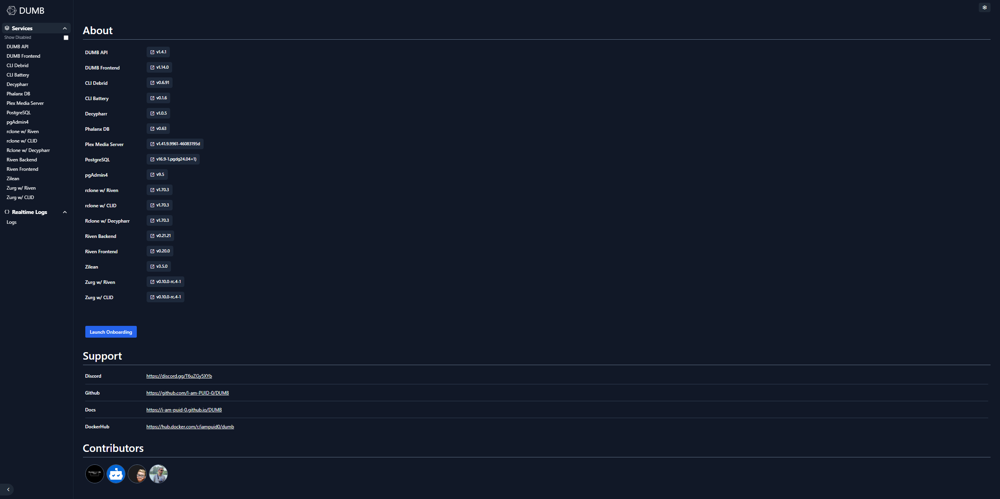

# Settings

The Settings page provides access to configuration options, user management, and system preferences for the DUMB Frontend and backend services.

---

## Overview

The Settings page is organized into sections:

- **Authentication** - Enable/disable auth, manage users
- **Tokens** - API keys and service tokens
- **Embedded UIs** - Service UI toggle
- **Preferences** - UI customization
- **Onboarding** - Reset setup wizard
- **About** - Version and contributor information

### Settings menu

The settings menu also includes quick links for:

- Rerunning onboarding
- Viewing installed versions
- Visiting service maintainer sites
- Jumping to Discord, GitHub, docs, and Docker Hub
- Viewing contributors

---

## About section

### Version information

Displays current versions:

- DUMB Backend version
- DUMB Frontend version
- Individual service versions

### Launch Onboarding

Return to the onboarding wizard to reconfigure your setup:

1. Click **Launch Onboarding**
2. Confirm the action
3. Navigate to `/onboarding` to restart the wizard

!!! warning "Existing configuration"

    Resetting onboarding does not delete existing service configurations. The wizard will apply new settings on top of current ones.

!!! note "Re-enabling previously enabled services"

    If you want onboarding to reselect a non-instance service that is already enabled, set that
    service's `enabled` flag to `false` in `DUMB Config`, `Save to File`, and stop the service first. The
    onboarding flow only re-offers non-instance services when they are disabled in the saved config.

### Skip to optional services

If onboarding was previously completed, you can re-run it to add optional services without reconfiguring core services.

---

## Embedded service UIs

Toggle the embedded service UI feature:

| Setting | Effect |
|---------|--------|
| **Enabled** | Access service UIs through the frontend proxy and Traefik routes |
| **Disabled** | Service UIs only accessible on their native ports |

When enabled, the Settings page shows how many UI-capable services are detected. Service pages include an embedded UI tab, a direct link button, and a full-window toggle for iframes.

---

## Token settings

### Plex token

Your Plex authentication token, used for:

- Library access
- Plex API integration
- Tautulli connection

### GitHub token

Optional GitHub personal access token for:

- Higher API rate limits
- Access to private repositories
- Auto-update functionality

!!! tip "Creating a GitHub token"

    1. Go to GitHub Settings :material-arrow-right: Developer Settings :material-arrow-right: Personal Access Tokens
    2. Create a token with `repo` scope
    3. Paste it in the GitHub Token field

---

## UI preferences

### Log timestamp format

Customize how timestamps appear in the log viewer:

| Option | Description |
|--------|-------------|
| **Date Order** | MDY (US) or DMY (International) |
| **Hour Format** | 12-hour or 24-hour |
| **Zero Padding** | Include leading zeros |

---

## Authentication settings

### Enable/disable authentication

Toggle the authentication requirement for accessing DUMB:

| Setting | Description |
|---------|-------------|
| **Enable Auth** | Require login for all access |
| **Disable Auth** | Allow unauthenticated access |

!!! danger "Security warning"

    Only disable authentication in trusted, isolated environments.

### User management

Manage user accounts when authentication is enabled:

| Action | Description |
|--------|-------------|
| **Add User** | Create a new user account |
| **Disable User** | Temporarily block a user |
| **Enable User** | Re-activate a disabled user |
| **Delete User** | Permanently remove a user |

!!! note "Last user protection"

    The last active user cannot be disabled or deleted to prevent lockout.

---

### Links

Quick access to:

- [GitHub Repository](https://github.com/I-am-PUID-0/DUMB)
- [Discord Community](https://discord.gg/8dqKUBtbp5)
- [Documentation](https://I-am-PUID-0.github.io/DUMB)
- [Docker Hub](https://hub.docker.com/r/iampuid0/dumb)

---

### Contributors

Acknowledgment of project contributors and integrated services.

---

## Related pages

- [Authentication](../features/authentication.md) - Detailed auth guide
- [Dashboard](dashboard.md) - Main service view
- [Onboarding](onboarding.md) - Setup wizard
