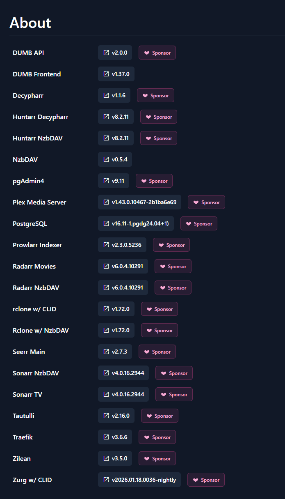
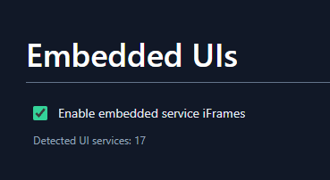
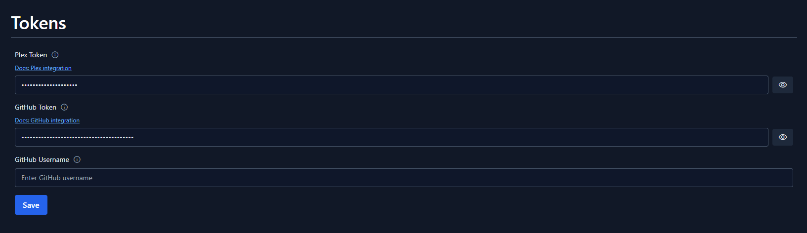
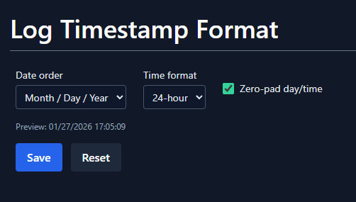
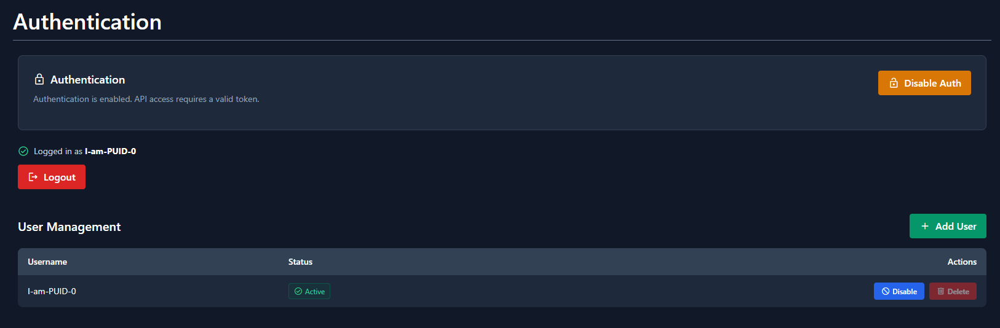
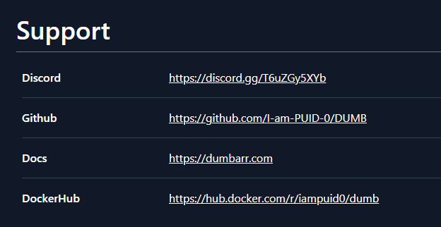

# Settings

The Settings page provides access to configuration options, user management, and system preferences for the DUMB Frontend and backend services.

---

## Overview

The Settings page is organized into sections:

- **Appearance** - Frontend color theme
- **About** - Installed service and frontend versions
- **Onboarding** - Restart the guided setup wizard
- **Embedded UIs** - Service UI toggle
- **Notifications** - Outbound destinations, event routing, thresholds, tests, and delivery history
- **Tokens** - API keys and service tokens
- **Log Timestamp Format** - Date order, clock format, and zero-padding preferences
- **Advanced** - Geek Mode and debug-level UI options
- **Authentication** - Enable or disable auth and manage users when supported
- **Support** - Project community, source, documentation, and image links
- **Contributors** - Project contributor links

Every top-level section can be expanded or collapsed from its heading. Sections start expanded for existing and first-time users, and each browser remembers the open/closed state independently for the next visit. Collapsing a section changes only the page layout; it does not disable, reset, or stop the feature inside it.

### Settings menu

The settings menu also includes quick links for:

- Rerunning onboarding
- Viewing installed versions
- Visiting service maintainer sites
- Jumping to Discord, GitHub, docs, and Docker Hub
- Viewing contributors

## Appearance

Choose **System Default** to follow the browser/operating-system light or dark preference, or select one of the explicit light/dark palettes shown in the theme grid. The choice is stored in browser local storage as `dmbdb.appearance.theme`; it is a per-browser preference and does not modify backend configuration.

---

## About section

### Version information

Displays current versions:

- DUMB Backend version
- DUMB Frontend version
- Individual service versions

{ .shadow }

### Launch Onboarding

Return to the onboarding wizard to reconfigure your setup:

1. Click **Launch Onboarding**
2. Confirm the action
3. Navigate to `/onboarding` to restart the wizard

!!! warning "Existing configuration"

    Resetting onboarding does not delete existing service configurations. The wizard will apply new settings on top of current ones.

!!! note "Re-enabling previously enabled services"

    If you want onboarding to reselect a non-instance service that is already enabled, set that
    service's `enabled` flag to `false` in `DUMB Config`, `Save to File`, and stop the service first. The
    onboarding flow only re-offers non-instance services when they are disabled in the saved config.

### Skip to optional services

If onboarding was previously completed, you can re-run it to add optional services without reconfiguring core services.

---

## Embedded service UIs

Toggle the embedded service UI feature:

| Setting | Effect |
|---------|--------|
| **Enabled** | Access service UIs through the frontend proxy and Traefik routes |
| **Disabled** | Service UIs only accessible on their native ports |

When enabled, the Settings page shows how many UI-capable services are detected. Service pages include an embedded UI tab, a direct link button, and a full-window toggle for iframes.

{ .shadow }

---

## Notifications

The Notifications section appears when the connected backend reports the `notifications` capability. It manages backend-owned outbound notifications independently from browser-local Metrics alert banners.

From this section you can:

- Enable or disable outbound delivery globally
- Configure monitoring, history retention, retry, and persistent-condition thresholds
- Add multiple Apprise or generic webhook destinations
- Route destinations by severity, event type, and one or more currently enabled services selected from a dropdown; disabled template services and unknown names are excluded, and saving pauses if enabled-service discovery is unavailable
- Configure cooldown and recovery behavior
- Save and test an individual destination
- Send a manual operator message
- Review or clear completed delivery history

Saved destination URLs and webhook headers are not returned to the browser. The UI displays whether a secret is configured; leave a blank secret field unchanged to preserve it.

Each event-routing choice shows its runtime severity, trigger, and prerequisites. The section warns when the selected minimum severity filters otherwise-selected events; the default **Warning** minimum excludes normal `Success` events such as a successful Auto-restart. A service-down guidance callout distinguishes unexpected exits from the dashboard's ordinary `Stopped` display and links directly to Auto-restart configuration. Setup/build helper subprocesses are not treated as managed-service exits. Update-available notices are emitted only when a service first enters that state or its available version changes. **Save & test** explains that its one-time test bypasses enable switches and routing filters, while normal manual messages still skip disabled destinations.

The setup screen also explains that Apprise is an embedded DUMB library, not a third-party relay: normal provider URLs are delivered directly from the DUMB container. It identifies `apprise://` and `apprises://` as the explicit Apprise API-server exception and links the official Apprise URL Builder beside the destination controls.

See [Notifications](../features/notifications.md) for provider setup, event behavior, payloads, security guidance, and troubleshooting.

---

## Token settings

### Plex token

Your Plex authentication token, used for:

- Library access
- Plex API integration
- Riven watchlist/library-scan integration when Riven is selected

### GitHub token

Optional GitHub personal access token for:

- Higher API rate limits
- Access to private repositories
- Private/sponsored release sources used by update/install workflows

!!! tip "Creating a GitHub token"

    1. Go to GitHub Settings :material-arrow-right: Developer Settings :material-arrow-right: Personal Access Tokens
    2. Grant only the read access required by the private/sponsored repository. Public release checks normally need no token.
    3. Paste it in the GitHub Token field

{ .shadow }

---

## UI preferences

### Log timestamp format

Customize how timestamps appear in the log viewer:

| Option | Description |
|--------|-------------|
| **Date Order** | MDY (US) or DMY (International) |
| **Hour Format** | 12-hour or 24-hour |
| **Zero Padding** | Include leading zeros |

{ .shadow }

---

## Advanced

### Geek Mode

Enable Geek Mode to reveal additional power-user information across the UI. When enabled:

**Service page header:**

- Displays the internal config key and process name in monospace (e.g. `sonarr:Sonarr`)

**Dependency graph panel:**

- **Copy JSON** button copies the full dependency graph response to clipboard
- **Latency badge** shows the API fetch time in milliseconds
- The **Flow** view shows raw Mermaid graph source text for troubleshooting

**Process Metrics panel** (DUMB Config tab):

- PID, thread count, and process uptime
- CPU usage and memory RSS with color-coded gauges (green < 50%, amber < 80%, red >= 80%)
- Disk I/O read/write totals
- Listening ports and active connection count
- Disk path health: existence check (green/red dot), usage bar with percent
- Container summary: CPU cores, total RAM, used RAM
- Restart history: total count, last exit reason, last restart timestamp
- Refresh button to re-fetch metrics on demand
- A compact **Database Health** subsection for supported services, including provider, pressure score, collection mode, store/WAL size, observed signal count, recommendation, documentation, and a link to the full per-service panel

Geek Mode exposes the Database Health summary but does not automatically enable collection. Database Health remains read-only and opt-in per service.

**Dashboard ServiceCard badges:**

- CPU% badge per service, color-coded by usage level
- Memory RSS badge per service
- Database Health pressure and score badge for services explicitly opted into monitoring, with provider, mode, score, and recommendation in its tooltip
- Metrics polled every 5 seconds while Geek Mode is active

Geek Mode is disabled by default. Toggle it from the **Advanced** section on the Settings page.

---

## Authentication settings

### Enable/disable authentication

Toggle the authentication requirement for accessing DUMB:

| Setting | Description |
|---------|-------------|
| **Enable Auth** | Require login for all access |
| **Disable Auth** | Allow unauthenticated access |

!!! danger "Security warning"

    Only disable authentication in trusted, isolated environments.

{ .shadow }

### User management

Manage user accounts when authentication is enabled:

| Action | Description |
|--------|-------------|
| **Add User** | Create a new user account |
| **Disable User** | Temporarily block a user |
| **Enable User** | Re-activate a disabled user |
| **Delete User** | Permanently remove a user |

!!! note "Last user protection"

    The last active user cannot be disabled or deleted to prevent lockout.

---

### Links

Quick access to:

- [GitHub Repository](https://github.com/I-am-PUID-0/DUMB)
- [Discord Community](https://discord.gg/8dqKUBtbp5)
- [Documentation](https://dumbarr.com)
- [Docker Hub](https://hub.docker.com/r/iampuid0/dumb)

{ .shadow }

---

### Contributors

Acknowledgment of project contributors and integrated services.

{ .shadow }

---

## Related pages

- [Authentication](../features/authentication.md) - Detailed auth guide
- [Dashboard](dashboard.md) - Main service view
- [Onboarding](onboarding.md) - Setup wizard
