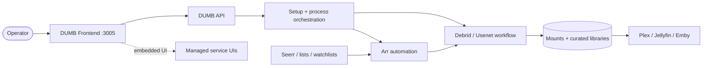

# Getting Started with DUMB

Welcome to **DUMB – Debrid Unlimited Media Bridge**: a unified media management and automation platform designed for users who want to streamline content discovery, acquisition, organization, playback, and service access using Debrid, Usenet, Arrs, media servers, request tools, and embedded service UIs.

---

## What Is DUMB?

DUMB combines multiple backend services into a single containerized system to provide:

- **Search and discovery** using Trakt, Plex watchlists, Seerr, Pulsarr, and other list/request sources.
- **Debrid and Usenet workflows** through services such as Riven, CLI Debrid, Decypharr, NzbDAV, and AltMount.
- **Arr automation** with Sonarr, Radarr, Lidarr, Whisparr, Prowlarr, NeutArr, and Profilarr.
- **Remote mounting and symlink libraries** using rclone, Zurg, and DUMB-managed path conventions.
- **Embedded media servers** with Plex, Jellyfin, and Emby inside the same container.
- **Web-based dashboards** for onboarding, service control, logs, metrics, configuration, updates, and embedded service UIs.
- **Optional access routing** through DUMB Traefik, Traefik Proxy Admin, and Cloudflared.

---

## Is This for You?

DUMB is ideal if you:

- Have a Plex, Jellyfin, or Emby server and want to auto-fill your library from Seerr requests, Trakt, Plex watchlists, MDBList, Listrr, or similar sources
- Want a guided solution that works with Debrid, Usenet, or hybrid workflows
- Prefer a containerized, modular deployment
- Want real-time log viewing, auto-updates, and one-click service control
- Want embedded access to service UIs without exposing every service port
- Want an optional path for protected LAN/public routing through Traefik Proxy Admin and Cloudflare Tunnel
- Don't want or know how to manually configure and deploy all the incorporated [Services](../services/index.md)

---

## Architecture at a Glance

DUMB coordinates the services and their configuration; each upstream service
still owns its application-specific behavior and data. See the
[architecture overview](../architecture/index.md) for the control, storage, and
proxy layers.

!!! note  "For details on each service, visit the [Services Overview](../services/index.md)."

---

## System Requirements

-  Docker or a compatible runtime
-  Linux (recommended) or Windows (WSL)
- A Debrid or Usenet provider, depending on the workflow you choose

---

## What Next?

1. Head to [Installation](installation.md) to get ready.
2. Choose your platform in [Deployment](../deployment/index.md)
3. Learn about [Features](../features/index.md), [Services](../services/index.md), and [Configuration](../features/configuration.md)
