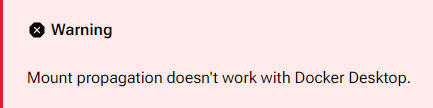

# Installation & Prerequisites

Before you deploy DUMB, make sure your environment and accounts are ready.

---

## System Requirements

- **Docker or Docker-compatible environment**
- Linux system (WSL on Windows when using `rshared`)
- Minimum 2 vCPU, 2GB RAM, SSD recommended

!!! warning "Docker Desktop" 
    Docker Desktop **CANNOT** be used to run DUMB when using `rshared` mount propagation. 

    Docker Desktop does not support the [mount propagation](https://docs.docker.com/storage/bind-mounts/#configure-bind-propagation) required for rclone mounts.

    

    See the [deployment options](https://i-am-puid-0.github.io/DUMB/deployment/wsl) to run DUMB on Windows through WSL2.
---

## Required Credentials

| Service     | Required Info                                 |
|------------------|------------------------------------------|
| Debrid      | API Key (Real-Debrid)                         |
| GitHub      | Token *(if using the sponsored Zurg repo)*    |

 See [Configuration → Integration Tokens](../features/configuration.md#-integration-tokens--credentials)

---

## Required Directories

You’ll need to bind mount the following volumes when running the container:

| Container Mount Path       | Description                                       |
|----------------------------|---------------------------------------------------|
|`/config`                   | Location for configuration files                  |
|`/log`                      | Location for logs                                 |
|`/zurg/RD`                  | Location for Zurg RealDebrid active configuration | 
|`/riven/backend/data`       | Location for Riven Backend data                   |
|`/postgres_data`            | Location for PostgreSQL databases                 |
|`/pgadmin/data`             | Location for pgAdmin 4 data                       |
|`/zilean/app/data`          | Location for Zilean data                          |
|`/plex_debrid/config`       | Location for plex_debrid data                     |
|`/cli_debrid/data`          | Location for cli_debrid data                      |
|`/phalanx_db/data`          | Location for phalanx_db data                      |
|`/decypharr`                | Location for decypharr data                       |
|`/plex`                     | Location for Plex Media Server data               |
|`/mnt/debrid`               | Location for raw debrid files/links and symlinks  |

!!! note "/config"
    If a Zurg config.yml and/or Zurg app is placed here, it will be used to override the default configuration and/or app used at startup

!!! note "/mnt/debrid:rshared"    
    The `:rshared` must be included in order to support [mount propagation](https://docs.docker.com/storage/bind-mounts/#configure-bind-propagation) for rclone to the host when exposing the raw debrid files/links to an external container; e.g., the arrs or a media server.

    `:rshared` is not required when using the default configuration leveraging the internal media server or when not utilizing [Decypharr](../services/core/decypharr.md)
---

## Preparation Checklist

- Choose your deployment method:

    - [Docker](../deployment/docker.md)
    - [Dockge](../deployment/dockge.md)
    - [Portainer](../deployment/portainer.md)
    - [Unraid](../deployment/unraid.md)
    - [WSL](../deployment/wsl.md)
    - [Proxmox](../deployment/proxmox.md)
    - [QNAP](../deployment/qnap.md)
    - [Synology](../deployment/synology.md)
    - [TrueNAS](../deployment/truenas.md)

- Run the container and access the web UI at the configured port
- View real-time or service logs to verify service health

---

## ⏭ Next Steps

-  [Explore Features](../features/index.md)
-  [Tune Your Configuration](../features/configuration.md)
-  [Inspect the Services](../services/index.md)