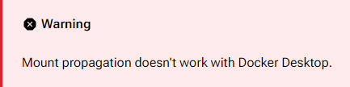

# Installation & Prerequisites

Before you deploy DUMB, make sure your environment and accounts are ready.

---

## System Requirements

- **Docker or Docker-compatible environment**
- Linux system (WSL on Windows when using `rshared`)
- A practical minimum of 2 vCPU and 2 GB RAM for a small stack; source builds, PostgreSQL, media servers, and larger service selections need more
- SSD-backed persistent storage is strongly recommended

!!! warning "Docker Desktop" 
    Docker Desktop cannot support DUMB workflows that require `rshared` mount propagation.

    Docker Desktop does not support the [mount propagation](https://docs.docker.com/storage/bind-mounts/#configure-bind-propagation) required for rclone mounts.

    

    See the [deployment options](https://dumbarr.com/deployment/wsl) to run DUMB on Windows through WSL2.
---

## Required Credentials

| Workflow | Required information |
|---|---|
| Debrid | API key for each selected debrid provider |
| Usenet | NNTP provider host, port, credentials, connections, and TLS choice |
| Plex | Claim/token and server address when the selected workflow needs Plex integration |
| Private/sponsored GitHub source | Read-capable GitHub token only when the repository requires it |
| Cloudflared | Cloudflare Tunnel token when enabling the tunnel connector |

 See [Configuration → Integration Tokens](../features/configuration.md#integration-tokens-credentials)

---

## Required Directories

The maintained Compose layout uses four host mounts:

| Container Mount Path       | Description                                       |
|----------------------------|---------------------------------------------------|
| `/config` | DUMB configuration, authentication data, migration jobs, snapshots, and feature state |
| `/log` | DUMB and collected service logs |
| `/data` | Persistent service data. DUMB maps internal paths such as `/plex`, `/postgres_data`, `/decypharr`, and `/altmount` into service-specific subdirectories here. |
| `/mnt/debrid` | Mounts, generated links, and symlink libraries shared by media workflows |

!!! note "Do not mount every internal service path"
    Current deployments normally persist those paths through `/data`. Separate direct mounts such as `/postgres_data` or `/plex` are legacy/advanced layouts and can prevent DUMB from creating its managed data symlinks. Keep them only when intentionally migrating an existing deployment and verify the service-specific guide.

!!! important "/mnt/debrid:rshared"    
    The `:rshared` must be included in order to support [mount propagation](https://docs.docker.com/storage/bind-mounts/#configure-bind-propagation) for rclone to the host when exposing the raw debrid files/links to an external container; e.g., the arrs or a media server.

    `:rshared` is not required when all consumers remain inside the DUMB container, when no FUSE/rclone submount is used, or when the selected workflow does not need mount propagation. The requirement is based on mount behavior—not on Decypharr alone.
---

## Preparation Checklist

!!! check "Before You Start"
    - Choose your deployment method:

        - [Docker](../deployment/docker.md)
        - [Dockge](../deployment/dockge.md)
        - [Portainer](../deployment/portainer.md)
        - [Unraid](../deployment/unraid.md)
        - [WSL](../deployment/wsl.md)
        - [Proxmox](../deployment/proxmox.md)
        - [QNAP](../deployment/qnap.md)
        - [Synology](../deployment/synology.md)
        - [TrueNAS](../deployment/truenas.md)

    - Run the container and access the web UI at the configured port
    - View real-time or service logs to verify service health

---

## Next Steps

-  [Explore Features](../features/index.md)
-  [Tune Your Configuration](../features/configuration.md)
-  [Inspect the Services](../services/index.md)
