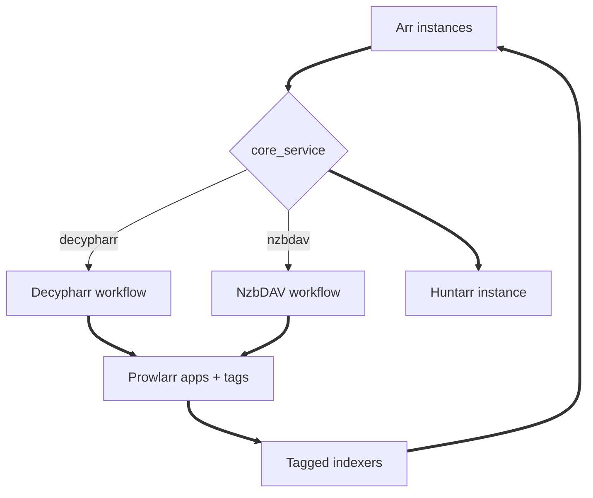

# Core service routing

`core_service` is the flag DUMB uses to route automation between Arrs and the core
download workflows. It keeps Debrid- and Usenet-based stacks isolated while
still allowing multiple instances of the same Arr service.

---

## Where `core_service` is used

| Config block | Purpose |
|-------------|---------|
| Arr instances (`sonarr`, `radarr`, `lidarr`, `whisparr`) | Selects the download workflow(s) to auto-wire. |
| Huntarr instances | Filters which Arr instances are sent to Huntarr. |
| rclone/zurg instances | Labels the instance for the workflow it supports. |

---

## Routing map



---

## Supported values

Use one or more of the core workflow keys:

| Value | Workflow | Typical use |
|-------|----------|-------------|
| `decypharr` | Debrid/torrent workflow | Decypharr + Debrid indexers |
| `nzbdav` | Usenet workflow | NzbDAV + Usenet indexers |

Leave `core_service` empty if you do not want DUMB to auto-wire a service into a
workflow. To combine workflows, set `core_service` to a list or use a
comma-separated string.

---

## What DUMB does with it

When `core_service` is set on an Arr instance, DUMB:

- Configures matching download clients (Decypharr and/or NzbDAV).
- Adds or updates Arr root folders and permissions for each workflow.
- Creates Prowlarr apps tagged with the same core service(s) so indexers sync
  only to the intended Arrs.

When `core_service` includes both `decypharr` and `nzbdav`, DUMB uses a shared
root folder base at `/mnt/debrid/combined_symlinks/<slug>` for the Arr instance.

When `core_service` is set on a Huntarr instance, DUMB:

- Sends Arr instances whose core services overlap the Huntarr instance.

---

## Example: split Debrid and Usenet workflows

```json
"radarr": {
  "instances": {
    "Debrid": {
      "enabled": true,
      "core_service": "decypharr",
      "use_huntarr": true,
      "port": 7878
    },
    "Usenet": {
      "enabled": true,
      "core_service": "nzbdav",
      "use_huntarr": false,
      "port": 7879
    }
  }
}
```

In this layout:

- The Debrid Radarr instance syncs with Decypharr and Debrid indexers.
- The Usenet Radarr instance syncs with NzbDAV and Usenet indexers.
- Huntarr only receives the Debrid instance because `use_huntarr` is set there.

## Example: combine workflows on one Arr instance

```json
"sonarr": {
  "instances": {
    "Combined": {
      "core_service": ["decypharr", "nzbdav"],
      "use_huntarr": true
    }
  }
}
```

In this layout, DUMB wires both Decypharr and NzbDAV download clients and root
folders for the same Sonarr instance.

---

## Related references

- [Multi-instance setup](instances.md)
- [Prowlarr](../services/core/prowlarr.md)
- [Huntarr](../services/core/huntarr.md)
