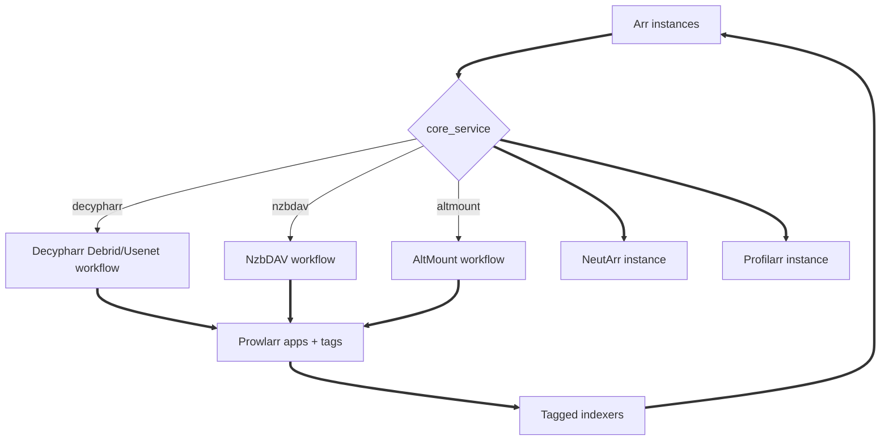

# Core service routing

`core_service` is the flag DUMB uses to route automation between Arrs and the core
download workflows. It keeps Debrid- and Usenet-based stacks isolated while
still allowing multiple instances of the same Arr service.

---

## Where `core_service` is used

| Config block | Purpose |
|-------------|---------|
| Arr instances (`sonarr`, `radarr`, `lidarr`, `whisparr`) | Selects the download workflow(s) to auto-wire. |
| NeutArr instances | Filters which Arr instances are sent to NeutArr. |
| Profilarr instances | Filters which Arr instances are auto-linked to Profilarr. |
| rclone/zurg instances | Labels the instance for the workflow it supports. |

---

## Routing map


```mermaid
%%{ init: { "flowchart": { "curve": "basis" } } }%%
flowchart TD
    ARR[Arr instances]
    CS{core_service}
    DEC[Decypharr Debrid/Usenet workflow]
    NZB[NzbDAV workflow]
    ALT[AltMount workflow]
    PROWLARR[Prowlarr apps + tags]
    IDX[Tagged indexers]
    NEUTARR[NeutArr instance]
    PROFILARR[Profilarr instance]

    ARR ==> CS
    CS -- decypharr --> DEC
    CS -- nzbdav --> NZB
    CS -- altmount --> ALT
    DEC ==> PROWLARR
    NZB ==> PROWLARR
    ALT ==> PROWLARR
    PROWLARR ==> IDX
    IDX ==> ARR
    CS ==> NEUTARR
    CS ==> PROFILARR
```

---

## Supported values

Use one or more of the core workflow keys:

| Value | Workflow | Typical use |
|-------|----------|-------------|
| `decypharr` | Debrid and/or Usenet workflow | Decypharr torrent and Sabnzbd-compatible Arr clients |
| `nzbdav` | Usenet workflow | NzbDAV + Usenet indexers |
| `altmount` | Usenet workflow | AltMount SABnzbd-compatible client + Usenet indexers |

Leave `core_service` empty if you do not want DUMB to auto-wire a service into a
workflow. To combine workflows, set `core_service` to a list or use a
comma-separated string.

---

## What DUMB does with it

When `core_service` is set on an Arr instance, DUMB:

- Configures matching download clients (Decypharr, NzbDAV, and/or AltMount).
- Adds or updates Arr root folders and permissions where that workflow's setup
  hook owns them. AltMount configures the download-client connection but leaves
  its import strategy and Arr root folders operator-managed.
- Creates Prowlarr apps tagged with the same core service(s) so indexers sync
  only to the intended Arrs.

When `core_service` combines Decypharr with NzbDAV or AltMount, DUMB uses the
shared `/mnt/debrid/combined_symlinks/<slug>` base for the Decypharr-owned Arr
root. NzbDAV without Decypharr keeps its NzbDAV symlink root, and AltMount does
not independently rewrite the Arr root folder.

When `core_service` is set on a NeutArr instance, DUMB:

- Sends Arr instances whose core services overlap the NeutArr instance.

When `core_service` is set on a Profilarr instance, DUMB:

- Auto-links only Arr instances whose core services overlap the Profilarr instance.
- Seeds profile/custom format/regex/media-management sync for those Arr instances (when `use_profilarr` is enabled on the Arr).

---

## Example: split Debrid and Usenet workflows

```json
"radarr": {
  "instances": {
    "Debrid": {
      "enabled": true,
      "core_service": "decypharr",
      "use_neutarr": true,
      "use_profilarr": true,
      "port": 7878
    },
    "Usenet": {
      "enabled": true,
      "core_service": "nzbdav",
      "use_neutarr": false,
      "use_profilarr": false,
      "port": 7879
    }
  }
}
```

In this layout:

- The Debrid Radarr instance syncs with Decypharr and Debrid indexers.
- The Usenet Radarr instance can sync with Decypharr, NzbDAV, AltMount, or any selected Usenet workflow service.
- NeutArr only receives the Debrid instance because `use_neutarr` is set there.
- Profilarr only links the Debrid instance because `use_profilarr` is set there.

## Example: combine workflows on one Arr instance

```json
"sonarr": {
  "instances": {
    "Combined": {
      "core_service": ["decypharr", "nzbdav", "altmount"],
      "use_neutarr": true,
      "use_profilarr": true
    }
  }
}
```

In this layout, DUMB wires Decypharr, NzbDAV, and AltMount download clients for
the same Sonarr instance. Decypharr and NzbDAV coordinate the DUMB-managed
combined root; AltMount's import strategy and compatible Arr paths still need
to be reviewed in AltMount.

---

## Related references

- [Multi-instance setup](instances.md)
- [Prowlarr](../services/core/prowlarr.md)
- [NeutArr](../services/core/neutarr.md)
