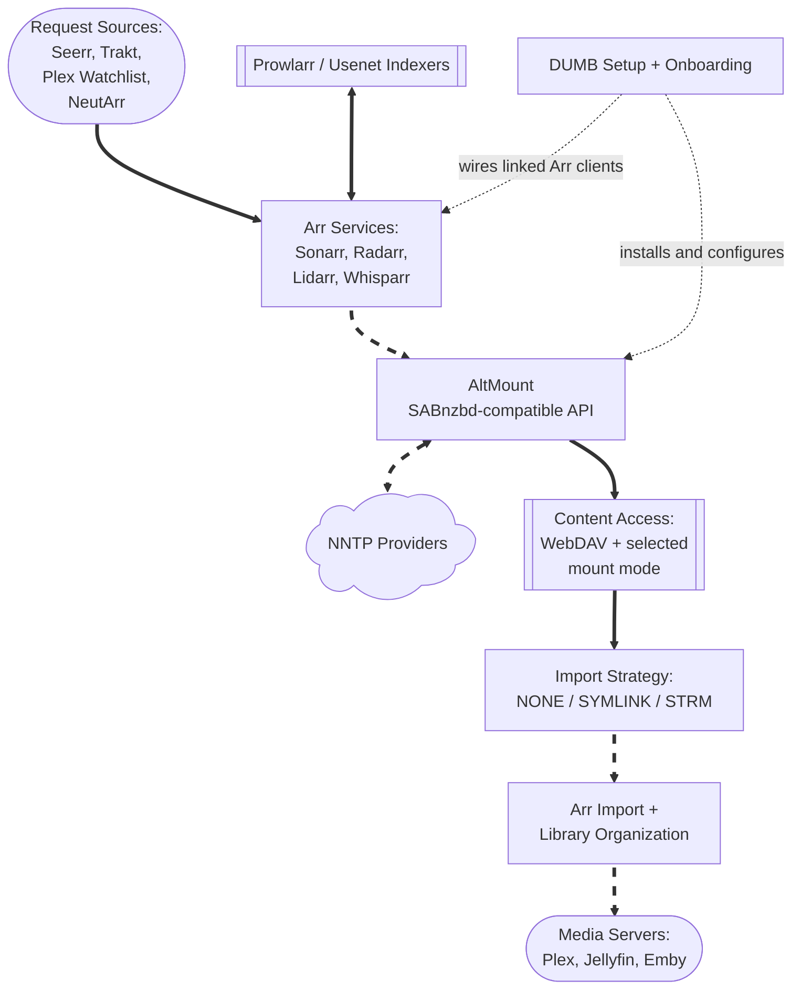

# AltMount (Core Service)

**AltMount** is a Usenet-backed WebDAV and streaming service. It accepts NZBs from Arr applications through a SABnzbd-compatible API, reads content from one or more NNTP providers, and makes that content available through WebDAV, a built-in FUSE or rclone mount, symlinks, or STRM files.

In DUMB, AltMount is a core Usenet workflow service. DUMB installs and starts AltMount, supplies its baseline configuration, embeds its UI, and connects enabled Sonarr, Radarr, Lidarr, and Whisparr instances whose `core_service` includes `altmount`.

---

## Workflow diagram



The dashed arrows are DUMB automation. The solid arrows are the normal request and media flow after setup.

---

## Service relationships

| Classification | Role |
|----------------|------|
| Core Service | Usenet WebDAV, streaming, and Arr download-client workflow |
| DUMB Dependencies | None by default; PostgreSQL is enabled only for an optional database cutover |
| External Requirement | At least one usable NNTP provider account |
| Integrates With | Sonarr, Radarr, Lidarr, Whisparr, Prowlarr, request services, and media servers |
| Exposes UI | Yes, on the configured AltMount port and through DUMB's embedded UI |

`external_rclone` does **not** create or start a DUMB-managed [rclone](../dependent/rclone.md) instance. In that mode AltMount exposes its rclone RC service, while you remain responsible for the external mount process.

---

## What AltMount provides

- A modern web UI and API for configuration, queue visibility, and health monitoring
- WebDAV access and range-based streaming directly from Usenet
- A SABnzbd-compatible download-client API for Arr applications
- Multiple NNTP providers with load distribution and failover
- Transparent handling of NZB content and supported archive formats
- `NONE`, `SYMLINK`, and `STRM` import strategies
- Built-in FUSE and rclone mount modes, plus an external-rclone mode
- Local metadata with optional SQLite-to-PostgreSQL migration through DUMB

AltMount owns the media-processing behavior. DUMB supplies the service lifecycle and integration around it.

## What DUMB manages

| DUMB manages | You manage in AltMount |
|--------------|------------------------|
| Downloads the architecture-specific release binary and records its version | Initial AltMount administrator registration |
| Creates the config, metadata, logs, rclone, and mount directories | NNTP provider hostnames, credentials, connection limits, and TLS settings |
| Generates `JWT_SECRET` and `ALTMOUNT_API_KEY` when missing | WebDAV credentials and any public/reverse-proxy cookie-domain changes |
| Maps DUMB's mount choice into AltMount's native `mount_type` | Import strategy, import directory, streaming cache, health monitoring, and advanced provider behavior |
| Enables SABnzbd compatibility and adds standard media categories | Arr root folders, media-server library paths, and validation of the complete import path |
| Adds linked Arr instances to AltMount and adds AltMount as their download client | Optional AltMount webhooks and any tuning beyond DUMB's baseline |
| Proxies the root-style web application into the service page | AltMount user accounts and application-level access policy |

!!! important "DUMB preserves most AltMount settings, but some fields are authoritative"

    DUMB creates `/altmount/config.yaml` only when the file is missing. On later setup or restart passes, it preserves providers and other AltMount-owned settings while synchronizing the DUMB-managed mount path/type, rclone mode, API prefix/key, SABnzbd enablement/categories, and Arr integration structure.

## Default port and URLs

| Endpoint | Default | Purpose |
|----------|---------|---------|
| Native listener | `8088` | AltMount web UI, WebDAV, SABnzbd-compatible API, and application API |
| Health probe | `http://127.0.0.1:8088/live` | Used by DUMB while completing post-start Arr integration |
| DUMB embedded route | `/service/ui/altmount` | Traefik-backed service UI route |
| Frontend iframe route | `/ui/altmount` | Internal dmbdb iframe/proxy context; open it from the AltMount service page |

The native port is inside the DUMB container. It is directly reachable from the host only if your deployment publishes or otherwise exposes it.

## Configuration in `dumb_config.json`

The current default block is:

```json
"altmount": {
  "enabled": false,
  "postgres_enabled": false,
  "postgres_database": "",
  "process_name": "AltMount",
  "repo_owner": "javi11",
  "repo_name": "altmount",
  "pinned_version": "latest",
  "suppress_logging": false,
  "log_level": "INFO",
  "port": 8088,
  "auto_update": false,
  "auto_update_interval": 24,
  "auto_update_start_time": "04:00",
  "mount_type": "rclone",
  "config_dir": "/altmount",
  "config_file": "/altmount/config.yaml",
  "metadata_dir": "/altmount/metadata",
  "mount_path": "/mnt/debrid/altmount",
  "log_file": "/altmount/logs/altmount.log",
  "command": [
    "/altmount/altmount",
    "serve",
    "--config",
    "/altmount/config.yaml"
  ],
  "env": {
    "PUID": "{puid}",
    "PGID": "{pgid}",
    "PORT": "{port}",
    "JWT_SECRET": "",
    "COOKIE_DOMAIN": "localhost",
    "ALTMOUNT_API_KEY": ""
  }
}
```

### Important fields

- `enabled`: Starts AltMount under DUMB's process manager.
- `pinned_version`: Uses the latest upstream release or a specific release tag. DUMB installs the matching architecture-specific `altmount-cli` asset.
- `port`: Sets the native AltMount listener and is copied into `env.PORT`.
- `mount_type`: Selects DUMB's operator-facing mount mode.
- `mount_path`: Shared path where the selected internal mount is exposed; DUMB synchronizes this into AltMount's root-level configuration.
- `config_dir`, `config_file`, `metadata_dir`, `log_file`: Persistent paths managed by DUMB.
- `auto_update`, `auto_update_interval`, `auto_update_start_time`: Use DUMB's normal update scheduler.
- `postgres_enabled`, `postgres_database`: Select the optional PostgreSQL backend after completing the guarded migration workflow.
- `env.JWT_SECRET`, `env.ALTMOUNT_API_KEY`: Generated and saved by DUMB when blank. Treat both as secrets.
- `env.COOKIE_DOMAIN`: Defaults to `localhost`; change it only when your direct or reverse-proxied AltMount access model requires another cookie domain.

`command`, `PUID`, `PGID`, and `PORT` are reconciled by setup. Avoid treating them as independent AltMount UI settings.

## Mount modes

| DUMB value | AltMount value | Behavior |
|------------|----------------|----------|
| `dfs` | `fuse` | AltMount's native FUSE mount at `mount_path` |
| `rclone` | `rclone` | Default; AltMount starts its built-in rclone mount and RC service |
| `external_rclone` | `rclone_external` | AltMount starts the RC service but does not mount; you provide the external rclone process |
| `none` | `none` | AltMount does not start a FUSE or rclone mount; WebDAV remains available |

DUMB creates `/mnt/debrid/altmount` by default and normalizes its ownership. During an install/update pass, DUMB also unmounts a stale FUSE mount at that exact path before replacing the AltMount binary. A non-FUSE mount is preserved rather than removed automatically.

!!! note "Mount mode and import strategy are different decisions"

    `mount_type` controls how AltMount content becomes visible as a filesystem. The AltMount-owned import strategy controls what Arr imports from that content.

## Import strategy and library paths

Configure the import strategy in **AltMount → Configuration → Import**:

| Strategy | Behavior | Typical use |
|----------|----------|-------------|
| `NONE` | Arr reads directly from the mounted content | Simplest direct-mount workflow |
| `SYMLINK` | AltMount creates category-based links in an import directory | Upstream's recommended choice for most Arr workflows |
| `STRM` | AltMount writes `.strm` files that point to WebDAV URLs | Common with Emby/Jellyfin or URL-based playback |

DUMB does not currently choose the import strategy, create its `import_dir`, or set Arr root folders/media-server libraries for AltMount. Keep every path inside the shared DUMB namespace—normally under `/mnt/debrid`—and make sure AltMount, the linked Arr, and the media server all see the same container path.

For `SYMLINK` or `STRM`, create and validate the chosen import directory before sending a real release. For `NONE`, confirm the linked Arr can browse the mounted category path under `/mnt/debrid/altmount`.

See AltMount's [ARR integration guide](https://altmount.kipsilabs.top/docs/Configuration/integration/) for the application-level import and webhook options.

## DUMB-to-AltMount Arr integration

For an enabled Sonarr, Radarr, Lidarr, or Whisparr instance, set:

```json
"core_service": "altmount"
```

For a shared Arr instance that uses several workflow services, use a list or the equivalent comma-separated UI selection:

```json
"core_service": ["decypharr", "nzbdav", "altmount"]
```

During guided onboarding, DUMB then:

1. Installs/configures AltMount and generates its internal secrets if needed.
2. Starts the selected Arr services and AltMount.
3. Reads each linked Arr API key from its application config.
4. Upserts the Arr instance URL/API key into AltMount's `arrs` section.
5. Enables AltMount's SABnzbd-compatible API and standard categories (`movies`, `tv`, `music`, and `adult`).
6. Creates or updates an `altmount` SABnzbd download client in each linked Arr with the matching category.

The integration is scoped by `core_service`; DUMB does not add every enabled Arr automatically. Existing AltMount Arr entries are updated by name or URL rather than replaced wholesale.

!!! warning "Finish the AltMount-owned setup"

    DUMB intentionally leaves `providers` empty. Add at least one NNTP provider, choose and validate the import strategy, confirm the Arr root/import paths, and test playback before relying on automation.

## First-start checklist

1. Select **AltMount** as the Usenet workflow in guided onboarding, then choose its mount mode.
2. Open AltMount from the DUMB service page and create the first AltMount administrator account.
3. Replace the generated first-run WebDAV credentials (`usenet` / `usenet`) before exposing the endpoint outside a trusted network.
4. Add and test at least one TLS-enabled NNTP provider in AltMount.
5. Review the DUMB-selected mount type/path in AltMount's Mount settings.
6. Choose `NONE`, `SYMLINK`, or `STRM` and configure any required import directory.
7. Verify the linked Arr instances and their `altmount` download clients.
8. Send a small test NZB and confirm queue, import, library scan, and playback behavior end to end.

## PostgreSQL migration

AltMount supports SQLite and PostgreSQL. New/default installs use `/altmount/altmount.db`.

For an existing SQLite-backed service, open **Database Migration** on the AltMount service page, run a rehearsal, validate the imported table counts against AltMount's application-created PostgreSQL schema, and only then run cutover. DUMB writes the PostgreSQL DSN into `/altmount/config.yaml`, registers the target database (`altmount` by default), and retains the SQLite file and migration backups for rollback.

Do not enable `postgres_enabled` directly when existing data must be retained. DUMB has not found an upstream application-specific data migration tool, so the guarded DUMB workflow and post-cutover application checks are important. See [SQLite to PostgreSQL Migration](../../features/arr-postgres-migration.md).

!!! info "AltMount v0.3.2 migration compatibility"

    AltMount `v0.3.2` contains invalid PostgreSQL syntax in its bundled migration 10 expression index. DUMB applies the intended index only in an isolated staging database whose latest Goose version is exactly 9 and which contains the expected `import_queue.metadata` column. Any mismatch refuses the repair and restores SQLite instead of skipping unknown schema work.

## Files and persistence

| Path | Purpose |
|------|---------|
| `/altmount/altmount` | DUMB-installed release binary |
| `/altmount/config.yaml` | AltMount runtime configuration, including provider credentials |
| `/altmount/altmount.db` | Default SQLite database |
| `/altmount/metadata` | NZB metadata root |
| `/altmount/rclone` | AltMount's managed rclone files/state |
| `/altmount/logs/altmount.log` | AltMount application log |
| `/altmount/version.txt` | DUMB-managed installed-version marker |
| `/mnt/debrid/altmount` | Default selected mount path |

In the maintained Compose layout, back up `/data/altmount` (the persistence target behind internal `/altmount`) as sensitive application data. It can contain NNTP credentials, API keys, user data, and the SQLite database.

## Embedded UI behavior

AltMount is a root-route React-style application. dmbdb keeps its root navigation and root `/api/*` calls in the AltMount iframe context so they do not collide with DUMB's own application or API routes. Open the UI from the AltMount service page rather than browsing directly to `/ui/altmount`.

If the embedded UI loses routing context, reload the DUMB service page. The direct Traefik-backed route is `/service/ui/altmount` when embedded service UIs are enabled.

## Troubleshooting

### AltMount does not start

- Check the DUMB service log and `/altmount/logs/altmount.log`.
- Confirm `/altmount/altmount` exists and is executable.
- Verify the configured port is free and `/altmount/config.yaml` is valid YAML.
- For FUSE/rclone modes, check whether `/mnt/debrid/altmount` is a stale, dangling, read-only, or busy mount path.

### Provider or streaming failures

- Confirm at least one provider is enabled and its credentials, TLS mode, and connection limit are valid.
- Do not allocate more combined connections than the provider account permits.
- Review AltMount's queue and health pages for missing articles, masked files, or cache pressure.

### Arr download-client setup is missing

- Confirm the Arr instance is enabled and `core_service` includes `altmount`.
- Confirm DUMB can read the Arr API key and AltMount's generated `ALTMOUNT_API_KEY` is still present.
- Verify both services are running, then restart AltMount or rerun the guided start so DUMB can repeat the integration pass.
- Check that the Arr category matches the DUMB defaults for its application type.

### Import completes but the library cannot see the file

- Confirm `mount_path`, the AltMount `import_dir`, the Arr root folder, and the media-server library use paths visible inside the DUMB container.
- For `SYMLINK`, inspect the link target from inside the container and verify it remains under a shared path.
- For `STRM`, confirm the WebDAV URL written into the file is reachable by the player.
- Use Arr Manual Import to separate path visibility problems from download-client problems.

### Embedded UI/API requests open DUMB instead of AltMount

- Reopen the AltMount service page and reload the iframe to refresh `dumb_ui_service` context.
- Verify embedded service UIs are enabled and `/service/ui/altmount` responds.
- Check dmbdb proxy logs for root-route or `/api/*` routing errors.

## Related links

- [AltMount documentation](https://altmount.kipsilabs.top/)
- [AltMount getting started](https://altmount.kipsilabs.top/docs/intro/)
- [AltMount ARR integration](https://altmount.kipsilabs.top/docs/Configuration/integration/)
- [AltMount streaming configuration](https://altmount.kipsilabs.top/docs/Configuration/streaming/)
- [AltMount repository](https://github.com/javi11/altmount)
- [Core-service routing](../../reference/core-service.md)
- [NzbDAV](nzbdav.md)
- [Decypharr](decypharr.md)
