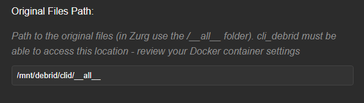

# CLI Debrid (Core Service)

**CLI Debrid** is a core content orchestrator in the DUMB ecosystem. It automates media collection and upgrading through Debrid services (e.g. Real-Debrid), working alongside Trakt, Plex, Seerr, and various scrapers. CLI Debrid can either monitor your Plex libraries or generate symlinks for organized media delivery to Plex or similar servers.

---

## Service Relationships

| Classification | Role                                                                                                       |
| -------------- | ---------------------------------------------------------------------------------------------------------- |
| Core Service   | Debrid Orchestrator                                                                                        |
| Depends On     | [CLI Battery](../dependent/cli-battery.md), [rclone](../dependent/rclone.md), [Zurg](../dependent/zurg.md) |
| Optional       | [Phalanx DB](../dependent/phalanx-db.md), [Zilean](../optional/zilean.md)                                  |
| Exposes UI     | Yes (Flask app on port 5000)                                                                               |

---

## Configuration in `dumb_config.json`

```json
"cli_debrid": {
    "enabled": false,
    "process_name": "CLI Debrid",
    "repo_owner": "godver3",
    "repo_name": "cli_debrid",
    "release_version_enabled": false,
    "release_version": "v0.6.07",
    "branch_enabled": false,
    "branch": "main",
    "suppress_logging": false,
    "log_level": "INFO",
    "port": 5000,
    "auto_update": false,
    "auto_update_interval": 24,
    "clear_on_update": true,
    "exclude_dirs": [
        "/cli_debrid/data"
    ],
    "platforms": [
        "python"
    ],
    "command": [
        "/cli_debrid/venv/bin/python",
        "main.py"
    ],
    "config_dir": "/cli_debrid",
    "config_file": "/cli_debrid/data/config/config.json",
    "log_file": "/cli_debrid/data/logs/debug.log",
    "env": {
        "USER_CONFIG": "/cli_debrid/data/config/",
        "USER_LOGS": "/cli_debrid/data/logs/",
        "USER_DB_CONTENT": "/cli_debrid/data/db_content/",
        "CLI_DEBRID_PORT": "{port}"
    }
},
```

### Key Configuration Fields

* `enabled`: Toggle to run CLI Debrid via DUMB.
* `process_name`: Used for display and logs.
* `repo_owner`, `repo_name`: GitHub repo to use for updates.
* `release_version_enabled`, `branch_enabled`: Target a specific tag or branch.
* `log_level`, `suppress_logging`: Logging controls.
* `port`: Flask web interface port.
* `env`: Environment variable configuration used by CLI Debrid.
* `clear_on_update`, `exclude_dirs`: Clean old files during update while protecting data dirs.

---

## What CLI Debrid Does

### Intelligent Automation

* Monitors your Plex library or local folder structure (symlinked library)
* Scrapes for content from various sources (Zilean, Jackett, Torrentio, Nyaa, Media Fusion)
* Downloads new or upgraded content using Debrid providers
* Optionally leverages webhook notifications from Seerr or Zurg to trigger updates

### Supported Features

* Content Sources: MDBList, Trakt, Seerr
* Upgrading: Queue system for quality upgrades
* Web UI: Web dashboard for real-time monitoring and control
* Metadata: Cached locally in the `cli_battery`
* Notifications: Optional support for Discord, Email, Telegram, NTFY
* Scraping Tuning: Manual test interface to evaluate scraper priorities


---

## Required Component: CLI Battery

!!! warning "CLI Battery must be running for CLI Debrid to function."

```json
"cli_battery": {
    "enabled": false,
    "process_name": "CLI Battery",
    "suppress_logging": false,
    "log_level": "INFO",
    "port": 5001,
    "platforms": [
        "python"
    ],
    "command": [
        "/cli_debrid/venv/bin/python",
        "cli_battery/main.py"
    ],
    "config_dir": "/cli_debrid",
    "config_file": "/cli_debrid/data/config/settings.json",
    "log_file": "/cli_debrid/data/logs/battery_debug.log",
    "env": {
        "PYTHONPATH": "/cli_debrid",
        "USER_CONFIG": "/cli_debrid/data/config/",
        "USER_LOGS": "/cli_debrid/data/logs/",
        "USER_DB_CONTENT": "/cli_debrid/data/db_content/",
        "CLI_DEBRID_BATTERY_PORT": "{port}"
    }
},
```

CLI Battery provides local metadata storage and Trakt integration, acting as the "memory" of CLI Debrid.


---

## Optional Utility: Phalanx DB

```json
"phalanx_db": {
    "enabled": false,
    "process_name": "Phalanx DB",
    "repo_owner": "godver3",
    "repo_name": "phalanx_db_hyperswarm",
    "release_version_enabled": false,
    "release_version": "v0.50",
    "branch_enabled": false,
    "branch": "main",
    "suppress_logging": false,
    "log_level": "INFO",
    "port": 8888,
    "auto_update": false,
    "auto_update_interval": 24,
    "clear_on_update": true,
    "exclude_dirs": [
        "/phalanx_db/data"
    ],
    "platforms": [
        "pnpm"
    ],
    "command": [
        "node",
        "phalanx_db_rest.js"
    ],
    "config_dir": "/phalanx_db",
    "env": {}
},
```
!!! note "While listed as optional, the onboarding process will treat it as a dependent service and enable it by default. You can disable it from the [DUMB Frontend](../dumb/dumb-frontend.md) if desired"


Phalanx DB provides distributed metadata storage via Hyperswarm. It is optional but can enhance metadata resilience and syncing.

---

## Mount Considerations

CLI Debrid can create symlinks to be used in the media server, or if using the rclone mounts directly in the media server it can monitor the Plex libraries for completed items.

In both cases, ensure the appropriate path for the rclone or zurg mount is used when adding the `Original Files Path`.

!!! note "Original Files Path"
    The `Original Files Path` is relative to the paths inside the container.

    Example: As default when configured with the onboarding process, the rclone `mount_dir` is set to `/mnt/debrid`, the rclone `mount_name` is set to `clid`, and it is using `zurg_enabled: true` for rclone, then the path should be:  

    

As mentioned, CLI Debrid also monitors either the created symlinks or the Plex libraries for completed items.

As such, it's important to ensure you select the appropriate option for your deployment.

!!! tip "Collection Mode Selection"
    `Symlinked/Local` will create symlinks in the user defined path, whereas `Plex` will monitor the Plex Libraries defined and not create symlinks.

    
    


---

## Plex Media Server Built-in!

With [Plex Media Server](plex-media-server.md) enabled in DUMB, you can also leverage it with CLI Debrid.

As shown below, if you select to "Sign in to Plex" during the CLI Debrid onboarding, it will allow you to select the local instance of [Plex Media Server](plex-media-server.md).

!!! note "Plex Media Server Requirement"
    [Plex Media Server](plex-media-server.md) must be configured and running in DUMB before it will appear in the list of available servers.


Signing into Plex and selecting the DUMB [Plex Media Server](plex-media-server.md) will pre-populate the "Plex URL" and "Plex Token" within the CLI Debrid onboarding. 

!!! warning "Plex URL Configuration"
    However, note that it sets the "Plex URL" as the DUMB docker container's IP Address:

    

    This may cause issues if the address changes for the container, so it is suggested to change the "Plex URL" as shown below:

    

---
## Zilean Built-in!

With [Zilean](../optional/zilean.md) enabled in DUMB, you can also leverage it with CLI Debrid


## Queues & Processing (Behind the Scenes)

* **Wanted Queue**: Items identified from your lists that need to be downloaded but haven't been processed by the scraper yet. Shows the time the item was last scraped. If within 24 hours of scraping items will remain in the Wanted queue.
* **Scraping Queue**: Items actively being searched for download sources (torrents/magnets).
* **Adding Queue**: Items for which a source has been found and are being added to your debrid service
* **Checking Queue**: Monitoring items for presence locally or in Plex. 

    * **Cached**: Available in debrid cache and ready to use. 

    * **Downloading**: Currently being downloaded with progress shown; grouped if multiple files. 

    * **Filenames**: Can be toggled to show specific files being processed

* **Unreleased**: Items identified but waiting for their release date before processing continues. Displays the relevant release date(s). Items requiring a physical release will indicate this.
* **Blacklisting**: Items that have been explicitly marked to be ignored by the application.
* **Upgrading Queue**: Items that are being considered for Upgrading. They have been collected and now for 24 hours cli_debrid will try to find upgrades once an hour.
* **Final Check**: Items for which initial scraping attempts failed. These items wait for a configured delay (defined in settings) before one last search attempt is automatically triggered. Shows when the item entered this waiting period. If the final search is successful, the item moves to Adding. If it fails again, the item is typically moved to Blacklisted.
* **Pending Uncached**: Items associated with uncached torrents that would take your account over its limit wait in the Pending Uncached queue until your download limit returns to normal.
* **Sleeping Queue**: Items that cli_debrid failed to find. Shows a 'Wake Count' indicating how many times the item has been retried.

All queues are managed on scheduled intervals.

---

## Webhook Support

CLI Debrid can listen for:

* **Seerr Webhooks**: Add content when users request it
* **Zurg Webhooks**: React to completed downloads (Symlink mode)

Example Zurg update hook:

```bash
#!/bin/bash
webhook_url="http://localhost:5000/webhook/rclone"
for arg in "$@"
do
  encoded=$(echo -n "$arg" | python3 -c "import sys, urllib.parse as ul; print(ul.quote(sys.stdin.read()))")
  curl -s -X GET "$webhook_url?file=$encoded"
done
echo "Webhook update complete."
```

## Branch / Version Targeting
You can control which version or branch is deployed by setting:

- `branch_enabled: true` and specifying a `branch`
- or `release_version_enabled: true` and specifying a `release_version`

---

## Access

- Navigate to: `http://<host>:<port>` 

- default port `5000`

---


---

## Additional Resources

* [CLI Debrid GitHub](https://github.com/godver3/cli_debrid)
* [CLI Battery GitHub](https://github.com/godver3/cli_debrid/tree/main/cli_battery)
* [Phalanx DB GitHub](https://github.com/godver3/phalanx_db_hyperswarm)
* [Join the CLI Debrid Community on Discord](https://discord.gg/jAmqZJCZJ4)
