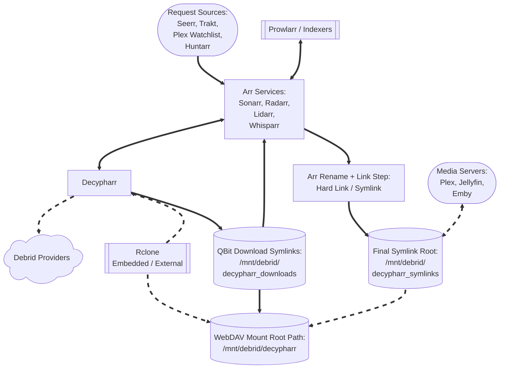

# Decypharr (Core Service)

**Decypharr** is a self-hosted, Go-based torrent manager and content orchestrator that integrates multiple Debrid services and acts as a mock qBittorrent client for Arr applications like Sonarr and Radarr. It is a core component in DUMB for automating torrent-based downloads with native Debrid support and seamless library linking.

---

## Workflow diagram



---

## Service Relationships

| Classification | Role                                                           |
| -------------- | -------------------------------------------------------------- |
| Core Service   | Debrid Torrent Orchestrator                                    |
| Depends On     | [rclone](../dependent/rclone.md)                               |
| Optional       | Sonarr, Radarr, Lidarr, Whisparr, Prowlarr, Huntarr            |
| Exposes UI     | Yes (Web UI)                                                   |


---

## Configuration in `dumb_config.json`

```json
"decypharr": {
    "enabled": false,
    "process_name": "Decypharr",
    "repo_owner": "sirrobot01",
    "repo_name": "decypharr",
    "release_version_enabled": false,
    "release_version": "v1.0.0",
    "branch_enabled": false,
    "branch": "main",
    "suppress_logging": false,
    "log_level": "INFO",
    "port": 8282,
    "auto_update": false,
    "auto_update_interval": 24,
    "clear_on_update": false,
    "exclude_dirs": [],
    "command": [
        "/decypharr/decypharr",
        "--config",
        "/decypharr"
    ],
    "config_dir": "/decypharr",
    "config_file": "/decypharr/config.json",
    "log_file": "/decypharr/logs/decypharr.log",
    "env": {},
    "use_embedded_rclone": true,
    "api_keys": {}
},
```

### Key Configuration Fields

* `enabled`: Toggle to run Decypharr via DUMB.
* `process_name`: Used for display and logs.
* `repo_owner`, `repo_name`: GitHub repo to use for updates.
* `release_version_enabled`, `branch_enabled`: Target a specific tag or branch.
* `log_level`, `suppress_logging`: Logging controls.
* `port`: Web UI port.
* `env`: Environment variables passed to Decypharr.
* `use_embedded_rclone`: Enable the embedded rclone integration (recommended).
* `api_keys`: Per-provider API keys used by Decypharr (embedded mode).
* `clear_on_update`, `exclude_dirs`: Clean old files during update while protecting data dirs.

---

## What Decypharr does


### How It Works

Decypharr acts as both a torrent manager and a renaming/organizing engine:

* Handles torrent links via Debrid services
* Mimics qBittorrent API for seamless \*Arr integration
* Renames and organizes files into structured symlink folders
* Provides a Web UI and WebDAV endpoints for remote management

### Supported Features

*  Mock Qbittorrent API for Sonarr, Radarr, Lidarr, etc.
*  Full-featured UI for managing torrents
*  Proxy filtering for un-cached Debrid torrents
*  Multiple Debrid service support (Real Debrid, Torbox, Debrid Link, All Debrid)
*  WebDAV server per Debrid provider for mounting remote files
*  Repair Worker for missing files or symlinks

---

## Integration with DUMB

When Decypharr starts, DUMB performs several automation steps:

- Syncs Arr instance details into `config.json`
- Ensures `/mnt/debrid/decypharr_symlinks/<instance>` roots exist
- Updates Arr permissions and root folders
- Adds or updates a download client named `decypharr` in Arr
- Populates Debrid providers and folders when embedded rclone is enabled
- Uses per-instance category labels when creating Arr download client entries

### Symlink repair and migration

For the complete DUMB symlink guide (UI option behavior, root scope, backup/restore, schedule, retention, and migration playbooks), see [Symlink Operations](../../features/symlinks.md).

If mount layouts change (for example provider-path changes between Decypharr modes), use
`POST /api/process/symlink-repair` to rewrite existing symlink targets instead of manually relinking.

Common Decypharr migration:

```json
{
  "dry_run": true,
  "presets": ["decypharr_beta_consolidated"]
}
```

Apply changes:

```json
{
  "dry_run": false,
  "presets": ["decypharr_beta_consolidated"],
  "backup_path": "/config/symlink-repair/decypharr-manifest.json"
}
```

When Arr `core_service` changes from Decypharr-only to combined Decypharr+NzbDAV, root folders move
from `/mnt/debrid/decypharr_symlinks/<slug>` to `/mnt/debrid/combined_symlinks/<slug>`.
Use root migration mode:

```json
{
  "dry_run": false,
  "root_migrations": [
    {
      "from_root": "/mnt/debrid/decypharr_symlinks",
      "to_root": "/mnt/debrid/combined_symlinks"
    }
  ],
  "backup_path": "/config/symlink-repair/decypharr-combined-manifest.json"
}
```

To clone entries into the new root while keeping the old root intact (for staged imports),
set `"copy_instead_of_move": true`.

For periodic safety snapshots, set service config keys `symlink_backup_enabled`,
`symlink_backup_interval`, `symlink_backup_start_time`, and `symlink_backup_path`
to let DUMB run internal scheduled snapshots. You can also run/manual restore via
`POST /api/process/symlink-manifest/backup` and `POST /api/process/symlink-manifest/restore`.
Set `symlink_backup_retention_count` to keep only the newest N scheduled manifests (`0` disables pruning).

!!! info "Startup timing"

    If the Decypharr UI is not reachable yet, DUMB retries the download-client setup shortly after startup.

!!! info "Download client credentials"

    DUMB configures the Arr qBittorrent download client to point at `127.0.0.1:<port>` and uses the Arr host/API key
    as the username/password pair expected by Decypharr.

### Arr `core_service` setting

For Sonarr/Radarr/Lidarr/Whisparr instances you want wired to Decypharr, set
`core_service` to `decypharr` or include it in a list:

```json
"core_service": "decypharr"
```

```json
"core_service": ["decypharr", "nzbdav"]
```

This tells DUMB to auto-configure Arr integration around Decypharr’s WebDAV and symlink workflows.
See [Core Service Routing](../../reference/core-service.md) for how `core_service` affects automation.

To successfully run Decypharr with DUMB, the following configuration and mounting steps must be completed:

### Embedded vs external rclone

Decypharr can run with either embedded rclone (recommended) or external rclone instances.

| Mode | How to configure | Notes |
|------|------------------|-------|
| Embedded rclone | `use_embedded_rclone: true` + `api_keys` map | DUMB populates `config.json` and Decypharr mounts to `/mnt/debrid/decypharr`. |
| External rclone | `use_embedded_rclone: false` + rclone instances with `core_service: decypharr` | DUMB reads rclone instance settings and populates debrid folders + RC URLs. |

When embedded mode is enabled, DUMB builds a default `rclone` block and synchronizes `debrids` entries from the `api_keys` map. It also ensures provider folders match the embedded mount layout under `/mnt/debrid/decypharr`.

### Beta Features: DFS + Usenet

Decypharr beta introduces a new mount system (DFS) and native Usenet support.
To use beta builds in DUMB, set:

```json
"decypharr": {
  "branch_enabled": true,
  "branch": "beta",
  "mount_type": "dfs",
  "mount_path": "/mnt/debrid/decypharr"
}
```

**Mount types (beta)**

| Mount Type | Description |
|-----------|-------------|
| `dfs` | Decypharr File System (recommended for streaming) |
| `rclone` | Embedded rclone managed by Decypharr |
| `external_rclone` | External RC endpoint (manual) |
| `none` | No mount (API/WebDAV only) |


**Usenet (beta)**

Decypharr beta connects directly to NNTP providers (no Sabnzbd container needed).
Configure Usenet inside the Decypharr UI or `config.json`. DUMB does not manage
Usenet provider credentials.

To wire Arrs to Usenet, add a **Sabnzbd** download client in Sonarr/Radarr:

- Host: `http://decypharr:8282`
- API Key: Decypharr API token (Settings → Auth)
- Category: `sonarr` / `radarr`

You can keep the normal Decypharr (qBittorrent) client for torrents and add the
Sabnzbd client for NZBs.

#### Embedded provider keys

Use `api_keys` to define provider credentials:

```json
"api_keys": {
  "realdebrid": "rd_...",
  "torbox": "tb_...",
  "alldebrid": "ad_...",
  "debridlink": "dl_..."
}
```

!!! danger "Protect API keys"

    Debrid API keys grant access to your account. Treat them like secrets.

### 1. Bind Mount Setup

If you are passing the rclone mount to an **external** Arr or media server container, include the following bind mounts in both your `DUMB` and `arrs` docker-compose files (replace `...` with the full host path to your DUMB bind mount):

=== "DUMB Compose"

    ```yaml
    volumes:
      - .../DUMB/mnt/debrid:/mnt/debrid:rshared
    ```

=== "Arrs Compose (Sonarr/Radarr)"

    ```yaml
    volumes:
      - .../DUMB/mnt/debrid:/mnt/debrid:rslave
    ```

!!! note "When Required"
    These mounts are only required when Arrs or media servers run **outside** the DUMB container and need access to the rclone mount and Decypharr symlinks.

### 2. Configure Root Folders in Arrs

When `core_service` is set to `decypharr` (or includes it), DUMB
automatically creates the root folders and updates the Arr settings for you.
If `core_service` includes both `decypharr` and `nzbdav`, the Arr root folder
base switches to `/mnt/debrid/combined_symlinks/<slug>`.
Manual configuration is only required when `core_service` is left blank or you
want to override the combined workflow wiring.

Inside the Sonarr and Radarr web UI:

* Navigate to **Settings > Media Management > Root Folders**
* Add the following paths:

  * **Radarr**: `/mnt/debrid/decypharr_symlinks/{slugged folder name}`
  * **Sonarr**: `/mnt/debrid/decypharr_symlinks/{slugged folder name}`

!!! important "Required Paths"
    These directories are managed by Decypharr and must be used for proper operation.

!!! info "Combined root folder"

    If `core_service` includes both `decypharr` and `nzbdav`, DUMB switches the
    base path to `/mnt/debrid/combined_symlinks/{slugged folder name}` for the
    Arr root folders.

!!! info "Per-instance folders"

    For named instances, DUMB uses a slugged folder name like `radarr-4k` or `sonarr-anime`.
    The full paths become `/mnt/debrid/decypharr_symlinks/radarr-4k` and
    `/mnt/debrid/decypharr_symlinks/sonarr-anime`.

!!! note "Manual folder naming"

    If you configure root folders manually, create a matching folder inside
    `/mnt/debrid/decypharr_symlinks/` using your preferred naming scheme, then
    use that folder for both the Arr root folder and your media server library.

### 3. Connect Decypharr to Arrs

When `core_service` is set to `decypharr` (or includes it), DUMB
automatically wires the download client and Arr permissions. If `core_service`
includes both `decypharr` and `nzbdav`, Arrs will point at
`/mnt/debrid/combined_symlinks/<slug>` instead of the Decypharr-only root.
Manual configuration is only required when `core_service` is left blank or you
want to override the combined workflow wiring.

Follow the [official usage guide](https://sirrobot01.github.io/decypharr/usage/#connecting-to-sonarrradarr) for step-by-step instructions on connecting your Radarr and Sonarr instances to Decypharr.

!!! tip "Connection Tips"
    This includes setting the correct API keys and ensuring URL paths match the container environments.

### 4. Media server library setup

In your media server (Plex/Jellyfin/Emby), add the Decypharr symlink folders as library sources:

* **Movies Library**: `/mnt/debrid/decypharr_symlinks/{slugged folder name}`
* **TV Shows Library**: `/mnt/debrid/decypharr_symlinks/{slugged folder name}`

!!! note "Library Benefits"
    This ensures the media server indexes files processed and renamed by Decypharr, enabling clean and consistent playback.


---

## Troubleshooting Tips

!!! tip "Common Issues"
    * When using external services, ensure the bind mounts are correct and both containers see the same `/mnt/debrid` structure
    * Make sure Decypharr has permission to write to and create symlinks in the target directory
    * If media doesn't appear in Plex, check that the symlink folders are scanned and indexed
    * Use `docker inspect` to verify correct mount propagation between DUMB and Arrs

!!! warning "Permission changes"

    DUMB updates Arr media-management permissions to enable chmod operations (folder `777`, file `666`).
    If you manage permissions manually, review these settings after integration.

---

## Supported Debrid Providers

* [Real Debrid](https://real-debrid.com)
* [Torbox](https://www.torbox.net)
* [Debrid Link](https://debrid-link.fr)
* [All Debrid](https://alldebrid.com)

---

## Resources

* [Decypharr GitHub](https://github.com/sirrobot01/decypharr)
* [Decypharr Docs](https://sirrobot01.github.io/decypharr/)
