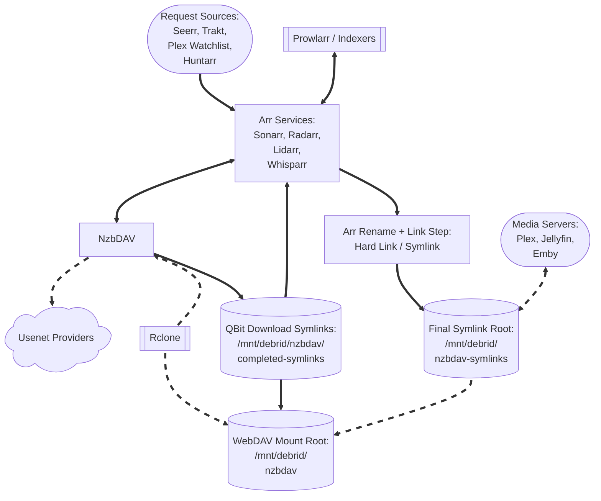

# NzbDAV (Core Service)

**NzbDAV** is a combined backend + frontend WebDAV service for **Usenet** workflows. In DUMB it runs as a single service that exposes a Web UI, a WebDAV endpoint for browsing/serving content, and a backend API used for automation.

---

## Workflow diagram



---

## Service Relationships

| Classification | Role                                                     |
| -------------- | -------------------------------------------------------- |
| Core Service   | NZB WebDAV gateway                                       |
| Depends On     | [rclone](../dependent/rclone.md)                         |
| Optional       | Sonarr, Radarr, Lidarr, Whisparr, Prowlarr, Huntarr      |
| Exposes UI     | Yes (Web UI + WebDAV)                                    |

---

## What NzbDAV provides

| Endpoint | Purpose | Default |
|----------|---------|---------|
| Web UI + WebDAV | Primary UI and WebDAV endpoint | `http://<host>:3000/` |
| Backend API | Internal API for DUMB automation | `http://127.0.0.1:8080/` |

NzbDAV also exposes a **Usenet download client** path in Arr by emulating a Sabnzbd-compatible API. DUMB registers this client automatically when `core_service: nzbdav` (or `core_service` includes `nzbdav`) is set on Arr instances.

!!! info "WebDAV endpoint"

    rclone and Arr download clients point at the WebDAV endpoint on the frontend port.

---

## Configuration in `dumb_config.json`

```json
"nzbdav": {
    "enabled": false,
    "process_name": "NzbDAV",
    "repo_owner": "nzbdav-dev",
    "repo_name": "nzbdav",
    "release_version_enabled": false,
    "release_version": "latest",
    "branch_enabled": false,
    "branch": "main",
    "suppress_logging": false,
    "log_level": "INFO",
    "frontend_port": 3000,
    "backend_port": 8080,
    "auto_update": false,
    "auto_update_interval": 24,
    "clear_on_update": false,
    "exclude_dirs": [],
    "platforms": [
        "pnpm",
        "dotnet"
    ],
    "command": [],
    "config_dir": "/nzbdav",
    "log_file": "/log/nzbdav.log",
    "webdav_password": "",
    "env": {}
},
```

### Key Configuration Fields

* `enabled`: Toggle to run NzbDAV via DUMB.
* `frontend_port`: Port for the Web UI and WebDAV endpoint.
* `backend_port`: Port for the backend API.
* `webdav_password`: Default WebDAV password (overridden by `WEBDAV_PASSWORD`).
* `config_dir`: Path where NzbDAV data is stored.
* `log_file`: Path for the consolidated NzbDAV log.
* `env`: Optional environment variables (see below).

!!! warning "WebDAV credentials"

    If `webdav_password` is blank, DUMB generates one at startup and stores it in the config.
    Change the password before exposing NzbDAV outside your trusted network.

### Environment Variables

* `LOG_LEVEL`: Logging level for NzbDAV (defaults to `INFO`).
* `WEBDAV_USER`: Override the WebDAV username (defaults to `admin`).
* `WEBDAV_PASSWORD`: Override the WebDAV password.
* `CONFIG_PATH`: Override the NzbDAV config path (defaults to `config_dir`).
* `FRONTEND_BACKEND_API_KEY`: Backend API key shared with the frontend.
* `ASPNETCORE_URLS`: Backend bind address (defaults to `http://+:<backend_port>`).
* `PORT`: Frontend port (defaults to `frontend_port`).
* `BACKEND_URL`: Frontend-to-backend URL (defaults to `http://127.0.0.1:<backend_port>`).

!!! danger "Protect API keys"

    `FRONTEND_BACKEND_API_KEY` grants backend access. Treat it like a secret and avoid committing it to source control.

---

## Integration with DUMB

When NzbDAV starts, DUMB performs several automation steps:

- Syncs Arr instance details into the NzbDAV database
- Ensures API categories exist for Arr integrations
- Creates `/mnt/debrid/nzbdav-symlinks/<category>` roots
- Updates Arr permissions and root folders
- Adds or updates a download client named `nzbdav` in Arr

The Arr instance list is stored in NzbDAV’s SQLite config under `arr.instances`, so DUMB can merge user edits with auto-detected instances.

!!! info "Startup timing"

    If the NzbDAV backend is not reachable yet, DUMB retries the download-client setup shortly after startup.

### Arr `core_service` setting

For Sonarr/Radarr/Lidarr/Whisparr instances you want wired to NzbDAV, set
`core_service` to `nzbdav` or include it in a list:

```json
"core_service": "nzbdav"
```

```json
"core_service": ["decypharr", "nzbdav"]
```

This tells DUMB to auto-configure Arr integration around NzbDAV’s WebDAV and download-client workflows.
See [Core Service Routing](../../reference/core-service.md) for how `core_service` affects automation.

### 1. rclone WebDAV Mount

Create a dedicated rclone instance for NzbDAV and point it at the WebDAV endpoint:

```json
"rclone": {
  "instances": {
    "NzbDAV": {
      "enabled": true,
      "core_service": "nzbdav",
      "process_name": "rclone w/ NzbDAV",
      "suppress_logging": false,
      "log_level": "INFO",
      "key_type": "NzbDAV",
      "zurg_enabled": false,
      "decypharr_enabled": false,
      "mount_dir": "/mnt/debrid",
      "mount_name": "nzbdav",
      "config_dir": "/config",
      "config_file": "/config/rclone.config",
      "log_file": "/log/rclone_w_nzbdav.log",
      "zurg_config_file": "",
      "cache_dir": "/cache",
      "command": [],
      "api_key": ""
    }
  }
}
```

When `key_type` is set to `NzbDAV`, DUMB configures rclone to use:

* `http://127.0.0.1:<frontend_port>/` as the WebDAV URL
* `WEBDAV_USER` / `WEBDAV_PASSWORD` (or the values stored in the NzbDAV DB)

Default rclone mount path (if not overridden) is:

```
/mnt/debrid/nzbdav
```

### 2. Arr Integration (Sonarr/Radarr)

Set `core_service` to `nzbdav` (or include `nzbdav` in a list) for the Sonarr and
Radarr instances you want wired to NzbDAV:

```json
"sonarr": {
  "instances": {
    "Default": {
      "enabled": true,
      "core_service": "nzbdav",
      "port": 8989
    }
  }
},
"radarr": {
  "instances": {
    "Default": {
      "enabled": true,
      "core_service": "nzbdav",
      "port": 7878
    }
  }
}
```

DUMB will:

* Create symlink roots at `/mnt/debrid/nzbdav-symlinks/<category>`
* Configure NzbDAV to recognize these paths
* Update Arr permissions (enable chmod + set folder/file modes)
* Attempt to add an `nzbdav` download client in the Arrs using their API keys

When `core_service` includes both `decypharr` and `nzbdav`, the root folder base
shifts to `/mnt/debrid/combined_symlinks/<category>`.

!!! info "Automatic vs manual wiring"

    When `core_service` is set to `nzbdav` (or includes it), DUMB
    automatically configures download clients, root folders, and permissions.
    If `core_service` includes both `decypharr` and `nzbdav`, the Arr root folder
    base switches to `/mnt/debrid/combined_symlinks/<category>`.
    Manual setup is only needed when `core_service` is blank or you want to override
    the combined workflow wiring.

### Category mapping

By default, DUMB maps Arr types to categories:

| Arr service | Default category |
|-------------|------------------|
| Radarr | `movies` |
| Sonarr | `tv` |
| Lidarr | `music` |
| Whisparr | `whisparr` |

Instance names are slugified into categories if present (for example, `Radarr 4K` becomes `radarr-4k`).

---

## Accessing the UI

* Navigate to: `http://<host>:<frontend_port>` (default port `3000`)
* WebDAV endpoint: `http://<host>:<frontend_port>/`

!!! warning "Port conflicts and auto-shift"

    NzbDAV defaults (`3000`/`8080`) overlap with Riven defaults. DUMB can auto-shift
    conflicting ports at container startup or during the onboarding core-service
    start flow, updating `dumb_config.json` accordingly.
    Per-service stop/start/restart does not re-run port conflict resolution, so fix
    conflicts manually before restarting a single service.

---

## Troubleshooting Tips

!!! warning "Permission changes"

    DUMB updates Arr media-management permissions to enable chmod operations (folder `777`, file `666`).
    If you manage permissions manually, review these settings after integration.

* If rclone fails to authenticate, verify `WEBDAV_USER`/`WEBDAV_PASSWORD` and restart the container.
* If Arr download clients are not created, confirm each Arr instance is enabled and has a readable `config.xml` for API key discovery.
* If Arr root folders are missing, verify `core_service` includes `nzbdav` and the Arr API is reachable.
* Check `/log` for NzbDAV startup errors, and ensure `frontend_port`/`backend_port` are not already in use.

---

## Resources

* [NzbDAV GitHub](https://github.com/nzbdav-dev/nzbdav)
