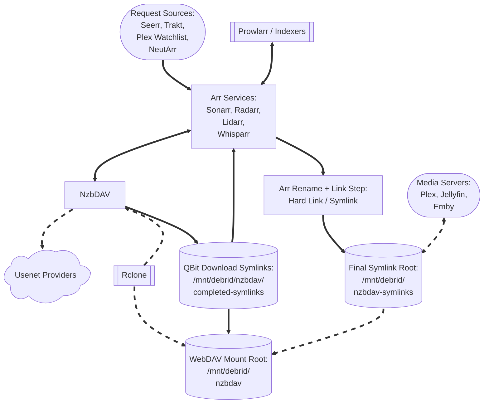

# NzbDAV (Core Service)

**NzbDAV** is a combined backend + frontend WebDAV service for **Usenet** workflows. In DUMB it runs as a single service that exposes a Web UI, a WebDAV endpoint for browsing/serving content, and a backend API used for automation.

---

## Workflow diagram


```mermaid
%%{ init: { "flowchart": { "curve": "basis" } } }%%
flowchart TD
    A([Request Sources:<br/>Seerr, Trakt,<br/>Plex Watchlist,<br/>NeutArr])
    B[Arr Services:<br/>Sonarr, Radarr,<br/>Lidarr,<br/>Whisparr]
    C[[Prowlarr / Indexers]]
    D[NzbDAV]
    E@{shape: cloud, label: "Usenet Providers"}
    F[[Rclone]]
    G[(WebDAV Mount Root:<br/>/mnt/debrid/<br/>nzbdav)]
    H[(QBit Download Symlinks:<br/>/mnt/debrid/nzbdav/<br/>completed-symlinks)]
    I[Arr Rename + Link Step:<br/>Hard Link / Symlink]
    J[(Final Symlink Root:<br/>/mnt/debrid/<br/>nzbdav-symlinks)]
    K([Media Servers:<br/>Plex, Jellyfin,<br/>Emby])

    E === D
    D === F
    linkStyle 0 stroke:transparent,stroke-width:0;
    linkStyle 1 stroke:transparent,stroke-width:0;

    A ==> B
    C <==> B
    B <==> D
    D e1@==> E
    F e2@==> D
    F e3@==> G
    D ==> H
    H ==> G
    H ==> B
    B ==> I
    I ==> J
    J e4@==> G
    K e5@<==> J


    classDef animate stroke-dasharray: 9,5,stroke-dashoffset: 900,animation: dash 25s linear infinite;
    class e1,e2,e3,e4,e5 animate
```

---

## Service Relationships

| Classification | Role                                                     |
| -------------- | -------------------------------------------------------- |
| Core Service   | NZB WebDAV gateway                                       |
| Depends On     | [rclone](../dependent/rclone.md)                         |
| Optional       | Sonarr, Radarr, Lidarr, Whisparr, Prowlarr, NeutArr      |
| Exposes UI     | Yes (Web UI + WebDAV)                                    |

---

## What NzbDAV provides

| Endpoint | Purpose | Default |
|----------|---------|---------|
| Web UI + WebDAV | Primary UI and WebDAV endpoint | `http://<host>:3000/` |
| Backend API | Internal API for DUMB automation | `http://127.0.0.1:8080/` |

NzbDAV also exposes a **Usenet download client** path in Arr by emulating a Sabnzbd-compatible API. DUMB registers this client automatically when `core_service: nzbdav` (or `core_service` includes `nzbdav`) is set on Arr instances.

!!! info "WebDAV endpoint"

    rclone and Arr download clients point at the WebDAV endpoint on the frontend port.

---

## Configuration in `dumb_config.json`

!!! important "DUMB defaults to InfiniDysk"

    DUMB installs and updates the renamed project from
    [`infinidysk/infinidysk`](https://github.com/infinidysk/infinidysk) by
    default. The legacy `nzbdav` DUMB service key and `NZBDAV_*` environment
    variables remain compatibility aliases. Existing configs containing either
    former DUMB default, `nzbdav-dev/nzbdav` or `nzbdav/nzbdav`, migrate to
    InfiniDysk automatically; intentional custom forks remain unchanged.

!!! tip "Support the maintainer"

    If InfiniDysk/NzbDAV is useful to your stack, you can support the maintainer
    through [Buy Me a Coffee](https://buymeacoffee.com/hoivikaj). DUMB also
    exposes this link through the frontend's NzbDAV service page and
    **Settings → About**.

```json
"nzbdav": {
    "enabled": false,
    "process_name": "NzbDAV",
    "repo_owner": "infinidysk",
    "repo_name": "infinidysk",
    "release_version_enabled": false,
    "release_version": "latest",
    "commit_sha": "",
    "branch_enabled": false,
    "branch": "main",
    "suppress_logging": false,
    "log_level": "INFO",
    "frontend_port": 3000,
    "backend_port": 8080,
    "auto_update": false,
    "auto_update_interval": 24,
    "auto_update_start_time": "04:00",
    "symlink_backup_enabled": false,
    "symlink_backup_interval": 168,
    "symlink_backup_start_time": "04:00",
    "symlink_backup_path": "/config/symlink-repair/snapshots/nzbdav-{timestamp}.json",
    "symlink_backup_include_broken": true,
    "symlink_backup_retention_count": 1,
    "symlink_backup_roots": [
        "/mnt/debrid/nzbdav-symlinks"
    ],
    "clear_on_update": false,
    "exclude_dirs": [],
    "platforms": [
        "pnpm",
        "dotnet"
    ],
    "command": [],
    "config_dir": "/nzbdav",
    "log_file": "/log/nzbdav.log",
    "webdav_password": "",
    "env": {}
},
```

### Key Configuration Fields

* `enabled`: Toggle to run NzbDAV via DUMB.
* `frontend_port`: Port for the Web UI and WebDAV endpoint.
* `backend_port`: Port for the backend API.
* `commit_sha`: Optional full 40-character GitHub SHA. When set, DUMB builds
  that exact NzbDAV revision instead of selecting a release or branch.
* `webdav_password`: Default WebDAV password (overridden by `WEBDAV_PASSWORD`).
* `config_dir`: Path where NzbDAV data is stored.
* `log_file`: Path for the consolidated NzbDAV log.
* `env`: Optional environment variables (see below).

!!! warning "WebDAV credentials"

    If `webdav_password` is blank, DUMB generates one at startup and stores it in the config.
    Change the password before exposing NzbDAV outside your trusted network.

### Tracking a moving NzbDAV release tag

NzbDAV tags do not need a matching GitHub Release. To track a tag such as
`dev`, enable the release selector and use the tag name:

```json
"nzbdav": {
    "release_version_enabled": true,
    "release_version": "dev",
    "commit_sha": "",
    "branch_enabled": false,
    "auto_update": true
}
```

DUMB treats any digit-free NzbDAV tag, such as `dev`, `lts`, or `edge`, as a
moving release channel. With `auto_update: true`, DUMB checks it at the normal
configured interval and installs it when the underlying commit changes. Manual
**Check for updates** and **Install update** remain available.

The installed marker is recorded as `dev-<short-sha>`. The source archive is
downloaded by the resolved full SHA, so the installed source and recorded
marker remain consistent even if the tag moves during the update.

### Prebuilt archives and automatic source fallback

For InfiniDysk release selectors, DUMB first looks for the official
architecture-specific `linux-x64` or `linux-arm64` release archive. It requires
GitHub's published SHA-256 digest, resolves the selected tag to its full commit,
requires the release asset's target commit to still match that tag, validates
the complete backend and frontend runtime, and activates them as one
rollback-safe unit. DUMB selects the exact channel asset deterministically and
accepts only InfiniDysk/NzbDAV archive roots for the selected CPU architecture.
This handles renamed rolling assets such as `rc`, whose downloaded archive can
keep the concrete RC version in its internal root directory.

If a selected tag has no GitHub Release object, has no compatible archive, or
has release assets that lag behind a moved channel tag, DUMB automatically
downloads the current resolved commit and uses its source-build path. The same
fallback applies when archive verification fails. This keeps the service
installable while making the fallback reproducible. Open the service page's
**Updates** panel to see **Installed using**, the resolved release, the selected
archive when applicable, and the prebuilt fallback reason.

The practical channel behavior is:

| Selector | DUMB behavior |
| --- | --- |
| `latest` | Resolve the current stable GitHub Release, then use its verified archive or source fallback |
| `prerelease` | For the official InfiniDysk repository, follow the `rc` channel so a newer `dev` snapshot cannot be mistaken for an RC; then use its verified archive or source fallback |
| `dev`, `rc`, `lts`, `edge` | Track the exact digit-free tag when it exists; use a matching verified release archive when published, otherwise build that tag's resolved commit |
| Versioned/dated tag | Treat it as a fixed configured release; use its verified archive when published, otherwise build its resolved commit |
| Full `commit_sha` or branch | Source build by design |

!!! note "Why DUMB does not unpack the Docker image"

    The official InfiniDysk container is Alpine/musl-based, while DUMB's
    runtime and managed packages are Ubuntu/glibc-based. Extracting application
    files from that image would also pull a runtime layout and native libraries
    built for a different libc boundary. The official Ubuntu-built release
    archives are the compatible prebuilt format for DUMB; source fallback is
    the compatibility path when no usable archive exists.

After a prebuilt install, DUMB starts the archive's framework-dependent native
apphost against DUMB's compatible .NET runtime, even if a local .NET SDK remains
from an older source build. Source installs continue to launch through the
managed local SDK and application DLL.

The same revision suffix remains visible for the rolling **prerelease** channel
and for branch, exact-commit, or other moving-tag installs. Ordinary stable
release versions are shown in the frontend as their clean release tag (for
example, `v0.10.0`); DUMB retains the resolved commit internally for download,
cache, and source-integrity checks rather than presenting it as part of the
stable version.

When the selected tag also has an architecture-specific NzbDAV release archive,
DUMB tries that archive first. The rolling `rc` GitHub Release is therefore a
valid moving channel: DUMB resolves its current commit and asset digest before
installing it. Branch and exact-commit selections remain source builds.

DUMB accepts the current `infinidysk-<version>-linux-<arch>.tar.gz` release
artifact and the former `nzbdav-<version>-linux-<arch>.tar.gz` name. The selected
asset must include a published SHA-256 digest, and its archive root must match
the asset name. When both names are published for one release, DUMB prefers the
name matching the configured repository. A renamed official artifact therefore
uses the verified prebuilt path instead of silently falling back to a source
build.

Existing installations whose marker is only `dev` perform one update to adopt
the commit-aware marker. Tags containing any digit, such as `v0.9.5`,
`2026.08.03`, or `dev2`, remain pinned configured releases and do not enable
scheduled automatic updates. Use **Install configured release** to apply those
tags intentionally.

### Pinning an exact NzbDAV commit

Set `commit_sha` to the complete SHA from the configured `repo_owner` and
`repo_name`:

```json
"nzbdav": {
    "repo_owner": "infinidysk",
    "repo_name": "infinidysk",
    "commit_sha": "0123456789abcdef0123456789abcdef01234567"
}
```

The commit pin overrides `release_version_enabled` and `branch_enabled`.
Automatic updates stay disabled while the pin is present. Change the SHA to
move deliberately to another revision, or clear it to return to the configured
release/branch strategy.

After saving a new SHA, open **Updates** and select **Install configured
commit**. This installs and restarts NzbDAV on the saved commit. Do not use
**Override + latest** for this operation; that action intentionally installs the
latest moving release while leaving the saved pin in place for a later restart.

### Source-build update safety

Branch and exact-commit updates publish the .NET backend into a clean candidate
directory, validate the complete runtime, and then replace the installed backend
as one unit. This prevents assemblies removed or upgraded upstream from remaining
in `/nzbdav/app` and being loaded alongside the new build.

After upgrading from an older DUMB version, an existing branch or commit install
may rebuild once even when its Git revision has not changed. That one-time rebuild
records the current source-build format and replaces any legacy overlaid output.
Do not manually delete `/nzbdav/app` or enable `clear_on_update` for this recovery;
use **Install configured release/branch/commit** and let DUMB preserve the previous
backend until the replacement candidate passes validation.

`clear_on_update` applies only to replaceable source and runtime files. Before
any clear or archive merge, DUMB automatically carries forward configured
exclusions, an in-tree `config_file`, explicit config/data/database path fields,
conventional `data`/`db` directories, root-level SQLite databases and active
WAL/SHM/journal sidecars, and symlinked persistent data directories. This guard
also applies when an older saved configuration omitted those paths from
`exclude_dirs`.

Keep normal backups of application databases and configuration. The update guard
prevents DUMB's installer from intentionally clearing those files; it is not a
replacement for backups or application-native database recovery.

### Environment Variables

* `LOG_LEVEL`: Logging level for NzbDAV (defaults to `INFO`).
* `WEBDAV_USER`: Override the WebDAV username (defaults to `admin`).
* `WEBDAV_PASSWORD`: Override the WebDAV password.
* `CONFIG_PATH`: Override the NzbDAV config path (defaults to `config_dir`).
* `FRONTEND_BACKEND_API_KEY`: Backend API key shared with the frontend.
* `ASPNETCORE_URLS`: Backend bind address (defaults to `http://+:<backend_port>`).
* `PORT`: Frontend port (defaults to `frontend_port`).
* `BACKEND_URL`: Frontend-to-backend URL (defaults to `http://127.0.0.1:<backend_port>`).

!!! danger "Protect API keys"

    `FRONTEND_BACKEND_API_KEY` grants backend access. Treat it like a secret and avoid committing it to source control.

---

## Integration with DUMB

When NzbDAV starts, DUMB performs several automation steps:

- Syncs Arr instance details into the NzbDAV database
- Ensures API categories exist for Arr integrations
- Creates `/mnt/debrid/nzbdav-symlinks/<category>` roots
- Updates Arr permissions and root folders
- Adds or updates a download client named `nzbdav` in Arr

The Arr instance list is stored in NzbDAV’s SQLite config under `arr.instances`, so DUMB can merge user edits with auto-detected instances.

!!! info "Startup timing"

    If the NzbDAV backend is not reachable yet, DUMB retries the download-client setup shortly after startup.

### Database migration startup

DUMB starts the NzbDAV frontend before running the blocking database migration.
This is the default launch behavior and lets the Web UI show NzbDAV's live
**Database maintenance in progress** page, including migration steps, progress,
and elapsed time, even when a large database takes a long time to migrate.

After a successful migration, DUMB starts the normal backend and the page reloads
into NzbDAV when it becomes healthy. If migration fails, DUMB keeps the frontend
alive through NzbDAV's brief failure-display window, then stops it and exits the
NzbDAV process with the migration's non-zero exit code. No separate setting is
required.

### Arr `core_service` setting

For Sonarr/Radarr/Lidarr/Whisparr instances you want wired to NzbDAV, set
`core_service` to `nzbdav` or include it in a list:

```json
"core_service": "nzbdav"
```

```json
"core_service": ["decypharr", "nzbdav", "altmount"]
```

This tells DUMB to auto-configure Arr integration around NzbDAV’s WebDAV and download-client workflows.
See [Core Service Routing](../../reference/core-service.md) for how `core_service` affects automation.

### 1. rclone WebDAV Mount

Create a dedicated rclone instance for NzbDAV and point it at the WebDAV endpoint:

```json
"rclone": {
  "instances": {
    "NzbDAV": {
      "enabled": true,
      "core_service": "nzbdav",
      "process_name": "rclone w/ NzbDAV",
      "suppress_logging": false,
      "log_level": "INFO",
      "key_type": "NzbDAV",
      "zurg_enabled": false,
      "decypharr_enabled": false,
      "mount_dir": "/mnt/debrid",
      "mount_name": "nzbdav",
      "config_dir": "/config",
      "config_file": "/config/rclone.config",
      "log_file": "/log/rclone_w_nzbdav.log",
      "zurg_config_file": "",
      "cache_dir": "/cache",
      "command": [],
      "api_key": ""
    }
  }
}
```

When `key_type` is set to `NzbDAV`, DUMB configures rclone to use:

* `http://127.0.0.1:<frontend_port>/` as the WebDAV URL
* `WEBDAV_USER` / `WEBDAV_PASSWORD` (or the values stored in the NzbDAV DB)
* an rclone RC listener on the first available port starting at `5572`

DUMB reserves RC ports already assigned to other managed rclone instances and
AltMount, and also checks active listeners before selecting the port. On first
setup, DUMB enables **Settings -> Rclone Server** in NzbDAV and points it at the
local RC listener so WebDAV changes can invalidate rclone's VFS directory cache.
Later NzbDAV UI changes to the RC enablement, host, username, or password are
preserved. A saved `--rc-addr` and `--dir-cache-time` in the rclone command are
also retained when they remain valid.

Default rclone mount path (if not overridden) is:

```
/mnt/debrid/nzbdav
```

#### Streaming optimization

When the backend advertises `rclone_optimizer_nzbdav`, open the dedicated
NzbDAV-backed **rclone service page** and select **Rclone Optimizer**. The primary
job indicator, content picker, live measurements, report, apply, and rollback
controls belong to rclone because those are rclone settings. The NzbDAV page only
shows a contextual link while an associated rclone test is active.

The test does pull content through NzbDAV's authenticated WebDAV server and the
configured Usenet providers. It also consumes NzbDAV Overview and stream-trace API
data while rclone RC and DUMB host metrics describe the mount and system side.
Review [Rclone Streaming Optimizer](../../features/rclone-optimizer.md) before
testing, especially the provider traffic and concurrency limits.

### 2. Arr Integration (Sonarr/Radarr)

Set `core_service` to `nzbdav` (or include `nzbdav` in a list) for the Sonarr and
Radarr instances you want wired to NzbDAV:

```json
"sonarr": {
  "instances": {
    "Default": {
      "enabled": true,
      "core_service": "nzbdav",
      "port": 8989
    }
  }
},
"radarr": {
  "instances": {
    "Default": {
      "enabled": true,
      "core_service": "nzbdav",
      "port": 7878
    }
  }
}
```

DUMB will:

* Create symlink roots at `/mnt/debrid/nzbdav-symlinks/<category>`
* Configure NzbDAV to recognize these paths
* Update Arr permissions (enable chmod + set folder/file modes)
* Attempt to add an `nzbdav` download client in the Arrs using their API keys

When `core_service` includes both `decypharr` and `nzbdav`, the root folder base
shifts to `/mnt/debrid/combined_symlinks/<category>`. Other multi-service
combinations keep the NzbDAV symlink root unless another workflow owns its own
root-folder setup.

!!! info "Automatic vs manual wiring"

    When `core_service` is set to `nzbdav` (or includes it), DUMB
    automatically configures download clients, root folders, and permissions.
    If `core_service` includes both `decypharr` and `nzbdav`, the Arr root folder
    base switches to `/mnt/debrid/combined_symlinks/<category>`.
    Manual setup is only needed when `core_service` is blank or you want to override
    the combined workflow wiring.

### Category mapping

By default, DUMB maps Arr types to categories:

| Arr service | Default category |
|-------------|------------------|
| Radarr | `movies` |
| Sonarr | `tv` |
| Lidarr | `music` |
| Whisparr | `whisparr` |

Instance names are slugified into categories if present (for example, `Radarr 4K` becomes `radarr-4k`).

---

## Accessing the UI

* Navigate to: `http://<host>:<frontend_port>` (default port `3000`)
* WebDAV endpoint: `http://<host>:<frontend_port>/`

!!! warning "Port conflicts and auto-shift"

    NzbDAV defaults (`3000`/`8080`) overlap with Riven defaults. DUMB can auto-shift
    conflicting ports at container startup or during the onboarding core-service
    start flow, updating `dumb_config.json` accordingly.
    Per-service stop/start/restart does not re-run port conflict resolution, so fix
    conflicts manually before restarting a single service.

---

## Troubleshooting Tips

### NzbDAV starts but its port is already open

The maintained NzbDAV fork serves a controlled migration status responder while
blocking database migrations run. During that phase the backend port can accept
connections, but `/health` returns HTTP `503` with
`{"status":"migrating"}`. DUMB's service health shows **Starting** and keeps
stack readiness open until NzbDAV's real backend returns `Healthy`.

This is not an Auto-restart failure. Do not repeatedly restart or interrupt a
legitimate migration. Open NzbDAV's embedded UI to view its migration progress.
If the state never advances, inspect NzbDAV logs and available storage before
deciding whether recovery is required.

### Compare NzbDAV performance

Open the NzbDAV service page's **AI Assist** tab and choose **Performance** to compare a selected window with the previous matching period or with the period before the latest DUMB-saved setting change.

In addition to generic logs and process metrics, DUMB can read the maintained fork's `metrics.sqlite` and `db.sqlite` in read-only mode. The evidence includes queue worker settings, segment success/missing/error/retry rates, provider latency, read-session activity, queue completion/failure timing, long-running queue processors, and busy-period throughput.

Use **Preview bundle** first to confirm native telemetry is available and check the exact coverage. These metrics do not measure Plex click-to-first-frame latency, so playback-start conclusions should remain qualified unless Plex-side timing is correlated separately.

See [AI Assistant](../../features/ai-assistant.md#nzbdav-native-evidence) for the full evidence and safety model.

### Assess SQLite pressure

NzbDAV currently stores its operational and metrics data in SQLite. DUMB can optionally monitor both databases from **Metrics → Settings → Database Health Monitoring** or the NzbDAV service page's **Database Health** panel.

Start with **Standard / passive** mode and collect through normal imports, health checks, and playback. Use **Enhanced / read-only probes** when you also want bounded SQLite metadata latency. Repeated lock/busy/timeout errors, sustained WAL growth, slow probes, or network-filesystem placement are stronger reasons to investigate PostgreSQL than database size alone. See [Metrics Collection](../../features/metrics.md#database-health-monitoring) for the safety boundary and interpretation guidance.

!!! warning "Permission changes"

    DUMB updates Arr media-management permissions to enable chmod operations (folder `777`, file `666`).
    If you manage permissions manually, review these settings after integration.

* If rclone fails to authenticate, verify `WEBDAV_USER`/`WEBDAV_PASSWORD` and restart the container.
* If Arr download clients are not created, confirm each Arr instance is enabled and has a readable `config.xml` for API key discovery.
* If Arr root folders are missing, verify `core_service` includes `nzbdav` and the Arr API is reachable.
* Every release install automatically tries NzbDAV's matching verified Linux
  x64/ARM64 prebuilt archive first. If the archive is absent, has no published
  SHA-256 digest, fails validation, or is not available for the current
  architecture, DUMB keeps the live runtime untouched and automatically falls
  back to the source build. This behavior is inherent and has no user-facing
  toggle. The moving `prerelease` selector resolves and tracks the newest GitHub
  prerelease through the same GitHub prerelease-list flow used by CLI Debrid.
  Its installed marker is `<tag>-<short-sha>`; update checks resolve the current
  tag commit before comparing, so an unchanged prerelease is reported as current
  while a tag moved to a different commit remains detectable.
  Source fallback resolves the selected tag to its immutable commit before
  downloading; branch/commit installs use an on-demand managed .NET SDK.
  DUMB merges the NzbDAV-specific build variables with the container environment so system tools
  remain available, and invokes `/bin/bash` explicitly when installing the SDK.
  An error such as `No such file or directory: 'bash'` indicates an image that
  predates this fix and should be retested after pulling a fixed tag and
  recreating the container.
* Check `/log` for NzbDAV startup errors, and ensure `frontend_port`/`backend_port` are not already in use.

---

## Resources

* [InfiniDysk repository used by DUMB (default)](https://github.com/infinidysk/infinidysk)
* [Support the InfiniDysk/NzbDAV maintainer](https://buymeacoffee.com/hoivikaj)
* [Former maintained NzbDAV repository](https://github.com/nzbdav/nzbdav)
* [Original NzbDAV repository](https://github.com/nzbdav-dev/nzbdav)
