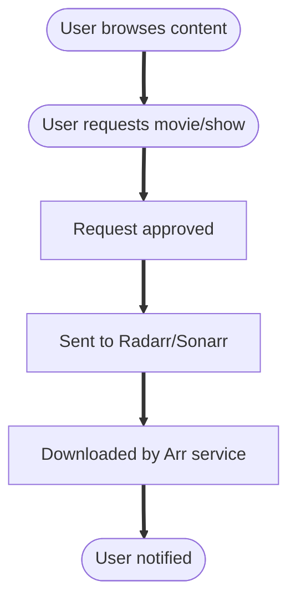

# Seerr

Seerr (Overseerr/Jellyseerr) is a media request and discovery platform that integrates with Plex, Jellyfin, Radarr, and Sonarr. It allows users to browse, request, and track media content through an intuitive web interface.

---

## Overview

Seerr provides:

- **Media discovery** - Browse trending, popular, and upcoming content
- **Request management** - Users can request movies and TV shows
- **Integration with Arr services** - Automatically sends requests to Radarr/Sonarr
- **User management** - Multiple users with different permission levels
- **Notifications** - Alerts when requests are fulfilled

---

## Default port

| Service | Port |
|---------|------|
| Seerr | 5055 |

---

## Configuration settings in `dumb_config.json`

Below is a sample configuration for Seerr within the `dumb_config.json` file:

```json
"seerr": {
  "instances": {
    "Default": {
      "enabled": false,
      "core_service": "",
      "process_name": "Seerr",
      "repo_owner": "seerr-team",
      "repo_name": "seerr",
      "release_version_enabled": false,
      "release_version": "latest",
      "branch_enabled": false,
      "branch": "main",
      "suppress_logging": false,
      "log_level": "INFO",
      "port": 5055,
      "auto_update": false,
      "auto_update_interval": 24,
      "clear_on_update": true,
      "exclude_dirs": [
        "/seerr/default/config"
      ],
      "platforms": [
        "pnpm"
      ],
      "command": ["node", "dist/index.js"],
      "config_dir": "/seerr/default",
      "config_file": "/seerr/default/config/settings.json",
      "log_file": "/seerr/default/config/logs/jellyseerr.log",
      "env": {
        "NODE_ENV": "production",
        "PORT": "{port}"
      }
    }
  }
}
```

### Configuration key descriptions

- **`enabled`**: Whether to start this Seerr instance.
- **`process_name`**: Display name used in logs and the frontend.
- **`repo_owner`** / **`repo_name`**: GitHub repository to pull from.
- **`release_version_enabled`** / **`release_version`**: Use a tagged release if enabled.
- **`branch_enabled`** / **`branch`**: Use a specific branch if enabled.
- **`suppress_logging`**: If `true`, disables log output for this service.
- **`log_level`**: Logging verbosity (e.g., `debug`, `info`, `warn`).
- **`port`**: Port the Seerr web UI is exposed on.
- **`auto_update`**: Enables automatic self-updates from GitHub.
- **`auto_update_interval`**: How often (in hours) to check for updates.
- **`clear_on_update`**: Clears build artifacts or cache during updates.
- **`exclude_dirs`**: Prevents specific directories from being affected by updates.
- **`platforms`**: Required runtime (typically `pnpm`).
- **`command`**: The command used to launch Seerr.
- **`config_dir`** / **`config_file`**: Where configuration files are stored.
- **`log_file`**: Path to the Seerr log file.
- **`env`**: Environment variables passed at runtime.

---

## Initial setup

After enabling Seerr and starting the service:

1. Access the Seerr UI at `http://<host>:5055`
2. Complete the setup wizard:
   - Sign in with your Plex account (or configure Jellyfin)
   - Connect to your Plex/Jellyfin server
   - Configure Radarr and Sonarr connections
   - Set up user permissions

---

## Connecting to media servers

### Plex configuration

Seerr can sync with your Plex server to:

- Show what content you already have
- Display watch status
- Allow Plex user authentication

### Jellyfin configuration

For Jellyfin users, Seerr (Jellyseerr variant) provides similar functionality:

- Library synchronization
- User authentication via Jellyfin

---

## Connecting to Arr services

Configure Radarr and Sonarr in Seerr settings:

| Setting | Description |
|---------|-------------|
| **Hostname** | `127.0.0.1` (internal to DUMB container) |
| **Port** | Radarr: `7878`, Sonarr: `8989` |
| **API Key** | Found in Arr service Settings :material-arrow-right: General |
| **Quality Profile** | Select default quality for requests |
| **Root Folder** | Default download location |

!!! tip "Multiple Arr instances"

    If you have multiple Radarr or Sonarr instances (e.g., for 4K content), you can add them all to Seerr and let users choose during requests.

---

## User management

Seerr supports multiple user types:

| User Type | Capabilities |
|-----------|--------------|
| **Admin** | Full access, manage settings and users |
| **User** | Request content, view request status |
| **Guest** | Browse only (configurable) |

Users can authenticate via:

- Plex account
- Jellyfin account
- Local Seerr account

---

## Request workflow



Requests can be configured for:

- **Auto-approval** - Requests are automatically sent to Arr services
- **Manual approval** - Admin must approve before processing
- **Request limits** - Limit requests per user per time period

---

## Accessing via DUMB frontend

When embedded service UIs are enabled, Seerr appears in the DUMB frontend with:

- An embedded UI tab on the Seerr service page
- A direct link that opens the proxied UI in a new browser tab

This provides a unified interface without exposing Seerr's port directly.

---

## Tips

- Configure request limits to prevent abuse in multi-user setups.
- Enable notifications (Discord, email, etc.) to alert users when content is available.
- Use quality profiles in your Arr services to control download quality.
- Seerr respects availability settings in Radarr/Sonarr for proper release monitoring.
- Logs can be viewed via DUMB's Frontend or at `/seerr/default/config/logs/jellyseerr.log`.

---

## Resources

- [Overseerr GitHub Repository](https://github.com/sct/overseerr)
- [Overseerr Documentation](https://docs.overseerr.dev/)
