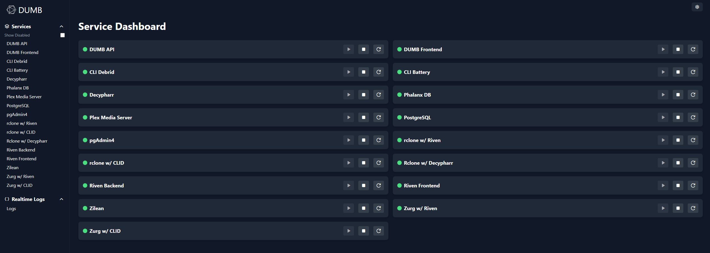
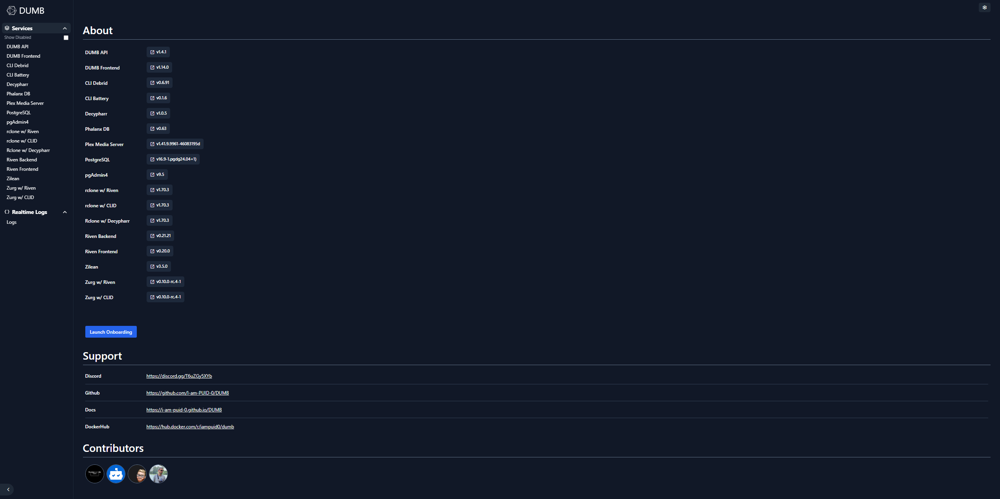
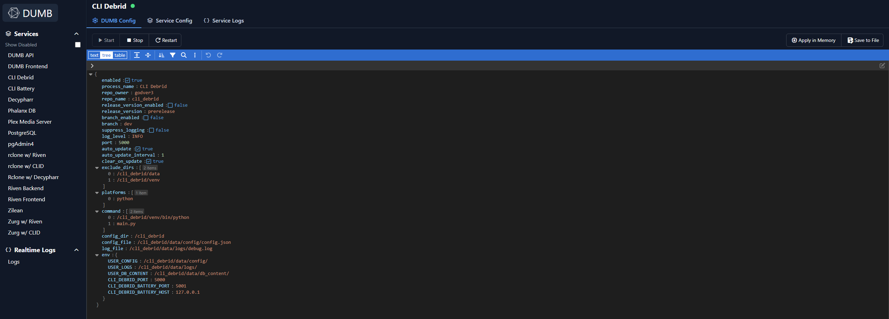
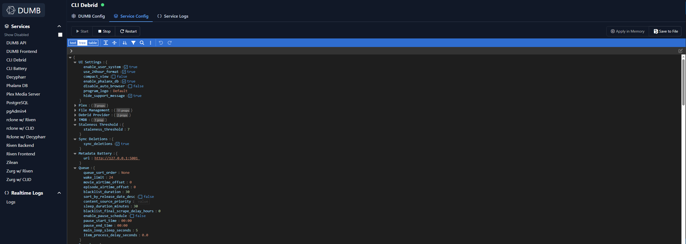
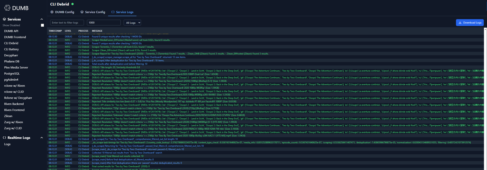

The **DUMB Frontend** is a web-based user interface designed to enhance the management and monitoring of the Debrid Unlimited Media Bridge (DUMB) ecosystem. It offers features such as real-time service logs, filtering options, and service control functionalities, providing users with an intuitive platform to interact with DUMB services.

---

## ⚙️ Configuration Settings in `dumb_config.json`

```json
"frontend": {
    "enabled": true,
    "process_name": "DUMB Frontend",
    "repo_owner": "nicocapalbo",
    "repo_name": "dmbdb",
    "release_version_enabled": false,
    "release_version": "v1.2.0",
    "branch_enabled": false,
    "branch": "main",
    "suppress_logging": false,
    "log_level": "INFO",            
    "origins": [
        "http://0.0.0.0:3005"
    ],
    "host": "0.0.0.0",
    "port": 3005,            
    "auto_update": false,
    "auto_update_interval": 24,
    "clear_on_update": true,
    "exclude_dirs": [],
    "platforms": ["pnpm"],
    "command": ["node",".output/server/index.mjs"],
    "config_dir": "/dumb/frontend",
    "env": {}            
}
```

### 🔍 Configuration Key Descriptions

- **`enabled`**: Determines whether the DUMB Frontend service is active.
- **`process_name`**: Name used in logs and process tracking.
- **`repo_owner`** / **`repo_name`**: Specifies the GitHub repository to clone for the frontend.
- **`release_version_enabled`** / **`release_version`**: Indicates if a specific release version should be used.
- **`branch_enabled`** / **`branch`**: Specifies the branch to use if enabled.
- **`suppress_logging`**: If `true`, disables log output for this service.
- **`log_level`**: Logging verbosity level (e.g., `DEBUG`, `INFO`).
- **`host`**: IP address the frontend should bind to.
- **`port`**: Port the frontend is served on.
- **`auto_update`**: Enables automatic self-updates.
- **`auto_update_interval`**: How often (in hours) to check for updates.
- **`clear_on_update`**: Clears build artifacts or cache during updates.
- **`exclude_dirs`**: Prevents specific directories from being affected by updates when using `clear_on_update`
- **`platforms`**: Specifies the runtime environment required (`pnpm`).
- **`command`**: Command to start the frontend service.
- **`config_dir`**: Directory where configuration files are stored.
- **`env`**: Environment variables for the frontend.

---

## ⚙️ Branch / Version Targeting
You can control which version or branch of the frontend is deployed by setting:

- `branch_enabled: true` and specifying a `branch`
- or `release_version_enabled: true` and specifying a `release_version`

---

## 🚪 Accessing the DUMB Frontend
- Navigate to: `http://<host>:<port>`
    - default port `3005`

## 📸 User Interface Overview

### Service Dashboard



The **Service Dashboard** displays all active services, showing their status and providing control options.

### Settings Menu



The **Settings Menu** section allows for:

- Viewing the current installed version of services
- Launching the onboarding process to add additional core services 
- Links to each of the service maintainers’ websites
- Links to DUMB Discord, GitHub, Docs, and DockerHub
- A list of Contributors for the project  

### Toolbar


The **Toolbar** allows for quick access to service settings and real-time logs, including:

* View services that are currently disabled
* Individual service logs, configuration files, and DUMB config settings


### Real-Time Logs


The **Real-Time Logs** section allows for:

- Filtering logs by **text entry** or **drop-down menu** (log levels and process names).
- Setting the number of log lines to capture.
- Downloading captured logs automatically named **DMB_logs.txt**.
- Pausing and resuming real-time logs.

### Viewing and Modifying Configurations

#### Edit DUMB Config



For each listed service, users can **view and modify** the `dumb_config.json` configuration. Changes can be applied **temporarily** (saved in memory) or **permanently** (saved to file).

#### Edit Service Config



For services with additional settings, this option allows similar modifications for the **service-specific configuration files**.

### Viewing Logs for Services



For services with log files, this view allows:

- **Viewing the latest logs** (since the last service start).
- **Filtering logs** (by log levels, log lines).
- **Downloading logs**, automatically named based on the service.

---

## 🧠 Tips

- **Automatic Updates**: Enable `auto_update` to keep the frontend up-to-date with the latest features.
- **Log Monitoring**: Utilize the service logs functionality for effective monitoring and troubleshooting.

---

## 📚 Resources

- [DUMB Frontend GitHub Repository](https://github.com/nicocapalbo/dmbdb)
- [DUMB Frontend CHANGELOG](https://github.com/nicocapalbo/dmbdb/blob/main/CHANGELOG.md)
