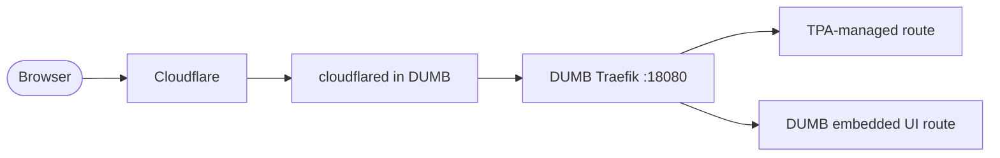
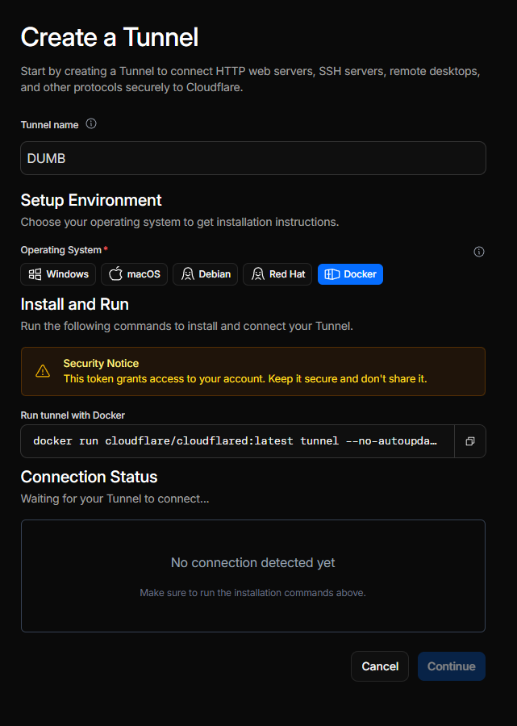
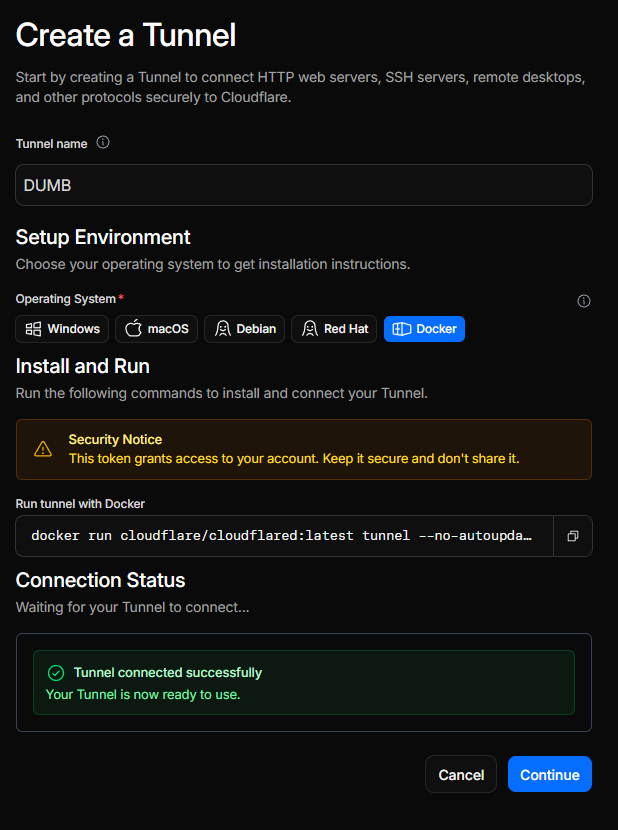
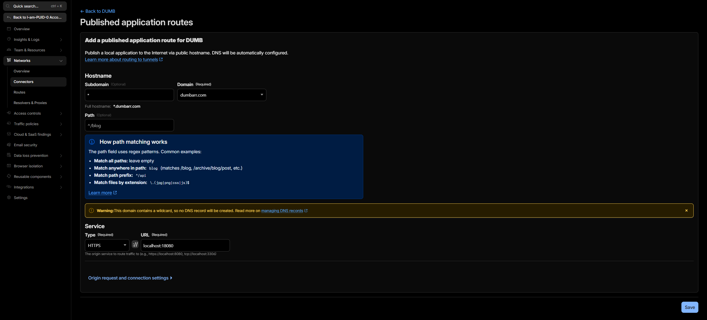
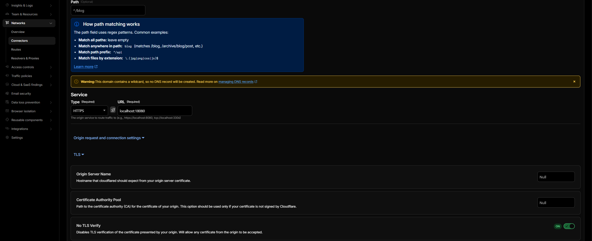

# Cloudflared

Cloudflared is an optional DUMB service that runs the Cloudflare Tunnel connector inside the DUMB container. It lets public Cloudflare hostname traffic reach DUMB's built-in Traefik entrypoint without opening router ports directly to the internet.

The intended flow is:



Cloudflared gets traffic to Traefik. Traefik still decides which local service receives the request.

---

## Before you start

You need:

- A Cloudflare account.
- A domain added to Cloudflare.
- The domain's authoritative nameservers pointed at Cloudflare.
- DUMB running with **Traefik** enabled.
- **Traefik Proxy Admin** enabled if you want to publish user-managed subdomains through TPA.

Cloudflare has a free plan that is enough for a normal first tunnel setup, but plan features and limits can change. Check Cloudflare's current pricing and Zero Trust plan pages before depending on it for anything critical.

!!! warning "Public access is real access"
    Cloudflared does not make an app private by itself. It only creates the tunnel. Keep TPA auth, service auth, Cloudflare Access, or the upstream app's own authentication enabled for anything exposed publicly.

---

## Step 1: Add your domain to Cloudflare

If your domain is already active in Cloudflare, skip to [Step 2](#step-2-create-a-cloudflare-tunnel).

1. Create or sign in to a Cloudflare account.
2. Add your domain as a Cloudflare site/zone.
3. Choose the free plan unless you know you need paid Cloudflare features.
4. Cloudflare will scan existing DNS records. Keep any records you already need.
5. At your registrar, change the domain's nameservers to the two Cloudflare nameservers shown during setup.
6. Wait for Cloudflare to mark the domain active.

This nameserver change is what lets Cloudflare answer DNS for your domain and route public hostnames through Tunnel.

---

## Step 2: Create a Cloudflare Tunnel

In Cloudflare, go to **Zero Trust** -> **Networks** -> **Connectors** -> **Cloudflare Tunnels**, then create a new tunnel.



Give the tunnel a simple name such as `DUMB`. Choose a **cloudflared** tunnel. DUMB uses a remotely-managed, token-based tunnel, so you do not need to run the Cloudflare install command on the host.

When Cloudflare shows the connector install command, copy only the tunnel token from the command. It is the long token after `--token`.

!!! warning "Treat the tunnel token like a password"
    Anyone with the token can run a connector for that tunnel. Store it only in DUMB's Cloudflared service config and rotate it in Cloudflare if it is exposed.

---

## Step 3: Enable Cloudflared in DUMB

In dmbdb, open the **Cloudflared** service page.

1. Enable the service.
2. Paste the copied tunnel token into `tunnel_token`.
3. Save the config.
4. Start or restart **Cloudflared**.

DUMB automatically starts Traefik before Cloudflared. In the Cloudflared logs, a healthy tunnel usually shows messages like:

```text
Registered tunnel connection
CONNECTIVITY PRE-CHECKS
SUMMARY: Environment is healthy
```

The UDP receive-buffer warning from `quic-go` is common in containers and does not usually block the tunnel.

On the first run, Cloudflare will show "Tunnel connected successfully." You can then click **Continue**.



---

## Step 4: Create the public hostname route

Cloudflare has two tunnel views. The account-level **Tunnels** page may show a simplified route editor. For the full origin settings, open the tunnel action menu and choose **Manage in Zero Trust**.

In Zero Trust:

1. Open the tunnel.
2. Go to **Published application routes**.
3. Add or edit a route.
4. Select the domain you want to publish under.
5. For a wildcard route, set **Subdomain** to `*`. For a single app, enter only that app's subdomain, such as `dumb` or `tpa`.
6. Leave **Path** empty unless you intentionally want path-based routing.
7. Set the service type to **HTTPS**.
8. Set the service URL to:

    ```text
    localhost:18080
    ```

Cloudflare may display the final service as `https://localhost:18080`.



---

## Step 5: Enable No TLS Verify

Because DUMB Traefik is the HTTPS origin for the tunnel, Cloudflared connects to Traefik over HTTPS inside the container. Traefik's local/default certificate is not expected to validate as `localhost`, so the route needs Cloudflare's **No TLS Verify** origin setting.

Open **Origin request and connection settings** -> **TLS**, then enable **No TLS Verify**.



Use this combination for DUMB Traefik:

| Cloudflare route field | Value |
| --- | --- |
| Service type | `HTTPS` |
| Service URL | `localhost:18080` |
| No TLS Verify | Enabled |

The HTTPS origin is important when TPA-generated routers use TLS. If the Cloudflare route points to `http://localhost:18080`, Traefik may receive the request but return 404 because the TLS router does not match. If the route points to `https://localhost:18080` without **No TLS Verify**, Cloudflare may return 502 because Cloudflared rejects the local Traefik certificate.

---

## Step 6: Add DNS records

For a single hostname, Cloudflare may create the DNS record for you when you save the tunnel route.

For a wildcard route, Cloudflare may warn that no DNS record will be created automatically. In that case, add the DNS record manually:

| Type | Name | Target | Proxy status |
| --- | --- | --- | --- |
| `CNAME` | `*` | `<tunnel-id>.cfargotunnel.com` | Proxied |

If you also want the apex/root domain itself to resolve through the tunnel, add a separate route and DNS record for the apex. A wildcard record covers subdomains; it does not automatically cover the bare apex hostname.

!!! note "Wildcard routes and TPA"
    A wildcard tunnel route sends matching subdomains to DUMB Traefik. TPA still needs a matching service route for each public hostname. If Cloudflare reaches Traefik but TPA has no matching router, Traefik will return 404.

---

## Step 7: Publish a service with TPA

In **Traefik Proxy Admin**:

1. Create or edit a domain matching your Cloudflare zone.
2. Add a service.
3. Choose a subdomain or custom hostname.
4. Set the target IP and port to the app you want Traefik to reach from inside DUMB.
5. Configure protection for the service, such as TPA service SSO, Basic Auth, Shared Link, Cloudflare Access, or the upstream app's own login.
6. Keep **Enable service** on.
7. Save.

For a quick smoke test, use a deliberately harmless test target or a temporary service that does not expose admin controls or personal data. Avoid using DUMB, TPA, or other admin surfaces as your first public test unless they are already protected by the auth model you intend to keep.

---

## Troubleshooting

| Symptom | Likely cause | What to check |
| --- | --- | --- |
| Cloudflare shows 502 Bad Gateway | Cloudflared cannot validate or reach the HTTPS origin | Confirm service is `https://localhost:18080` and **No TLS Verify** is enabled. Check Cloudflared logs for `tls: failed to verify certificate`. |
| Browser shows `404 page not found` | Request reached Traefik, but no router matched | Confirm the hostname exists in TPA or DUMB's embedded UI route set. Check Traefik access logs for the requested host. |
| Tunnel is inactive | Connector is not running or token is wrong | Confirm Cloudflared is enabled, token is pasted, and logs show registered tunnel connections. |
| Wildcard subdomains do not resolve | DNS record is missing | Add a proxied wildcard CNAME pointing to `<tunnel-id>.cfargotunnel.com`. |
| One hostname works but another does not | DNS or TPA route exists for only one host | Check both Cloudflare DNS and the matching TPA service route. |
| Cloudflare route is set to HTTP and Traefik returns 404 | TPA generated TLS routers | Use HTTPS to `localhost:18080` plus **No TLS Verify**. |

---

## Configuration reference

```json
"cloudflared": {
  "enabled": false,
  "process_name": "Cloudflared",
  "pinned_version": "latest",
  "suppress_logging": false,
  "log_level": "INFO",
  "auto_update": false,
  "auto_update_interval": 24,
  "auto_update_start_time": "04:00",
  "config_dir": "/cloudflared",
  "log_file": "/log/cloudflared.log",
  "tunnel_token": "",
  "command": [
    "/bin/bash",
    "-c",
    "exec /cloudflared/cloudflared tunnel --no-autoupdate run --token \"$TUNNEL_TOKEN\""
  ],
  "env": {
    "HOME": "/cloudflared"
  }
}
```

### Configuration key descriptions

- **`enabled`**: Whether to install and start cloudflared.
- **`pinned_version`**: Cloudflared release version, or `latest`.
- **`tunnel_token`**: Cloudflare Tunnel token. Required before start.
- **`config_dir`**: Stores the downloaded `cloudflared` binary and version marker.
- **`log_file`**: DUMB-managed log path for cloudflared output.

---

## Related links

- [Traefik Proxy Admin](traefik-proxy-admin.md)
- [Embedded Service UIs](../../features/embedded-ui.md)
- [Cloudflare Tunnel documentation](https://developers.cloudflare.com/tunnel/)
- [Cloudflare tunnel configuration](https://developers.cloudflare.com/tunnel/configuration/)
- [Cloudflare origin parameters](https://developers.cloudflare.com/tunnel/advanced/origin-parameters/)
- [Cloudflare tunnel token permissions](https://developers.cloudflare.com/cloudflare-one/networks/connectors/cloudflare-tunnel/configure-tunnels/remote-tunnel-permissions/)
- [Cloudflare domain setup](https://developers.cloudflare.com/fundamentals/setup/manage-domains/)
- [Cloudflare Zero Trust pricing](https://www.cloudflare.com/plans/zero-trust-services/)
