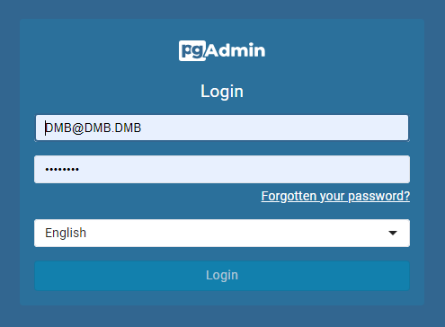
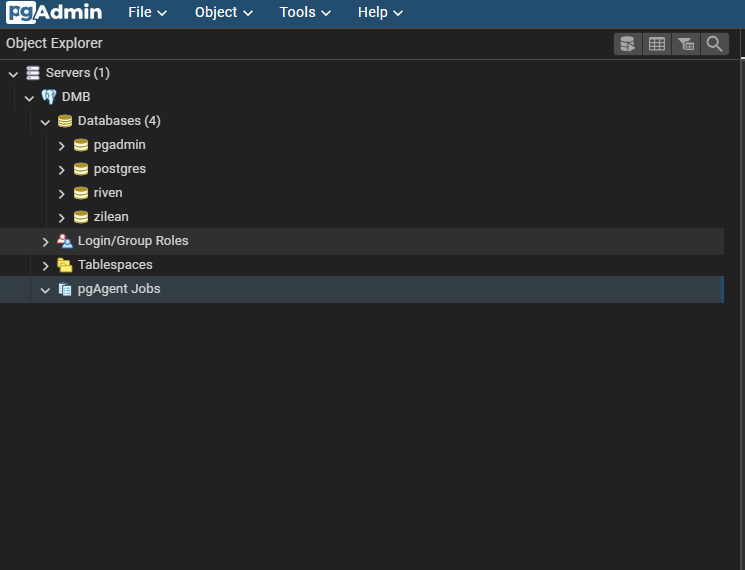

# pgAdmin 4

pgAdmin 4 is a web-based administration tool for managing PostgreSQL databases. 

DUMB includes pgAdmin pre-installed and configured to work out of the box, allowing you to inspect, query, and back up your databases directly from a browser.

---

## ⚙️ Configuration Settings in `dumb_config.json`
```json
"pgadmin": {
    "enabled": true,
    "process_name": "pgAdmin4",
    "config_dir": "/pgadmin/data",
    "config_file": "/pgadmin/data/config_local.py",
    "log_file": "/pgadmin/data/pgadmin4.log",
    "port": 5050,
    "default_server": "0.0.0.0",
    "setup_email": "DUMB@DUMB.DUMB",
    "setup_password": "postgres",
    "command": []
},
```    

### 🔍 Configuration Key Descriptions
- **`enabled`**: Whether to start the pgAdmin service.
- **`process_name`**: The label used in logs and process tracking.
- **`config_dir`** – Directory where pgAdmin configuration files are stored.
- **`config_file`** – Path to the primary pgAdmin configuration file.
- **`port`**: Port exposed for the pgAdmin.
- **`default_server`**: IP address pgAdmin should bind to. 

    !!! note "`0.0.0.0` allows access to pgAdmin from all addresses"

- **`setup_email`**: The email address to be used with pgAdmin.
- **`setup_password`**: The password to be used with pgAdmin. 
- **`command`** – The command used to start pgAdmin.

## 🚪 Accessing pgAdmin
- Navigate to: `http://<host>:<port>` 
    - default port `5055`
- Login using the credentials set via environment variables:
  - `PGADMIN_SETUP_EMAIL` 
    - default: `DUMB@DUMB.DUMB`
  - `PGADMIN_SETUP_PASSWORD` 
    - default: `postgres`

!!! tip "The email is used as the username. It does not need to be a real email address."



---

## 🔐 Server Configuration
- pgAdmin is preconfigured with a server connection named **DUMB**.
- On first login, you must enter the password for the PostgreSQL server connection.
    - Default password: `postgres`
    - Or, use the value of `POSTGRES_PASSWORD` if set in your environment.


---

## ⚙️ Extensions
The following PostgreSQL extensions are included in the DUMB image:

### 📈 `system_stats`
Provides system performance statistics inside PostgreSQL.

- Find it in the pgAdmin dashboard under the connected database (e.g., `pgadmin` or `riven`).


### 📅 `pgAgent`
A job scheduler for PostgreSQL. Useful for:

- Scheduling backups
- Routine maintenance



---

## 📚 More Info

- [pgAdmin FAQ](../../faq/pgadmin.md)

- [pgAdmin Docs](https://www.pgadmin.org/docs/pgadmin4/latest/index.html)

- [pgAgent Job Scheduler](https://www.pgadmin.org/docs/pgadmin4/development/pgagent_jobs.html)

---

## 🧠 Summary
| Setting                | Value                |
|------------------------|----------------------|
| UI Address             | `http://<host>:5050` |
| Default Email/Username | `DUMB@DUMB.DUMB`     |
| Default Password       | `postgres`           |
| Data Directory         | `/pgadmin/data`      |
| Config File            | `/pgadmin/data/config_local.py` |
