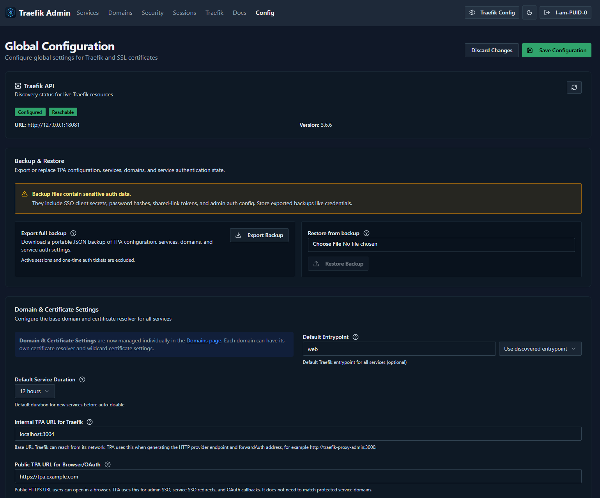
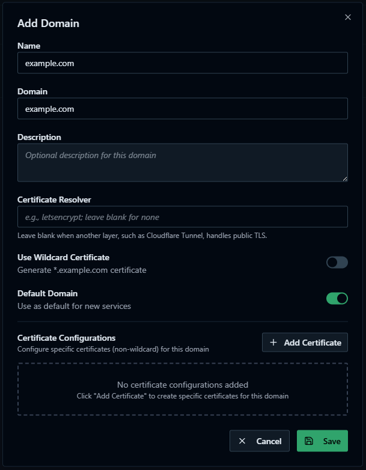
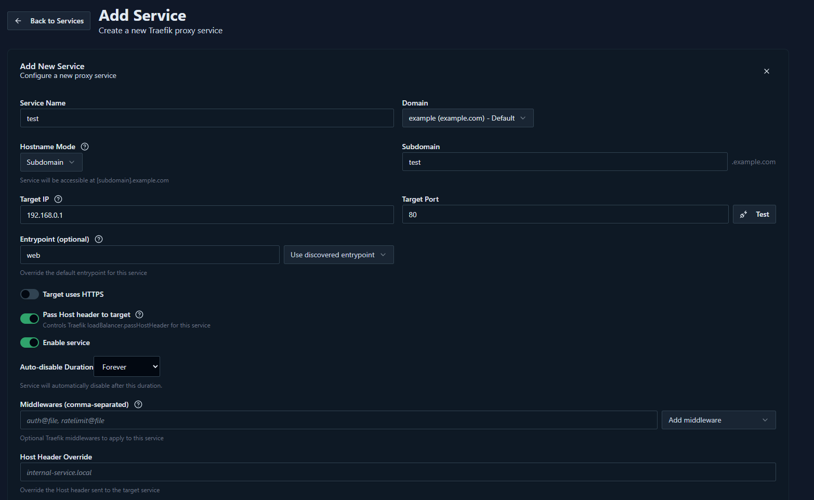
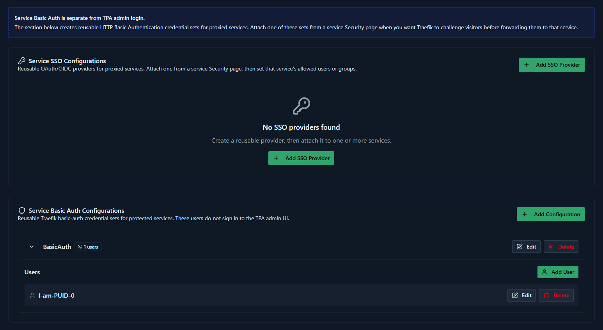
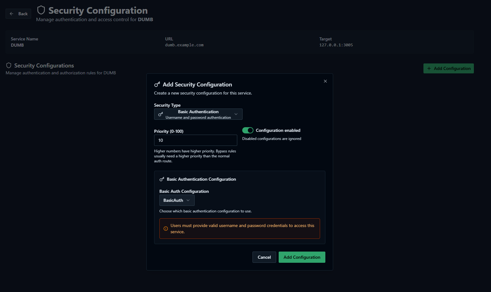

# Traefik Proxy Admin

Traefik Proxy Admin (TPA) is an optional DUMB service for managing user-facing reverse proxy routes through the Traefik instance bundled with DUMB. Use it when you want DUMB to keep handling embedded service UIs, while TPA manages public or LAN hostnames for services inside or outside the DUMB container.

---

## What TPA adds

TPA provides:

- **User-managed reverse proxy routes** - Create domains, services, middleware choices, and auth rules from a web UI.
- **Built-in Traefik integration** - DUMB enables Traefik and points Traefik's HTTP provider at TPA's generated config endpoint.
- **Persistent storage** - TPA uses DUMB PostgreSQL database `traefik_proxy_admin`.
- **Admin authentication** - TPA defaults to local admin auth and generates a persistent `ADMIN_AUTH_SECRET` on first setup.
- **External-service support** - Routes can target services outside the DUMB container when the target host is reachable from the DUMB container.
- **Target reachability tests** - TPA can test TCP connectivity to allowed private ranges before you save a service.

!!! warning "TPA is an admin surface"
    TPA can create public routes to sensitive services. Keep TPA admin auth enabled, protect exposed services with an auth layer, and avoid publishing DUMB or TPA itself unless you understand the risk.

---

## Default port

| Service | Port |
|---------|------|
| Traefik Proxy Admin | 3004 |

---

## How DUMB wires TPA to Traefik

DUMB keeps two Traefik configuration lanes separate:

| Owner | Purpose | Location or endpoint |
|-------|---------|----------------------|
| DUMB | Static Traefik config | `/config/traefik/traefik.yml` |
| DUMB | Embedded service UI routes | `/config/traefik/dynamic/services.yaml` |
| TPA | User-managed reverse proxy routes | `http://127.0.0.1:3004/api/traefik/config` |

When `traefik_proxy_admin.enabled=true`, DUMB also enables PostgreSQL and Traefik, ensures the `traefik_proxy_admin` database exists, waits for PostgreSQL before starting TPA, then starts Traefik after the TPA provider endpoint is returning valid config.

```yaml
providers:
  file:
    directory: /config/traefik/dynamic
    watch: true
  http:
    endpoint: http://127.0.0.1:3004/api/traefik/config
    pollInterval: 10s
```

This lets DUMB regenerate embedded UI routes without overwriting TPA-managed external routes.

---

## Step 1: Enable TPA in DUMB

1. Open the **Traefik Proxy Admin** service page in DUMB.
2. Enable the service.
3. Start the service.
4. Let DUMB start or prepare PostgreSQL and Traefik automatically.
5. Open TPA from the DUMB service page, the embedded UI tab, or `http://<host>:3004`.

On first start, DUMB also writes runtime values that TPA needs, including the database URL, admin auth secret, admin cookie mode, Traefik API URL, access log path, and target-test allowlist.

---

## Step 2: Create the first admin account

The first TPA screen asks you to create a local admin account.

1. Enter an admin username.
2. Enter a strong password.
3. Confirm the password.
4. Select **Create admin account**.

After this, TPA admin auth protects the TPA UI and API.

!!! tip "SSO can come later"
    Start with local admin auth so you have a known-good break-glass login. You can configure admin SSO later from TPA's Security page.

---

## Admin cookie security

DUMB runs TPA with `ADMIN_COOKIE_SECURE=false` by default. This allows local admin login to work when you open TPA over plain HTTP on a LAN address, such as `http://<host>:3004`. Without this, browsers can store the secure admin session cookie but refuse to send it back over HTTP, which looks like a successful login that immediately returns to the login page.

If you expose TPA only through HTTPS and do not need direct HTTP LAN access, you can set:

```env
ADMIN_COOKIE_SECURE=true
```

Then restart TPA. For public deployments, HTTPS plus secure cookies is preferred. Keep `ADMIN_COOKIE_SECURE=false` only when you intentionally need local HTTP access.

---

## Step 3: Review global configuration

Open **Config** in TPA.



Check these fields first:

| Field | Recommended DUMB value | Why it matters |
|-------|------------------------|----------------|
| Traefik API URL | `http://127.0.0.1:18081` | Lets TPA inspect live Traefik resources, entrypoints, middlewares, and version. |
| Default EntryPoint | `web` or the discovered entrypoint you want | Services inherit this when their own entrypoint is blank. |
| Internal TPA URL for Traefik | `localhost:3004` or another Traefik-reachable TPA address | Used in generated forwardAuth and provider references that Traefik itself must reach. |
| Public TPA URL for Browser/OAuth | Your browser-facing TPA URL, if using SSO/OAuth | Used for browser redirects and OAuth callbacks. |

Select **Save Configuration** after changes.

!!! note "Internal versus public URL"
    The internal TPA URL is for Traefik-to-TPA traffic. The public TPA URL is for browser/OAuth traffic. They can be different, especially when Cloudflare Tunnel or another external proxy is involved.

---

## Step 4: Add a domain

Domains are the base hostnames TPA uses when building service routes.



1. Open **Domains**.
2. Select **Add Domain**.
3. Enter the base domain you control.
4. For **Certificate Resolver**, leave the field blank when Cloudflare Tunnel handles public TLS. Enter your Traefik ACME resolver name only if Traefik itself should issue certificates.
5. Choose whether this domain should be the default.
6. Save the domain.

For Cloudflare Tunnel, make sure Cloudflare DNS and the tunnel route also point matching hostnames at DUMB Traefik. The tunnel terminates public TLS at Cloudflare, then connects to DUMB Traefik. See the [Cloudflared guided setup](cloudflared.md).

---

## Step 5: Add your first service route

Open **Services**, then select **Add Service**.



Recommended first test target:

- Use a low-risk internal test app or temporary service.
- Avoid testing first with DUMB, TPA, or another admin surface unless auth is already configured.
- Confirm the target is reachable from inside the DUMB container, not just from your browser.

Fill in the route:

| Field | What to enter |
|-------|---------------|
| Service Name | A clear name for the route. |
| Domain | The domain added in the previous step. |
| Hostname Mode | Usually **Subdomain**. |
| Subdomain | The app subdomain, for example `test`. |
| Target IP | The target host or IP as seen by the DUMB container. |
| Target Port | The target service port. |
| Target uses HTTPS | Enable only when the upstream target itself uses HTTPS. |
| Skip TLS Certificate Validation | Enable only for HTTPS upstreams with self-signed or otherwise invalid certificates. |
| Enable service | Leave on when you want Traefik to publish the route. |

Select **Test** beside the target fields before saving.

---

## Target reachability allowlist

TPA target testing is intentionally restricted. By default DUMB sets:

```env
TARGET_TEST_ALLOW_CIDRS=10.0.0.0/16,172.20.0.0/16,192.168.0.0/16,127.0.0.0/8
```

This allows target tests for common private/container networks:

| Range | Typical use |
|-------|-------------|
| `10.0.0.0/16` | Common 10.0.x.x private LAN or VPN subnets. |
| `172.20.0.0/16` | Docker bridge-style private networks. |
| `192.168.0.0/16` | Common home LAN ranges. |
| `127.0.0.0/8` | Services inside the same DUMB container/network namespace. |

If your targets live on another private subnet, add that CIDR to `traefik_proxy_admin.env.TARGET_TEST_ALLOW_CIDRS` in DUMB config, then restart TPA.

!!! warning "Do not make this public"
    Do not set the allowlist to `0.0.0.0/0`. Target tests open outbound TCP connections and should remain limited to networks you intentionally operate.

---

## Step 6: Add protection before publishing sensitive apps

TPA can publish a route, but publishing is not the same as protecting it.

Before exposing sensitive services, configure at least one protection layer:

- TPA service SSO.
- TPA Basic Auth middleware.
- TPA Shared Link for temporary or limited access.
- Cloudflare Access in front of the hostname.
- The upstream application's own login, if it is strong enough for the exposure model.

Use stronger protection for admin tools, download clients, dashboards, and anything that can modify your stack.

### Example: Basic Auth

Basic Auth is a simple first protection layer for low-risk routes and smoke tests. It is not a replacement for a strong app login or SSO on highly sensitive admin tools, but it is useful when you need a quick gate before a service is reachable.

First create a reusable Basic Auth configuration from **Security**.



1. Open **Security**.
2. Add a **Service Basic Auth Configuration**.
3. Give it a clear name.
4. Add one or more username/password entries.
5. Save the configuration.

Then attach that Basic Auth configuration to the service route.



1. Open the service route.
2. Open the service's **Security** settings.
3. Enable Basic Auth for that service.
4. Select the reusable Basic Auth configuration.
5. Save the service security settings.

---

## Step 7: Save and validate the route

1. Save the service.
2. Open the service hostname in a private browser window.
3. Check TPA service status.
4. Check DUMB Traefik access logs if the route does not match.
5. Check the upstream target logs if Traefik reaches the service but the app fails.

A successful route means:

- DNS or tunnel routing reaches DUMB Traefik.
- TPA generated a matching Traefik router.
- Traefik can reach the target IP and port.
- Any auth middleware behaves as expected.

---

## Cloudflare Tunnel handoff

If publishing through Cloudflare Tunnel:

1. Create the TPA service route in TPA.
2. Create a matching Cloudflare Tunnel published application route.
3. Point the tunnel service URL at `https://localhost:18080`.
4. In Zero Trust, enable **No TLS Verify** for that origin.
5. Keep service auth enabled in TPA, Cloudflare Access, or the upstream app.

Full steps are in the [Cloudflared guide](cloudflared.md).

---

## Configuration settings in `dumb_config.json`

```json
"traefik_proxy_admin": {
  "enabled": false,
  "process_name": "Traefik Proxy Admin",
  "repo_owner": "I-am-PUID-0",
  "repo_name": "traefik-proxy-admin",
  "release_version_enabled": false,
  "release_version": "latest",
  "commit_sha": "",
  "branch_enabled": false,
  "branch": "main",
  "suppress_logging": false,
  "log_level": "INFO",
  "port": 3004,
  "auto_update": false,
  "auto_update_interval": 24,
  "auto_update_start_time": "04:00",
  "clear_on_update": true,
  "exclude_dirs": [
    "/traefik-proxy-admin/.next/cache",
    "/traefik-proxy-admin/node_modules"
  ],
  "platforms": ["pnpm"],
  "command": [
    "/bin/bash",
    "-c",
    "if [ -f .next/standalone/server.js ]; then exec node .next/standalone/server.js; else exec pnpm exec next start -H 0.0.0.0 -p \"$PORT\"; fi"
  ],
  "config_dir": "/traefik-proxy-admin",
  "log_file": "/log/traefik_proxy_admin.log",
  "env": {
    "NODE_ENV": "production",
    "PORT": "3004",
    "HOSTNAME": "0.0.0.0",
    "ADMIN_AUTH_ENABLED": "true",
    "ADMIN_AUTH_PROVIDER": "local",
    "ADMIN_COOKIE_SECURE": "false",
    "TRAEFIK_API_URL": "http://127.0.0.1:18081",
    "TRAEFIK_ACCESS_LOG_PATH": "/log/traefik_access.log",
    "TARGET_TEST_ALLOW_CIDRS": "10.0.0.0/16,172.20.0.0/16,192.168.0.0/16,127.0.0.0/8",
    "NEXT_TELEMETRY_DISABLED": "1",
    "HOME": "/traefik-proxy-admin",
    "PNPM_HOME": "/config/.pnpm-store/traefik-proxy-admin-runtime/pnpm-home",
    "XDG_DATA_HOME": "/config/.pnpm-store/traefik-proxy-admin-runtime/xdg-data",
    "XDG_CACHE_HOME": "/config/.pnpm-store/traefik-proxy-admin-runtime/xdg-cache",
    "npm_config_userconfig": "/traefik-proxy-admin/.npmrc",
    "npm_config_cache": "/config/.pnpm-store/traefik-proxy-admin-runtime/npm-cache",
    "npm_config_store_dir": "/config/.pnpm-store/traefik-proxy-admin-runtime/store"
  },
  "wait_for_tcp": [
    {
      "name": "PostgreSQL",
      "host": "127.0.0.1",
      "port": 5432,
      "timeout": 2
    }
  ]
}
```

DUMB may add generated database/auth secrets to the effective environment. Use
the service editor or `/api/config` as the authority for those secret-bearing
runtime values rather than copying them from a running instance.

### Configuration key descriptions

- **`enabled`**: Whether to install and start TPA.
- **`commit_sha`**: Optional full 40-character GitHub SHA for an exact TPA source build.
- **`port`**: TPA web UI port.
- **`platforms`**: Uses DUMB's pnpm setup path.
- **`config_dir`**: TPA source and build directory.
- **`env.DATABASE_URL`**: Generated automatically when missing, targeting DUMB PostgreSQL database `traefik_proxy_admin`.
- **`env.ADMIN_AUTH_SECRET`**: Generated automatically on first setup and persisted in runtime config.
- **`env.ADMIN_COOKIE_SECURE`**: Defaults to `false` in DUMB so local HTTP admin login works. Set to `true` when TPA is only accessed through HTTPS.
- **`env.TRAEFIK_API_URL`**: Internal URL for TPA to inspect DUMB Traefik's live API.
- **`env.TRAEFIK_ACCESS_LOG_PATH`**: DUMB Traefik access log path for TPA diagnostics.
- **`env.TARGET_TEST_ALLOW_CIDRS`**: Private CIDR allowlist used by TPA target reachability tests.

!!! info "Exact commit pin"

    Set `commit_sha` to the complete SHA from `repo_owner`/`repo_name` to deploy
    that immutable TPA revision. It overrides release and branch selection and
    disables automatic updates until changed or cleared.

---

## Troubleshooting

| Symptom | Likely cause | What to check |
|---------|--------------|---------------|
| TPA starts but logs database connection errors | PostgreSQL is not ready or database was not created | Restart TPA after PostgreSQL is healthy. DUMB should auto-enable PostgreSQL and create `traefik_proxy_admin`. |
| TPA login returns to the login page over HTTP | Browser is not sending a secure admin session cookie over plain HTTP | Keep `ADMIN_COOKIE_SECURE=false` for local HTTP access, or access TPA through HTTPS and set it to `true`. Clear the old `tpa-admin-session` cookie after changing this value. |
| Traefik logs HTTP provider decode errors | TPA provider endpoint returned invalid or partial config | Restart TPA, then Traefik. DUMB waits for a top-level `http` provider response before starting Traefik. |
| Target test is blocked | Target IP is outside `TARGET_TEST_ALLOW_CIDRS` | Add the private subnet CIDR to the allowlist and restart TPA. |
| Browser shows 404 from Traefik | No matching router for the requested host | Check the TPA service hostname, domain, enabled state, and Traefik access logs. |
| Browser shows 502 or bad gateway | Traefik cannot reach the target | Check target IP, target port, HTTPS toggle, TLS validation toggle, and container network reachability. |
| Cloudflare Tunnel shows 502 | Cloudflared cannot validate or reach the local HTTPS origin | Use `https://localhost:18080` and enable **No TLS Verify** in the Zero Trust tunnel route origin settings. |

---

## Related links

- [Cloudflared](cloudflared.md)
- [Embedded Service UIs](../../features/embedded-ui.md)
- [Traefik architecture](../../architecture/traefik.md)
- [Traefik Proxy Admin repository](https://github.com/I-am-PUID-0/traefik-proxy-admin)
